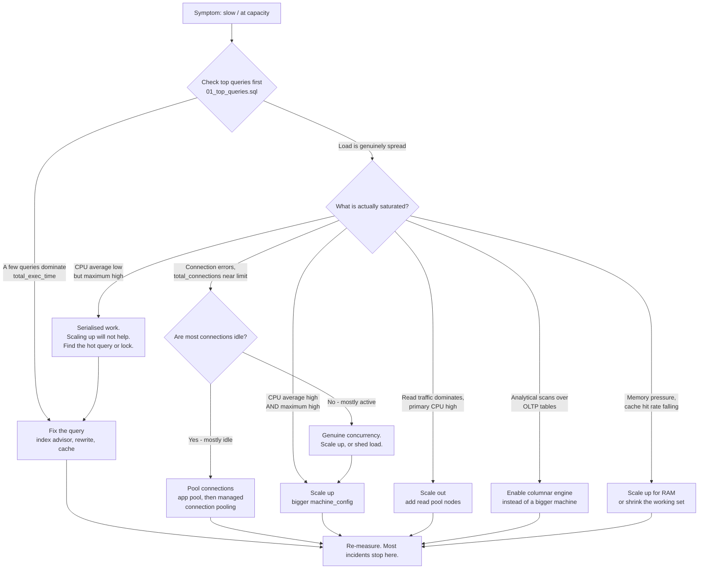
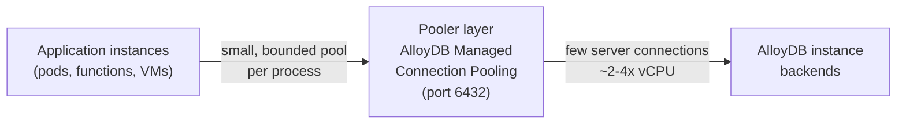

# AlloyDB Scaling Playbook

> **The triage order we suggest:**
> **1. Fix the query. 2. Fix the connections. 3. Then consider buying hardware.**
>
> Scaling hardware to compensate for a missing index is an expensive way to solve the
> wrong problem. A 32 vCPU instance running an unindexed sequential scan is simply a
> more costly way to run an unindexed sequential scan.

This is a decision document for the moment someone says "the database is slow". For
choosing a shape from scratch, or for the compute-vs-storage mental model, read
[sizing-guide.md](./sizing-guide.md) first.

---

## The decision tree



> [!IMPORTANT]
> Notice how many branches route back to "fix the query". That is not stylistic. In
> practice the majority of "we need a bigger database" tickets are one query, one
> missing index, or one application pool misconfiguration.

---

## 1. Fix the query first

### Why this comes first

Hardware scaling is linear and expensive. Query fixes are frequently
order-of-magnitude and free. Adding an index that turns a sequential scan into an
index scan can cut a query's cost by 100x; doubling your vCPU count cuts it by 2x and
doubles your bill forever.

There is also an operational-risk argument that matters to a security review: a
vertical scale restarts the instance and drops connections, while `CREATE INDEX
CONCURRENTLY` does not. The cheap fix is also the lower-blast-radius fix.

### Step 1: find the expensive queries

Run query **A** in
[01_top_queries.sql](../../monitoring/sql/01_top_queries.sql). Sort by
`total_exec_time`, not `mean_exec_time` — a 5 ms query executed two million times is a
bigger problem than a nine-second report that runs twice a day.

The `cache_hit_pct` column in that query is the tell for a sizing problem versus a
query problem. A hot query below roughly 95% cache hit rate is reading from storage
repeatedly, which means either the query scans too much (fix the query) or the
instance is too small for the working set (see
[sizing-guide.md](./sizing-guide.md#9-right-sizing-an-existing-instance)).

### Step 2: ask the index advisor

AlloyDB ships an index advisor that continuously analyses your workload and proposes
indexes. Enable it from the console: **Clusters → your cluster → Query Insights →
Edit query settings → Enable index advisor**
([Use the index advisor](https://cloud.google.com/alloydb/docs/use-index-advisor)).

Once enabled, the recommendations are ordinary database views, so you can query them
like anything else:

```sql
-- Recommended indexes, with estimated storage cost and the number of queries
-- each index would affect. The `index` column contains a ready-to-run
-- CREATE INDEX DDL statement.
SELECT * FROM google_db_advisor_recommended_indexes;

-- Pair each recommendation with the full query text that motivated it.
-- This is the version to take to a code review, because it shows the
-- reviewer WHY the index is being proposed.
SELECT DISTINCT recommended_indexes, query
FROM google_db_advisor_workload_report r,
     google_db_advisor_workload_statements s
WHERE r.query_id = s.query_id;

-- Force an on-demand analysis rather than waiting for the periodic run.
SELECT * FROM google_db_advisor_recommend_indexes();
```

> [!WARNING]
> The index advisor recommends; it does not know your write path. Every index you add
> is a write amplification tax on every `INSERT`, `UPDATE` and `DELETE` touching that
> table, plus storage, plus vacuum work. Review recommendations against
> [03_vacuum_and_bloat.sql](../../monitoring/sql/03_vacuum_and_bloat.sql) before
> applying a batch of them. Create indexes with `CONCURRENTLY` in production.

### Step 3: rule out locking

If queries are slow but CPU is low, you may be looking at lock contention rather than
resource exhaustion. Use
[02_connections_and_locks.sql](../../monitoring/sql/02_connections_and_locks.sql),
and check `instance/postgresql/deadlock_count` (a DELTA metric — it does exist,
despite what some summaries claim) and
`instance/postgresql/wait_count` / `wait_time`.

Sessions parked in `idle_in_transaction` are a classic cause. Watch
`instance/postgresql/backends_by_state` with the `state` label, and consider setting
the `idle_in_transaction_session_timeout` flag (settable, **no restart required**,
range 0–2147483647).

---

## 2. Which lever? A summary

| Symptom | Lever | Downtime | Cost impact |
| --- | --- | --- | --- |
| A handful of queries dominate | Fix the query / add an index | None with `CONCURRENTLY` | Usually negative (you save money) |
| Many idle connections, connection errors | Connection pooling | None to enable a pooler in front | Negligible |
| CPU average and maximum both high | Vertical scale | **Yes** — instance restarts, connections dropped | Linear in vCPU |
| CPU average low, maximum high | Find the serialised work | None | None |
| Read-heavy, primary saturated | Read pool nodes | None at the instance level | Linear in nodes |
| Analytical scans on OLTP tables | Columnar engine | **Yes** — restart required | Often avoids a bigger machine |
| Memory pressure, falling cache hit rate | Vertical scale for RAM | **Yes** | Linear |

---

## 3. Vertical scaling: make the machine bigger

### What you change

```hcl
resource "google_alloydb_instance" "primary" {
  cluster       = google_alloydb_cluster.main.name
  instance_id   = "primary"
  instance_type = "PRIMARY"

  machine_config {
    # Option A: N2 only. Just set the vCPU count; RAM follows the shape.
    cpu_count = 16

    # Option B: any series. If you set BOTH machine_type and cpu_count they
    # must agree, or the API rejects the update.
    # machine_type = "c4a-highmem-16-lssd"
  }
}
```

Or with gcloud:

```bash
# Change the machine type / vCPU count of an existing instance.
gcloud alloydb instances update INSTANCE_ID \
  --cpu-count=16 \
  --region=us-central1 \
  --cluster=CLUSTER_ID \
  --project=bryanko-databases-demo1

# To apply the change immediately rather than waiting, use the beta command
# with FORCE_APPLY. Google documents this path as: the instance experiences
# approximately one minute of downtime, and the machine type changes after
# 10 to 15 minutes.
gcloud beta alloydb instances update INSTANCE_ID \
  --cpu-count=16 \
  --region=us-central1 \
  --cluster=CLUSTER_ID \
  --project=bryanko-databases-demo1 \
  --update-mode=FORCE_APPLY
```

Source for the FORCE_APPLY behaviour:
[Accelerate machine type updates](https://cloud.google.com/alloydb/docs/instance-read-pool-scale#accelerate-machine-type-updates).

### What actually happens, honestly

A machine type change is not an in-place resize of a running server. AlloyDB prepares
replacement compute and swaps to it. Three consequences you must plan for:

1. **Connections are dropped.** Every open session ends. This is inherent to how the
   swap works rather than a defect, and it is worth planning around explicitly.
2. **Caches start cold.** The new compute has to rewarm its buffer cache and
   ultra-fast cache. Expect a period of degraded latency after the swap that is
   longer than the swap itself.
3. **Timing is not instantaneous.** With `FORCE_APPLY` Google documents approximately
   one minute of downtime with the change completing in 10–15 minutes. Without
   `FORCE_APPLY` the change is applied on AlloyDB's own schedule, which is gentler but
   less predictable.

> [!CAUTION]
> We have **not** independently verified a precise downtime figure for a non-forced
> machine type change, and you should not put one in a change record on our authority.
> Google's general statement about maintenance operations is that "primary instances
> typically experience less than a second of downtime, while read pools remain
> continuously available. Any active connections to the database are momentarily
> dropped"
> ([AlloyDB overview](https://cloud.google.com/alloydb/docs/overview#maintenance)) —
> but that describes maintenance, and the `FORCE_APPLY` path explicitly documents
> ~1 minute. Plan a window, measure it in staging, and record your own number.

### The application-side requirement

Because connections are dropped, **retry logic is a prerequisite for vertical
scaling, not a nice-to-have.** Specifically:

- Every pool must set a **maximum connection lifetime** so it rotates onto the new
  backend rather than clinging to dead sockets. See
  [app-side-pool-sizing.md](../../config/connection-pooling/app-side-pool-sizing.md)
  for the per-language settings.
- Retries need **exponential backoff with jitter**. Without jitter, every pod in your
  fleet reconnects at the same instant and you convert a one-minute blip into a
  thundering-herd outage.
- Retries must be **idempotency-aware**. Blind retry of a non-idempotent write after
  an ambiguous failure is a correctness bug.

> [!TIP]
> Test this deliberately before you need it. Scale a staging instance during a load
> test and watch what your application does. If it does not recover on its own, you
> have found a production incident early and cheaply.

---

## 4. Horizontal read scaling: read pools

### What a read pool actually is

A read pool instance is one or more read-only nodes attached to the **same cluster**,
serving the **same storage**. AlloyDB automatically load-balances requests across the
nodes behind a single instance endpoint
([AlloyDB overview](https://cloud.google.com/alloydb/docs/overview#alloydb-resource-hierarchy)).

The critical difference from a PostgreSQL streaming replica, and the reason read pools
are cheap to add: **there is no full copy of the data.** Because storage is
disaggregated and shared at the cluster level, adding a read node adds compute, not a
second copy of your database. Your storage bill does not change when you add read
nodes.

For the security team, the corollary is worth stating explicitly: a read pool node is
**not** an isolation boundary for data. It is the same data, the same encryption keys,
the same cluster. It is a performance and availability boundary, and a useful
blast-radius boundary for *workload* (a runaway report cannot starve the OLTP
primary), but it is not a data-segregation control.

### The 20-node budget

> [!IMPORTANT]
> A cluster can have **a maximum of 20 nodes across all read pool instances**, not 20
> per read pool. Three read pools of 8 nodes each is invalid. Source:
> [Scale an instance](https://cloud.google.com/alloydb/docs/instance-read-pool-scale#scale-node-count)
> and [AlloyDB overview](https://cloud.google.com/alloydb/docs/overview#alloydb-resource-hierarchy).

Budget those 20 nodes deliberately across your workload classes. A common split is a
large pool for application reads and a small, separately-sized pool for BI and ad-hoc
analytics, so that an analyst's `SELECT *` cannot consume the capacity your
application depends on. Managed connection pooling reinforces that separation:
`max_pool_size` applies **per user and database pair**, so giving reporting its own
database role bounds the server connections that workload can occupy independently of
the application's — see
[managed-connection-pooling.md](../../config/connection-pooling/managed-connection-pooling.md#configuration-reference).

### More nodes, or bigger nodes?

| Situation | Choose |
| --- | --- |
| Many small, concurrent read queries | **More nodes.** Concurrency scales with node count. |
| Individual queries are slow because they scan a lot | **Bigger nodes.** More RAM per node means a bigger cache per node. |
| Working set does not fit on a node | **Bigger nodes.** Adding more small nodes just multiplies the cache misses. |
| You need HA for reads | **At least 2 nodes.** A read pool with two or more nodes is multi-zonal and load-balanced. |
| You are near the 20-node budget | **Bigger nodes.** You will run out of node budget before you run out of vCPU quota. |

### Scaling node count

```bash
# Node count changes have no instance-level downtime. Increasing the count leaves
# existing client connections untouched; decreasing it lets clients on a node being
# shut down reconnect to the remaining nodes via the instance endpoint.
gcloud alloydb instances update READ_POOL_INSTANCE_ID \
  --read-pool-node-count=6 \
  --region=us-central1 \
  --cluster=CLUSTER_ID \
  --project=bryanko-databases-demo1
```

```hcl
resource "google_alloydb_instance" "reads" {
  cluster       = google_alloydb_cluster.main.name
  instance_id   = "read-pool-app"
  instance_type = "READ_POOL"

  read_pool_config {
    node_count = 6 # 1..20, counted across ALL read pools in the cluster
  }

  machine_config {
    cpu_count = 8
  }
}
```

> [!WARNING]
> **A read pool's `max_connections` must be greater than or equal to the primary's.**
> The quotas page states it verbatim: *"When you set the max_connections flag on a
> read pool instance, the new value must match or exceed the max_connections value of
> its cluster's primary."*
> ([AlloyDB quotas and limits](https://cloud.google.com/alloydb/quotas)). This bites
> when someone raises `max_connections` on the primary and forgets the read pools —
> and it is worse in the other direction, because it means you cannot give a read pool
> a *smaller* connection budget than the primary in order to constrain it. Constrain
> read pools with a pooler, not with `max_connections`.

### Replication lag and application design

Read pools are asynchronous. Your application must be designed for it, and this is an
application-architecture decision, not a database setting.

- **Read-your-own-writes is not guaranteed.** If a user updates their profile and the
  next page load reads from a read pool, they may see stale data. Route
  read-after-write within a session to the primary, or carry a write token and wait.
- **Anything with a correctness dependency on freshness goes to the primary.**
  Balance checks, uniqueness checks, authorisation decisions, "has this coupon already
  been used" — these belong on the primary regardless of read load.
- **Reporting and analytics are the natural fit**, because a few seconds of staleness
  is usually irrelevant to them.

Monitor lag with `instance/postgres/replication/maximum_lag`
(GAUGE, milliseconds). Related metrics that exist and are useful:
`instance/postgres/replication/network_lag`,
`instance/postgres/replication/replicas`, and for cross-region secondaries,
`instance/postgres/replication/maximum_secondary_lag`.

> [!NOTE]
> Google does not publish a target or recommended alerting threshold for replication
> lag. Choose a number from your application's tolerance, not from a blog post. A
> reasonable **starting point requiring calibration** is to alert when
> `maximum_lag` exceeds the freshness assumption baked into your most lag-sensitive
> read path — if any page assumes data less than 5 seconds old, alert well below
> 5,000 ms.

---

## 5. Connection scaling: usually the real answer

Most "the database is at capacity" incidents are connection-management incidents. The
database is not out of CPU; it is out of backends, or it is spending its CPU on
context switching between far more backends than it has cores.

### The layered model

Three layers, each with a distinct job. Get all three right; fixing only one does not
help.



| Layer | Job | Sized by | Where it is configured |
| --- | --- | --- | --- |
| **App-side pool** | Bound how many connections *one process* can open | 2–4x vCPU ÷ number of app instances at max autoscale | [app-side-pool-sizing.md](../../config/connection-pooling/app-side-pool-sizing.md) |
| **Pooler** | Multiplex thousands of client connections onto few server connections | Server pool ≈ 2–4x primary vCPU | [managed-connection-pooling.md](../../config/connection-pooling/managed-connection-pooling.md) |
| **AlloyDB** | Execute queries | `max_connections` as a *backstop*, not a capacity plan | Database flag |

The capacity arithmetic — max pool size × app instances at maximum autoscale, plus
batch jobs, plus migration tooling, plus BI, plus monitoring agents, plus humans with
a `psql` open — is set out in
[app-side-pool-sizing.md](../../config/connection-pooling/app-side-pool-sizing.md#the-capacity-arithmetic).
Do that sum before you change anything else. It is the check almost nobody does.

### Is this your problem? Two-minute diagnosis

```sql
-- Connection census by state. If idle vastly outnumbers active, you have a
-- pooling problem, not a capacity problem.
SELECT state, count(*)
FROM pg_stat_activity
WHERE backend_type = 'client backend'
GROUP BY state
ORDER BY count(*) DESC;
```

The metric equivalents, both confirmed to exist:
`instance/postgresql/backends_by_state` (label `state`, values `idle`, `active`,
`idle_in_transaction`, `idle_in_transaction_aborted`, `disabled`) and
`instance/postgres/total_connections`.

> [!TIP]
> Alert on the **ratio** `instance/postgres/total_connections` ÷
> `instance/postgres/connections_limit`, never on an absolute connection count. The
> `connections_limit` metric exists precisely so you do not have to hardcode
> `max_connections` into an alert policy that silently becomes wrong the day someone
> changes the flag. As a **starting point requiring calibration**, warn at 0.80.

---

## 6. AlloyDB Managed Connection Pooling

AlloyDB has a pooler built into the service. This is the pooling layer we recommend
for this deployment: there is no VM fleet to run, no second credential store, and no
extra TLS termination point to rotate. The full reference — every flag, every default
and the compatibility checklist — lives in
[managed-connection-pooling.md](../../config/connection-pooling/managed-connection-pooling.md).

### The basics

- It is **disabled by default**, so it is something you switch on deliberately and can
  evidence in code review.
- It listens on **port 6432**. Direct, unpooled connections continue to use 5432, so
  both paths remain available on the same instance.
- Connecting is otherwise identical to a direct connection, and any user on the
  instance can use it.
- It is enabled **per instance** — primary and read pool instances separately.
- It **does** work with the AlloyDB Auth Proxy and the AlloyDB Language Connectors.
  Several third-party write-ups claim otherwise; the Google documentation states it is
  supported.
- It is **not supported over public IP**, and connections from users holding the
  PostgreSQL `REPLICATION` role are not supported either.
- It exposes a built-in stats console on port 6432, in per-pooler databases named
  `alloydb_mcp_stats_{pooler_id}`, reachable by users you nominate via
  `--connection-pooling-stats-users`.

> [!TIP]
> The public-IP limitation is worth reading as a control rather than a gap. Adopting
> managed connection pooling structurally enforces private-only connectivity for the
> pooled path, which is the posture described in
> [security-hardening.md](./security-hardening.md). A self-managed pooler can be
> misconfigured onto a public address; this one cannot.

Source: [Configure managed connection pooling](https://cloud.google.com/alloydb/docs/managed-connection-pooling).

### Configuring it in Terraform

In this repository you normally enable it through the `alloydb-cluster` module rather
than by writing the resource by hand:

```hcl
module "alloydb" {
  source = "../../modules/alloydb-cluster"

  # ... cluster configuration ...

  connection_pool = {
    enabled = true
    flags = {
      "pool_mode"     = "transaction"
      "max_pool_size" = "48"
    }
  }
}
```

A worked example lives in
[terraform/examples/02-prod-ha](../../terraform/examples/02-prod-ha).

Underneath, the module writes the `connection_pool_config` block on
`google_alloydb_instance`, which is available in the GA provider. The flag-naming
transformation is the part people get wrong:

> Take the gcloud/API flag name, **drop the `connection-pooling-` prefix, and replace
> hyphens with underscores.** So `connection-pooling-pool-mode` becomes `pool_mode`.

```hcl
resource "google_alloydb_instance" "primary" {
  cluster       = google_alloydb_cluster.main.name
  instance_id   = "primary"
  instance_type = "PRIMARY"

  machine_config {
    cpu_count = 16
  }

  connection_pool_config {
    # `enabled` is a required attribute in the provider schema (google v8.3.0).
    enabled = true

    # Flag names: drop the "connection-pooling-" prefix, hyphens -> underscores.
    # The documented default for each flag is noted alongside it.
    flags = {
      # "transaction" (default) or "session". Transaction mode gives the large
      # multiplexing win; see the compatibility notes below.
      "pool_mode" = "transaction"

      # Server-side connections, per user and database pair. Default 50.
      # A useful starting range is 2-4x the instance vCPU count; with
      # cpu_count = 16 that is roughly 32-64.
      "max_pool_size" = "48"

      # Keep some connections warm so a spike does not pay TLS + auth setup.
      # Default 0.
      "min_pool_size" = "8"

      # Client-side connections the pooler will accept. Default 5000,
      # range 1-262042. This can be large and cheap - it is just a socket -
      # and it is the whole point of a pooler.
      "max_client_connections" = "2000"

      # Seconds a client waits for a server connection before failing.
      # Default 120. Keeping it below your application's own request timeout
      # means failures surface as clean errors rather than upstream 504s.
      "query_wait_timeout" = "15"

      # Release idle server connections back to AlloyDB. Default 600 seconds.
      "server_idle_timeout" = "300"

      # Recycle server connections periodically; helps rebalance after a
      # failover or a machine type change. Default 3600 seconds.
      "server_lifetime" = "3600"

      # Prepared statements tracked by the pooler in transaction mode.
      # Default 0, meaning none. Raise it only after testing with your own
      # driver, since driver behaviour here varies.
      "max_prepared_statements" = "200"
    }

    # `pooler_count` is computed - it does not need to be set.
  }
}
```

Equivalent gcloud, for when you are testing before codifying:

```bash
# Enable on an existing instance.
gcloud alloydb instances update INSTANCE_ID \
  --enable-connection-pooling \
  --region=us-central1 --cluster=CLUSTER_ID \
  --project=bryanko-databases-demo1

# Tune it. Note the flags here DO carry the connection-pooling- prefix;
# only the Terraform map keys drop it.
gcloud alloydb instances update INSTANCE_ID \
  --connection-pooling-pool-mode=transaction \
  --connection-pooling-max-pool-size=48 \
  --connection-pooling-max-client-connections=2000 \
  --region=us-central1 --cluster=CLUSTER_ID \
  --project=bryanko-databases-demo1
```

### Transaction pooling mode: what breaks

Transaction mode is where the 10-100x multiplexing win comes from, and it is where
applications break. In transaction pooling mode, Google documents these SQL features
as **not supported**:

| Feature | Typical thing that uses it |
| --- | --- |
| `SET` / `RESET` | Per-session `search_path`, `statement_timeout`, timezone, role switching |
| `LISTEN` | Event-driven workers, job queues built on `NOTIFY` |
| `WITH HOLD CURSOR` | Batch exports and paged report generation |
| `PREPARE` / `DEALLOCATE` | Explicit server-side prepared statements |
| `PRESERVE`/`DELETE ROW` temp tables | ETL staging, some ORMs |
| `LOAD` | Dynamic module loading |
| Session-level advisory locks | Leader election, singleton schedulers, Flyway/Liquibase migrations |
| Protocol-level prepared plans | Some drivers by default |

Two further limitations: managed connection pooling is **not supported for public IP
connections**, and connections from users holding the PostgreSQL `REPLICATION` role
are not supported.

Source: [Configure managed connection pooling](https://cloud.google.com/alloydb/docs/managed-connection-pooling).

> [!WARNING]
> Session-level advisory locks are the one that catches people. Schema migration tools
> (Flyway, Liquibase, Alembic, Rails) commonly take a session advisory lock to prevent
> two deployments migrating simultaneously. In transaction pooling mode that lock can
> be acquired on one server connection and the next statement executed on another —
> the lock is effectively lost, and two migrations can run at once. Because `pool_mode`
> is an instance-level setting, the practical answer is to point migration tooling at
> the **direct database port 5432** rather than the pooler on 6432, so it holds a real
> session for the length of the migration. Application traffic continues to use 6432.

### Monitoring the pooler

Four confirmed metrics under `database/conn_pool/*`:

| Metric | Labels | Reading it |
| --- | --- | --- |
| `database/conn_pool/client_connections` | `status`, `pooler` | Client-side demand |
| `database/conn_pool/server_connections` | `status`, `pooler` | Actual backends consumed on AlloyDB |
| `database/conn_pool/client_connections_avg_wait_time` | `pooler` (unit: microseconds) | **The one to alert on.** Sustained non-zero wait means the server pool is too small |
| `database/conn_pool/num_pools` | `pooler` | Pool count, for sanity checks |

The `pooler` label matters: MCP runs multiple pooler processes, and metrics are
per-pooler. Aggregate before you alert, or you will alert on one quiet pooler.

> [!NOTE]
> `client_connections_avg_wait_time` is the pooling equivalent of run-queue depth:
> while it sits near zero the pool is correctly sized, and the moment it climbs, every
> request pays that latency before its query even starts. There is no
> Google-published threshold. As a **starting point requiring calibration**: any
> sustained value above a few thousand microseconds suggests clients are queueing for
> backends and `max_pool_size` is too small — or, if raising it does not help, that the
> database itself is the bottleneck.

---

## 7. Why raising `max_connections` is usually the wrong lever

It is often the first lever people reach for, and it is rarely the one that helps.

### What the flag actually permits

| Property | Value | Source |
| --- | --- | --- |
| Default | 1,000 | [AlloyDB quotas and limits](https://cloud.google.com/alloydb/quotas) |
| Minimum | 200 | AlloyDB Admin API `supportedDatabaseFlags` |
| Maximum | 240,000 | Both of the above |
| Restart required | **Yes** | AlloyDB Admin API `supportedDatabaseFlags` |

### The guideline curve

Google publishes a recommended `max_connections` series that scales with instance
size. The shape of that series is the argument:

> **500 → 1,000 → 2,000 → 4,000 → 5,000 → 5,000 → 5,000 → 5,000 → 5,000 → 5,000 → 5,000**

It doubles as the instance grows, and then **plateaus at 5,000** and stays there no
matter how large the machine gets. Source:
[AlloyDB quotas and limits](https://cloud.google.com/alloydb/quotas).

> [!IMPORTANT]
> Read the plateau as a message. Google's own recommendation stops increasing with
> instance size, which tells you that beyond a certain point more connections stop
> being a capacity feature and start being a liability. The maximum of 240,000 is what
> the flag *accepts*, which is a very different thing from what you should *set*.

### The memory tradeoff

Every PostgreSQL connection is a separate OS process with its own memory allocation.
The docs are explicit that raising `max_connections` above the recommendation
**"reduces memory for the shared buffer"**
([AlloyDB quotas and limits](https://cloud.google.com/alloydb/quotas)).

That is a direct trade: connection slots you are probably not using, purchased with
buffer cache you definitely are. The observable consequences are a falling
`instance/postgres/ultrafastcache_hitrate` and a falling
`instance/memory/min_available_memory` — a self-inflicted version of the
undersized-instance symptom in
[sizing-guide.md](./sizing-guide.md#9-right-sizing-an-existing-instance).

You also pay in CPU. Past a few hundred active backends, you lose more to context
switching and lock contention than you gain in concurrency, which is the curve drawn
in
[app-side-pool-sizing.md](../../config/connection-pooling/app-side-pool-sizing.md#the-one-formula-you-need).

### Google's own guidance is to pool

The quotas page is explicit that pooling — not a larger `max_connections` — is the
documented approach, and it names both application-side poolers (HikariCP, c3p0) and
self-managed proxies as options. On AlloyDB you get the proxy layer without owning it:
**AlloyDB Managed Connection Pooling** is built into the instance, so the recommended
pattern in this repository is a bounded application-side pool in front of the managed
pooler. PgBouncer and pgpool-II remain self-managed alternatives, but we do not
recommend them here — the reasoning is set out in
[managed-connection-pooling.md](../../config/connection-pooling/managed-connection-pooling.md#why-not-run-your-own-pooler).

### When raising it *is* correct

Three legitimate cases:

1. **You run a pooler and the pooler's server pool legitimately needs more.** Rare,
   because the pooler's whole job is to need few.
2. **You are raising a read pool to match the primary,** because the constraint in
   section 4 requires it.
3. **You genuinely have thousands of concurrently *active* queries** and have measured
   that throughput still improves as you add them. Measure it; do not assume it.

```hcl
# If you do raise it, remember: this requires a restart, and it must be applied to
# the read pools too, or they will fail validation against the primary's value.
database_flags = {
  "max_connections" = "2000"
}
```

---

## 8. Columnar engine: scale the query, not the machine

If your pain is analytical — large scans, aggregations, `GROUP BY` over millions of
rows on OLTP tables — the columnar engine is often a better answer than a bigger
machine, because it changes the algorithmic cost of the scan rather than throwing more
cores at the same row-by-row work.

```hcl
database_flags = {
  # Restart required.
  "google_columnar_engine.enabled" = "on"

  # Let AlloyDB decide what to columnarise based on the observed workload.
  # This one does not require a restart.
  "google_columnar_engine.enable_auto_columnarization" = "on"
}
```

The sizing consequence — that the column store is carved out of the **same instance
memory** as the row-store buffer cache, defaulting to 30% of it — is covered in
[sizing-guide.md](./sizing-guide.md#7-columnar-engine-memory-sizing). Read that before
enabling it on a production primary.

> [!TIP]
> Consider enabling the columnar engine on a **read pool** rather than on the primary.
> You get the analytical acceleration where the analytical queries actually run,
> without taking 30% of the primary's buffer cache away from the transactional
> workload that pays the bills. Remember the 20-node cluster budget when planning
> that pool.

---

## 9. Scaling down and cost control

Everyone builds a scale-up runbook. Almost nobody builds a scale-down runbook, which
is why cloud database spend ratchets in one direction.

### Build the review into a cadence

Once a quarter, for every cluster, look at:

| Question | Metric | Action if yes |
| --- | --- | --- |
| Is peak CPU consistently low? | `instance/cpu/maximum_utilization` below ~0.35 for 30 days | Scale down one shape |
| Is memory permanently abundant? | `instance/memory/min_available_memory` never approaches zero | Scale down one shape |
| Are read pool nodes idle? | Per-node `node/*` CPU metrics | Reduce `node_count` |
| Is any non-production cluster HA? | `availabilityType` on the instance | Consider a basic instance |
| Is storage growing from something nobody wants? | `cluster/storage/usage` trend | Investigate; often old partitions or a forgotten audit table |

All thresholds above are **starting points requiring calibration, not Google
recommendations.**

### Scaling down safely

- **Scale down in single steps**, never two shapes at once, and wait a full business
  cycle between steps. The cost of one extra week at the larger shape is trivial
  compared to the cost of an incident.
- **Scaling down is the same disruptive operation as scaling up** — the instance is
  replaced and connections are dropped. Use a change window.
- **Reducing read pool node count is not disruptive at the instance level**: clients
  on a node being shut down reconnect to the remaining nodes through the instance
  endpoint. This makes read pools the safest thing to trim first.
- **Scale down against a 30-day trend, not against a quiet period.** A fortnight of
  low traffic over a holiday is not evidence that the shape is wrong.

### Structural cost levers, in order of payback

1. **Right-size non-production.** Dev and test clusters are the biggest source of
   waste. Use [basic instances](https://cloud.google.com/alloydb/docs/basic-instance)
   (single node, no standby) for anything that does not need HA — this halves both the
   cost and the vCPU quota consumption of that instance.
2. **Use read pool autoscaling** for spiky read workloads. AlloyDB supports both
   CPU-utilisation-based and schedule-based autoscaling policies, and when both are
   active the autoscaler takes whichever recommends more nodes
   ([Scale an instance](https://cloud.google.com/alloydb/docs/instance-read-pool-scale#autoscaling)).
   Two caveats from that same doc: long-lived connections are not redistributed onto
   newly added nodes, and new nodes take a few minutes to warm their caches.
3. **Fix the top query.** Still the best return on effort available, and it reduces
   the bill rather than merely capping it.
4. **Review backup retention.** Backup storage is billed separately from cluster
   storage, so retention policy is a real cost lever — but it is also a
   recovery-objective and compliance decision. Change it with your risk owner, not
   unilaterally to save money.

> [!CAUTION]
> It is safer not to scale down a production primary as a cost measure until you have
> re-run the validation checks in
> [sizing-guide.md](./sizing-guide.md#step-3--validate-after-cutover). An instance that
> looks over-provisioned on average CPU may be correctly provisioned for its month-end
> peak, and month-end is a bad time to discover that.

---

## Where to go next

- **Choosing a shape from scratch** → [sizing-guide.md](./sizing-guide.md)
- **Application pool settings per language** → [app-side-pool-sizing.md](../../config/connection-pooling/app-side-pool-sizing.md)
- **Managed connection pooling in depth** → [managed-connection-pooling.md](../../config/connection-pooling/managed-connection-pooling.md)
- **Finding the expensive queries** → [01_top_queries.sql](../../monitoring/sql/01_top_queries.sql)
- **Connections, locks and blocking chains** → [02_connections_and_locks.sql](../../monitoring/sql/02_connections_and_locks.sql)
- **Vacuum, bloat and transaction ID wraparound** → [03_vacuum_and_bloat.sql](../../monitoring/sql/03_vacuum_and_bloat.sql)

---

*Last verified: 2026-09-22 against provider google v8.3.0. Re-verify hard numbers before reuse.*
