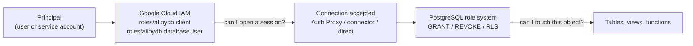

# AlloyDB Security Hardening Baseline

> Audience: security reviewers and platform engineers who are new to AlloyDB.
> This is written as a **baseline you can audit against**, not a feature tour.
> Every row in the checklist has a "how to verify" column so a reviewer can
> walk down it with a terminal open and produce evidence.

**Companion document:** [audit-logging-and-siem.md](./audit-logging-and-siem.md)
covers proving *who did what*. This document covers *stopping them doing it*.

**Reference implementation:** [`terraform/examples/04-secure-cmek/`](../../terraform/examples/04-secure-cmek/)

---

## The three things that will surprise you

Before the checklist, three AlloyDB-specific facts that break assumptions
carried over from Cloud SQL or self-managed PostgreSQL. Each one has bitten a
real deployment.

1. **The private-networking mode is chosen at cluster creation and is
   permanent.** Private Services Access (PSA) and Private Service Connect (PSC)
   are not a toggle. If you pick wrong, the remediation is "create a new cluster
   and migrate". Treat it as an architectural decision with the same weight as
   choosing a region.

2. **There is no predefined AlloyDB organization policy constraint for public
   IP.** Cloud SQL has `constraints/sql.restrictPublicIp`; it applies to Cloud
   SQL instances only. AlloyDB ships exactly two predefined constraints, both
   CMEK-related. Blocking public IP org-wide requires a *custom* constraint that
   you author yourself.

3. **`roles/alloydb.viewer` can read your data.** It is not a metadata-only
   role. It carries `alloydb.instances.executeSqlReadOnly` and
   `alloydb.clusters.export`. If "Viewer" is currently treated as a harmless
   grant in your role model, it is worth revisiting before this cluster holds
   regulated data.

---

## Hardened baseline checklist

Walk down this table. Everything marked **Baseline** should be true for any
production cluster before it holds regulated data.

| # | Control | Why it matters | How to set it | How to verify it |
|---|---------|----------------|---------------|------------------|
| 1 | **Private Service Connect (PSC) as the networking standard** | Eliminates VPC peering, isolates consumer and producer networks, and enforces explicit project-number allow-listing per instance | `psc_enabled = true` on cluster, `psc_allowed_consumer_projects` on instances | `gcloud alloydb clusters describe CLUSTER --region=R --format="yaml(pscConfig)"` |
| 2 | **Public IP off on every instance** | Public IP moves the instance from "reachable only inside your VPC" to "reachable from the internet subject to an allowlist" | Omit `enable_public_ip` (defaults off) or set it to `false` | `gcloud alloydb instances list --cluster=C --region=R --format="table(name,networkConfig.enablePublicIp)"` |
| 3 | **Custom org policy denying public IP** | Defence in depth — stops a future engineer re-enabling it. No predefined constraint exists | `gcloud org-policies set-custom-constraint` (YAML in [Blocking public IP](#blocking-public-ip-for-real)) | `gcloud org-policies list-custom-constraints --organization=ORG_ID` |
| 4 | **`ssl_mode = ENCRYPTED_ONLY`** | Rejects plaintext connections at the server. This is the default, but assert it explicitly so drift is visible in code review | `--ssl-mode=ENCRYPTED_ONLY` | `gcloud alloydb instances describe I --cluster=C --region=R --format="value(clientConnectionConfig.sslConfig.sslMode)"` |
| 5 | **`require_connectors = true`** (decide deliberately) | Forces mTLS + IAM *authorization* via Auth Proxy / language connectors. Breaks plain `psql`. A real tradeoff — see [Encryption in transit](#encryption-in-transit) | `--require-connectors` | `gcloud alloydb instances describe I ... --format="value(clientConnectionConfig.requireConnectors)"` |
| 6 | **CMEK on cluster, automated backups and continuous backups** | Gives you a kill switch and a Cloud KMS audit trail. Must be set at creation — cannot be added in place | `--kms-key` at cluster create, plus per-backup-policy `encryption_config` | `gcloud alloydb clusters describe C --region=R --format="yaml(encryptionConfig,automatedBackupPolicy.encryptionConfig,continuousBackupConfig.encryptionConfig)"` |
| 7 | **`constraints/gcp.restrictNonCmekServices` denies `alloydb.googleapis.com`** | Stops a non-CMEK cluster ever being created in the org | Org policy list constraint | `gcloud org-policies describe gcp.restrictNonCmekServices --organization=ORG_ID --effective` |
| 8 | **`constraints/gcp.restrictCmekCryptoKeyProjects` scoped to your key projects** | Stops CMEK being satisfied by a key in an attacker-controlled or shadow project | Org policy list constraint | `gcloud org-policies describe gcp.restrictCmekCryptoKeyProjects --organization=ORG_ID --effective` |
| 9 | **No human or app holds `roles/alloydb.admin` in steady state** | 104 permissions including `alloydb.clusters.delete`. Break-glass only | Remove from project IAM; grant via a just-in-time process | `gcloud projects get-iam-policy P --flatten="bindings[].members" --filter="bindings.role:roles/alloydb.admin"` |
| 10 | **`roles/alloydb.viewer` treated as a data-access role** | It includes `alloydb.instances.executeSqlReadOnly` and `alloydb.clusters.export` | Replace with a custom role if you only need metadata | `gcloud iam roles describe roles/alloydb.viewer --format="value(includedPermissions)"` |
| 11 | **IAM database authentication on (`alloydb.iam_authentication=on`)** | Removes long-lived passwords from the app path. Requires **no restart** | Database flag on the instance | `gcloud alloydb instances describe I ... --format="value(databaseFlags)"` |
| 12 | **Password policy flags set for any remaining built-in users** | Built-in users are your residual credential risk | `password.*` flags — see [Password policy](#password-policy-for-built-in-users) | Same `databaseFlags` output as above |
| 13 | **`pg_authid` / `pg_shadow` readable only by a named role** | Password hashes are offline-crackable material | `alloydb.pg_authid_select_role`, `alloydb.pg_shadow_select_role` | `databaseFlags` output; then `\du` and `SELECT` as a normal user to confirm denial |
| 14 | **pgAudit enabled with a scoped `pgaudit.log`** | Control-plane logs do not record SQL. Without pgAudit you cannot answer "who read the salary table" | See [audit-logging-and-siem.md](./audit-logging-and-siem.md) | `SHOW pgaudit.log;` and a Logs Explorer query |
| 15 | **Data Access audit logs enabled for `alloydb.googleapis.com`** | Off by default. Also the *delivery channel for pgAudit output* | `google_project_iam_audit_config` — see companion doc | `gcloud projects get-iam-policy P --format="yaml(auditConfigs)"` |
| 16 | **VPC Service Controls perimeter around the AlloyDB project** | Mitigates credential-theft exfiltration via the Admin API | `gcloud access-context-manager perimeters update` | `gcloud access-context-manager perimeters describe PERIMETER` |
| 17 | **`deletion_protection = true` on production clusters** | Blast-radius control against a bad `terraform destroy` | Terraform argument on `google_alloydb_cluster` | `terraform state show` / cluster describe |

> [!IMPORTANT]
> Rows 1 and 6 are the only ones on this list that you **cannot retrofit**.
> Networking mode and CMEK are both fixed at cluster creation. Everything else
> can be remediated on a running cluster. Get those two right first.

---

## Network isolation

Every AlloyDB cluster must have a private IP interface — it is not optional.
In this repository, all Terraform examples standardise on **Private Service Connect (PSC)**
rather than Private Services Access (PSA). For a cybersecurity and network architecture
review, PSC offers structural security advantages that make it the superior enterprise choice:

1. **Zero VPC peering**: There is no direct peering between your VPC and Google's producer
   network. This eliminates transitive routing risks, prevents address-space collisions, and
   means you do not hand a `/16` range to Google's producer network.
2. **Explicit allow-listing by project number**: Reachability to the database is granted
   deliberately per consumer project number (`psc_allowed_consumer_projects`). Each entry is
   an explicit, auditable authorization grant. Consumers not on the list remain permanently
   unable to establish a connection.
3. **Per-instance service attachments**: Every AlloyDB instance — the primary and each read pool —
   publishes its own independent service attachment. Reachability is therefore granular: you can
   expose a read pool to a BI project without exposing the primary.
4. **Reinforces private-only access**: Managed Connection Pooling (port 6432) works seamlessly
   over PSC and is blocked on public IP.

*(For a detailed comparison of PSA versus PSC operational trade-offs, see
[`terraform/examples/README.md`](../../terraform/examples/README.md).)*

### Private Services Access vs Private Service Connect

| Dimension | Private Services Access (PSA) | Private Service Connect (PSC) |
|-----------|-------------------------------|-------------------------------|
| **Mechanism** | VPC Network Peering between your VPC and a Google-managed producer VPC | A per-instance *service attachment* that you connect to with a forwarding rule (endpoint) in your VPC |
| **IP consumption** | You reserve an allocated range from your VPC. AlloyDB consumes a **/24 per region**; minimum allocation is one /24, **recommended /16** | **One IP address per endpoint per VPC**. No range is locked up |
| **Address families** | RFC 1918 only (`10/8`, `172.16/12`, `192.168/16`). Privately-used public IP (PUPI) ranges are **not supported** | Both RFC 1918 and non-RFC 1918 ranges are supported for endpoints |
| **Cross-VPC / cross-project** | Same VPC network only. Peering is non-transitive, so a spoke VPC cannot reach the cluster without a manual socks5 proxy | Designed for it. Connect from multiple VPCs, projects, or organizations |
| **Direction** | Bi-directional — inbound and outbound | Inbound only by default. Outbound (FDW, dblink, migration) needs a separate **network attachment** |
| **DNS responsibility** | Google-managed; the instance gets a private IP you resolve normally | **Yours**, in the manual flow. You create a private DNS zone and an A record pointing at your endpoint IP |
| **Cost** | Minimal — reuses existing VPC peering | Higher — per-endpoint hourly charge plus data transfer per GiB |
| **Google's own summary** | "Less secure compared to Private Service Connect due to direct connection" | "More secure due to isolation of consumer and producer VPC" |
| **Standard in this repo** | Supported, but documented as an alternative | **Default standard across all 5 Terraform examples** |

Sources:
[Private services access overview](https://cloud.google.com/alloydb/docs/about-private-services-access),
[About Private Service Connect](https://cloud.google.com/alloydb/docs/about-private-service-connect),
[Choose a connectivity option](https://cloud.google.com/alloydb/docs/choose-alloydb-connectivity),
[Private IP overview](https://cloud.google.com/alloydb/docs/private-ip).

> [!CAUTION]
> **This choice is made at cluster creation and cannot be changed afterwards.**
> The AlloyDB documentation states plainly: "You cannot change the private
> services access configuration of a cluster after AlloyDB has created the
> cluster." The same immutability applies to enabling PSC — it is a
> cluster-create flag. Migrating between the two means building a new cluster
> and moving the data. Budget an architecture review before the first
> `terraform apply`, not after.

### What PSC actually asks you to build

PSC is the right default for a large enterprise with a hub-and-spoke or
multi-tenant VPC layout, but it is not free of work. In the manual flow you own
two objects that PSA would have given you for nothing:

1. **The consumer endpoint.** AlloyDB publishes a service attachment URL per
   instance (primary, each read pool, each secondary). You create a forwarding
   rule in your VPC that targets it (with `load_balancing_scheme = ""`). If the
   consuming project is not listed in the instance's `allowed_consumer_projects`
   (which requires **project NUMBERS**, not project IDs), you can still create
   the endpoint, but it sits in `PENDING` forever — a genuinely confusing
   failure mode, because nothing errors.

2. **The DNS record.** AlloyDB exposes a suggested DNS name on the instance
   (`psc_dns_name`, following the convention `<uid>.<region>.alloydb-psc.goog.`),
   but in the manual flow nothing creates the record for you. You create a private
   DNS zone in each consuming VPC and point an A record at that VPC's endpoint IP.
   The AlloyDB Auth Proxy (which requires the `--psc` flag) and the language
   connectors resolve that hostname rather than raw IPs, so **nothing connects
   until the DNS record exists**.

In Terraform, the consumer-side endpoint and DNS logic are encapsulated in this repository's
reusable [`terraform/modules/psc-endpoint/`](../../terraform/modules/psc-endpoint/) module.

```bash
# 1. Read the service attachment for the instance you want to reach.
gcloud alloydb instances describe INSTANCE_ID \
  --cluster=CLUSTER_ID --region=REGION \
  --format="value(pscInstanceConfig.serviceAttachmentLink, pscInstanceConfig.pscDnsName)"

# 2. Create the consumer endpoint (a forwarding rule) in the consumer VPC.
gcloud compute addresses create alloydb-psc-ip \
  --region=REGION --subnet=CONSUMER_SUBNET --addresses=10.20.30.40

gcloud compute forwarding-rules create alloydb-psc-ep \
  --region=REGION --network=CONSUMER_VPC \
  --address=alloydb-psc-ip \
  --target-service-attachment=SERVICE_ATTACHMENT_LINK

# 3. Create the DNS record yourself. Nothing does this for you in this flow.
gcloud dns managed-zones create alloydb-psc \
  --dns-name="REGION.PROJECT_NUMBER.alloydb-psc.goog." \
  --networks=CONSUMER_VPC --visibility=private --description="AlloyDB PSC"

gcloud dns record-sets create "PSC_DNS_NAME" \
  --zone=alloydb-psc --type=A --ttl=300 --rrdatas=10.20.30.40
```

> [!NOTE]
> AlloyDB also supports an automated path: a **service connection policy** in
> the consumer VPC lets AlloyDB provision endpoints for you, and the instance
> field `pscAutoDnsState` can enable PSC auto-DNS. If you use that path, Google
> creates the endpoint and DNS record. Most enterprises with a central network
> team still run the manual flow because it keeps endpoint creation inside their
> change process. Decide which one you want *before* you write the Terraform.

### Shared VPC

Both mechanisms work with Shared VPC, with different homework:

- **PSA + Shared VPC:** the network lives in the host project, AlloyDB lives in
  a service project. Grant your cluster-creating principals Service Project
  Admin with access to the allocated ranges, and always pass the **fully
  qualified** network path — `projects/HOST_PROJECT/global/networks/NET`. A
  short name silently resolves against the wrong project.
- **VPC Service Controls + Shared VPC:** put **both** the host project and the
  service project inside the perimeter. A perimeter that contains only the
  service project is a perimeter with a hole in it.

### Terraform shape

```hcl
# PSA — cluster attaches to your VPC via peering. Immutable after create.
resource "google_alloydb_cluster" "psa" {
  cluster_id = "prod-psa"
  location   = var.region
  network_config {
    network            = "projects/${var.host_project}/global/networks/${var.vpc}"
    allocated_ip_range = "google-managed-services-default"
  }
  deletion_protection = true
}

# PSC — no network_config on the cluster; consumers attach via endpoints.
resource "google_alloydb_cluster" "psc" {
  cluster_id = "prod-psc"
  location   = var.region
  psc_config {
    psc_enabled = true # immutable: flipping this forces cluster replacement
  }
  deletion_protection = true
}

resource "google_alloydb_instance" "psc_primary" {
  cluster       = google_alloydb_cluster.psc.name
  instance_id   = "prod-psc-primary"
  instance_type = "PRIMARY"

  psc_instance_config {
    # Projects NOT listed here can create endpoints, but they stay PENDING.
    allowed_consumer_projects = [var.app_project_number, var.analytics_project_number]
  }
}
```

---

## Blocking public IP for real

### Layer 1 — the instance default

Public IP is an **instance-level** setting, `network_config.enable_public_ip`.
It is optional and off unless you turn it on; the AlloyDB connectivity guidance
states that "Private IP is enabled by default, so you must explicitly configure
public IP". Leaving the block out of your Terraform is therefore already secure.

Assert it anyway. An explicit `enable_public_ip = false` is a line a reviewer
can see in a diff; an absent block is not.

### Layer 2 — authorized external networks are not a substitute

`authorized_external_networks` is a list of CIDR ranges permitted to reach the
**public** IP. It has no effect when public IP is off, and it is an allowlist,
not an isolation boundary. Two failure modes are common:

- `0.0.0.0/0` gets added "temporarily" for a laptop or for Cloud Shell (which
  has no stable egress IP) and is never removed.
- A `/8` belonging to a corporate NAT range is added, which in practice means
  "anyone inside the corporate network", not "this one jump host".

> [!WARNING]
> Google's own guidance calls out the Cloud Shell case explicitly: Cloud Shell
> has no stable outbound IP, so allowlisting it means allowlisting `0.0.0.0/0`.
> If someone needs ad-hoc access, give them the Auth Proxy, not a CIDR entry.

### Layer 3 — a custom organization policy constraint

AlloyDB supports exactly **two predefined** organization policy constraints, and
both are about CMEK (`gcp.restrictNonCmekServices` and
`gcp.restrictCmekCryptoKeyProjects`). There is nothing equivalent to Cloud SQL's
`constraints/sql.restrictPublicIp` — that constraint's own description scopes it
to "Cloud SQL instances". Verified against
[AlloyDB organization policies overview](https://cloud.google.com/alloydb/docs/organization-policies-overview)
and the
[Organization policy constraints reference](https://cloud.google.com/resource-manager/docs/organization-policy/org-policy-constraints)
on 2026-09-22.

So you author a custom constraint. This example is taken verbatim from the
AlloyDB custom-constraints documentation:

```yaml
# alloydb-restrict-public-ip.yaml
name: organizations/ORGANIZATION_ID/customConstraints/custom.restrictPublicIP
resourceTypes:
  - alloydb.googleapis.com/Instance
methodTypes:
  - CREATE
  - UPDATE
condition: "resource.networkConfig.enablePublicIp == true"
actionType: DENY
displayName: Restrict public IP access on AlloyDB instances
description: Prevent users from enabling public IP on instance creation and update.
```

```bash
# Register the constraint at the org.
gcloud org-policies set-custom-constraint alloydb-restrict-public-ip.yaml

# Confirm it exists before you try to enforce it.
gcloud org-policies list-custom-constraints --organization=ORGANIZATION_ID
```

Then enforce it. Run it in dry-run first — the policy takes up to 15 minutes to
take effect, and dry-run tells you what it *would* have blocked:

```yaml
# policy.yaml
name: organizations/ORGANIZATION_ID/policies/custom.restrictPublicIP
spec:
  rules:
    - enforce: true
dryRunSpec:
  rules:
    - enforce: true
```

```bash
gcloud org-policies set-policy policy.yaml --update-mask=dryRunSpec  # observe
gcloud org-policies set-policy policy.yaml --update-mask=spec        # enforce
```

Two companion constraints worth adding at the same time, both verbatim from the
same doc page — they cover the case where public IP is a deliberate, approved
exception and you want to bound the blast radius:

```yaml
# Deny authorized networks wider than a chosen prefix length.
condition: "resource.networkConfig.authorizedExternalNetworks.exists(net, ['/0', '/1', '/2', '/n'].exists(ending, net.cidrRange.endsWith(ending)))"
actionType: DENY

# Deny more than N authorized networks.
condition: "resource.networkConfig.authorizedExternalNetworks.size() > 1"
actionType: DENY
```

> [!CAUTION]
> **Custom constraints gate create and update. They are not retroactive.**
> The AlloyDB documentation is explicit: "policy changes don't apply
> retroactively to existing clusters and backups... A new policy has no effect
> on existing instances, clusters, or backups." Enforcing the constraint today
> does nothing about the instance that already has public IP on. You need a
> separate sweep. Note also that a scheduled maintenance update does not
> re-trigger enforcement, so a non-compliant instance can survive indefinitely.

Sweep script for the existing estate:

```bash
# Find every AlloyDB instance in the project with public IP enabled.
for LOC in $(gcloud alloydb clusters list --region=- --format="value(name)" \
             | awk -F/ '{print $4}' | sort -u); do
  for C in $(gcloud alloydb clusters list --region="$LOC" --format="value(name)" \
             | awk -F/ '{print $6}'); do
    gcloud alloydb instances list --cluster="$C" --region="$LOC" \
      --filter="networkConfig.enablePublicIp=true" \
      --format="value[separator=' '](name, networkConfig.authorizedExternalNetworks.cidrRange)"
  done
done
```

Run that across every project in scope (wrap it in a loop over
`gcloud projects list`) and you have your remediation backlog.

Sources:
[AlloyDB custom constraints](https://cloud.google.com/alloydb/docs/alloydb-custom-constraints),
[AlloyDB organization policies overview](https://cloud.google.com/alloydb/docs/organization-policies-overview).

---

## Connection pooling as a security control

Most teams think of connection pooling as a performance topic. On AlloyDB it is
also a security decision, and it is worth making deliberately rather than by
default. Our recommendation is to use **AlloyDB Managed Connection Pooling
(MCP)**, the pooler built into the service, rather than deploying and operating
your own. The configuration detail lives in
[`config/connection-pooling/managed-connection-pooling.md`](../../config/connection-pooling/managed-connection-pooling.md);
what follows is the security-relevant part of the argument.

### It reinforces private-only networking

Managed connection pooling is **not supported for public IP connections**, and it
**does** work over Private Service Connect. For most teams the first half of that
is a limitation. For a deployment whose first priority is private-only
networking, the pair of facts is a structural control: the pooler is available on
exactly the topology every example here uses, and unavailable on the one you are
trying to rule out. If all application traffic goes through the pooler, then all
application traffic is by construction on a private path. The property is
enforced by the platform rather than by a policy that someone has to remember to
keep enforced.

This complements, rather than replaces, the three layers in
[Blocking public IP for real](#blocking-public-ip-for-real). The custom
organization policy constraint remains the control you point an auditor at,
because it is the one that is declaratively verifiable.

### It keeps the end-user identity visible to pgAudit

This is the argument that matters most to an audit function, and it applies to
any external pooler, not only to one specific product.

An external pooler multiplexes many application clients onto a small number of
server connections. Those server connections are opened using the pooler's own
credentials, so the identity that reaches PostgreSQL — and therefore the
identity that pgAudit and the server log record — is the pooler's, not the end
user's. Every statement appears to originate from a single service account.
Attribution then depends entirely on correlating database records against
application-side logs, which is exactly the fragile, after-the-fact
reconstruction that enabling pgAudit was meant to avoid.

The same reasoning applies to the credential itself. A self-managed pooler
needs its own credential store — a `userlist` file or an `auth_query` role — so
you acquire a second set of database credentials to rotate, protect and audit,
sitting outside AlloyDB's IAM model. Managed connection pooling adds no
credential store of its own.

> [!NOTE]
> Managed connection pooling is **disabled by default** and listens on port
> **6432**; direct connections continue to use 5432. It works with the AlloyDB
> Auth Proxy and the AlloyDB Language Connectors, so adopting it does not
> require giving up `require_connectors`. Connections from users holding the
> PostgreSQL `REPLICATION` role are not supported through the pooler and must
> connect directly.

### What to check before enabling it

Transaction pooling mode, the default, does not support `SET`/`RESET`,
`LISTEN`, `WITH HOLD CURSOR`, `PREPARE`/`DEALLOCATE`, `PRESERVE`/`DELETE ROW`
temp tables, `LOAD`, session-level advisory locks, or protocol-level prepared
plans. Session mode supports them at the cost of less aggressive reuse. Some
schema-migration tools use advisory locks to serialise migrations, so that
particular item is worth checking explicitly before you enable transaction
mode.

Source: [Configure managed connection pooling](https://cloud.google.com/alloydb/docs/configure-managed-connection-pooling).

---

## Encryption in transit

### `ssl_config.ssl_mode`

The Terraform provider (`google` v8.3.0) accepts exactly two values on
`google_alloydb_instance.client_connection_config.ssl_config.ssl_mode`:

| Value | Behaviour | Use it when |
|-------|-----------|-------------|
| `ENCRYPTED_ONLY` | SSL connections are required. CA verification is **not** enforced | Always. This is the baseline |
| `ALLOW_UNENCRYPTED_AND_ENCRYPTED` | SSL connections are optional | Never in production. Legacy client migration windows only, with an expiry date |

The AlloyDB Admin API additionally exposes `SSL_MODE_ALLOW`, `SSL_MODE_REQUIRE`
and `SSL_MODE_VERIFY_CA`, but the discovery document marks all three as
**deprecated**, and the Terraform provider does not accept them. If you see them
in an old runbook, they are stale. `SSL_MODE_UNSPECIFIED` defaults to
`ENCRYPTED_ONLY`.

```bash
gcloud alloydb instances update INSTANCE_ID \
  --cluster=CLUSTER_ID --region=REGION \
  --ssl-mode=ENCRYPTED_ONLY
```

```hcl
client_connection_config {
  ssl_config {
    ssl_mode = "ENCRYPTED_ONLY" # the only value you should be shipping
  }
}
```

> [!NOTE]
> `ENCRYPTED_ONLY` gives you confidentiality on the wire but **not** server
> authentication — CA verification is not enforced, so a direct client can use a
> locally self-signed certificate. Direct connections do not support client
> certificates or the `verify-ca` / `verify-full` `sslmode` settings at all. If
> your threat model includes an on-path attacker inside the VPC, encryption
> alone is not enough and you need connectors (below).

Source: [Configure SSL enforcement](https://cloud.google.com/alloydb/docs/instance-ssl).

### `require_connectors` — the real tradeoff

An AlloyDB instance listens on two (or three) TCP ports:

| Port | Purpose |
|------|---------|
| `5432` | Standard PostgreSQL wire protocol — what `psql` and your driver use |
| `6432` | Managed connection pooling, when enabled |
| `5433` | Reserved for AlloyDB connectors: the Auth Proxy and the language connectors |

Setting `require_connectors = true` (`--require-connectors`) shuts the direct
path. Everything must arrive via port 5433 through a connector. What you gain,
and what you lose:

| Capability | Direct connection | Auth Proxy / language connector |
|------------|-------------------|---------------------------------|
| Encrypted connection | Yes | Yes |
| IAM **authentication** | Yes | Yes |
| IAM **authorization** | No | Yes |
| mTLS | No | Yes |
| Plain `psql` to host:5432 works | Yes | **No** |
| Extra latency | None | Small increase |

> [!WARNING]
> `require_connectors = true` **will break plain `psql`**, every BI tool that
> speaks raw PostgreSQL, every migration utility, and every sidecar-less
> container. That is the point — but it is an operational decision, not a
> checkbox. Before you enable it, inventory every client, confirm each can run
> the Auth Proxy or a language connector, and have a documented break-glass
> procedure (`--no-require-connectors`) that is itself audited.

One more constraint that catches people running cross-region DR: for the primary
instance in a **Private Service Connect** cluster, connector enforcement is only
supported when there are **no secondary instances**. Because every example here
uses PSC, that lands directly on
[`terraform/examples/05-cross-region-dr/`](../../terraform/examples/05-cross-region-dr/):
once a secondary exists, `require_connectors` is currently off the table for the
primary. Verify this against the docs before you design around it, because it is
the kind of limitation that gets lifted.

Sources: [Enforce connectors](https://cloud.google.com/alloydb/docs/enforce-connectors),
[Choose a connectivity option](https://cloud.google.com/alloydb/docs/choose-alloydb-connectivity).

---

## Encryption at rest and CMEK

AlloyDB always encrypts data at rest. CMEK changes *who holds the top key*, and
that is what your auditors care about: with CMEK you get a Cloud KMS audit trail
of every encrypt/decrypt AlloyDB performs on your behalf, a rotation schedule
you control, and a disable switch you can pull.

### Setting it up

```bash
# 1. Create (or reuse) a key in the SAME region as the cluster.
#    A cluster in us-central1 can only use a key in us-central1.
gcloud kms keys create alloydb-prod \
  --location=us-central1 --keyring=db-keys --purpose=encryption

# 2. Materialise the AlloyDB service agent in your project.
#    This is idempotent — it creates it, or prints it if it already exists.
gcloud beta services identity create \
  --service=alloydb.googleapis.com --project=PROJECT_ID
# -> Service identity created: service-PROJECT_NUMBER@gcp-sa-alloydb.iam.gserviceaccount.com

# 3. Grant the service agent encrypt/decrypt on the key — and nothing more.
gcloud kms keys add-iam-policy-binding alloydb-prod \
  --location=us-central1 --keyring=db-keys --project=KEY_PROJECT \
  --member="serviceAccount:service-PROJECT_NUMBER@gcp-sa-alloydb.iam.gserviceaccount.com" \
  --role=roles/cloudkms.cryptoKeyEncrypterDecrypter

# 4. Create the cluster WITH the key. There is no "add CMEK later".
gcloud alloydb clusters create prod \
  --region=us-central1 --network=prod-vpc \
  --kms-key=projects/KEY_PROJECT/locations/us-central1/keyRings/db-keys/cryptoKeys/alloydb-prod
```

The service agent principal follows the standard Google service agent form,
`service-<PROJECT_NUMBER>@gcp-sa-alloydb.iam.gserviceaccount.com`. The
documentation renders it as `service-xxx@gcp-sa-alloydb.iam.gserviceaccount.com`
— run step 2 and read the exact string back rather than constructing it by hand.

### The rules that are not obvious

| Rule | Consequence |
|------|-------------|
| The key must be in the **same location** as the cluster | A `us-west1` cluster can only use a `us-west1` key. Cross-region DR needs a key per region |
| CMEK is set **at cluster creation only** | You cannot add CMEK to an existing cluster in place. Migration = backup/restore into a new CMEK cluster |
| Clusters do **not** re-encrypt after key rotation | The cluster is bound to the key version that was primary at creation time. To actually rotate, back up and restore onto the newer version |
| Backups pin their key version at backup time | A CMEK backup's key and key version cannot be modified afterwards, even if the KMS key rotates |
| Restore defaults to **Google-managed** encryption | If you restore and forget `--kms-key`, you have silently dropped CMEK. Assert it in the restore runbook |
| Cluster, automated backups and continuous backups each carry their **own** `encryption_config` | If you omit the backup ones they inherit the cluster's key, which is usually what you want — but state it explicitly so a reviewer does not have to infer it |
| Disabling the key takes the cluster down | Instances experience downtime **within 30 minutes**. Re-enabling brings them back. Destroying the key makes the cluster **permanently inaccessible** |
| KMS unavailability is tolerated for 30 minutes | AlloyDB polls KMS about every five minutes; if it cannot reach KMS it continues best-effort for up to 30 minutes, then takes the cluster offline |
| Key disable/destroy can take up to **three hours** to propagate | Do not treat "I disabled the key" as an instant containment action |

```hcl
resource "google_alloydb_cluster" "prod" {
  cluster_id = "prod"
  location   = var.region

  encryption_config {
    kms_key_name = var.kms_key # forces replacement if changed
  }

  automated_backup_policy {
    enabled = true
    encryption_config {
      kms_key_name = var.kms_key # inherits cluster key if omitted; be explicit
    }
  }

  continuous_backup_config {
    enabled = true
    encryption_config {
      kms_key_name = var.kms_key
    }
  }

  deletion_protection = true
}
```

### Enforcing CMEK org-wide

These are the only two **predefined** AlloyDB organization policy constraints:

```bash
# 1. Require CMEK: deny creating AlloyDB clusters/backups without a CMEK key.
cat > deny-non-cmek.yaml <<'EOF'
name: organizations/ORGANIZATION_ID/policies/gcp.restrictNonCmekServices
spec:
  rules:
    - values:
        deniedValues:
          - alloydb.googleapis.com
EOF
gcloud org-policies set-policy deny-non-cmek.yaml

# 2. Constrain WHERE the key may live, so CMEK cannot be satisfied by a
#    key in a project outside your key-management boundary.
cat > cmek-key-projects.yaml <<'EOF'
name: organizations/ORGANIZATION_ID/policies/gcp.restrictCmekCryptoKeyProjects
spec:
  rules:
    - values:
        allowedValues:
          - under:folders/SECURITY_FOLDER_ID
EOF
gcloud org-policies set-policy cmek-key-projects.yaml
```

> [!IMPORTANT]
> Constraint 1 without constraint 2 is a weak control. "Must use CMEK" is
> satisfied by *any* key the service agent can reach, including one in a project
> you do not govern. Ship them together.

Like the custom constraints, both are enforced only on **newly created**
AlloyDB clusters and backups. Existing resources need a separate inventory.

> [!TIP]
> Turn on Cloud KMS API audit logging in the key project. Without it you have
> CMEK but no record of AlloyDB's decrypt calls — which is usually the specific
> evidence an auditor asks for. See
> [audit-logging-and-siem.md](./audit-logging-and-siem.md) for the
> `auditConfigs` pattern; apply the same shape to `cloudkms.googleapis.com`.

Sources: [About CMEK](https://cloud.google.com/alloydb/docs/cmek),
[Use CMEK](https://cloud.google.com/alloydb/docs/use-cmek).

---

## Identity and access

### The distinction that causes most of the confusion

**Google Cloud IAM gets you to the door. PostgreSQL GRANTs decide which rooms
you can enter.** They are two separate authorization systems that meet at the
login boundary, and neither one can see the other.



Consequences a security reviewer should internalise:

- Granting `roles/alloydb.databaseUser` does **not** grant `SELECT` on anything.
  A freshly created IAM database user lands in the `alloydbiamuser` group role,
  which "by default doesn't have any privileges".
- Revoking a Google Cloud IAM role does **not** drop the PostgreSQL role or its
  object grants. It stops new logins; it does not clean up. Offboarding needs
  both halves: revoke the IAM binding **and**
  `gcloud alloydb users delete` / `DROP ROLE`.
- An IAM audit of "who can read the database" that stops at the IAM policy is
  incomplete. You also need `\dp` output from inside each database.

### Predefined `roles/alloydb.*` roles

Verified against the live IAM API on 2026-09-22 in project
`bryanko-databases-demo1`.

| Role | What it is for | Key permissions | Danger |
|------|----------------|-----------------|--------|
| `roles/alloydb.admin` | Full control of clusters, instances, backups and users. Break-glass | 104 permissions, incl. `clusters.delete`, `instances.delete`, `users.delete`, `users.login` | Cluster deletion and data access in one role. Never a steady-state grant |
| `roles/alloydb.editor` | Create/modify without some destructive operations | 59 permissions | Still very broad. Prefer a custom role |
| `roles/alloydb.client` | **Connect** to an instance. The role your application needs | `instances.connect`, `clusters.generateClientCertificate`, `clusters.get`, `instances.get`, `monitoring.timeSeries.create` | Minimal and appropriate. Note it can mint client certificates |
| `roles/alloydb.databaseUser` | **Log in** as a database user; run SQL through the Data API | `users.login`, `instances.executeSql`, `instances.executeSqlReadOnly` | `executeSql` is read-write SQL over the Admin API, bypassing your network path entirely |
| `roles/alloydb.viewer` | Nominally read-only | 33 permissions incl. `instances.executeSqlReadOnly` **and** `clusters.export` | **Not metadata-only.** It can read data and export a cluster |
| `roles/alloydb.serviceAgent` | Held by the Google-managed service agent | — | Do not grant to humans |
| `roles/alloydb.backupDrAdmin` | Backup and DR integration | — | Scope to the backup automation identity only |

> [!CAUTION]
> `roles/alloydb.viewer` and `roles/alloydb.databaseUser` both carry
> `alloydb.instances.executeSqlReadOnly`. That permission executes SQL through
> the AlloyDB API — it does not traverse your VPC, your PSC endpoint, or your
> Auth Proxy. All of your network hardening is irrelevant to it. If you have
> built a network-isolation story for this cluster, you must also constrain who
> holds these roles, or the story has a hole in it. The upside is that these
> calls are auditable: `alloydb.instances.executeSqlReadOnly` is classified
> `DATA_READ`, so enabling Data Access logs captures them.

### Least-privilege pattern for an application service account

```bash
APP_SA="app-payments@${PROJECT_ID}.iam.gserviceaccount.com"

# 1. Project-level: the minimum needed to open a connection.
gcloud projects add-iam-policy-binding "${PROJECT_ID}" \
  --member="serviceAccount:${APP_SA}" --role="roles/alloydb.client"

# 2. Permission to sign in as a database user.
#    Note the docs and the live role definitions disagree slightly on which
#    role carries the login permission; see the warning below.
gcloud projects add-iam-policy-binding "${PROJECT_ID}" \
  --member="serviceAccount:${APP_SA}" --role="roles/alloydb.databaseUser"

# 3. Required so the connector can check permissions.
gcloud projects add-iam-policy-binding "${PROJECT_ID}" \
  --member="serviceAccount:${APP_SA}" --role="roles/serviceusage.serviceUsageConsumer"

# 4. Create the DB user. NOTE the dropped .gserviceaccount.com suffix.
gcloud alloydb users create "app-payments@${PROJECT_ID}.iam" \
  --cluster=prod --region=us-central1 --type=IAM_BASED
```

Then, and only then, grant inside PostgreSQL:

```sql
-- Application role gets exactly the objects it needs. Nothing else.
GRANT CONNECT ON DATABASE payments TO "app-payments@PROJECT_ID.iam";
GRANT USAGE   ON SCHEMA   app      TO "app-payments@PROJECT_ID.iam";
GRANT SELECT, INSERT, UPDATE ON app.transactions TO "app-payments@PROJECT_ID.iam";

-- Explicitly withhold DELETE and DDL. Soft-delete in the application instead.
-- Future tables in this schema should NOT be auto-granted:
ALTER DEFAULT PRIVILEGES IN SCHEMA app REVOKE ALL ON TABLES FROM PUBLIC;
```

> [!WARNING]
> The AlloyDB documentation states that IAM database authentication requires the
> `alloydb.instances.login` permission and that it is included in
> `roles/alloydb.client`. Reading the live role definition on 2026-09-22,
> `roles/alloydb.client` contains `alloydb.instances.connect` (not
> `.login`), and `alloydb.users.login` sits in `roles/alloydb.databaseUser`.
> The operational guidance in
> [Manage IAM authentication](https://cloud.google.com/alloydb/docs/database-users/manage-iam-auth)
> — grant `alloydb.databaseUser` plus `serviceusage.serviceUsageConsumer` — is
> consistent with the live roles, so follow that. Re-verify before you build a
> custom role around a single permission name.

### IAM database authentication

| Item | Value | Verified from |
|------|-------|---------------|
| Flag | `alloydb.iam_authentication` | `supportedDatabaseFlags` API |
| Allowed values | `on`, `off` | `supportedDatabaseFlags` API |
| Restart required | **No** | `supportedDatabaseFlags` API (`requiresDbRestart: false`) |
| Group auth flag | `alloydb.iam_group_authentication` (`on`/`off`, no restart) | `supportedDatabaseFlags` API |
| User type (API / Terraform) | `ALLOYDB_IAM_USER` (vs `ALLOYDB_BUILT_IN`) | AlloyDB v1 discovery document |
| User type (`gcloud`) | `--type=IAM_BASED` | `gcloud alloydb users create` |
| Service account user ID | Email **without** the `.gserviceaccount.com` suffix | AlloyDB docs, confirmed on a live cluster |

> [!TIP]
> `alloydb.iam_authentication` requires **no restart**. This is a genuine
> difference from what a lot of secondhand material claims, and it matters
> operationally: you can turn IAM authentication on during a change window
> without a connection-dropping restart. Contrast with
> `alloydb.enable_pgaudit`, which *does* restart the instance.

```bash
# No restart. Verify with a describe immediately afterwards.
gcloud alloydb instances update prod-primary \
  --cluster=prod --region=us-central1 \
  --database-flags=alloydb.iam_authentication=on
```

The dropped-suffix rule is the single most common IAM-auth failure:

| Google Cloud principal | AlloyDB database user ID |
|------------------------|--------------------------|
| `dana@example.com` (human) | `dana@example.com` — unchanged |
| `svc@proj.iam.gserviceaccount.com` | `svc@proj.iam` — suffix dropped |

The shortened identifier must be **63 characters or fewer**. PostgreSQL
truncates longer identifiers in the catalog and authentication then fails with
an error that does not point at the length. Check the length of your service
account names before you standardise on a naming convention.

Two further limits worth knowing:

- IAM sign-ins **require SSL**. Unencrypted connections are rejected outright,
  which is a useful belt-and-braces property if `ssl_mode` ever drifts.
- There is a **per-minute sign-in quota per instance**, counting both successful
  and failed attempts. Google does not publish the number. A connection pool
  that reconnects aggressively can exhaust it and cause a self-inflicted
  availability incident — another argument for pooling, and specifically for
  [managed connection pooling](../../config/connection-pooling/managed-connection-pooling.md).

IAM **group** authentication (Preview at time of writing) adds Cloud Identity
group membership as the grant mechanism. Constraints to plan around: PostgreSQL
15+, maximum 200 groups per instance, roughly 15 minutes for membership changes
to propagate, no support for managed connection pooling or federated identities,
and you cannot mix an individual `ALLOYDB_IAM_USER` with a group-based user for
the same principal on one instance.

### PostgreSQL roles AlloyDB creates for you

| Role | Privileges | Notes |
|------|------------|-------|
| `alloydbsuperuser` | `CREATEROLE`, `CREATEDB`, `LOGIN` | The closest thing to superuser. Can create extensions, event triggers, replication users/publications |
| `postgres` | `CREATEROLE`, `CREATEDB`, `LOGIN` | Member of `alloydbsuperuser`. Created with the cluster |
| `alloydbimportexport` | `CREATEROLE`, `CREATEDB` | System user for import/export. Cannot be used to sign in |
| `alloydbagent` | `CREATEROLE`, `CREATEDB` | Internal. Managed by the service; you cannot grant it |
| `alloydbreplica` | `REPLICATION` | Internal. Managed by the service |
| `alloydbiamuser` | None by default | Group role that IAM-authenticated users land in. Cannot be granted with `GRANT` |

> [!NOTE]
> AlloyDB does **not** let you grant the PostgreSQL `SUPERUSER` attribute to
> anyone. `alloydbsuperuser` is the ceiling. That is a meaningful containment
> property — it means no database user can, for example, read arbitrary files
> from the host or load an arbitrary shared library. Relatedly,
> `shared_preload_libraries` and `wal_level` are not settable flags on AlloyDB.

Source: [Database users overview](https://cloud.google.com/alloydb/docs/database-users/overview).

---

## Password policy for built-in users

Use IAM authentication wherever you can. Where you cannot — a legacy application
that only speaks username/password, a break-glass account — the `password.*`
flag family is your control. Every one of these flags is settable and
**requires no restart**.

The ranges below were read directly from the AlloyDB Admin API
`supportedDatabaseFlags` endpoint on 2026-09-22, not from documentation.

| Flag | Type | API range | What it does |
|------|------|-----------|--------------|
| `password.enforce_complexity` | `on` / `off` | — | Master switch for the character-class and length checks |
| `password.enforce_expiration` | `on` / `off` | — | Master switch for password ageing |
| `password.enforce_password_does_not_contain_username` | `on` / `off` | — | Rejects a password containing the username as a substring |
| `password.min_pass_length` | integer | 0 – 10000 | Minimum length |
| `password.max_pass_length` | integer | 0 – 10000 | Maximum length |
| `password.min_uppercase_letters` | integer | 0 – 10000 | Minimum uppercase characters |
| `password.max_uppercase_letters` | integer | 0 – 10000 | Maximum uppercase characters |
| `password.min_lowercase_letters` | integer | 0 – 10000 | Minimum lowercase characters |
| `password.max_lowercase_letters` | integer | 0 – 10000 | Maximum lowercase characters |
| `password.min_numerical_chars` | integer | 0 – 10000 | Minimum digits |
| `password.max_numerical_chars` | integer | 0 – 10000 | Maximum digits |
| `password.min_special_chars` | integer | 0 – 10000 | Minimum non-alphanumeric characters |
| `password.max_special_chars` | integer | 0 – 10000 | Maximum non-alphanumeric characters |
| `password.expiration_in_days` | integer | 0 – 10000 | Days until a password expires |
| `password.notify_expiration_in_days` | integer | 0 – 10000 | Days of advance warning before expiry |

> [!IMPORTANT]
> Google's security recommender only considers an instance to have a password
> policy if **all three** master switches are `on`:
> `password.enforce_complexity`, `password.enforce_expiration`, and
> `password.enforce_password_does_not_contain_username`. Set two of the three
> and the instance is still flagged as non-compliant.

### A recommended starting baseline

> [!WARNING]
> The specific numbers below are a **starting point for calibration, not a
> Google-published recommendation**. Google does not publish numeric password
> policy values for AlloyDB. Align them with your own standard (NIST SP 800-63B
> and many internal standards now prefer length over composition rules).

```bash
gcloud alloydb instances update prod-primary \
  --cluster=prod --region=us-central1 \
  --database-flags=^:^\
password.enforce_complexity=on:\
password.enforce_expiration=on:\
password.enforce_password_does_not_contain_username=on:\
password.min_pass_length=16:\
password.min_uppercase_letters=1:\
password.min_lowercase_letters=1:\
password.min_numerical_chars=1:\
password.min_special_chars=1:\
password.expiration_in_days=90:\
password.notify_expiration_in_days=14
```

Note the `^:^` alternate-delimiter syntax. `--database-flags` splits on commas
by default, and several AlloyDB flag values legitimately contain commas
(`pgaudit.log=read,write` is the obvious one). Using `:` as the delimiter
consistently saves you a class of confusing failures.

> [!CAUTION]
> `password.enforce_expiration` applies to built-in users including any
> break-glass account. An expired password means that user **cannot connect at
> all**. If your incident runbook depends on a built-in `postgres` login, either
> exclude it from expiry deliberately or add a calendar reminder that fires
> before day 90. A break-glass account that has silently expired is worse than
> no break-glass account, because you find out during the incident.

Source: [Manage password policy](https://cloud.google.com/alloydb/docs/database-users/manage-password-policy).

---

## Data protection inside the database

Network and IAM controls stop people getting to the database. These controls
limit what they can do once they are inside — the part most cloud database
hardening guides skip.

### Restricting who can read password hashes

By default, reading `pg_authid` or `pg_shadow` gives you every stored password
hash on the cluster. Those hashes are offline-crackable, and they are exactly
the kind of artifact that turns a read-only compromise into a credential
compromise. AlloyDB exposes two flags that gate access behind a named role:

| Flag | Type | Default | Restart | Purpose |
|------|------|---------|---------|---------|
| `alloydb.pg_authid_select_role` | string | empty | No | Name of the PostgreSQL role permitted to query the `pg_authid` catalog table |
| `alloydb.pg_shadow_select_role` | string | empty | No | Name of the PostgreSQL role permitted to query the `pg_shadow` view |

The legitimate uses are narrow: exporting roles during a migration, or setting
up a connection proxy that needs to read authentication identifiers.

```sql
-- Create a dedicated, non-login role that exists only to hold this privilege.
CREATE ROLE hash_reader WITH NOLOGIN;
```

```bash
# Point the flag at it. No restart required.
gcloud alloydb instances update prod-primary \
  --cluster=prod --region=us-central1 \
  --database-flags=alloydb.pg_authid_select_role=hash_reader
```

```sql
-- Grant it only to the migration tool's role, for the duration of the migration.
GRANT hash_reader TO "migration-tool@PROJECT_ID.iam";
-- ...and revoke it the moment the migration finishes.
REVOKE hash_reader FROM "migration-tool@PROJECT_ID.iam";
```

> [!TIP]
> Pair this with object-level pgAudit on the same catalogs. Set
> `alloydb.pg_authid_select_role` to a role, then grant that role to your
> pgAudit auditor role as well — now every read of the password hashes is both
> restricted *and* logged. See
> [audit-logging-and-siem.md](./audit-logging-and-siem.md#object-level-auditing).

### `search_path` hijacking against privileged roles

This is a PostgreSQL-wide issue (the class of problem behind CVE-2018-1058), not
an AlloyDB one, but AlloyDB does nothing to mitigate it for you and it is a
realistic privilege-escalation path in a shared database.

The attack: a low-privilege user who can create objects in a schema that appears
earlier in a privileged role's `search_path` — classically `public`, or the
user's own schema — plants a function or operator that shadows a built-in. When
the privileged role (a maintenance job, a `SECURITY DEFINER` function, a DBA
running `VACUUM ANALYZE`) resolves that name, it executes the attacker's code
with the privileged role's rights.

Hardening, in order of value:

```sql
-- 1. Stop everyone being able to create objects in public. This single
--    statement removes most of the attack surface.
REVOKE CREATE ON SCHEMA public FROM PUBLIC;

-- 2. Pin search_path for privileged roles. Do not rely on the session default.
ALTER ROLE dba_maintenance SET search_path = pg_catalog, admin_schema;

-- 3. Every SECURITY DEFINER function must pin its own search_path.
--    A SECURITY DEFINER function without this is a standing escalation bug.
CREATE FUNCTION admin_schema.rotate_keys() RETURNS void
  LANGUAGE plpgsql
  SECURITY DEFINER
  SET search_path = pg_catalog, admin_schema   -- <-- not optional
AS $$ BEGIN /* ... */ END $$;

-- 4. Audit for the ones that are missing it.
SELECT n.nspname AS schema, p.proname AS function, p.proconfig
FROM   pg_proc p
JOIN   pg_namespace n ON n.oid = p.pronamespace
WHERE  p.prosecdef                                   -- SECURITY DEFINER
  AND (p.proconfig IS NULL
       OR NOT EXISTS (SELECT 1 FROM unnest(p.proconfig) c
                      WHERE c LIKE 'search\_path=%'))
  AND  n.nspname NOT IN ('pg_catalog', 'information_schema')
ORDER  BY 1, 2;
```

Query 4 belongs in your recurring compliance scan. Run it alongside the checks
in [`monitoring/sql/`](../../monitoring/sql/).

### Foreign data wrappers and outbound reach

Foreign data wrappers (`postgres_fdw`, and `dblink`) let the database itself
originate network connections. From a blast-radius perspective that is a hole in
your egress story: an attacker with enough privilege can use the database as a
pivot to reach anything the instance can route to, and can exfiltrate query
results without ever touching your application tier.

Controls:

- **Extension creation is already restricted.** Only members of
  `alloydbsuperuser` can create extensions. Keep that membership to a named,
  audited set of roles, and treat `CREATE EXTENSION` as a change-controlled
  operation.
- **`USAGE ON FOREIGN SERVER` is the real privilege.** Granting it lets a role
  use a foreign server's stored credentials. Audit it explicitly:

  ```sql
  -- Who can use a foreign server, and with whose credentials?
  SELECT s.srvname, s.srvowner::regrole, s.srvacl        FROM pg_foreign_server s;
  SELECT um.umuser::regrole, s.srvname                   FROM pg_user_mapping um
    JOIN pg_foreign_server s ON s.oid = um.umserver;
  SELECT foreign_table_schema, foreign_table_name, foreign_server_name
    FROM information_schema.foreign_tables;
  ```
- **On PSC clusters, outbound is not automatic.** Outbound connectivity requires
  a Private Service Connect **network attachment** that you create in the
  consumer VPC. That is a control point: if you never create one, FDW-based
  egress to your VPC does not work. Note also that private DNS resolution for
  PSC outbound connections (FDW and `dblink` included) is **not supported**, so
  those connections need IP addresses.
- **Watch `enable_outbound_public_ip`.** Separate from inbound public IP, the
  instance-level `enableOutboundPublicIp` field lets the database server send
  requests out to the internet. Audit it with the same rigour as
  `enablePublicIp`, and consider adding it to your custom org policy constraint.

---

## VPC Service Controls

AlloyDB is a supported VPC Service Controls service. A perimeter is your control
against the scenario that network isolation does not cover: **stolen
credentials used from outside your environment against the AlloyDB API**.

### What a perimeter does and does not protect

| Protects against | Does **not** protect against |
|------------------|------------------------------|
| An exfiltrated service account key used from an attacker's machine to call `alloydb.googleapis.com` | Anything happening *inside* the perimeter. A compromised workload in-perimeter is unaffected |
| `alloydb.clusters.export` to a Cloud Storage bucket outside the perimeter | Data read through a normal PostgreSQL connection from an in-perimeter VM and then written elsewhere by that VM |
| Copying a backup into an untrusted project | Over-broad PostgreSQL `GRANT`s. VPC-SC has no visibility into SQL |
| Reads of cluster metadata from outside the perimeter | Misconfigured IAM inside the perimeter |

Think of it as an exfiltration boundary on the **control plane and the APIs
around it**, layered on top of — not instead of — your network and IAM controls.

### Building one

```bash
# Restrict the AlloyDB API plus every API a determined exfiltrator would
# pivot through. Omitting any one of these leaves a documented gap.
gcloud access-context-manager perimeters update PERIMETER_ID \
  --policy=POLICY_ID \
  --add-restricted-services=\
alloydb.googleapis.com,\
compute.googleapis.com,\
storage.googleapis.com,\
containerregistry.googleapis.com,\
privateca.googleapis.com,\
cloudkms.googleapis.com

# If you use enhanced query insights, add it too or the console breaks.
gcloud access-context-manager perimeters update PERIMETER_ID \
  --policy=POLICY_ID \
  --add-restricted-services=databaseinsights.googleapis.com
```

> [!IMPORTANT]
> `cloudkms.googleapis.com` is on that list for a reason. If your CMEK key
> project sits outside the perimeter and KMS is unrestricted, an attacker with
> stolen credentials can still interact with the key material's control plane.
> Restricting AlloyDB but not KMS is a half-built perimeter.

Shared VPC: include **both** the host project and the service project in the
perimeter. Access levels are for permitting *inbound* access from outside; they
cannot be used to let an in-perimeter resource reach out.

Roll the perimeter out in **dry-run mode** first. A perimeter that unexpectedly
blocks your CI/CD service account is an outage, and the dry-run violation logs
give you the exact list of principals and services to allowlist.

Source: [Configure VPC Service Controls](https://cloud.google.com/alloydb/docs/vpc-sc/configure-vpc-service-controls).

---

## How to verify this baseline

Everything here is read-only. Run it as a reviewer; paste the output into the
evidence pack.

```bash
#!/usr/bin/env bash
# verify-alloydb-baseline.sh — read-only AlloyDB hardening audit.
set -euo pipefail
PROJECT="${1:?usage: verify-alloydb-baseline.sh PROJECT_ID}"

echo "=== 1. Clusters: networking mode and CMEK ==="
# networkConfig.network present => PSA.  pscConfig.pscEnabled=true => PSC.
# encryptionConfig.kmsKeyName empty => Google-managed keys, NOT CMEK.
gcloud alloydb clusters list --project="$PROJECT" --region=- \
  --format="table(
    name.segment(5):label=CLUSTER,
    name.segment(3):label=REGION,
    networkConfig.network:label=PSA_NETWORK,
    pscConfig.pscEnabled:label=PSC,
    encryptionConfig.kmsKeyName:label=CMEK_KEY,
    automatedBackupPolicy.encryptionConfig.kmsKeyName:label=BACKUP_CMEK,
    continuousBackupConfig.encryptionConfig.kmsKeyName:label=CONT_CMEK
  )"

echo
echo "=== 2. Instances: public IP, SSL mode, connector enforcement, PSC consumers, flags ==="
gcloud alloydb clusters list --project="$PROJECT" --region=- --format="value(name)" \
| while IFS= read -r CL; do
    REGION="$(cut -d/ -f4 <<<"$CL")"; CLUSTER="$(cut -d/ -f6 <<<"$CL")"
    gcloud alloydb instances list --project="$PROJECT" \
      --cluster="$CLUSTER" --region="$REGION" \
      --format="table[no-heading](
        name.segment(7):label=INSTANCE,
        networkConfig.enablePublicIp:label=PUBLIC_IP,
        networkConfig.enableOutboundPublicIp:label=OUTBOUND_IP,
        networkConfig.authorizedExternalNetworks[].cidrRange:label=AUTH_NETS,
        pscInstanceConfig.allowedConsumerProjects:label=PSC_CONSUMERS,
        clientConnectionConfig.sslConfig.sslMode:label=SSL_MODE,
        clientConnectionConfig.requireConnectors:label=REQ_CONNECTORS,
        databaseFlags:label=FLAGS
      )"
  done

echo
echo "=== 3. Who holds broad AlloyDB roles? ==="
gcloud projects get-iam-policy "$PROJECT" \
  --flatten="bindings[].members" \
  --filter="bindings.role:(roles/alloydb.admin OR roles/alloydb.editor OR roles/alloydb.viewer)" \
  --format="table(bindings.role, bindings.members)"

echo
echo "=== 4. Data Access audit logging (expect DATA_READ + DATA_WRITE) ==="
gcloud projects get-iam-policy "$PROJECT" --format="yaml(auditConfigs)"

echo
echo "=== 5. Database users and their types ==="
gcloud alloydb clusters list --project="$PROJECT" --region=- --format="value(name)" \
| while IFS= read -r CL; do
    REGION="$(cut -d/ -f4 <<<"$CL")"; CLUSTER="$(cut -d/ -f6 <<<"$CL")"
    echo "-- $CLUSTER ($REGION)"
    gcloud alloydb users list --project="$PROJECT" \
      --cluster="$CLUSTER" --region="$REGION" \
      --format="table[no-heading](name.segment(7), userType, databaseRoles)"
  done
```

Organization-scoped checks (run with org-level read access):

```bash
ORG_ID="123456789"

# Predefined CMEK constraints in force?
gcloud org-policies describe gcp.restrictNonCmekServices     --organization="$ORG_ID" --effective
gcloud org-policies describe gcp.restrictCmekCryptoKeyProjects --organization="$ORG_ID" --effective

# Custom constraints registered? Look for your public-IP denial.
gcloud org-policies list-custom-constraints --organization="$ORG_ID"

# Perimeters and what they restrict.
gcloud access-context-manager perimeters list --policy=POLICY_ID
gcloud access-context-manager perimeters describe PERIMETER_ID --policy=POLICY_ID \
  --format="yaml(status.restrictedServices, status.resources)"
```

In-database checks, run as a privileged role against each database:

```sql
-- Who can log in, and who is a member of alloydbsuperuser?
SELECT rolname, rolsuper, rolcreaterole, rolcreatedb, rolcanlogin
FROM   pg_roles
WHERE  rolname NOT LIKE 'pg\_%'
ORDER  BY rolcanlogin DESC, rolname;

SELECT m.member::regrole AS member
FROM   pg_auth_members m
WHERE  m.roleid = 'alloydbsuperuser'::regrole;

-- Anything still granted to PUBLIC? Usually the first real finding.
SELECT table_schema, table_name, privilege_type
FROM   information_schema.role_table_grants
WHERE  grantee = 'PUBLIC'
ORDER  BY 1, 2;

-- Can PUBLIC still create objects in a schema? (search_path hijack precondition)
SELECT nspname, nspacl FROM pg_namespace WHERE nspacl::text LIKE '%=UC/%';

-- Confirm the audit and hash-protection settings actually took effect.
SHOW alloydb.pg_authid_select_role;
SHOW alloydb.pg_shadow_select_role;
SHOW pgaudit.log;
```

---

## Related documents

- [audit-logging-and-siem.md](./audit-logging-and-siem.md) — proving coverage:
  Cloud Audit Logs, pgAudit, server logs, and SIEM export
- [`terraform/examples/04-secure-cmek/`](../../terraform/examples/04-secure-cmek/)
  — the reference implementation of this baseline
- [`terraform/examples/02-prod-ha/`](../../terraform/examples/02-prod-ha/) —
  production HA topology this baseline is normally applied to
- [`terraform/examples/README.md`](../../terraform/examples/README.md) — why
  every example standardises on Private Service Connect, and the operational
  work that comes with it
- [`terraform/modules/psc-endpoint/`](../../terraform/modules/psc-endpoint/) —
  the consumer-side endpoint and DNS record, written once rather than per example
- [maintenance-and-upgrades.md](./maintenance-and-upgrades.md) — restart-inducing
  flag changes (`alloydb.enable_pgaudit`) belong in a maintenance window
- [monitoring-metrics.md](./monitoring-metrics.md) — metric names and the
  0–1 fraction trap for percentage-unit thresholds
- [`config/connection-pooling/managed-connection-pooling.md`](../../config/connection-pooling/managed-connection-pooling.md)
  — the recommended pooling approach, and why it reinforces private-only
  networking and preserves pgAudit attribution
- [`config/connection-pooling/app-side-pool-sizing.md`](../../config/connection-pooling/app-side-pool-sizing.md)
  — relevant here because connection churn interacts with the IAM sign-in quota
- [`monitoring/sql/02_connections_and_locks.sql`](../../monitoring/sql/02_connections_and_locks.sql)
  — who is connected right now, and as whom

---

*Last verified: 2026-09-22 against provider google v8.3.0. Re-verify hard numbers before reuse.*
