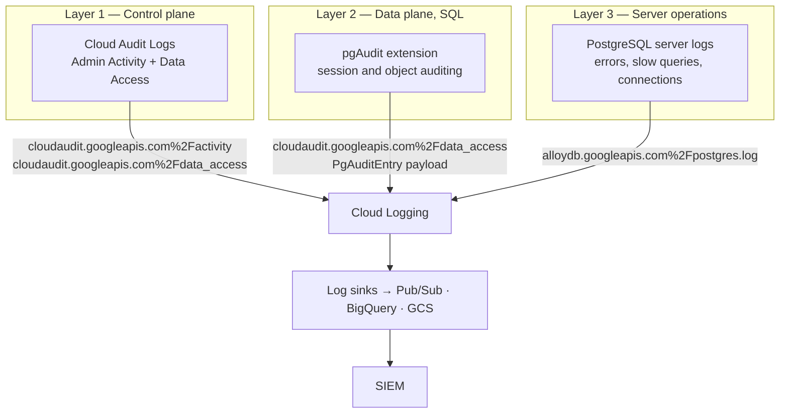
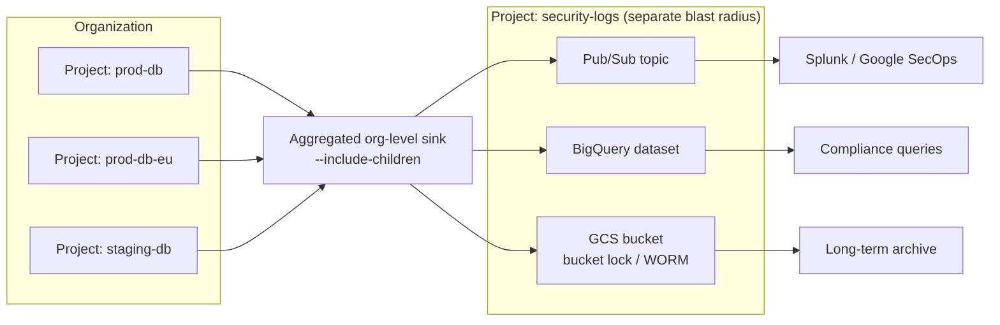

# AlloyDB Audit Logging and SIEM Integration

> Audience: a security team that will have to **prove** audit coverage, not just
> configure it. The organising idea of this document is that AlloyDB auditing is
> three independent systems that people constantly conflate. Enabling one and
> assuming you have the others is the most common way a database audit programme
> fails its first review.

**Companion document:** [security-hardening.md](./security-hardening.md) covers
the preventive controls. This one covers the detective controls.

**Reference implementation:** [`terraform/examples/04-secure-cmek/`](../terraform/examples/04-secure-cmek/)

---

## The three-layer model

There is no single "AlloyDB audit log". There are three, they answer different
questions, they are enabled separately, they are billed separately, and they
land in different places.



| | **Layer 1: Cloud Audit Logs** | **Layer 2: pgAudit** | **Layer 3: Server logs** |
|---|---|---|---|
| **Question it answers** | Who touched the AlloyDB *service*? | Who ran what *SQL* inside a database? | What did the *server* do, and what went wrong? |
| **Example event** | `alloydb.clusters.delete` by `dana@example.com` | `SELECT * FROM salary` by role `alice` in database `finance` | `FATAL: password authentication failed`; autovacuum completion; a 4-second query |
| **Identity recorded** | Google Cloud IAM principal | PostgreSQL role name | PostgreSQL role name (where the log line includes it) |
| **Default state** | Admin Activity **always on**; Data Access **off** | Off. Needs a flag, a value, **and** `CREATE EXTENSION` per database | On for the standard server log stream |
| **Enabling cost** | Admin Activity free; Data Access billable | Billable (it becomes Data Access log volume) | Billable as normal log ingestion |
| **Log name** | `cloudaudit.googleapis.com%2Factivity` / `%2Fdata_access` | `cloudaudit.googleapis.com%2Fdata_access` | `alloydb.googleapis.com%2Fpostgres.log` |
| **Cannot tell you** | Any SQL. It never sees inside a connection | Anything about cluster/instance configuration changes | Reliably, *every* statement — it is not an audit trail |

> [!IMPORTANT]
> The most common misconception: **Cloud Audit Logs do not record SQL.** A
> perfectly configured Admin Activity + Data Access setup will tell you that
> `app-payments@...` logged in, and nothing at all about what it then read. If
> your control objective is "detect unauthorised access to PII columns", Layer 1
> cannot satisfy it and pgAudit is mandatory.

A second, subtler point: the three layers use **different identity namespaces**.
Layer 1 records Google Cloud IAM principals. Layers 2 and 3 record PostgreSQL
role names. With IAM database authentication the two line up (the PostgreSQL
role *is* the principal email, minus the `.gserviceaccount.com` suffix for
service accounts). With built-in password authentication they do not, and
correlating "who was `app_user`" becomes a manual exercise. This is a strong
operational argument for IAM database authentication — see
[security-hardening.md](./security-hardening.md#iam-database-authentication).

### Connection pooling affects what identity pgAudit can see

Worth settling before you design the audit pipeline, because it is difficult to
retrofit.

An external, self-managed connection pooler multiplexes many application
clients onto a small number of server connections, and it opens those server
connections with its own credentials. The identity that reaches PostgreSQL —
and therefore the identity pgAudit and the server log record — is the pooler's,
not the end user's. Every statement in the audit trail appears to originate
from one service identity, and attribution falls back to correlating database
records against application logs by timestamp. That is precisely the
reconstruction that Layer 2 exists to make unnecessary.

**AlloyDB Managed Connection Pooling** is the recommended alternative. It runs
inside the managed instance rather than in front of it, adds no credential
store of its own, and is not supported over public IP — which means adopting it
also reinforces a private-only network posture. Configuration, pool modes and
the transaction-mode compatibility list are in
[`config/connection-pooling/managed-connection-pooling.md`](../config/connection-pooling/managed-connection-pooling.md);
the security framing is in
[security-hardening.md](./security-hardening.md#connection-pooling-as-a-security-control).

> [!NOTE]
> Pooling of any kind still collapses *sessions*, so `pg_stat_activity` will not
> map one-to-one onto end users. What managed connection pooling preserves is
> the authenticated database role on the connection, which is the field your
> pgAudit queries and SIEM correlation rules depend on.

---

## Layer 1 — Cloud Audit Logs

### Admin Activity vs Data Access

| | Admin Activity | Data Access |
|---|---|---|
| Records | API calls that **modify** configuration or metadata | API calls that read metadata/configuration (`ADMIN_READ`) or read/write user data (`DATA_READ`, `DATA_WRITE`) |
| Default | **Always written.** You cannot configure, exclude or disable them — even with the Cloud Logging API disabled | **Off.** Must be explicitly enabled per service |
| Cost | Stored in the locked `_Required` bucket; Logging does not charge for it | Stored in `_Default` (or wherever you route it) and billed as normal ingestion |
| Retention | `_Required` is fixed at **400 days** and cannot be changed | `_Default` defaults to **30 days**, configurable 1–3650 days |
| Read permission | `roles/logging.viewer` | **`roles/logging.privateLogViewer`** |

The 400-day / 30-day figures above were confirmed live against project
`bryanko-databases-demo1` (`gcloud logging buckets list --location=global`).

> [!CAUTION]
> If your security analysts only hold `roles/logging.viewer`, they will see
> Admin Activity logs and **silently see nothing** for Data Access — including
> all pgAudit output. The query returns zero rows rather than a permission
> error, which is a very effective way to convince a team that pgAudit "isn't
> working". Grant `roles/logging.privateLogViewer`.

### Which AlloyDB operations map to which log type

Read from the
[AlloyDB audit logging reference](https://cloud.google.com/alloydb/docs/audit-logging)
on 2026-09-22:

| Permission | Type | Consequence |
|------------|------|-------------|
| `alloydb.clusters.create`, `.delete`, `.switchover` | `ADMIN_WRITE` | Admin Activity — always captured |
| `alloydb.backups.create` | `ADMIN_WRITE` | Admin Activity — always captured |
| `alloydb.clusters.get`, `.list`, `alloydb.instances.get`, `.list`, `alloydb.users.get`, `.list`, `alloydb.databases.list` | `ADMIN_READ` | **Not captured unless you enable `ADMIN_READ`** |
| `alloydb.instances.executeSqlReadOnly` | `DATA_READ` | Read-only SQL through the API — invisible without `DATA_READ` |
| `alloydb.clusters.export` | `DATA_READ` | Bulk data export — invisible without `DATA_READ` |
| `alloydb.users.login` | `DATA_WRITE` | Database sign-ins — invisible without `DATA_WRITE` |

> [!WARNING]
> Three of the operations a security team most wants to see —
> `executeSqlReadOnly`, `clusters.export`, and `users.login` — are **all** Data
> Access, which is **off by default**. Out of the box, a principal with
> `roles/alloydb.viewer` can read data through the API and export a cluster, and
> you will have no record of it. Enabling Data Access logs for
> `alloydb.googleapis.com` is not optional for this audience.

### Enabling Data Access logs

Data Access logging is configured through the **IAM policy** of the project (or
folder/organization), in an `auditConfigs` block. Note that you cannot disable
at a project a Data Access log that a parent organization or folder enabled —
which is exactly the property you want for a centrally-mandated control.

```yaml
# audit-config.yaml — merge this into the project (or org) IAM policy.
auditConfigs:
  - service: alloydb.googleapis.com
    auditLogConfigs:
      - logType: ADMIN_READ     # who listed clusters, users, databases
      - logType: DATA_READ      # executeSqlReadOnly, cluster export, pgAudit reads
      - logType: DATA_WRITE     # users.login, pgAudit writes
  # Do KMS at the same time, or CMEK gives you a key with no usage trail.
  - service: cloudkms.googleapis.com
    auditLogConfigs:
      - logType: ADMIN_READ
      - logType: DATA_READ
```

```bash
# Read-modify-write. Never hand-edit the live policy without the etag.
gcloud projects get-iam-policy PROJECT_ID --format=yaml > policy.yaml
#   ... merge the auditConfigs block above into policy.yaml ...
gcloud projects set-iam-policy PROJECT_ID policy.yaml
```

Terraform — the authoritative way to manage this, because it makes the control
reviewable in a pull request:

```hcl
# Enables Data Access audit logs for AlloyDB across the whole project.
# NOTE: google_project_iam_audit_config is AUTHORITATIVE for the named service.
# Applying it will remove any auditLogConfigs for alloydb.googleapis.com that
# were set outside Terraform.
resource "google_project_iam_audit_config" "alloydb" {
  project = var.project_id
  service = "alloydb.googleapis.com"

  audit_log_config { log_type = "ADMIN_READ" }
  audit_log_config { log_type = "DATA_READ" }
  audit_log_config { log_type = "DATA_WRITE" }
}

# CMEK without KMS audit logging is a control with no evidence behind it.
resource "google_project_iam_audit_config" "kms" {
  project = var.project_id
  service = "cloudkms.googleapis.com"

  audit_log_config { log_type = "ADMIN_READ" }
  audit_log_config { log_type = "DATA_READ" }
}
```

> [!TIP]
> `auditLogConfigs` supports `exemptedMembers`. It is tempting to exempt a noisy
> CI service account. Resist it for `alloydb.googleapis.com`: an exemption is an
> invisible blind spot that no dashboard will show you, and a compromised CI
> identity is a realistic attack path. If volume is the problem, fix it with a
> sink-level exclusion filter instead, where the exclusion is at least visible
> in the sink definition.

Verify:

```bash
gcloud projects get-iam-policy PROJECT_ID --format="yaml(auditConfigs)"
```

Source: [Configure Data Access audit logs](https://cloud.google.com/logging/docs/audit/configure-data-access).

---

## Layer 2 — pgAudit, end to end

pgAudit is the open-source PostgreSQL auditing extension. On AlloyDB it takes
**three** separate actions to produce a single log line. Missing any one of them
produces silence, not an error — which is why so many teams believe pgAudit is
enabled when it is not.

### Step 1 — enable the extension on the instance

```bash
# Note: AlloyDB restarts the instance automatically after this flag change.
gcloud alloydb instances update prod-primary \
  --cluster=prod --region=us-central1 \
  --database-flags=alloydb.enable_pgaudit=on
```

| Property | Value | Source |
|----------|-------|--------|
| Flag | `alloydb.enable_pgaudit` | `supportedDatabaseFlags` API |
| Allowed values | `on`, `off` | `supportedDatabaseFlags` API |
| Restart required | **Yes** | `supportedDatabaseFlags` API (`requiresDbRestart: true`) |

> [!WARNING]
> This restart is a connection-dropping event on the primary. Schedule it.
> Contrast with `alloydb.iam_authentication`, which takes effect with **no**
> restart — the two are often turned on in the same change, and only one of them
> is disruptive.

### Step 2 — set `pgaudit.log`, or you get nothing

The default value of `pgaudit.log` is `none`. With the extension enabled and
`pgaudit.log` left alone, pgAudit produces **zero** output. This is the single
most common pgAudit misconfiguration.

Exact allowed values, read from the AlloyDB `supportedDatabaseFlags` API on
2026-09-22:

```
read  write  function  role  ddl  misc  misc_set  all  none
-read -write -function -role -ddl -misc -misc_set -all -none
```

| Class | Captures |
|-------|----------|
| `read` | `SELECT`, and `COPY` when the source is a relation |
| `write` | `INSERT`, `UPDATE`, `DELETE`, `TRUNCATE`, and `COPY` when the destination is a relation |
| `function` | Function calls and `DO` blocks |
| `role` | `GRANT`, `REVOKE`, `CREATE`/`ALTER`/`DROP ROLE` — privilege changes |
| `ddl` | All DDL not captured by `role` |
| `misc` | Miscellaneous commands: `DISCARD`, `FETCH`, `CHECKPOINT`, `VACUUM`, `SET` |
| `misc_set` | Only the `SET` subset of `misc` |
| `all` | Everything above |
| `none` | Nothing. The default |

**The subtractive forms** (`-read`, `-misc`, …) are the feature that makes
pgAudit usable on a busy system, and they are widely missed. A leading `-`
removes a class from the set you have already accumulated, so you can write
"everything except the noise" instead of enumerating what you want:

```sql
-- "Audit everything, except the low-value chatter."
-- Evaluated left to right: start from all, subtract misc, subtract misc_set.
ALTER DATABASE finance SET pgaudit.log = 'all, -misc, -misc_set';

-- "Audit every privilege change and schema change, but no data access."
-- Useful as a low-volume org-wide baseline.
ALTER DATABASE finance SET pgaudit.log = 'role, ddl';

-- "Everything except reads" — keeps the volume down on a read-heavy OLTP DB
-- while still capturing all mutations and privilege changes.
ALTER DATABASE finance SET pgaudit.log = 'all, -read, -misc';
```

At the instance level, remember the comma problem:

```bash
# The ^:^ prefix changes the flag separator from ',' to ':' so that the
# comma-separated pgaudit.log value survives argument parsing.
gcloud alloydb instances update prod-primary \
  --cluster=prod --region=us-central1 \
  --database-flags=^:^pgaudit.log=read,write:pgaudit.log_parameter=off
```

### Step 3 — create the extension in **every** database

```sql
-- Must be run on the PRIMARY instance, as a member of alloydbsuperuser
-- (the default `postgres` user qualifies). Repeat for EVERY database.
\c finance
CREATE EXTENSION IF NOT EXISTS pgaudit;

\c payments
CREATE EXTENSION IF NOT EXISTS pgaudit;
```

> [!CAUTION]
> `CREATE EXTENSION` is **per database**, not per cluster. A new database
> created next quarter by an application migration will have pgAudit silently
> absent. Add an extension-presence check to your compliance scan:
>
> ```sql
> SELECT d.datname,
>        EXISTS (SELECT 1 FROM pg_extension e WHERE e.extname = 'pgaudit') AS pgaudit_present
> FROM pg_database d WHERE d.datallowconn AND NOT d.datistemplate;
> ```
>
> (Run the `pg_extension` half while connected to each database — `pg_extension`
> is a per-database catalog.) You must also do this on the **primary** even if
> the auditing you care about is on a read pool.

### The rest of the `pgaudit.*` family

All verified against `supportedDatabaseFlags` on 2026-09-22. None of these
require a restart.

| Flag | Type / allowed values | What it does | Security note |
|------|----------------------|--------------|---------------|
| `pgaudit.log` | see list above | Session audit classes | The main switch. Default `none` |
| `pgaudit.role` | string (a role name) | Enables **object** auditing against the named role | The highest-value setting for this audience — see below |
| `pgaudit.log_catalog` | `on` / `off` | Audit statements that touch only `pg_catalog` | Off reduces noise from tools; on catches catalog reconnaissance |
| `pgaudit.log_client` | `on` / `off` | Also send audit lines to the connected client | Leave **off**. Showing the attacker the audit trail is not a feature |
| `pgaudit.log_level` | `debug`, `debug5`–`debug1`, `info`, `notice`, `warning`, `log` | Severity used for audit entries | `log` is the normal choice. Changing it changes how your SIEM severity-maps the events |
| `pgaudit.log_parameter` | `on` / `off` | Include bind parameters in the audit record | **Decide deliberately.** On gives you the actual values queried; it also writes PII, card numbers and tokens into your log estate |
| `pgaudit.log_relation` | `on` / `off` | Emit a separate entry per relation in a statement | Much better attribution for multi-table joins, at multiplied volume |
| `pgaudit.log_rows` | `on` / `off` | Include the number of rows returned or affected | Cheap and very useful — a 2-row `SELECT` and a 5-million-row `SELECT` are different events |
| `pgaudit.log_statement_once` | `on` / `off` | Log statement text only on the first entry of a statement/substatement chain | Saves volume; costs you self-contained log lines. Off is friendlier to SIEM parsers |
| `pgaudit.auditlog_volume_reduction_window` | integer, −1 – 2147483647 | Deduplication window used by AlloyDB's audit-log volume reduction | See [volume control](#audit-log-volume-and-cost-control) |

> [!CAUTION]
> `pgaudit.log_parameter = on` will write query parameter values into Cloud
> Logging. For a table holding card numbers, national IDs or health data that
> means your log sink, your BigQuery dataset and your SIEM all become systems of
> record for regulated data, with the compliance scope that implies. Leave it
> `off` unless you have consciously decided to bring your log pipeline into
> scope. When it is off, the `parameter` field reads `[not logged]`.

### Object-level auditing via `pgaudit.role`

This is the pattern to build your programme around. Session auditing asks "log
everything this *user* does". Object auditing asks "log every access to *this
table*, whoever does it" — which is how a control objective is actually worded
in a compliance framework.

The mechanism: name a role in `pgaudit.role`, then `GRANT` that role privileges
on the objects you care about. pgAudit logs any operation that matches the
combination of granted access and object, performed by **any** user.

```sql
-- 1. A role that exists purely as an audit marker. No login, no members.
CREATE ROLE auditor WITH NOLOGIN;

-- 2. Point pgAudit at it, for this database.
ALTER DATABASE employee SET pgaudit.role = 'auditor';

-- 3. Tag the sensitive objects by granting the auditor role access to them.
--    Every SELECT on salary is now logged, regardless of who runs it.
GRANT SELECT ON salary TO auditor;

-- 4. Column-level precision: log only when the sensitive columns are touched.
--    A SELECT of employee_id alone is not logged; adding income is.
GRANT SELECT (income, tax_status) ON salary TO auditor;

-- 5. Cover mutations of a high-value table too.
GRANT SELECT, INSERT, UPDATE, DELETE ON payment_methods TO auditor;
```

Why this is the right shape for a security team:

- It **survives new users.** A contractor onboarded next month is covered
  automatically; nobody has to remember to add them to a session-audit list.
- It **scopes volume to risk.** You pay log ingestion for the ten tables that
  matter, not for the four hundred that do not.
- It **maps to controls.** "All access to the `salary` relation is logged" is a
  sentence you can put in a control description and evidence with one `GRANT`
  statement and one log query.
- Combined with `alloydb.pg_authid_select_role` from
  [security-hardening.md](./security-hardening.md#restricting-who-can-read-password-hashes),
  you can make reads of the password hashes both restricted and audited.

> [!NOTE]
> Object auditing appears in the log with `auditType: OBJECT`; session auditing
> appears as `auditType: SESSION`. Use that field in your SIEM to separate
> "targeted sensitive-object access" from general activity — they usually
> warrant different alerting.

A restriction worth knowing before you delegate: database users created with
`CREATE ROLE` inside PostgreSQL **cannot modify audit settings**. Only database
users created through the Google Cloud console or `gcloud` can. That is a useful
separation-of-duties property — an application role cannot turn its own auditing
off.

Sources:
[About pgAudit](https://cloud.google.com/alloydb/docs/pgaudit/about),
[Enable pgAudit](https://cloud.google.com/alloydb/docs/pgaudit/enable-audit),
[Configure pgAudit logging behavior](https://cloud.google.com/alloydb/docs/pgaudit/configure-log-behavior).

---

## Layer 3 — PostgreSQL server logs

The server log stream is on by default and lands in Cloud Logging under
`alloydb.googleapis.com%2Fpostgres.log`. Verified live on 2026-09-22 against
project `bryanko-databases-demo1`.

```json
{
  "logName": "projects/bryanko-databases-demo1/logs/alloydb.googleapis.com%2Fpostgres.log",
  "resource": {
    "type": "alloydb.googleapis.com/Instance",
    "labels": {
      "resource_container": "projects/141783588520",
      "cluster_id": "alloydb-demo4",
      "instance_id": "alloydb-demo4-primary",
      "location": "us-central1"
    }
  },
  "labels": {
    "CONSUMER_PROJECT": "bryanko-databases-demo1",
    "CONSUMER_PROJECT_NUMBER": "141783588520",
    "DATABASE_VERSION": "POSTGRES_15",
    "NODE_ID": "w9cp",
    "NODE_TYPE": "ACTIVE"
  },
  "severity": "INFO",
  "textPayload": "2026-09-22 07:17:07.696 UTC [3813335][autovacuum worker]: ... LOG: ..."
}
```

> [!IMPORTANT]
> The **Cloud Logging** resource labels for
> `alloydb.googleapis.com/Instance` are `resource_container` (a
> `projects/<PROJECT_NUMBER>` string), `cluster_id`, `instance_id` and
> `location`. The **Cloud Monitoring** metric labels for the same resource type
> use `project_id` instead of `resource_container`. If you write a log filter
> using `project_id`, or a monitoring filter using `resource_container`, it will
> match nothing and fail silently. This trips people up constantly because the
> resource type name is identical in both products.

What the server log is good for, and what it is not:

| Good for | Not good for |
|----------|--------------|
| Authentication failures (`FATAL: password authentication failed for user ...`) | A complete statement record. It is not an audit trail |
| Connection and disconnection events, if you configure them | Non-repudiation — content depends on log settings that can be changed |
| Slow queries via `log_min_duration_statement` | Object-level attribution |
| Autovacuum, checkpoint and replication diagnostics | Any guarantee of completeness |

Two useful flags, both settable and neither requiring a restart:

| Flag | Range | Use |
|------|-------|-----|
| `log_min_duration_statement` | −1 – 2147483647 | Log statements slower than N ms. `-1` disables; `0` logs everything (do not do that in production) |
| `statement_timeout` | 0 – 2147483647 | Not a logging control, but it bounds the damage a runaway query does. Pairs with the analysis in [`monitoring/sql/01_top_queries.sql`](../monitoring/sql/01_top_queries.sql) |

> [!TIP]
> Failed authentications only appear in Layer 3. They are not Cloud Audit Log
> events, and pgAudit does not see them because the session never established.
> A brute-force detection rule therefore has to be built on
> `alloydb.googleapis.com%2Fpostgres.log`, not on the audit logs. This is a
> coverage gap people discover after an incident.

---

## Where pgAudit output actually lands

**Verified.** pgAudit output is delivered as **Cloud Audit Logs Data Access
entries**, not into the server log stream. Confirmed from
[View pgAudit logs](https://cloud.google.com/alloydb/docs/pgaudit/view-audit-log)
on 2026-09-22.

```
resource.type="alloydb.googleapis.com/Instance"
logName="projects/PROJECT_ID/logs/cloudaudit.googleapis.com%2Fdata_access"
protoPayload.request.@type="type.googleapis.com/google.cloud.alloydb.audit.v1.PgAuditEntry"
```

Payload shape:

```json
{
  "protoPayload": {
    "@type": "type.googleapis.com/google.cloud.audit.AuditLog",
    "methodName": "alloydb.instances.query",
    "request": {
      "@type": "type.googleapis.com/google.cloud.alloydb.audit.v1.PgAuditEntry",
      "auditClass": "READ",
      "auditType": "SESSION",
      "chunkCount": "1",
      "chunkIndex": "1",
      "command": "SELECT",
      "database": "finance",
      "databaseSessionId": 2209692,
      "parameter": "[not logged]",
      "statement": "SELECT * FROM revenue",
      "statementId": 2,
      "substatementId": 1,
      "user": "alice"
    }
  }
}
```

Fields your SIEM parser needs to know about:

| Field | Meaning | Parser note |
|-------|---------|-------------|
| `auditClass` | `READ`, `WRITE`, `FUNCTION`, `ROLE`, `DDL`, `MISC`, `MISC_SET` | Maps to the `pgaudit.log` class that triggered the entry |
| `auditType` | `SESSION` or `OBJECT` | Use this to separate targeted sensitive-object access from general activity |
| `command` | e.g. `SELECT`, `ALTER TABLE` | Primary event-type field |
| `database` | Database name | Your tenancy / scoping dimension |
| `databaseSessionId` | Session identifier | Join key for reconstructing a session |
| `statement` | The SQL text | **May be chunked** — see below |
| `parameter` | Bind parameters, `[none]`, or `[not logged]` | `[not logged]` when `pgaudit.log_parameter=off` |
| `statementId` / `substatementId` | Sequential IDs within a session | `statementId` is sequential *even for statements that were not logged* — gaps are expected and are not evidence of tampering |
| `chunkCount` / `chunkIndex` | Chunking of `statement` and `parameter` | A long statement is split across entries. **Your SIEM must reassemble them** or long queries will be truncated in your evidence |

> [!WARNING]
> Chunking is the detail that quietly breaks SIEM integrations. A large
> statement arrives as several log entries with the same `statementId` and
> increasing `chunkIndex` (1-based) up to `chunkCount`. A naive parser that
> treats each entry as a complete statement will store fragments. Test your
> pipeline with a deliberately long query before you sign off coverage.

Two things this repo could **not** verify in the live environment, because
pgAudit is not currently enabled on any cluster in
`bryanko-databases-demo1` (enabling it requires an instance restart):

1. Whether pgAudit entries are *also* duplicated into
   `alloydb.googleapis.com%2Fpostgres.log`. The documentation describes only the
   Data Access destination. Confirm on a non-production cluster before you
   design deduplication logic.
2. The maximum `chunkCount` observed in practice for very large statements.

Both are called out in the summary at the end for pre-workshop verification.

---

## Audit log volume and cost control

This is where audit programmes die. `pgaudit.log = all` on a busy OLTP database
is not a logging configuration, it is a denial-of-service against your own
platform — and AlloyDB's published limits make the failure mode concrete.

### The hard limits

| Limit | Value | Source |
|-------|-------|--------|
| Maximum audit log **ingestion rate** | **90 MiB per second** | [About pgAudit](https://cloud.google.com/alloydb/docs/pgaudit/about) |
| Maximum size of a **single audit record** | **1 MB** | [About pgAudit](https://cloud.google.com/alloydb/docs/pgaudit/about) |
| Processing model | Asynchronous, buffered on the instance's local storage | Same |

> [!CAUTION]
> Read the failure mode carefully, because it is worse than "logs are delayed".
> Google documents that sustained backpressure can cause: higher latency between
> the event and its appearance in Cloud Logging; **instance restarts or crashes
> resulting from local disk space exhaustion**; and **intermittent gaps in
> processed and persisted audit log trails**. In other words, over-configuring
> pgAudit can take your database down *and* leave holes in the evidence you were
> trying to collect. A gap in an audit trail is a finding.

### Control 1 — scope with `ALTER DATABASE` / `ALTER ROLE`

The single most effective lever. Set `pgaudit.log` narrowly at the instance
level and widen it only where risk justifies it.

```sql
-- Instance-level baseline: privilege and schema changes only. Low volume,
-- high value, and it applies to every database including new ones.
--   gcloud ... --database-flags=^:^pgaudit.log=role,ddl

-- Widen for the one database that holds regulated data.
ALTER DATABASE finance SET pgaudit.log = 'all, -misc, -misc_set';

-- Narrow again for a specific chatty service account inside that database.
ALTER ROLE "reporting-etl@PROJECT_ID.iam" SET pgaudit.log = 'write, ddl, role';

-- Widen for a specific high-risk human.
ALTER ROLE dba_oncall SET pgaudit.log = 'all';
```

Precedence runs instance → database → role, with the most specific setting
winning. Document which databases and roles have overrides; an undocumented
`ALTER ROLE ... SET pgaudit.log = 'none'` is an audit-evasion technique that
looks like normal tuning.

### Control 2 — AlloyDB's volume reduction

AlloyDB ships a platform-level deduplication mechanism for repetitive audit
records — the classic case being an application that runs the same prepared
statement thousands of times per second.

| Flag | Type | Default | Restart | Notes |
|------|------|---------|---------|-------|
| `alloydb.enable_auditlog_volume_reduction` | `on` / `off` | `off` | **Yes** | Master switch for the reduction mechanism |
| `pgaudit.auditlog_volume_reduction_window` | integer, −1 – 2147483647 | — | No | The deduplication window |

```bash
# Restart-inducing. Batch it with your alloydb.enable_pgaudit change.
gcloud alloydb instances update prod-primary \
  --cluster=prod --region=us-central1 \
  --database-flags=^:^alloydb.enable_pgaudit=on:\
alloydb.enable_auditlog_volume_reduction=on:\
pgaudit.auditlog_volume_reduction_window=60
```

> [!NOTE]
> The **unit** of `pgaudit.auditlog_volume_reduction_window` is not stated in
> the `supportedDatabaseFlags` API response, and the AlloyDB flags reference
> does not document this flag. The value `60` above is illustrative only and
> assumes seconds — that assumption is **unverified**. Confirm the unit and the
> deduplication semantics with Google before you rely on it, and before you
> claim in a control description that no events are being dropped.

There is a compliance question buried here that you should answer explicitly in
your control documentation: **deduplication means the log no longer contains one
entry per execution.** For some frameworks that is fine (you retain evidence of
the access pattern); for others "every access to the table is individually
logged" is the literal requirement. Decide before you enable it, not during the
audit.

### Control 3 — watch the pipeline, and alert on it

AlloyDB exposes three metrics on the `alloydb.googleapis.com/InstanceNode`
monitored resource. These are the early warning that your audit pipeline is
falling behind — and a silently lagging audit pipeline is a compliance failure,
not a performance nuisance.

| Metric | Kind / type | Unit | Meaning |
|--------|-------------|------|---------|
| `alloydb.googleapis.com/node/database/logging/audit/backlog_bytes_count` | GAUGE / INT64 | `By` | Size of the audit log backlog on the node awaiting processing and upload. "A sustained high or increasing value indicates backpressure in the audit log forwarding pipeline" |
| `alloydb.googleapis.com/node/database/logging/audit/processed_bytes_count` | DELTA / INT64 | `By` | Bytes successfully processed and forwarded to Cloud Logging |
| `alloydb.googleapis.com/node/database/logging/audit/processed_entries_count` | DELTA / INT64 | `1` | Entries successfully processed and forwarded |

Metric names, kinds, units and descriptions verified against
[View pgAudit logs](https://cloud.google.com/alloydb/docs/pgaudit/view-audit-log)
on 2026-09-22.

```hcl
# Alert when the audit backlog stays elevated. Treat this as a compliance
# alert rather than a performance alert — route it to the security on-call,
# not the DBA queue.
resource "google_monitoring_alert_policy" "audit_backlog" {
  display_name = "AlloyDB audit log backlog sustained"
  combiner     = "OR"

  conditions {
    display_name = "audit backlog_bytes_count elevated for 15m"
    condition_threshold {
      filter = join(" AND ", [
        "resource.type = \"alloydb.googleapis.com/InstanceNode\"",
        "metric.type = \"alloydb.googleapis.com/node/database/logging/audit/backlog_bytes_count\"",
      ])
      comparison = "COMPARISON_GT"

      # This is a starting point we chose, not a Google recommendation.
      # Google does not publish a threshold for this metric. Baseline your own
      # steady state first (it should hover near zero), then set the threshold
      # well above normal but far below anything that risks local disk
      # exhaustion. Recalibrate after any pgaudit.log change.
      threshold_value = 104857600 # 100 MiB — calibrate against your baseline

      duration = "900s" # sustained, not a momentary spike
      aggregations {
        alignment_period   = "60s"
        per_series_aligner = "ALIGN_MAX"
      }
    }
  }

  documentation {
    content = <<-EOT
      The AlloyDB audit log pipeline is backing up on at least one node.

      Why this is a security incident, not just a performance one:
      sustained backpressure can cause gaps in the audit trail and, in the
      worst case, instance restarts from local disk exhaustion.

      Triage:
        1. Compare processed_bytes_count now vs. the last 24h baseline.
        2. Check for a recent pgaudit.log / ALTER DATABASE / ALTER ROLE change.
        3. Consider narrowing pgaudit.log scope, or enabling
           alloydb.enable_auditlog_volume_reduction (requires a restart).
        4. Record the window in the audit-gap register regardless of outcome.
    EOT
  }
}
```

> [!TIP]
> Also alert on `processed_entries_count` dropping to **zero** while the
> database is demonstrably serving traffic. A backlog alert catches "too much
> audit data"; a zero-throughput alert catches "someone turned auditing off".
> The second is the one an insider would trigger.

### Control 4 — filter at the sink, not at the source

Once the events are in Cloud Logging you can still control what you pay to store
in BigQuery or stream to your SIEM. Exclusion at the sink is preferable to
disabling collection, because the events still exist in the (400-day, free,
locked) `_Required` bucket for Admin Activity, and in `_Default` for Data
Access, while your expensive downstream copy stays small.

```bash
# Route only high-signal pgAudit classes to the expensive real-time SIEM path.
gcloud logging sinks create alloydb-pgaudit-highvalue \
  pubsub.googleapis.com/projects/SECURITY_PROJECT/topics/siem-alloydb \
  --log-filter='
    resource.type="alloydb.googleapis.com/Instance"
    logName:"cloudaudit.googleapis.com%2Fdata_access"
    protoPayload.request."@type"="type.googleapis.com/google.cloud.alloydb.audit.v1.PgAuditEntry"
    (
      protoPayload.request.auditType="OBJECT"        OR
      protoPayload.request.auditClass="ROLE"         OR
      protoPayload.request.auditClass="DDL"          OR
      protoPayload.request.auditClass="WRITE"
    )
  '
```

Everything else can go to BigQuery on a cheaper cadence. Splitting the
destinations by value, rather than throwing one firehose at the SIEM, is the
difference between an audit programme that survives its first budget review and
one that does not.

---

## SIEM export

### Architecture



> [!IMPORTANT]
> Put the sink destinations in a **separate security project**, outside the
> audited project's blast radius, with a different set of project owners. An
> attacker who compromises the database project should not be able to delete the
> evidence of what they did. This is the single highest-value architectural
> decision in this section, and it costs nothing.

### Destination choice

| Destination | Latency | Best for | Watch out for |
|-------------|---------|----------|---------------|
| **Pub/Sub** | Near real-time | Streaming to Splunk, Google SecOps (Chronicle), or any third-party SIEM | Needs a subscriber that keeps up; unacknowledged messages expire. Highest per-GB cost path |
| **BigQuery** | Minutes | Compliance queries, joins against HR/CMDB data, evidence generation for auditors | Partition and cluster the tables, or your first year-long query will be expensive |
| **Cloud Storage** | Hourly batches | WORM archival for multi-year retention | Apply a **retention policy and bucket lock** or it is not tamper-evident. Locked policies cannot be shortened or removed |
| **Cloud Logging bucket** | Immediate | Keeping searchable copies with custom retention (1–3650 days) | Retention beyond the 30-day default is chargeable |

> [!NOTE]
> Routing a copy of a log that is already stored in the free `_Required` bucket
> to another bucket **does** incur storage and retention pricing. Admin Activity
> logs are free where they land by default; they are not free once you duplicate
> them. Factor that into the cost model before you write an
> `--include-children` sink with a broad filter.

### Organization-level aggregated sink

```bash
ORG_ID="123456789"
SEC_PROJECT="security-logs"

gcloud logging sinks create alloydb-audit-org \
  "bigquery.googleapis.com/projects/${SEC_PROJECT}/datasets/alloydb_audit" \
  --organization="${ORG_ID}" \
  --include-children \
  --use-partitioned-tables \
  --log-filter='
    resource.type="alloydb.googleapis.com/Instance"
    OR protoPayload.serviceName="alloydb.googleapis.com"
  '

# The sink writes as a service account Logging creates for it. Until you grant
# that identity write access on the destination, the sink silently drops data.
WRITER=$(gcloud logging sinks describe alloydb-audit-org \
  --organization="${ORG_ID}" --format="value(writerIdentity)")

gcloud projects add-iam-policy-binding "${SEC_PROJECT}" \
  --member="${WRITER}" --role="roles/bigquery.dataEditor"
```

> [!WARNING]
> Forgetting the writer-identity grant is the classic aggregated-sink failure.
> The sink is created successfully, reports no errors, and delivers nothing.
> Always read `writerIdentity` back and grant it explicitly, then confirm data
> is arriving at the destination before you declare coverage. Re-check after any
> destination project IAM change.

Filter recipes, scoped to AlloyDB:

```bash
# Control-plane changes only — small, high value, good for a real-time channel.
protoPayload.serviceName="alloydb.googleapis.com"
protoPayload.methodName:("create" OR "delete" OR "update" OR "patch" OR "switchover")

# Cluster deletions specifically. Alert on this, do not just archive it.
protoPayload.serviceName="alloydb.googleapis.com"
protoPayload.authorizationInfo.permission="alloydb.clusters.delete"

# Every pgAudit entry.
protoPayload.request."@type"="type.googleapis.com/google.cloud.alloydb.audit.v1.PgAuditEntry"

# Privilege changes inside the database — GRANT/REVOKE/CREATE ROLE.
protoPayload.request."@type"="type.googleapis.com/google.cloud.alloydb.audit.v1.PgAuditEntry"
protoPayload.request.auditClass="ROLE"

# Object-level hits on your tagged sensitive tables.
protoPayload.request."@type"="type.googleapis.com/google.cloud.alloydb.audit.v1.PgAuditEntry"
protoPayload.request.auditType="OBJECT"

# Authentication failures — Layer 3 only. Not in the audit logs.
logName:"alloydb.googleapis.com%2Fpostgres.log"
textPayload:"password authentication failed"

# Data exfiltration candidates via the API path.
protoPayload.serviceName="alloydb.googleapis.com"
protoPayload.authorizationInfo.permission="alloydb.clusters.export"
```

### Terraform for the org-level sink

```hcl
# ---------------------------------------------------------------------------
# Destination lives in a SEPARATE security project so that compromising the
# database project does not give an attacker the ability to destroy evidence.
# ---------------------------------------------------------------------------

resource "google_bigquery_dataset" "alloydb_audit" {
  project                    = var.security_project_id
  dataset_id                 = "alloydb_audit"
  location                   = "US"
  delete_contents_on_destroy = false

  # 7 years. Set to your regulatory requirement; 0 means never expire.
  default_table_expiration_ms = 7 * 365 * 24 * 60 * 60 * 1000
}

resource "google_logging_organization_sink" "alloydb_audit" {
  name        = "alloydb-audit-org"
  org_id      = var.org_id
  destination = "bigquery.googleapis.com/projects/${var.security_project_id}/datasets/${google_bigquery_dataset.alloydb_audit.dataset_id}"

  # Without this the sink only captures logs written directly at the org node,
  # which is almost nothing. This single flag is the difference between
  # organization-wide coverage and an empty dataset.
  include_children = true

  filter = <<-EOT
    resource.type="alloydb.googleapis.com/Instance"
    OR protoPayload.serviceName="alloydb.googleapis.com"
  EOT

  bigquery_options {
    use_partitioned_tables = true # partition by day; keeps long-range queries affordable
  }
}

# The sink writes as a Logging-managed service account. No grant => silent drop.
resource "google_project_iam_member" "sink_writer_bq" {
  project = var.security_project_id
  role    = "roles/bigquery.dataEditor"
  member  = google_logging_organization_sink.alloydb_audit.writer_identity
}

# ---------------------------------------------------------------------------
# Real-time path to the SIEM, filtered to high-signal events only.
# ---------------------------------------------------------------------------

resource "google_pubsub_topic" "siem" {
  project = var.security_project_id
  name    = "siem-alloydb"
}

resource "google_logging_organization_sink" "alloydb_siem" {
  name             = "alloydb-siem-org"
  org_id           = var.org_id
  destination      = "pubsub.googleapis.com/${google_pubsub_topic.siem.id}"
  include_children = true

  filter = <<-EOT
    protoPayload.serviceName="alloydb.googleapis.com"
    AND (
      protoPayload.authorizationInfo.permission="alloydb.clusters.delete"
      OR protoPayload.authorizationInfo.permission="alloydb.clusters.export"
      OR protoPayload.request."@type"="type.googleapis.com/google.cloud.alloydb.audit.v1.PgAuditEntry"
         AND (protoPayload.request.auditClass="ROLE" OR protoPayload.request.auditType="OBJECT")
    )
  EOT
}

resource "google_pubsub_topic_iam_member" "sink_writer_ps" {
  project = var.security_project_id
  topic   = google_pubsub_topic.siem.name
  role    = "roles/pubsub.publisher"
  member  = google_logging_organization_sink.alloydb_siem.writer_identity
}

# ---------------------------------------------------------------------------
# WORM archive. The retention policy is what makes this tamper-evident;
# without it, a GCS bucket is just a cheap bucket.
# ---------------------------------------------------------------------------

resource "google_storage_bucket" "audit_archive" {
  project                     = var.security_project_id
  name                        = "${var.security_project_id}-alloydb-audit-archive"
  location                    = "US"
  uniform_bucket_level_access = true

  retention_policy {
    # is_locked = true is IRREVERSIBLE. Once locked the retention period can
    # be increased but never shortened, and objects cannot be deleted early.
    # Test with is_locked = false first.
    is_locked        = true
    retention_period = 7 * 365 * 24 * 60 * 60 # 7 years, in seconds
  }
}
```

---

## Retention and demonstrating coverage

### What to keep, and for how long

> [!WARNING]
> The retention periods in this table are a **starting point for discussion with
> your compliance function, not a Google recommendation**. Google publishes
> platform defaults (below), not regulatory guidance. Your actual numbers come
> from your regulator, your contracts and your legal team.

| Data | Platform default | Typical target | Where to keep it |
|------|------------------|----------------|------------------|
| Admin Activity audit logs | `_Required` bucket, **400 days**, locked, free | 1–7 years | Copy to GCS with bucket lock for anything beyond 400 days |
| Data Access audit logs (incl. pgAudit) | `_Default` bucket, **30 days** | 1–7 years | BigQuery for query, GCS for archive |
| PostgreSQL server logs | `_Default` bucket, **30 days** | 90 days – 1 year | BigQuery; rarely needs multi-year retention |
| Cloud KMS audit logs | Per your `auditConfigs` | Match the AlloyDB data retention | Same destinations |
| Terraform state and plan history | n/a | Life of the system | Versioned GCS bucket, separate project |

Platform defaults verified live on 2026-09-22 (`_Required` = 400 days locked,
`_Default` = 30 days) and against
[Cloud Logging pricing](https://cloud.google.com/stackdriver/pricing), which
states there are no retention charges for the `_Required` bucket and that
Logging charges for retention beyond the 30-day default elsewhere.

> [!IMPORTANT]
> You cannot change the retention period of the `_Required` bucket, and you
> cannot extend the retention of a log bucket that lives in a folder or
> organization. If you need long retention on org-level logs, route them to a
> log bucket **in a project** and set retention there. Plan for this before you
> promise a seven-year retention SLA.

### Demonstrating coverage during an audit

An auditor rarely asks "is logging enabled". They ask "show me that you would
have seen X". Prepare these five artifacts in advance; each one is a single
command or query.

**1. Configuration evidence — the controls are on.**

```bash
gcloud projects get-iam-policy PROJECT_ID --format="yaml(auditConfigs)"
gcloud alloydb instances describe INSTANCE --cluster=C --region=R \
  --format="yaml(databaseFlags, clientConnectionConfig)"
gcloud logging sinks list --organization=ORG_ID
gcloud logging buckets list --location=global \
  --format="table(name, retentionDays, locked)"
```

**2. Extension evidence — pgAudit is present in every database.**

```sql
-- Run per database. An empty result for any database is a coverage gap.
SELECT current_database() AS db, extname, extversion
FROM   pg_extension WHERE extname = 'pgaudit';

-- And the effective configuration at each scope.
SHOW pgaudit.log;
SHOW pgaudit.role;
SELECT datname, unnest(setconfig) AS setting
FROM   pg_db_role_setting s JOIN pg_database d ON d.oid = s.setdatabase
WHERE  unnest(setconfig) LIKE 'pgaudit.%';
```

**3. Object-coverage evidence — the sensitive tables are actually tagged.**

```sql
-- Exactly which objects and columns the auditor role covers.
-- This is the evidence for "all access to sensitive data is logged".
SELECT table_schema, table_name, privilege_type
FROM   information_schema.role_table_grants
WHERE  grantee = 'auditor'
ORDER  BY 1, 2;

SELECT table_schema, table_name, column_name, privilege_type
FROM   information_schema.column_privileges
WHERE  grantee = 'auditor'
ORDER  BY 1, 2, 3;
```

Diff that output against your data classification register. Any table classified
as sensitive that is missing from the `auditor` grants is an uncovered asset,
and you should find it before the auditor does.

**4. Live evidence — the pipeline actually delivers.**

Run a deliberate, harmless access against a tagged object, then retrieve it.
This is the demonstration that moves a reviewer from "configured" to "working".

```sql
SELECT count(*) FROM salary WHERE 1 = 0;  -- returns 0 rows, still audited
```

```bash
gcloud logging read '
  resource.type="alloydb.googleapis.com/Instance"
  logName="projects/PROJECT_ID/logs/cloudaudit.googleapis.com%2Fdata_access"
  protoPayload.request."@type"="type.googleapis.com/google.cloud.alloydb.audit.v1.PgAuditEntry"
  protoPayload.request.auditType="OBJECT"
' --limit=5 --freshness=10m --format=json
```

**5. Continuity evidence — no silent gaps.**

```sql
-- BigQuery, against the sink dataset. Hours with zero AlloyDB audit events on
-- a 24x7 system are the thing to investigate and to be able to explain.
SELECT TIMESTAMP_TRUNC(timestamp, HOUR) AS hour,
       COUNT(*)                          AS events,
       COUNT(DISTINCT resource.labels.instance_id) AS instances
FROM   `SECURITY_PROJECT.alloydb_audit.cloudaudit_googleapis_com_data_access_*`
WHERE  _TABLE_SUFFIX BETWEEN '20260101' AND '20261231'
GROUP  BY hour
HAVING events = 0
ORDER  BY hour;
```

Pair that with the backlog-metric alert history. Together they answer "how do
you know you did not lose any audit records", which is the hardest question in
the room and the one most teams cannot answer.

> [!TIP]
> Keep a short **audit-gap register**: a dated list of every period where
> auditing was degraded (a restart for `alloydb.enable_pgaudit`, a backlog
> alert, a sink misconfiguration), with the cause and the remediation. Auditors
> respond far better to a documented, bounded, explained gap than to a confident
> claim of perfection that they then disprove with one query.

---

## Related documents

- [security-hardening.md](./security-hardening.md) — the preventive baseline
  these logs are evidence for
- [`terraform/examples/04-secure-cmek/`](../terraform/examples/04-secure-cmek/)
  — reference implementation including audit configuration
- [monitoring-metrics.md](./monitoring-metrics.md) — the metric catalogue,
  including the `node/database/logging/audit/*` family used above
- [troubleshooting-runbook.md](./troubleshooting-runbook.md) — what to do when
  the backlog alert fires
- [`monitoring/sql/02_connections_and_locks.sql`](../monitoring/sql/02_connections_and_locks.sql)
  — live session inspection, complementary to the audit trail
- [`monitoring/sql/01_top_queries.sql`](../monitoring/sql/01_top_queries.sql)
  — statement-level analysis; useful for estimating pgAudit volume before you
  enable it
- [`config/connection-pooling/managed-connection-pooling.md`](../config/connection-pooling/managed-connection-pooling.md)
  — the pooling approach that preserves the database identity pgAudit records
- [`config/connection-pooling/app-side-pool-sizing.md`](../config/connection-pooling/app-side-pool-sizing.md)
  — connection churn drives audit volume more than most people expect

---

*Last verified: 2026-09-22 against provider google v8.3.0. Re-verify hard numbers before reuse.*
