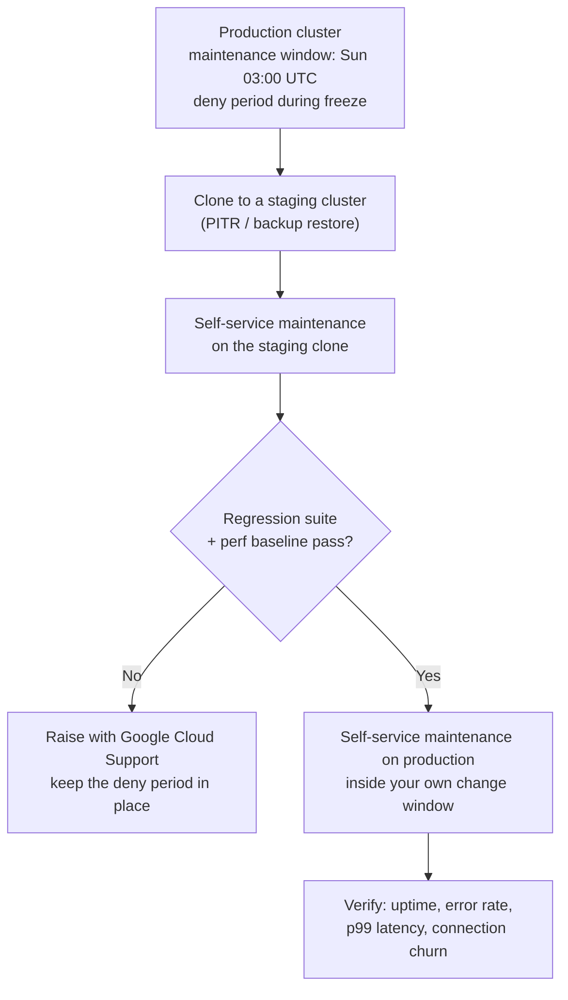

# AlloyDB Maintenance and Upgrades

> **The decision in one line:** set an explicit maintenance window on every production
> cluster, and confirm that every application can survive a connection being dropped
> underneath it. Everything else on this page is detail.

If you do nothing, AlloyDB still patches your clusters — it simply picks the time. That
is a reasonable choice for a sandbox and a poor one for a regulated production system,
because it removes your ability to have the right people awake.

Related reading: [monitoring-metrics.md](./monitoring-metrics.md) for the signals to
watch during a change, and [troubleshooting-runbook.md](./troubleshooting-runbook.md)
for what to do when a change goes wrong.

---

## 1. What AlloyDB maintenance actually is

AlloyDB clusters are built on Google-managed VMs, load balancers and storage. Google
patches all of it. Most updates need no downtime; the ones that require the serving
node to be replaced are what Google calls **maintenance updates**.

The mechanism matters, because it explains the blast radius:

> "AlloyDB's non-disruptive maintenance operations limit the downtime to **<1 second
> for primary instances, and zero seconds for read pools**. To achieve near-zero and
> zero downtime, AlloyDB prepares a replacement server with the updates and then
> switches the database server."
> — [Maintenance overview](https://cloud.google.com/alloydb/docs/maintenance)

That quotation repays close reading. "Less than one second of downtime" is **not** "no
impact". A server switch means the **old backend process is gone**. Every TCP connection
to it is dead. Your application does not experience a one-second pause on its existing
connections — it experiences those connections being severed, and it must open new
ones. That distinction is the entire subject of [Section 5](#5-the-single-most-important-consequence-connections-drop).

Maintenance happens for two documented reasons: new AlloyDB features and bug fixes
(including extension updates and security fixes), and PostgreSQL **minor** version
upgrades within your chosen major version. Major version upgrades are never automatic
— see [Section 7](#7-major-version-upgrades).

---

## 2. Maintenance windows

A maintenance window is set **per cluster** and consists of a **day of week** and an
**hour of day**, both in **UTC**.

### What happens if you do not set one

> [!WARNING]
> With no maintenance window configured, non-emergency maintenance "can occur any time
> **except** for the hours between 6 AM and 10 PM on weekdays, in the local time of the
> region where the cluster is located"
> ([Maintenance overview](https://cloud.google.com/alloydb/docs/maintenance)).
>
> That default is reasonable but it is not yours. It means your cluster can be restarted
> at 3 AM Saturday local-to-the-region, which may be the middle of your batch window, or
> at 11 PM on a weekday during a change freeze. It also means the timing differs between
> a cluster in `us-central1` and one in `asia-east2`, which is a nasty surprise for a
> multi-region estate. Set the window explicitly.

### Behaviour once you set one

| Property | Behaviour | Source |
| --- | --- | --- |
| Granularity | Day of week + hour, UTC | [Manage maintenance windows](https://cloud.google.com/alloydb/docs/maintenance-windows) |
| Start guarantee | Maintenance begins **no later than one hour after** the specified time | [Maintenance overview](https://cloud.google.com/alloydb/docs/maintenance) |
| Advance notice | Events are scheduled **at least one week ahead** | same |
| Window length | You **cannot** set an end time; only a one-hour window is configurable | same |
| Typical total duration | The entire maintenance process "usually completes within an hour" | same |
| Order of operations | **Read pools first, simultaneously; then the primary** | same |
| Emergency maintenance | Can occur outside your window, and outside deny periods | same |

> [!IMPORTANT]
> Because maintenance may *start* at the last minute of your one-hour window and then
> take up to an hour, the **impact can land outside the window you configured**. Google
> documents this explicitly for clusters with multiple read pools. Do not schedule your
> window to end exactly when peak traffic begins — leave at least a two-hour buffer.

### Terraform shape

This is where teams lose an afternoon to a validation error.

```hcl
resource "google_alloydb_cluster" "prod" {
  cluster_id = "prod-cluster"
  location   = "us-central1"
  # ... network_config, encryption_config, etc.

  maintenance_update_policy {
    maintenance_windows {
      # Day of week, UTC. Sunday 03:00 UTC.
      day = "SUNDAY"

      start_time {
        # `hours` is required.
        hours = 3

        # minutes / seconds / nanos are optional, but only the value 0 is
        # supported. Writing `minutes = 30` is a validation error, not a
        # half-past-three window. AlloyDB windows are whole hours.
        minutes = 0
        seconds = 0
        nanos   = 0
      }
    }
  }
}
```

> [!CAUTION]
> `maintenance_update_policy.maintenance_windows.start_time.hours` is **required**, and
> `minutes`, `seconds` and `nanos` accept **only `0`**. This was confirmed against the
> real provider schema for `hashicorp/google` v8.3.0. The most common failure is
> someone writing `minutes = 30`, expecting a half-hourly window, and getting a
> validation error they then work around by deleting the whole block — which silently
> reverts the cluster to the default any-time-outside-business-hours behaviour.

Equivalent in gcloud:

```bash
# Set a Sunday 03:00 UTC maintenance window on an existing cluster.
gcloud alloydb clusters update prod-cluster \
  --region=us-central1 \
  --maintenance-window-day=SUNDAY \
  --maintenance-window-hour=3

# Remove the window and go back to the Google-chosen default timing.
gcloud alloydb clusters update prod-cluster \
  --region=us-central1 \
  --maintenance-window-any
```

### Choosing the hour

Pick the hour by asking who is awake, not by asking when traffic is lowest. The window
is the time at which you can have a database engineer and an application on-call
looking at a dashboard. A 3 AM window with nobody watching converts a two-minute
reconnection storm into a two-hour outage.

Also remember the window is **UTC** while the no-window default is **region-local**.
If you are moving from default to explicit, do the timezone arithmetic deliberately.

### Maintenance notifications

Email notifications are **disabled by default**, are enabled **per Google Cloud
project**, and each user must opt in individually — you cannot subscribe a colleague
([Manage maintenance windows](https://cloud.google.com/alloydb/docs/maintenance-windows)).
For a security team this matters: there is no shared mailbox subscription, so make the
opt-in part of on-call onboarding, or ingest the equivalent signal from your own
monitoring instead of relying on email.

---

## 3. Deny maintenance periods

A deny period is the change-freeze mechanism: a date range during which non-emergency
maintenance will not run.

| Property | Value | Source |
| --- | --- | --- |
| Duration | **1 to 30 days** | [Manage maintenance windows](https://cloud.google.com/alloydb/docs/maintenance-windows) |
| Precedence | Deny period **overrides** the maintenance window | same |
| Blocks emergency maintenance? | **No** — urgent security patches still apply | [Maintenance overview](https://cloud.google.com/alloydb/docs/maintenance) |
| Blocks self-service maintenance? | **No** — you can still trigger an update yourself | [Manage maintenance windows](https://cloud.google.com/alloydb/docs/maintenance-windows) |
| Skipping multiple events | "The system does not typically allow setting a deny period to skip more than one maintenance event" | same |
| Version requirement | Requires a cluster on the latest AlloyDB version; older clusters may reject it | same |

```bash
# Freeze non-emergency maintenance over a financial year-end.
# Dates are YYYY-MM-DD; the time is HH:MM in UTC and applies to both the
# start and the end of the interval.
gcloud alloydb clusters update prod-cluster \
  --region=us-central1 \
  --deny-maintenance-period-start-date=2026-12-20 \
  --deny-maintenance-period-end-date=2027-01-05 \
  --deny-maintenance-period-time=00:00

# Lift the freeze.
gcloud alloydb clusters update prod-cluster \
  --region=us-central1 \
  --remove-deny-maintenance-period
```

> [!NOTE]
> Setting a deny period that conflicts with an already-scheduled event does not
> immediately clear the schedule. AlloyDB continues to show the maintenance as
> *upcoming* and only cancels it when the scheduled time arrives. Do not interpret a
> still-visible "upcoming maintenance" entry as the deny period having failed.

If a cluster refuses to accept a deny period, it is behind on maintenance versions.
The fix is to run self-service maintenance first ([Section 6](#6-self-service-maintenance-and-maintenance-versions)),
which is itself a good argument for keeping clusters current rather than deferring
indefinitely.

---

## 4. What actually causes a restart or a dropped connection

This is the table to bookmark. Every row was confirmed against the AlloyDB Admin API
`supportedDatabaseFlags` endpoint (423 flags) on 2026-09-22, or against the maintenance
documentation.

### Flag changes

| Flag | Requires restart? |
| --- | --- |
| `alloydb.iam_authentication` | **No** |
| `alloydb.iam_group_authentication` | No |
| `idle_in_transaction_session_timeout` | No |
| `statement_timeout` | No |
| `work_mem` | No |
| `maintenance_work_mem` | No |
| `effective_cache_size` | No |
| `max_wal_size` | No |
| `log_min_duration_statement` | No |
| `log_lock_waits` | No |
| `autovacuum_vacuum_scale_factor` | No |
| `autovacuum_vacuum_cost_limit` | No |
| `pgaudit.log` and the other `pgaudit.*` tuning flags | No |
| `auto_explain.*` tuning flags | No |
| `pg_wait_sampling.*` tuning flags | No |
| All `password.*` policy flags | No |
| `google_columnar_engine.enable_auto_columnarization` | No |
| **`max_connections`** | **Yes** |
| **`shared_buffers`** | **Yes** |
| **`autovacuum_max_workers`** | **Yes** |
| **`alloydb.enable_pgaudit`** | **Yes** |
| **`alloydb.enable_auto_explain`** | **Yes** |
| **`alloydb.enable_pg_wait_sampling`** | **Yes** |
| **`alloydb.enable_pglogical`** | **Yes** |
| **`alloydb.enable_pg_cron`** | **Yes** |
| **`alloydb.logical_decoding`** | **Yes** |
| **`alloydb.enable_auditlog_volume_reduction`** | **Yes** |
| **`google_columnar_engine.enabled`** | **Yes** |
| **`google_columnar_engine.memory_size_in_mb`** | **Yes** |
| **`google_db_advisor.enabled`** | **Yes** |
| **`pg_stat_statements.max`** | **Yes** |
| **`track_activity_query_size`** | **Yes** |

> [!IMPORTANT]
> **`alloydb.iam_authentication` does not require a restart.** This is worth stating
> plainly because it is widely assumed to, and that assumption causes teams to defer
> enabling IAM database authentication until a change window that never arrives.
> Turning on IAM authentication is a live change. Conversely,
> **`alloydb.enable_pgaudit` does require a restart** — so switching on database
> auditing is a change-window operation, and the two halves of "make this cluster
> auditable and IAM-authenticated" have very different operational costs.

The pattern across the whole flag set is consistent and worth internalising: **flags
that change what is loaded into the server process at startup require a restart; flags
that change runtime behaviour do not.** `alloydb.enable_*` flags gate library preloading
(see [monitoring-metrics.md](./monitoring-metrics.md#10-observability-extensions-and-why-shared_preload_libraries-is-missing)),
so they restart. Their `*.` tuning counterparts are plain GUCs, so they do not.

### A note on the `autovacuum_*` rows

The autovacuum flags appear in the table above because you *can* set them, not because
you normally should. AlloyDB enables **adaptive autovacuum** by default
(`enable_google_adaptive_autovacuum`), which adjusts CPU, I/O, worker count and memory
for vacuum in response to the live workload, and additionally writes warnings to the
postgres log when it detects a vacuum blocker such as a long-running transaction, an
orphan prepared transaction or an orphan replication slot. The practical consequence
for change planning is that the stock-PostgreSQL habit of retuning `autovacuum_*`
instance-wide is usually unnecessary here — and because `autovacuum_max_workers`
requires a restart, avoiding it also avoids a change window you did not need.

Where a specific table genuinely needs more eager vacuuming, prefer a per-table
setting, which takes effect immediately and has no instance-wide side effects:

```sql
-- Per-table override. Adaptive autovacuum takes stated preferences into account.
ALTER TABLE events SET (autovacuum_vacuum_scale_factor = 0.02);
```

Source: [Configure adaptive autovacuum](https://cloud.google.com/alloydb/docs/adaptive-autovacuum).

### Everything else

| Change | Restart / connection drop? | Notes |
| --- | --- | --- |
| Routine maintenance update | **Yes** — server switch | <1 s for primary, 0 s for read pools |
| Machine type / `cpu_count` change | **Yes** | The node is replaced |
| Enabling Advanced Query Insights (`observability_config`) | **Yes** | Documented as restarting the instance |
| Changing `query_insights_config.query_string_length` | **Yes** | Documented; other Query Insights fields do not |
| HA failover (automatic or manual) | **Yes** | Standby is promoted; all connections to the old primary die |
| Major version upgrade | **Yes**, extended | Writes unavailable — see [Section 7](#7-major-version-upgrades) |
| Adding or removing read pool nodes | Affects the pool | Existing connections to removed nodes drop |
| Enabling [Managed Connection Pooling](../config/connection-pooling/managed-connection-pooling.md) | Verify before assuming | We could not confirm this either way; test on a clone before scheduling |
| Rotating a user password | No | |
| Granting or revoking IAM roles | No | |
| Changing `authorized_external_networks` | No restart, but connectivity changes | |

> [!NOTE]
> Several of these are *the same event* from the database's point of view: a
> maintenance swap, a machine-type change and a failover all end with "the backend you
> were talking to no longer exists". If your application handles one correctly, it
> handles all three. If it handles none, you have three separate recurring outages.

---

## 5. The single most important consequence: connections drop

Everything above reduces to one engineering requirement:

> **Every application that talks to AlloyDB must reconnect automatically, retry the
> failed operation where it is safe to do so, and back off with jitter while doing it.**

This is not AlloyDB-specific advice dressed up — it is the difference between a
sub-second maintenance event and a customer-visible outage. Teams migrating from a
self-managed PostgreSQL that was restarted twice a year, by hand, at a time everyone
knew about, have usually never had to build this. Managed databases restart more often
and with less ceremony, on purpose.

### What "handles it correctly" means

**1. The pool must detect and discard dead connections.** A connection pool that hands
out a socket to a server that no longer exists produces an immediate error on every
checkout until something evicts it. Every mature pool has this; most have it switched
off by default.

**2. `maxLifetime` must be shorter than any infrastructure idle timeout, and must have
jitter.** This is the setting that rotates your pool onto the new backend after a swap,
and it is already specified for each language in
[app-side-pool-sizing.md](../config/connection-pooling/app-side-pool-sizing.md):

| Runtime | Setting | Value in the pool-sizing guide |
| --- | --- | --- |
| Java / HikariCP | `maxLifetime` | `1800000` ms (30 min) |
| Go / pgxpool | `MaxConnLifetime` + `MaxConnLifetimeJitter` | 30 min + 5 min jitter |
| Python / SQLAlchemy | `pool_recycle` + `pool_pre_ping` | 1800 s, pre-ping on |
| Node.js / node-postgres | `maxLifetimeSeconds` + `pool.on('error')` | 1800 s, handler required |

> [!CAUTION]
> **Jitter is not optional, and only pgxpool gives it to you as a first-class setting.**
> Without jitter, every connection created at the same moment — which is exactly what
> happens after a maintenance swap, because the whole pool reconnects at once — expires
> at the same moment. Thirty minutes later every pod in your fleet simultaneously tears
> down and rebuilds every connection. That thundering herd looks identical to an
> outage, and it will recur every thirty minutes forever. If your pool has no jitter
> knob, randomise `maxLifetime` per process at startup.

**3. Retry only what is safe to retry.** A `SELECT` is idempotent and can be retried
freely. A bare `INSERT` is not. Retry at the level where you know the semantics — the
unit of work, not the driver — and use an idempotency key for anything that mutates
state. Blind driver-level retries on writes create duplicate records, which is a worse
incident than the one you were avoiding.

**4. Back off exponentially, with a cap and full jitter.** During a failover the
database may be unavailable for several seconds. A fleet retrying every 50 ms turns a
brief unavailability into a connection storm that delays recovery.

```python
# Reconnect/retry with exponential backoff and full jitter.
# Full jitter (random over the whole interval) de-synchronises a fleet far
# better than "backoff +/- 10%", which keeps everyone roughly in step.
import random, time

def with_retry(op, attempts=6, base=0.2, cap=10.0):
    for attempt in range(attempts):
        try:
            return op()
        except TransientDatabaseError:
            if attempt == attempts - 1:
                raise
            # Full jitter: sleep uniformly in [0, min(cap, base * 2**attempt)).
            time.sleep(random.uniform(0, min(cap, base * (2 ** attempt))))
```

**5. Set a connection timeout shorter than your request timeout.** Otherwise a pool
that cannot get a connection converts a fast, retryable failure into an upstream
gateway timeout, and the retry budget is spent in the wrong place.

### Proving it before the maintenance window

Reconnection behaviour is easy to believe in and hard to be sure of, so verify it
directly rather than by inspection:

```bash
# Force a failover on a non-production HA instance and watch what the
# application does. This is the closest safe analogue of a maintenance swap:
# the backend disappears and a new one takes over.
gcloud alloydb instances failover test-primary \
  --cluster=test-cluster \
  --region=us-central1
```

Success criteria: error rate returns to baseline within your SLO, no duplicate writes,
no connection storm visible in `instance/postgresql/new_connections_count`, and no
sustained rise in `database/conn_pool/client_connections_avg_wait_time` if you use
Managed Connection Pooling. Watch
`instance/postgres/instances{status="down"}` and `node/postgres/uptime` to confirm the
event actually happened.

---

## 6. Self-service maintenance and maintenance versions

You do not have to wait for Google to reach your cluster. **Self-service maintenance**
applies the latest available maintenance version on demand
([Perform self-service maintenance](https://cloud.google.com/alloydb/docs/self-service-maintenance)).

```bash
# See which maintenance version a cluster is on today.
gcloud alloydb clusters describe prod-cluster \
  --region=us-central1 \
  --format="yaml(name,maintenanceVersion,maintenanceUpdatePolicy,state)"

# Apply the latest available maintenance version now, on your terms.
gcloud alloydb clusters update prod-cluster \
  --region=us-central1 \
  --maintenance-version=latest
```

Why a security team should care:

- It lets you apply a security fix **inside your own change process**, with your own
  approvals and your own people watching, instead of inside Google's schedule.
- Deny periods do not block it, so it is the escape hatch during a change freeze when
  a genuine vulnerability lands.
- Clusters that are behind cannot accept deny periods at all, so staying current is a
  prerequisite for the freeze mechanism you will want later.
- Google publishes [maintenance changelogs](https://cloud.google.com/alloydb/docs/maintenance-changelog/overview)
  and [release notes](https://cloud.google.com/alloydb/docs/release-notes) after
  maintenance completes across all regions, which gives you an auditable record of what
  changed. Note the ordering: clusters **with** a maintenance window typically receive
  updates *after* the changelog is published, so you can read what is coming before it
  arrives. Clusters without a window may get it first.

### The clone-test-promote pattern

The strongest operational pattern available, and the one to standardise on for
regulated workloads. Google documents a variant of it as
[managing maintenance updates with a staging cluster](https://cloud.google.com/alloydb/docs/manage-maintenance-updates-staging-cluster).



The value is that you find an incompatibility on a cluster nobody is using, on a
Tuesday afternoon, rather than at 03:00 on a Sunday. The cost is one extra cluster for
the duration of the test, plus the vCPU quota it consumes — remember a primary
instance consumes **two VMs** of vCPU quota (active + standby)
([AlloyDB quotas](https://cloud.google.com/alloydb/quotas)), so budget the clone
accordingly.

---

## 7. Major version upgrades

Major version upgrades are **never automatic**. AlloyDB keeps you on the latest *minor*
version of the major version you chose; moving between major versions is a decision you
make, plan and test.

### Supported versions and paths

AlloyDB supports **PostgreSQL 14, 15, 16, 17 and 18** — confirmed on every flag
returned by the `supportedDatabaseFlags` API. New clusters default to **17**
([Upgrade a cluster's major server version](https://cloud.google.com/alloydb/docs/cluster-upgrade)).

Documented in-place upgrade targets
([Perform an in-place major version database upgrade](https://cloud.google.com/alloydb/docs/upgrade-db-inplace-major-version)):

| From | Available targets |
| --- | --- |
| PG 14 | 15, 16, 17, 18 |
| PG 15 | 16, 17, 18 |
| PG 16 | 17, 18 |
| PG 17 | 18 |

Three upgrade methods exist: **in-place** (Google's recommendation), file-based export
and import, and Database Migration Service. Only the first keeps your cluster identity
and IP addresses; the other two produce a new cluster your applications must be
repointed at.

### The shape of the downtime

> [!WARNING]
> **The primary instance is unavailable during an in-place major version upgrade, and
> read pool instances are upgraded too.** Google's documented figures:
>
> - Total operation: **40 minutes to 48 hours**, depending on database size, schema
>   size, and the number of read pool instances.
> - **Primary instance downtime: typically 20 minutes to one hour**, driven primarily
>   by your database *schema* — the number of objects — not by how much data you store.
>
> ([Perform an in-place major version database upgrade](https://cloud.google.com/alloydb/docs/upgrade-db-inplace-major-version))
>
> Those two ranges are very wide and the doc is explicit that they depend on your
> schema. Measure yours on a clone; do not plan a change window against the low end of
> a published range.

The object-count sensitivity has a hard edge: upgrading instances with **more than
1,000 databases or 1 million objects** (tables, views) "takes a long time, and the
upgrade might time out" — and the doc notes this limitation is **independent of actual
data size**. A 200 GB database with 40,000 partitions is a harder upgrade than a 20 TB
database with 300 tables.

### Preconditions

| Precondition | Why | Action |
| --- | --- | --- |
| No secondary (cross-region) clusters | You cannot upgrade a secondary cluster in place | Promote or drop secondaries first, recreate after |
| No active logical replication *out* of the cluster | Slots and subscriptions do not survive | Disable downstream subscriptions, drop all logical slots |
| Extensions compatible with the target | Some are dropped or need a version bump | Pre-upgrade checks report violations with suggested actions |
| PostGIS at the minimum version for the target | Documented per major version | PG14→3.1, PG15→3.2, PG16→3.4, PG17→3.5, PG18→3.6 |
| `pg_largeobject_metadata` empty | Unsupported; the upgrade fails | `select count(*) from pg_largeobject_metadata;` must return 0 |
| No orphaned role memberships | Memberships whose grantor no longer exists are not preserved | Resolve before upgrading |
| `template1` is a template, databases allow connections | Checked by the upgrade | `ALTER DATABASE template1 WITH IS_TEMPLATE true;` |

Being a *target* of logical replication is fine; being a *source* is not.

```sql
-- Precondition check: is this cluster a logical replication SOURCE?
-- Any row here must be dropped before an in-place major version upgrade.
SELECT slot_name, plugin, slot_type, active, restart_lsn
FROM pg_replication_slots
WHERE slot_type = 'logical';

-- Precondition check: large object metadata must be empty.
SELECT count(*) AS large_objects FROM pg_largeobject_metadata;

-- Precondition check: object count, which drives primary downtime far more
-- than data volume does.
SELECT count(*) AS relations
FROM pg_class
WHERE relkind IN ('r', 'p', 'm', 'v', 'i');
```

### Running it

```bash
# Always --async. The operation can run for hours; you do not want it bound
# to a shell session.
gcloud alloydb clusters upgrade prod-cluster \
  --region=us-central1 \
  --version=POSTGRES_17 \
  --async

# Track it. The stage sequence below tells you where the upgrade has reached.
gcloud alloydb operations describe OPERATION_ID \
  --region=us-central1 \
  --format="yaml(done,metadata.upgradeClusterStatus)"
```

The documented stages, in order, are `ALLOYDB_PRECHECK`, `PG_UPGRADE_CHECK`,
`PREPARE_FOR_UPGRADE`, `PRIMARY_INSTANCE_UPGRADE`, `READ_POOL_INSTANCES_UPGRADE`,
`CLEANUP`. AlloyDB runs the pre-checks *before* touching anything, and the request
fails outright if the cluster is not ready.

Pre-check findings go to Cloud Logging, not to the CLI output:

```bash
# Read the pre-upgrade check findings. This is where extension
# incompatibilities and orphaned role memberships are reported.
gcloud logging read \
  'logName="projects/PROJECT_ID/logs/alloydb.googleapis.com%2Fpostgres_upgrade"
   AND labels.LOG_TYPE="ALLOYDB_PRECHECK"
   AND resource.labels.cluster_id="prod-cluster"' \
  --project=PROJECT_ID \
  --limit=200 \
  --format="table(timestamp,jsonPayload.message)"
```

### Cancelling and rolling back

The operation is cancellable via `gcloud alloydb operations cancel OPERATION_ID`, but
**only up to a point**: "You can't cancel the upgrade after the primary instance
upgrade reaches a certain point." Check `upgradeClusterStatus.cancellable` — if it is
`false`, the cancel request is ignored silently and returns an empty response with no
error. Do not interpret a successful-looking cancel call as a cancelled upgrade.

Rollback is a **restore, not a downgrade**. AlloyDB automatically creates a pre-upgrade
backup prefixed `pre-upgrade-bkp`; restoring it creates a **new cluster** on the
previous PostgreSQL version, which your applications must then be repointed at. Point-in-time
recovery to a pre-upgrade timestamp is the other option.

> [!CAUTION]
> Plan the rollback path before you start, and make sure the application can be
> repointed at a new cluster endpoint. "Roll back" means "stand up a restored cluster
> and cut over to it" — it is not a button. Also note the documented caveat that the
> upgrade operation may complete *before* the pre-upgrade or post-upgrade backup
> finishes, and that post-upgrade backup contents may not exactly match the pre-upgrade
> database. Verify your backup inventory after the upgrade rather than assuming it.

### Test on a clone before every major version upgrade

Google recommends it explicitly, and the reason is that pre-checks catch structural
problems but not behavioural ones — plan regressions, changed default behaviours,
extension semantics. Clone production, upgrade the clone, run your regression suite and
a representative load test against it, compare p99 latency and plan shapes, and only
then schedule the real change. The clone also gives you a realistic downtime
measurement for *your* schema, which is the number your change ticket actually needs.

---

## 8. Pre-change checklist

Run through this before any restart-inducing change: a flag change from the "Yes"
column in [Section 4](#4-what-actually-causes-a-restart-or-a-dropped-connection), a
machine type change, self-service maintenance, or a major version upgrade.

- [ ] **Change is classified.** Does it restart the instance? Check Section 4. If the
      answer is "probably not", treat it as "yes" until proven otherwise on a clone.
- [ ] **Blast radius is written down.** Which applications, which regions, which
      downstream systems. Name them.
- [ ] **Reconnection behaviour is proven**, not assumed — a failover test on a
      non-production HA instance within the last quarter.
- [ ] **Pool `maxLifetime` and jitter** verified against
      [app-side-pool-sizing.md](../config/connection-pooling/app-side-pool-sizing.md).
- [ ] **Backups verified fresh.** `cluster/last_backup_timestamp` is current, and the
      backup-stale alert is not suppressed. Note the restore RTO, not just that a
      backup exists.
- [ ] **A clone has been tested** for anything beyond a no-restart flag change.
- [ ] **Deny period lifted** if one is active and this change needs to proceed.
- [ ] **Rollback path documented**, including who is authorised to trigger it and what
      the application-side cutover involves.
- [ ] **Baseline captured**: p50/p99 latency, error rate, connection count, CPU. You
      cannot tell whether the change made things worse without a before.
- [ ] **Alerting reviewed.** Silence what will predictably and harmlessly fire; leave
      everything else armed. Do not blanket-silence the cluster.
- [ ] **Named on-call for database *and* application**, both awake, both in the same
      channel.
- [ ] **Change ticket references this document and the runbook**, so the responder has
      the diagnostics to hand.

---

## 9. Change-window runbook template

Copy this into the change ticket and fill it in. Times in **UTC**, always — mixed
timezones in an incident timeline is how post-incident reviews go wrong.

```markdown
## Change: <one line>

Cluster:        projects/<PROJECT_ID>/locations/<REGION>/clusters/<CLUSTER_ID>
Instances:      <primary id>, <read pool ids>
Window (UTC):   <YYYY-MM-DD HH:MM> to <HH:MM>
Restart?        <yes / no>  (justification: Section 4 of maintenance-and-upgrades.md)
Change owner:   <name>       DB on-call: <name>       App on-call: <name>
Rollback owner: <name>       Rollback decision deadline (UTC): <HH:MM>

### T-24h
- [ ] Clone tested, result recorded: <link>
- [ ] Deny period status confirmed: <active / none / lifted at HH:MM>
- [ ] Backup freshness confirmed: last backup <UTC timestamp>
- [ ] Baseline captured: <dashboard link>

### T-15m
- [ ] Both on-calls present in <channel>
- [ ] Predictable alerts silenced; list: <...>
- [ ] Current state recorded:
      gcloud alloydb clusters describe <CLUSTER_ID> --region=<REGION> \
        --format="yaml(state,databaseVersion,maintenanceVersion)"
- [ ] pg_stat_activity snapshot saved (query B, 02_connections_and_locks.sql)

### T-0  Execute
- [ ] Command run at <UTC>:
      <exact command>
- [ ] Operation ID: <OPERATION_ID>

### During
Watch, in this order:
- [ ] instance/postgres/instances{status="down"}      -> expected transient
- [ ] node/postgres/uptime                            -> confirms the restart
- [ ] instance/postgresql/new_connections_count       -> reconnection storm shape
- [ ] application error rate + p99                    -> the number that matters
- [ ] database/conn_pool/client_connections_avg_wait_time (if MCP in use)

### T+15m  Verify
- [ ] Cluster state READY, version as expected
- [ ] Error rate back to baseline
- [ ] p99 latency within <X>% of baseline
- [ ] Connection count stable, not climbing
- [ ] No sustained idle_in_transaction growth
      (instance/postgresql/backends_by_state{state="idle_in_transaction"})

### T+1h  Close
- [ ] Silences removed
- [ ] Baseline comparison recorded: <link>
- [ ] Deny period reinstated if applicable
- [ ] Surprises noted for the next change: <...>

### Rollback (if triggered)
Trigger condition: <specific, measurable — e.g. error rate >2% for 5 minutes>
Steps: <...>
```

---

## 10. Where to go next

| Need | Go to |
| --- | --- |
| Which metric confirms the change worked | [monitoring-metrics.md](./monitoring-metrics.md) |
| It went wrong and I need to triage | [troubleshooting-runbook.md](./troubleshooting-runbook.md) |
| Capacity and machine shape | [sizing-guide.md](./sizing-guide.md) |
| Pool settings that survive a restart | [app-side-pool-sizing.md](../config/connection-pooling/app-side-pool-sizing.md) |
| Managed connection pooling configuration | [managed-connection-pooling.md](../config/connection-pooling/managed-connection-pooling.md) |
| Connection census before a change | [02_connections_and_locks.sql](../monitoring/sql/02_connections_and_locks.sql) |
| Alert policies to arm or silence | [terraform/modules/observability/](../terraform/modules/observability/) |

---

*Last verified: 2026-09-22 against provider google v8.3.0. Re-verify hard numbers before reuse.*
