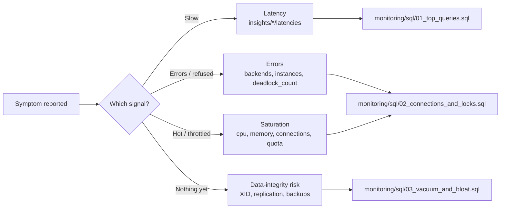

# AlloyDB Monitoring and Metrics Reference

> **The decision in one line:** alert on **symptoms** (saturation, latency, errors,
> data-integrity risk) using **ratios wherever a ratio exists**, and never write a
> percentage threshold as `85` — the AlloyDB percentage metrics return a **fraction
> between 0 and 1** from the API.

This document is the observability reference for AlloyDB. It is organised around the
four questions you actually ask during an incident, not around an alphabetical metric
dump — although the complete, API-verified metric catalogue is in
[Section 13](#13-the-complete-metric-catalogue) for copy-paste.

For "something is broken right now, what do I do", go to
[troubleshooting-runbook.md](./troubleshooting-runbook.md).
For "how big should this instance be", go to [sizing-guide.md](./sizing-guide.md).

---

## 1. Read this before you write a single alert

Three mistakes account for most silently-broken AlloyDB alerting. All three pass
`terraform validate`. All three fail closed — the alert simply never fires, and you
find out during the incident it was supposed to catch.

> [!CAUTION]
> **Percentage-unit metrics return a FRACTION between 0 and 1, not 0–100.**
>
> `alloydb.googleapis.com/instance/cpu/maximum_utilization` has unit `10^2.%` and its
> own API description reads *"Maximum CPU utilization across all currently serving
> nodes of the instance **from 0 to 100**"*. That description is misleading. We sampled
> a live instance in `bryanko-databases-demo1` on 2026-09-22 and the API returned
> `0.042357`. The Cloud Console multiplies by 100 before rendering, which is why the
> chart says "4.2%" and the API says `0.042`.
>
> Consequence: in a Terraform `threshold_value`, 85% CPU is **`0.85`**, not `85`.
> If you write `85`, the condition can never be true and the alert is dead for the
> life of the policy. Nobody notices, because dead alerts look exactly like healthy
> systems.

The same fraction convention applies to
`database/postgresql/vacuum/transaction_id_utilization`. Its description also says
"percentage", and it is also a fraction: three independent live clusters returned
`0.0895`, `0.0699` and `0.0723`. Thresholds for it are discussed in
[Section 2.4](#transaction-id-utilisation-scale-and-thresholds).

The other two traps are naming:

| Trap | Wrong | Right |
| --- | --- | --- |
| CPU metric name | `alloydb.googleapis.com/instance/cpu/utilization` — **does not exist** | `instance/cpu/average_utilization` or `instance/cpu/maximum_utilization` |
| Project resource label | `resource.labels.resource_container` | `resource.labels.project_id` |

The monitored resource `alloydb.googleapis.com/Instance` carries exactly four labels,
confirmed from a live timeseries: **`project_id`**, **`location`**, **`cluster_id`**,
**`instance_id`**. There is no `resource_container`, no `region`, no `database`.

> [!TIP]
> Before you commit any alert policy, prove the filter returns data. This takes
> thirty seconds and catches all three traps at once:
>
> ```bash
> # Does this metric + filter actually return points? If timeSeries is empty,
> # your alert will never fire regardless of the threshold you set.
> gcloud monitoring time-series list \
>   --project=PROJECT_ID \
>   --filter='metric.type="alloydb.googleapis.com/instance/cpu/maximum_utilization"' \
>   --format='value(points[0].value)'
> ```
>
> Look at the magnitude of the number that comes back. That magnitude — not the
> documented unit — is what your threshold must match.

---

## 2. Golden signals for AlloyDB

Everything below maps a *symptom a human will report* to *the metric that confirms it*
and *the in-database query that explains it*.



### 2.1 Saturation

Saturation is where AlloyDB differs most sharply from Cloud SQL, so read the storage
row carefully.

| Dimension | Metric | Alert shape | Why |
| --- | --- | --- | --- |
| CPU | `instance/cpu/maximum_utilization` | Absolute fraction, e.g. `0.85` | No ratio partner exists; 1.0 is full |
| Memory | `instance/memory/min_available_memory` (bytes) | Absolute byte floor, scaled to the shape | No percentage metric exists |
| Connections | `instance/postgres/total_connections` ÷ `instance/postgres/connections_limit` | **Ratio** | Survives resizes — see [Section 3](#3-ratio-alerts-the-two-that-matter) |
| Storage **quota** | `quota/storage_usage_per_cluster/usage` ÷ `quota/storage_usage_per_cluster/limit` | **Ratio** | Survives quota increases |
| Pool pressure | `database/conn_pool/client_connections_avg_wait_time` | Absolute microseconds | The one MCP signal that matters |

> [!IMPORTANT]
> **There is no "disk full" on AlloyDB.** Storage is elastic and disaggregated from
> compute — you never provision a volume, and `cluster/storage/usage` growing is not,
> by itself, an incident. What *can* stop your writes is the **per-cluster storage
> quota**, which defaults to 16 TiB and is raisable to a maximum supported 128 TiB
> ([AlloyDB quotas and limits](https://cloud.google.com/alloydb/quotas)). We confirmed
> the default by sampling `quota/storage_usage_per_cluster/limit` on a live cluster:
> it returned `17592186044416` bytes, which is exactly 16 TiB. Alert on the **quota
> ratio**, not on raw bytes, and do not carry over any Cloud SQL autogrow or IOPS
> concepts — they do not exist here.

### 2.2 Latency

AlloyDB does not publish a single server-side "query latency" gauge. Latency comes
from the Query Insights `latencies` families, which are `DISTRIBUTION` valued in
microseconds — so you can alert on a percentile rather than a mean:

- `database/postgresql/insights/aggregate/latencies` — instance-wide shape
- `database/postgresql/insights/perquery/latencies` — per normalised query
- `database/postgresql/insights/pertag/latencies` — per application tag / route

Pair these with `instance/postgresql/wait_time` (DELTA, `us`, labels
`wait_event_type` and `wait_event_name`) to answer *why* latency moved: the wait event
type tells you whether the time went to IO, locks, LWLocks or the client.

### 2.3 Errors

| Symptom | Metric | Notes |
| --- | --- | --- |
| Node gone | `instance/postgres/instances` with label `status` (`up` \| `down`) | Alert on `status="down"` count > 0 |
| Deadlocks | `instance/postgresql/deadlock_count` (DELTA) | This metric **does exist** — a common false belief is that it does not |
| Rollbacks | `instance/postgres/abort_count` (DELTA) | A rising abort ratio usually means serialisation failures or app-side timeouts |
| Per-database deadlocks | `database/postgresql/deadlock_count_for_top_databases` | Use to find *which* database is fighting |

### 2.4 Data-integrity risk

These are the slow-burn failures. None of them page you on day one; all of them ruin
a quarter if you miss them.

| Risk | Metric | Ground truth in SQL |
| --- | --- | --- |
| Transaction ID wraparound | `database/postgresql/vacuum/transaction_id_utilization` (DOUBLE, fraction) | Query **A** in [03_vacuum_and_bloat.sql](../monitoring/sql/03_vacuum_and_bloat.sql) |
| Vacuum horizon pinned | `database/postgresql/vacuum/oldest_transaction_age` (label `type`: `running`, `prepared`, `replication_slot`, `replica`) | Query **C** in the same file |
| Read pool staleness | `instance/postgres/replication/maximum_lag` (ms) | — |
| Cross-region DR staleness | `instance/postgres/replication/maximum_secondary_lag` (ms) | — |
| Backups silently stopped | `cluster/last_backup_timestamp` (µs since epoch) | See [Section 5](#5-backup-freshness-the-alert-nobody-sets-up) |

The `oldest_transaction_age` `type` label is unusually useful: it tells you *which
category* of thing is holding the horizon open, which maps one-to-one onto the three
subqueries C1/C2/C3 in `03_vacuum_and_bloat.sql`.

#### Transaction ID utilisation: scale and thresholds

`database/postgresql/vacuum/transaction_id_utilization` returns a **fraction between 0
and 1**. This is settled, not a hypothesis: three independent live clusters sampled on
2026-09-22 returned `0.0895`, `0.0699` and `0.0723`. Read as fractions of the roughly
2-billion usable XID space those are about 179M, 140M and 145M transactions — all
sitting just below the 200M default `autovacuum_freeze_max_age`, which is exactly
where healthy PostgreSQL steady state sits. No other reading of the number produces a
sensible result, so write thresholds as fractions.

The thresholds implemented in
[terraform/modules/observability/variables.tf](../terraform/modules/observability/variables.tf)
are **0.2 for a warning and 0.4 for a page**. The reasoning is worth understanding
rather than copying:

| Threshold | What it means | Why |
| --- | --- | --- |
| `0.2` (warn) | Twice the level autovacuum should ever allow | Freezing happens at 200M transactions, so a healthy instance stays near 0.10. Crossing 0.2 means vacuum is losing ground. |
| `0.4` (page) | Four times that level | Vacuum has been blocked for a sustained period — typically a long-running transaction, an orphaned prepared transaction, or an orphaned replication slot. |

Thresholds up around 0.8 are a common carry-over from generic PostgreSQL advice, and
they only fire once you are already close to a write outage. These two numbers are
**our starting points, not Google recommendations**, and they still deserve the
calibration procedure in [Section 11](#11-thresholds).

#### What AlloyDB already does about it

AlloyDB enables **adaptive autovacuum by default** (flag
`enable_google_adaptive_autovacuum`, `on|off`). Rather than relying on the fixed
thresholds stock PostgreSQL uses, it adjusts CPU, I/O, worker count and memory for
vacuum against the live workload, throttles transaction ID consumption to prevent
wraparound, and logs the blockers that hold vacuum back — long-running transactions,
orphaned prepared transactions and orphaned replication slots — to the postgres log.

The documentation is explicit about what that means for the familiar tuning flags:

> "You do not need to set values in any of these flags for adaptive autovacuum to work
> because adaptive autovacuum adapts and optimizes its behavior to your real workloads.
> If you set values in these flags, then adaptive autovacuum adjusts its behavior to
> take your preferences into account."
>
> — [Adaptive autovacuum](https://cloud.google.com/alloydb/docs/adaptive-autovacuum)

So the standard reflex of globally lowering `autovacuum_vacuum_scale_factor` or raising
`autovacuum_vacuum_cost_limit` does not transfer here; each static value is one more
signal the adaptive logic has to work around. Where a specific table genuinely needs
more aggressive treatment, a per-table setting is the safer instrument:

```sql
-- Prefer a targeted per-table setting over a global flag change, so the
-- adaptive logic keeps its freedom everywhere else.
ALTER TABLE orders SET (autovacuum_vacuum_scale_factor = 0.02);
```

For workloads with heavy `UPDATE`/`DELETE` churn, `alloydb.enable_pg_squeeze` (default
`off`) is worth evaluating. The flag reference describes it as reducing *"table and
index bloat in a more efficient and less disruptive way as compared to other PostgreSQL
bloat reduction methods such as VACUUM"*
([AlloyDB flags](https://cloud.google.com/alloydb/docs/reference/alloydb-flags)). It
rewrites tables and takes locks while doing so, so test it on a clone first.

> [!TIP]
> Keep `log_autovacuum_min_duration` set to a sensible value. Adaptive autovacuum
> writes its blocker warnings to the postgres log, and that log is the first place to
> look when this metric starts climbing. The annotated flag set lives in
> [config/database-flags/production-oltp.env](../config/database-flags/production-oltp.env).

---

## 3. Ratio alerts: the two that matter

A hardcoded threshold encodes an assumption about the environment at the moment you
wrote it. When someone resizes the instance, raises `max_connections`, or files a
quota increase, that assumption quietly becomes false and the alert either screams
constantly or goes silent. A **ratio** alert has the current reality in its
denominator, so it keeps meaning the same thing.

AlloyDB exposes exactly two usable numerator/denominator pairs. Use both.

### 3.1 Connection saturation

```hcl
# Connection saturation as a RATIO of the live limit, not a hardcoded number.
# If you later raise max_connections from 1000 to 4000, this alert continues to
# mean "80% of whatever the limit is" with no edit.
condition_threshold {
  filter = <<-EOT
    metric.type = "alloydb.googleapis.com/instance/postgres/total_connections" AND
    resource.type = "alloydb.googleapis.com/Instance" AND
    resource.labels.cluster_id = "prod-cluster"
  EOT

  denominator_filter = <<-EOT
    metric.type = "alloydb.googleapis.com/instance/postgres/connections_limit" AND
    resource.type = "alloydb.googleapis.com/Instance" AND
    resource.labels.cluster_id = "prod-cluster"
  EOT

  comparison      = "COMPARISON_GT"
  threshold_value = 0.8   # starting point, NOT a Google recommendation
  duration        = "300s"
}
```

> [!WARNING]
> Read the two metric descriptions carefully, because they are not symmetric.
> `total_connections` is *"the number of active and idle connections to the AlloyDB
> instance **across serving nodes** of the instance"*, while `connections_limit` is
> *"the current limit on the number of connections **per node**"*. On a primary
> instance (one serving node) the naive ratio is correct. On a **read pool with N
> nodes** the denominator is N times too small, so the ratio over-reports saturation
> by a factor of N. For read pools, either scale the denominator by the node count
> from `instance/postgres/instances` (label `status="up"`), or alert per node using
> `node/postgres/backends` on the `InstanceNode` resource.

We observed `connections_limit = 1000` on all three live clusters, consistent with the
documented default `max_connections` of 1,000
([AlloyDB quotas and limits](https://cloud.google.com/alloydb/quotas)).

### 3.2 Storage quota consumption

```hcl
# Storage QUOTA consumption as a fraction. Note the resource type is Location,
# not Instance, and the cluster is a METRIC label - not a resource label.
condition_threshold {
  filter = <<-EOT
    metric.type = "alloydb.googleapis.com/quota/storage_usage_per_cluster/usage" AND
    resource.type = "alloydb.googleapis.com/Location" AND
    metric.labels.cluster = "prod-cluster"
  EOT

  denominator_filter = <<-EOT
    metric.type = "alloydb.googleapis.com/quota/storage_usage_per_cluster/limit" AND
    resource.type = "alloydb.googleapis.com/Location" AND
    metric.labels.cluster = "prod-cluster"
  EOT

  comparison      = "COMPARISON_GT"
  threshold_value = 0.8   # starting point, NOT a Google recommendation
  duration        = "1800s"
}
```

The `cluster` label being a *metric* label rather than a *resource* label on the quota
family is easy to get wrong; the resource is `alloydb.googleapis.com/Location`, which
only carries `project_id` and `location`.

There is also `quota/storage_usage_per_cluster/exceeded` (DELTA) — a counter of quota
denials. Any non-zero value is already an incident; treat it as a backstop, not as
your primary signal, because by the time it increments writes have already failed.

---

## 4. `average_utilization` vs `maximum_utilization`

Both exist, both are `GAUGE DOUBLE` with unit `10^2.%`, and both return fractions.
The difference is the aggregation *inside* AlloyDB, before Cloud Monitoring ever sees
the value:

| Metric | Meaning (from the API description) | Use it for |
| --- | --- | --- |
| `instance/cpu/average_utilization` | Average CPU across all currently serving nodes | Capacity planning and right-sizing |
| `instance/cpu/maximum_utilization` | Maximum CPU across all currently serving nodes | **Alerting** |

For a single-node primary the two are identical. For a multi-node read pool they are
not, and the difference is exactly the thing you care about. A four-node read pool
with one node pinned at 100% and three idling averages 25% — an `average_utilization`
alert at `0.85` stays green while a quarter of your read traffic times out. This is
the same reason you do not alert on a load balancer's mean backend latency.

Use `maximum_utilization` for paging, `average_utilization` for the monthly
right-sizing review. When `maximum` is persistently far above `average`, you have a
load-distribution problem (sticky connections, an unbalanced pooler) rather than a
capacity problem — adding nodes will not help.

> [!NOTE]
> Per-node detail lives on a different monitored resource. `node/cpu/usage_time`
> (GAUGE DOUBLE, `10^2.%`) on `alloydb.googleapis.com/InstanceNode` lets you see which
> individual node is hot. Group by `resource.label.instance_id` and reduce with
> `REDUCE_MAX` rather than `REDUCE_MEAN`.

---

## 5. Backup freshness: the alert nobody sets up

`cluster/last_backup_timestamp` is a `GAUGE INT64` in **microseconds since the Unix
epoch**, on the `alloydb.googleapis.com/Cluster` resource, with a `backup_type` label.
We observed the value `1789988437157711` with `backup_type = "CONTINUOUS"` on a live
cluster — note the label value comes back **upper-case** even though the API
description spells the options as "continuous, automated, on-demand".

This metric is the only cheap way to detect *"backups stopped happening"*, which is
the single most expensive silent failure in any database estate. A failed backup job
does not raise CPU, does not raise latency, and does not appear in any dashboard you
are already looking at. You discover it on the day you need a restore.

Because the alert is *"now minus the metric exceeds N hours"*, it needs arithmetic
against the current time, which a plain threshold condition cannot express. Use MQL:

```mql
# "No backup newer than 48 hours." end() is the end of the alignment window, and
# last_backup_timestamp is microseconds since epoch - MQL handles the unit.
fetch alloydb.googleapis.com/Cluster
| metric 'alloydb.googleapis.com/cluster/last_backup_timestamp'
| filter resource.cluster_id == 'prod-cluster'
| group_by [], [latest_backup_us: max(value.last_backup_timestamp)]
| every 30m
| condition latest_backup_us < (end() - 48h)
```

The implemented version of this is in
[terraform/modules/observability/main.tf](../terraform/modules/observability/main.tf)
as the `backup_stale` policy.

> [!TIP]
> Filter or group by `backup_type` if you run both scheduled and continuous backups.
> A cluster with healthy continuous backup and a dead automated-backup schedule will
> look fine to an unfiltered `max()` across all types, because continuous backup keeps
> the timestamp fresh. Alert on each type you depend on, separately.

---

## 6. Connection states and the idle-in-transaction problem

`instance/postgresql/backends_by_state` (GAUGE INT64) carries a `state` label whose
values are, verbatim from the API: `idle`, `active`, `idle_in_transaction`,
`idle_in_transaction_aborted`, `disabled`, `fastpath_function_call`.

`idle_in_transaction` deserves its own alert. A session in that state has an open
transaction, holds whatever locks it acquired, and — critically — **pins the vacuum
horizon**, so autovacuum cannot reclaim dead tuples anywhere in the database. One
forgotten `BEGIN` in an application worker can, over days, cause table bloat,
statistics drift, plan regressions and eventually transaction ID wraparound pressure.
It is the common root cause behind three separate runbooks.

```hcl
# Sessions parked in idle_in_transaction. These hold locks and block vacuum.
# A healthy OLTP system sits near zero; sustained non-zero is a code defect.
condition_threshold {
  filter = <<-EOT
    metric.type = "alloydb.googleapis.com/instance/postgresql/backends_by_state" AND
    resource.type = "alloydb.googleapis.com/Instance" AND
    resource.labels.cluster_id = "prod-cluster" AND
    metric.labels.state = "idle_in_transaction"
  EOT

  comparison      = "COMPARISON_GT"
  threshold_value = 5      # starting point, NOT a Google recommendation
  duration        = "600s" # sustained, not a momentary blip
}
```

When this fires, go straight to query **E** in
[02_connections_and_locks.sql](../monitoring/sql/02_connections_and_locks.sql),
which lists long-running and idle-in-transaction sessions with `transaction_age`,
`application_name` and `client_addr`. Query **B** in the same file gives you the
connection census grouped by application, which is how you identify the responsible
service rather than just the responsible PID.

The durable fix is the `idle_in_transaction_session_timeout` flag, which is settable
on AlloyDB with range `0`–`2147483647` and **does not require a restart** (confirmed
via the AlloyDB Admin API `supportedDatabaseFlags`). Setting it turns an unbounded
outage into a bounded application error.

`instance/postgresql/backends_for_top_applications` (label `application_name`) is the
metric equivalent of query B — but it only works if every pool sets
`application_name`, which is exactly why
[app-side-pool-sizing.md](../config/connection-pooling/app-side-pool-sizing.md)
insists on it in every language example.

---

## 7. Query Insights: three tiers, and the cardinality tradeoff

Query Insights emits three parallel metric families. They carry the same six measures
— `execution_time`, `io_time`, `lock_time`, `latencies`, `row_count`,
`shared_blk_access_count` — at three different levels of granularity. The measures
are identical; only the labels differ, and the labels are the entire cost model.

| Tier | Metric prefix | Extra labels beyond `user`, `client_addr` | Series cardinality | Use it when |
| --- | --- | --- | --- | --- |
| Aggregate | `database/postgresql/insights/aggregate/*` | none | Lowest — bounded by users × client addresses | Dashboards, SLOs, "is the database busy" |
| Per query | `database/postgresql/insights/perquery/*` | `querystring`, `query_hash` | **Highest** — one series per normalised query | Finding the specific query that regressed |
| Per tag | `database/postgresql/insights/pertag/*` | `action`, `application`, `controller`, `db_driver`, `framework`, `route`, `tag_hash` | High, but bounded by your route table | Attributing load to a service or endpoint |

Choosing between them:

- **Default to `aggregate`** for anything that runs continuously — dashboards, alert
  policies, SLO burn rates. It is the only tier with bounded cardinality that you can
  reason about in advance.
- **Use `perquery` interactively**, in Metrics Explorer or the Query Insights console,
  when you already know something is slow. Do not build standing alerts on it: the
  `querystring` label means your series count grows with your application's query
  diversity, and a new deploy with dynamically-constructed SQL can multiply it
  overnight.
- **Use `pertag` when you need blame attribution** across teams. It requires
  [sqlcommenter](https://google.github.io/sqlcommenter/)-style tagging from the ORM,
  and it is the only tier that can answer "which HTTP route is responsible for this
  database load".

> [!CAUTION]
> `perquery` and `pertag` both carry the query text or route into a Cloud Monitoring
> **label**. Labels are not redacted, are visible to anyone with
> `roles/monitoring.viewer` on the project, and are retained by Cloud Monitoring for
> far longer than a log sink you control. If your SQL embeds literals — and normalised
> query text can still leak schema, table and column names — treat Monitoring reader
> access on this project as data access, and review it in your access model.
> `record_client_address` similarly writes client IPs into metric labels.

There is also `database/postgresql/statements_executed_count` (DELTA, label
`operation_type` with values `SELECT`, `UPDATE`, `INSERT`, `DELETE`, `MERGE`,
`UTILITY`, `NOTHING`, `UNKNOWN`). Its API description states it is *"Only available
for instances with Query insights enabled"* — a useful read/write mix signal, and a
good way to spot a batch job that has started rewriting far more rows than usual.

---

## 8. Managed Connection Pooling metrics

AlloyDB Managed Connection Pooling is the pooler built into the service, and the
pooling layer this repository recommends. It is **disabled by default** and listens on
**port 6432** once enabled; direct connections continue to use 5432. Four metrics on
the `alloydb.googleapis.com/Database` resource describe pool health. All four carry a
`pooler` label described as *"Pooler id for differentiating individual connection pool
instances"* — so always group by it, or you will average a struggling pooler away
against healthy ones.

| Metric | Kind / unit | Labels | What it tells you |
| --- | --- | --- | --- |
| `database/conn_pool/client_connections` | GAUGE, `1` | `status` (`ACTIVE`, `WAITING`), `pooler` | Demand arriving at the pool |
| `database/conn_pool/server_connections` | GAUGE, `1` | `status` (`ACTIVE`, `IDLE`), `pooler` | Backends the pool actually holds |
| `database/conn_pool/client_connections_avg_wait_time` | GAUGE, `us` | `pooler` | **Pool pressure — the key signal** |
| `database/conn_pool/num_pools` | GAUGE, `1` | `pooler` | Pool count per database |

Label values above were read from the live `metricDescriptors` API on 2026-09-22.

`client_connections_avg_wait_time` is the one to alert on. It is the average time a
client spends waiting for a server connection to become free, in microseconds. It is
the pooling equivalent of run-queue depth: while it is near zero the pool is correctly
sized, and the moment it climbs, every application request is paying that latency on
top of its own query time — before the query even starts. Rising wait time with flat
CPU means the pool is too small; rising wait time *with* high CPU means the database
is the bottleneck and enlarging the pool will make things worse.

Watch `client_connections{status="WAITING"}` alongside it. Wait time tells you how bad
the queue is; the WAITING count tells you how many are in it.

Sizing note: `max_pool_size` is **per user and database pair** and defaults to `50`,
so the server connections a pooler can open is that figure multiplied by the number of
`(user, database)` pairs in use. A reasonable starting point for the server pool is
**2–4 × vCPU**, starting at 2× and growing only while throughput still improves.

> [!NOTE]
> Managed connection pooling is **not supported over public IP**, which for this
> audience reads as a control rather than a gap: adopting it enforces the private-only
> connectivity posture structurally. Connections from users holding the PostgreSQL
> `REPLICATION` role are likewise not supported and must use 5432 directly.

Enablement in this repository goes through the `alloydb-cluster` module's
`connection_pool = { enabled = true, flags = {...} }` variable, which writes the
`connection_pool_config` block on `google_alloydb_instance` (`enabled` is required;
`flags` is a `map(string)` where you drop the `connection-pooling-` prefix and use
underscores, so `connection-pooling-pool-mode` becomes `pool_mode`). A worked example
lives in [terraform/examples/02-prod-ha](../terraform/examples/02-prod-ha), and the
full flag reference — including the transaction-mode compatibility checklist — is in
[managed-connection-pooling.md](../config/connection-pooling/managed-connection-pooling.md).

---

## 9. System Insights vs Query Insights vs Advanced Query Insights

Three different products with confusingly similar names. Here is what each actually
gives you.

| | System Insights | Query Insights | Advanced (enhanced) Query Insights |
| --- | --- | --- | --- |
| Answers | "Is the machine healthy?" | "Which query is slow?" | "Why is this specific query slow, right now?" |
| Surface | Console → cluster → **System insights** tab | Console → cluster → **Query insights** tab | Same tab, extra panels |
| Enabled | Always on | **On by default** on AlloyDB instances | Opt-in |
| Data window | Last **30 days** in the dashboard | Timeline zooms out to **one week** | See note below |
| Restart to change | n/a | Changing query length restarts the instance | Enabling restarts the instance |
| Terraform | n/a | `query_insights_config` on `google_alloydb_instance` | **Not present in the GA `google` provider v8.3.0** |

Sources: [Monitor instances](https://cloud.google.com/alloydb/docs/monitor-instance)
for the 30-day System Insights window; [Improve query performance using query
insights](https://cloud.google.com/alloydb/docs/using-query-insights) for the
default-on behaviour, the one-week timeline, and the configuration defaults below.

### Query Insights configuration

Verified defaults and ranges from the Query Insights documentation:

| Setting (Terraform) | gcloud flag | Default | Range |
| --- | --- | --- | --- |
| `query_string_length` | `--insights-config-query-string-length` | `1024` bytes | 256 – 4500 |
| `record_application_tags` | `--[no-]insights-config-record-application-tags` | `true` | bool |
| `record_client_address` | `--[no-]insights-config-record-client-address` | `true` | bool |
| `query_plans_per_minute` | `--insights-config-query-plans-per-minute` | `5` | 0 – 20 |

> [!WARNING]
> Changing `query_string_length` **restarts the instance** — the Query Insights
> documentation states this explicitly, and higher limits consume more memory. The
> other three fields do not. Treat a `query_string_length` change as a change-window
> operation and read
> [maintenance-and-upgrades.md](./maintenance-and-upgrades.md#what-actually-causes-a-restart-or-a-dropped-connection)
> first. Note also that `record_client_address` and `record_application_tags` both
> default to **`true`**, so client IPs and application tags are being written into
> Monitoring labels unless you have explicitly turned them off.

### Advanced Query Insights

Advanced (enhanced) Query Insights adds active-query tracking and wait-event tracking.
It is configured through `observability_config`, which — confirmed against the live
provider schema — **does not exist on `google_alloydb_instance` in the GA `google`
provider v8.3.0**. Manage it with `gcloud` or the `google-beta` provider, and verify
availability before you put it in a GA-provider module.

Verified from `gcloud alloydb instances update --help` in the authenticated
environment:

```bash
# Enable enhanced query insights. This restarts the instance - plan a change window.
gcloud alloydb instances update INSTANCE_ID \
  --cluster=CLUSTER_ID \
  --region=REGION \
  --observability-config-enabled \
  --observability-config-track-active-queries \
  --observability-config-track-wait-events
```

| gcloud flag | Documented default |
| --- | --- |
| `--observability-config-max-query-string-length` | 10k bytes |
| `--observability-config-query-plans-per-minute` | 20 |
| `--[no-]observability-config-preserve-comments` | (no default stated in help text) |
| `--[no-]observability-config-track-active-queries` | (no default stated in help text) |
| `--observability-config-track-wait-events` | (no default stated in help text) |

> [!NOTE]
> **Cost and retention caveats we could not verify.** We did not confirm a published
> per-feature price for Query Insights or Advanced Query Insights, and we did not
> confirm a retention figure for the Insights metric families beyond the console
> windows above (30 days for System Insights, one week of timeline for Query
> Insights). The Insights *metrics* land in Cloud Monitoring and are therefore subject
> to [Cloud Monitoring data retention](https://cloud.google.com/monitoring/quotas#data_retention),
> which is the number to check for long-term forensic use. Confirm pricing against the
> [AlloyDB pricing page](https://cloud.google.com/alloydb/pricing) before you present
> a cost estimate.

---

## 10. Observability extensions, and why `shared_preload_libraries` is missing

AlloyDB ships the usual PostgreSQL observability extensions, but **you do not enable
them the way you would on self-managed PostgreSQL**. This is the AlloyDB-specific
behaviour most likely to waste an afternoon.

On self-managed PostgreSQL you add a library to `shared_preload_libraries` and restart.
On AlloyDB, `shared_preload_libraries` is **not a settable flag** — it does not appear
in the 423 flags returned by the AlloyDB Admin API `supportedDatabaseFlags` endpoint.
Neither does `wal_level`. Google owns the preload list.

Instead, preloadable extensions are gated behind AlloyDB-specific `alloydb.enable_*`
flags. Setting one of these to `on` tells AlloyDB to include that library in the
preload set on the next start — which is why almost all of them require a restart.
You then still run `CREATE EXTENSION` in each database that needs it.

All values below confirmed from the `supportedDatabaseFlags` API on 2026-09-22:

| Capability | Gate flag | Restart | Then |
| --- | --- | --- | --- |
| `pg_stat_statements` | none — available by default | n/a | `CREATE EXTENSION IF NOT EXISTS pg_stat_statements;` |
| Index / query advisor | `google_db_advisor.enabled` | **yes** | query the advisor views |
| Wait event sampling | `alloydb.enable_pg_wait_sampling` | **yes** | `CREATE EXTENSION pg_wait_sampling;` |
| Automatic plan logging | `alloydb.enable_auto_explain` | **yes** | tune `auto_explain.*` (no restart) |
| pgAudit | `alloydb.enable_pgaudit` | **yes** | tune `pgaudit.*` (no restart) |

The tuning sub-flags for each of these are settable **without** a restart, which gives
you a useful operational pattern: pay the restart once to turn the machinery on, then
tune it freely afterwards.

```bash
# Turn on auto_explain machinery. This requires a restart - plan a change window.
gcloud alloydb instances update INSTANCE_ID \
  --cluster=CLUSTER_ID --region=REGION \
  --database-flags=alloydb.enable_auto_explain=on

# Afterwards these are all live changes, no restart:
#   auto_explain.log_min_duration   -1 .. 2147483647   (-1 = off)
#   auto_explain.log_analyze        on|off
#   auto_explain.log_buffers        on|off
#   auto_explain.log_timing         on|off
#   auto_explain.log_format         text|xml|json|yaml
#   auto_explain.sample_rate        (float)
```

> [!CAUTION]
> `auto_explain.log_analyze = on` makes PostgreSQL actually instrument every qualifying
> execution. On a high-QPS OLTP instance this is a significant and easily-underestimated
> overhead. Use `auto_explain.sample_rate` to log a fraction of executions, start with
> a high `log_min_duration` so only genuinely slow statements qualify, and never enable
> `log_analyze` fleet-wide as a default. The same caution applies to
> `pg_stat_statements.track = all`, which records nested statements too.

Related flags worth knowing, all confirmed settable:

| Flag | Restart | Notes |
| --- | --- | --- |
| `pg_stat_statements.max` | **yes** | 100 – 1073741823 |
| `pg_stat_statements.track` | no | `none` \| `top` \| `all` |
| `pg_stat_statements.track_utility` | no | on/off |
| `track_io_timing` | no | Needed for meaningful `io_time` attribution |
| `track_activity_query_size` | **yes** | 100 – 102400 |
| `log_min_duration_statement` | no | -1 – 2147483647 |
| `log_lock_waits` | no | Turn this on; it is nearly free and invaluable |
| `pg_wait_sampling.profile_period` | no | Sampling interval once the gate flag is on |
| `google_db_advisor.enable_auto_advisor` | no | Periodic automatic analysis |
| `google_db_advisor.enable_vector_index_advisor` | no | Vector index recommendations |

> [!TIP]
> `pg_stat_statements` is available by default on AlloyDB, which is why
> [01_top_queries.sql](../monitoring/sql/01_top_queries.sql) can assume it. Verify
> per database with `SELECT * FROM pg_extension WHERE extname = 'pg_stat_statements';`
> — the extension must be created in **each** database, not just once per instance.

---

## 11. Thresholds

> [!IMPORTANT]
> **Google publishes no official numeric alerting thresholds for AlloyDB.** Every
> number in [terraform/modules/observability/variables.tf](../terraform/modules/observability/variables.tf),
> in `monitoring/alerts/`, and in this document is a **calibrated starting point
> chosen by us**, not a vendor recommendation. Treat them as a hypothesis. Run them in
> notification-only mode against at least two weeks of your own baseline — including a
> month-end or peak-season period — before you let any of them wake a human. An alert
> that has never been calibrated is an alert that will be ignored, and an ignored alert
> is worse than no alert because it creates the appearance of coverage.

Calibration procedure that works:

1. Deploy the policies with `notification_channel_ids = []`. They appear in the console
   and record incidents, but page nobody.
2. After two weeks, list every incident each policy generated. For each, ask: *would I
   have wanted to be woken up?*
3. Raise thresholds or lengthen `duration` until the answer is yes for every remaining
   incident. Lengthening `duration` is almost always better than raising the threshold
   — it filters transients without reducing sensitivity to real degradation.
4. Only then attach notification channels, and only to the policies whose incidents are
   genuinely actionable.
5. Re-run step 2 after any resize, major version upgrade, or significant traffic change.

---

## 12. Where the implementations live

| What | Where |
| --- | --- |
| Terraform alert policies + dashboard | [terraform/modules/observability/](../terraform/modules/observability/) |
| Standalone alert definitions | `monitoring/alerts/` |
| Importable console dashboards | [monitoring/dashboards/](../monitoring/dashboards/) |
| In-database diagnostics — slow queries | [01_top_queries.sql](../monitoring/sql/01_top_queries.sql) |
| In-database diagnostics — connections and locks | [02_connections_and_locks.sql](../monitoring/sql/02_connections_and_locks.sql) |
| In-database diagnostics — vacuum, bloat, wraparound | [03_vacuum_and_bloat.sql](../monitoring/sql/03_vacuum_and_bloat.sql) |
| Incident response | [troubleshooting-runbook.md](./troubleshooting-runbook.md) |
| Restarts and change windows | [maintenance-and-upgrades.md](./maintenance-and-upgrades.md) |
| Capacity | [sizing-guide.md](./sizing-guide.md) |
| Connection pooling | [managed-connection-pooling.md](../config/connection-pooling/managed-connection-pooling.md) |

---

## 13. The complete metric catalogue

Every row below was read directly from the Cloud Monitoring `metricDescriptors` API
for `alloydb.googleapis.com` in project `bryanko-databases-demo1` on 2026-09-22.
**122 metrics.** If a metric name is not in this table, verify it against the API
before you put it in a filter.

```bash
# Regenerate this table for your own project - metric availability can change
# with new AlloyDB releases.
curl -s -H "Authorization: Bearer $(gcloud auth print-access-token)" \
  "https://monitoring.googleapis.com/v3/projects/PROJECT_ID/metricDescriptors?filter=metric.type%3Dstarts_with(%22alloydb.googleapis.com%22)&pageSize=500" \
  | jq -r '.metricDescriptors[] | [.type, .metricKind, .valueType, .unit] | @tsv'
```

Resource-type column values are short names of `alloydb.googleapis.com/<Type>`.

### Cluster scope

| Metric type (prefix `alloydb.googleapis.com/`) | Kind | Value | Unit | Labels | Resource |
| --- | --- | --- | --- | --- | --- |
| `cluster/last_backup_timestamp` | GAUGE | INT64 | `us` | `backup_type` | Cluster |
| `cluster/storage/usage` | GAUGE | INT64 | `By` | — | Cluster |

### Quota scope

| Metric type | Kind | Value | Unit | Labels | Resource |
| --- | --- | --- | --- | --- | --- |
| `quota/storage_usage_per_cluster/exceeded` | DELTA | INT64 | `1` | `limit_name`, `cluster` | Location |
| `quota/storage_usage_per_cluster/limit` | GAUGE | INT64 | `1` | `limit_name`, `cluster` | Location |
| `quota/storage_usage_per_cluster/usage` | GAUGE | INT64 | `1` | `limit_name`, `cluster` | Location |

### Instance scope

| Metric type | Kind | Value | Unit | Labels | Resource |
| --- | --- | --- | --- | --- | --- |
| `instance/cpu/average_utilization` | GAUGE | DOUBLE | `10^2.%` | — | Instance |
| `instance/cpu/maximum_utilization` | GAUGE | DOUBLE | `10^2.%` | — | Instance |
| `instance/cpu/vcpus` | GAUGE | INT64 | `1` | — | Instance |
| `instance/memory/min_available_memory` | GAUGE | INT64 | `By` | — | Instance |
| `instance/postgres/abort_count` | DELTA | INT64 | `1` | — | Instance |
| `instance/postgres/autoscaler_total_connections` | GAUGE | INT64 | `1` | — | `generic_node` |
| `instance/postgres/average_connections` | GAUGE | DOUBLE | `1` | — | Instance |
| `instance/postgres/commit_count` | DELTA | INT64 | `1` | — | Instance |
| `instance/postgres/connections_limit` | GAUGE | INT64 | `1` | — | Instance |
| `instance/postgres/instances` | GAUGE | INT64 | `1` | `status` | Instance |
| `instance/postgres/replication/maximum_lag` | GAUGE | INT64 | `ms` | `replica_instance_id` | Instance |
| `instance/postgres/replication/maximum_secondary_lag` | GAUGE | INT64 | `ms` | `application_name`, `client_addr`, `secondary_project`, `secondary_location`, `secondary_cluster_id`, `secondary_instance_id` | Instance |
| `instance/postgres/replication/network_lag` | GAUGE | INT64 | `ms` | `client_addr`, `application_name`, `secondary_project`, `secondary_location`, `secondary_cluster_id`, `secondary_instance_id` | Instance |
| `instance/postgres/replication/replicas` | GAUGE | INT64 | `1` | `state`, `replica_instance_id` | Instance |
| `instance/postgres/total_connections` | GAUGE | INT64 | `1` | — | Instance |
| `instance/postgres/transaction_count` | DELTA | INT64 | `1` | — | Instance |
| `instance/postgres/ultrafastcache_hitrate` | GAUGE | DOUBLE | `1` | — | Instance |
| `instance/postgresql/backends_by_state` | GAUGE | INT64 | `1` | `state` | Instance |
| `instance/postgresql/backends_for_top_applications` | GAUGE | INT64 | `1` | `application_name` | Instance |
| `instance/postgresql/blks_hit` | DELTA | INT64 | `1` | — | Instance |
| `instance/postgresql/blks_read` | DELTA | INT64 | `1` | — | Instance |
| `instance/postgresql/deadlock_count` | DELTA | INT64 | `1` | — | Instance |
| `instance/postgresql/deleted_tuples_count` | DELTA | INT64 | `1` | — | Instance |
| `instance/postgresql/fetched_tuples_count` | DELTA | INT64 | `1` | — | Instance |
| `instance/postgresql/inserted_tuples_count` | DELTA | INT64 | `1` | — | Instance |
| `instance/postgresql/new_connections_count` | DELTA | INT64 | `1` | — | Instance |
| `instance/postgresql/returned_tuples_count` | DELTA | INT64 | `1` | — | Instance |
| `instance/postgresql/temp_bytes_written_count` | DELTA | INT64 | `By` | — | Instance |
| `instance/postgresql/temp_files_written_count` | DELTA | INT64 | `1` | — | Instance |
| `instance/postgresql/updated_tuples_count` | DELTA | INT64 | `1` | — | Instance |
| `instance/postgresql/version` | GAUGE | STRING | — | — | Instance |
| `instance/postgresql/wait_count` | DELTA | INT64 | `1` | `wait_event_type`, `wait_event_name` | Instance |
| `instance/postgresql/wait_time` | DELTA | DOUBLE | `us` | `wait_event_type`, `wait_event_name` | Instance |
| `instance/postgresql/written_tuples_count` | DELTA | INT64 | `1` | — | Instance |
| `database/postgresql/vacuum/oldest_transaction_age` | GAUGE | INT64 | `1` | `type` | Instance |
| `database/postgresql/vacuum/transaction_id_utilization` | GAUGE | DOUBLE | `1` | — | Instance |

> [!NOTE]
> The last two rows are the counter-intuitive ones. The two vacuum metrics use the
> **`database/` metric prefix but report against the `Instance` monitored resource**.
> Filtering them with `resource.type = "alloydb.googleapis.com/Database"` returns
> nothing. This inconsistency is real; it is not a typo in this table.

### Database scope — connection pooling and Query Insights

| Metric type | Kind | Value | Unit | Labels | Resource |
| --- | --- | --- | --- | --- | --- |
| `database/conn_pool/client_connections` | GAUGE | INT64 | `1` | `status`, `pooler` | Database |
| `database/conn_pool/client_connections_avg_wait_time` | GAUGE | INT64 | `us` | `pooler` | Database |
| `database/conn_pool/num_pools` | GAUGE | INT64 | `1` | `pooler` | Database |
| `database/conn_pool/server_connections` | GAUGE | INT64 | `1` | `status`, `pooler` | Database |
| `database/postgresql/insights/aggregate/execution_time` | DELTA | INT64 | `us{CPU}` | `user`, `client_addr` | Database |
| `database/postgresql/insights/aggregate/io_time` | DELTA | INT64 | `us` | `user`, `client_addr`, `io_type` | Database |
| `database/postgresql/insights/aggregate/latencies` | DELTA | DISTRIBUTION | `us` | `user`, `client_addr` | Database |
| `database/postgresql/insights/aggregate/lock_time` | DELTA | INT64 | `us` | `user`, `client_addr`, `lock_type` | Database |
| `database/postgresql/insights/aggregate/row_count` | DELTA | INT64 | `1` | `user`, `client_addr` | Database |
| `database/postgresql/insights/aggregate/shared_blk_access_count` | DELTA | INT64 | `1` | `user`, `client_addr`, `access_type` | Database |
| `database/postgresql/insights/perquery/execution_time` | DELTA | INT64 | `us{CPU}` | `querystring`, `user`, `client_addr`, `query_hash` | Database |
| `database/postgresql/insights/perquery/io_time` | DELTA | INT64 | `us` | `querystring`, `user`, `client_addr`, `io_type`, `query_hash` | Database |
| `database/postgresql/insights/perquery/latencies` | DELTA | DISTRIBUTION | `us` | `querystring`, `user`, `client_addr`, `query_hash` | Database |
| `database/postgresql/insights/perquery/lock_time` | DELTA | INT64 | `us` | `querystring`, `user`, `client_addr`, `lock_type`, `query_hash` | Database |
| `database/postgresql/insights/perquery/row_count` | DELTA | INT64 | `1` | `querystring`, `user`, `client_addr`, `query_hash` | Database |
| `database/postgresql/insights/perquery/shared_blk_access_count` | DELTA | INT64 | `1` | `querystring`, `user`, `client_addr`, `access_type`, `query_hash` | Database |
| `database/postgresql/insights/pertag/execution_time` | DELTA | INT64 | `us{CPU}` | `user`, `client_addr`, `action`, `application`, `controller`, `db_driver`, `framework`, `route`, `tag_hash` | Database |
| `database/postgresql/insights/pertag/io_time` | DELTA | INT64 | `us` | + `io_type` | Database |
| `database/postgresql/insights/pertag/latencies` | DELTA | DISTRIBUTION | `us` | as `pertag/execution_time` | Database |
| `database/postgresql/insights/pertag/lock_time` | DELTA | INT64 | `us` | + `lock_type` | Database |
| `database/postgresql/insights/pertag/row_count` | DELTA | INT64 | `1` | as `pertag/execution_time` | Database |
| `database/postgresql/insights/pertag/shared_blk_access_count` | DELTA | INT64 | `1` | + `access_type` | Database |

### Database scope — per-database counters

| Metric type | Kind | Value | Unit | Labels | Resource |
| --- | --- | --- | --- | --- | --- |
| `database/postgresql/backends_for_top_databases` | GAUGE | INT64 | `1` | — | Database |
| `database/postgresql/blks_hit_for_top_databases` | DELTA | INT64 | `1` | — | Database |
| `database/postgresql/blks_read_for_top_databases` | DELTA | INT64 | `1` | — | Database |
| `database/postgresql/committed_transactions_for_top_databases` | DELTA | INT64 | `1` | — | Database |
| `database/postgresql/deadlock_count_for_top_databases` | DELTA | INT64 | `1` | — | Database |
| `database/postgresql/deleted_tuples_count_for_top_databases` | DELTA | INT64 | `1` | — | Database |
| `database/postgresql/fetched_tuples_count_for_top_databases` | DELTA | INT64 | `1` | — | Database |
| `database/postgresql/inserted_tuples_count_for_top_databases` | DELTA | INT64 | `1` | — | Database |
| `database/postgresql/new_connections_for_top_databases` | DELTA | INT64 | `1` | — | Database |
| `database/postgresql/returned_tuples_count_for_top_databases` | DELTA | INT64 | `1` | — | Database |
| `database/postgresql/rolledback_transactions_for_top_databases` | DELTA | INT64 | `1` | — | Database |
| `database/postgresql/statements_executed_count` | DELTA | INT64 | `1` | `operation_type` | Database |
| `database/postgresql/temp_bytes_written_for_top_databases` | DELTA | INT64 | `By` | — | Database |
| `database/postgresql/temp_files_written_for_top_databases` | DELTA | INT64 | `1` | — | Database |
| `database/postgresql/tuples` | GAUGE | INT64 | `1` | `state` (`live`, `dead`) | Database |
| `database/postgresql/updated_tuples_count_for_top_databases` | DELTA | INT64 | `1` | — | Database |
| `database/postgresql/written_tuples_count_for_top_databases` | DELTA | INT64 | `1` | — | Database |

> [!TIP]
> `database/postgresql/tuples` with `state="dead"` is the Cloud Monitoring view of
> query **D** in [03_vacuum_and_bloat.sql](../monitoring/sql/03_vacuum_and_bloat.sql).
> Its description notes it is *"only exposed when the number of db's is less than 50"* —
> so on a heavily multi-tenant cluster it disappears, and the SQL becomes your only
> option.

### Node scope — audit logging and network

These are on `alloydb.googleapis.com/InstanceNode` and have no instance-level
equivalent, so they are the only way to see them.

| Metric type | Kind | Value | Unit | Resource |
| --- | --- | --- | --- | --- |
| `node/cpu/usage_time` | GAUGE | DOUBLE | `10^2.%` | InstanceNode |
| `node/database/logging/audit/backlog_bytes_count` | GAUGE | INT64 | `By` | InstanceNode |
| `node/database/logging/audit/processed_bytes_count` | DELTA | INT64 | `By` | InstanceNode |
| `node/database/logging/audit/processed_entries_count` | DELTA | INT64 | `1` | InstanceNode |
| `node/memory/available_memory` | GAUGE | INT64 | `By` | InstanceNode |
| `node/network/received_bytes_count` | DELTA | INT64 | `By` | InstanceNode |
| `node/network/sent_bytes_count` | DELTA | INT64 | `By` | InstanceNode |
| `node/postgres/replay_lag` | GAUGE | INT64 | `ms` | InstanceNode |
| `node/postgres/uptime` | GAUGE | DOUBLE | `1` | InstanceNode |

`node/database/logging/audit/backlog_bytes_count` is the compliance metric. It is
*"audit log backlog size in bytes that have not yet been processed and uploaded to
Cloud Logging"*. A sustained backlog means pgAudit records are buffered on the node
rather than durably in Cloud Logging — an audit gap that nothing else will tell you
about. See runbook 9 in
[troubleshooting-runbook.md](./troubleshooting-runbook.md#runbook-9--audit-log-pipeline-backlog).
`node/postgres/uptime` is the cheapest way to confirm "did this node restart?" after a
maintenance event.

### Node scope — per-node mirrors

The remaining node metrics mirror their instance-level counterparts one-for-one, at
node granularity on `alloydb.googleapis.com/InstanceNode`. Use them when you need to
know *which node*, which is most of the time on a read pool.

| Metric type | Kind | Value | Unit | Labels |
| --- | --- | --- | --- | --- |
| `node/postgres/backends` | GAUGE | INT64 | `1` | — |
| `node/postgres/backends_by_state` | GAUGE | INT64 | `1` | `state` |
| `node/postgres/backends_for_top_applications` | GAUGE | INT64 | `1` | `application_name` |
| `node/postgres/blks_hit` | DELTA | INT64 | `1` | — |
| `node/postgres/blks_read` | DELTA | INT64 | `1` | — |
| `node/postgres/deadlock_count` | DELTA | INT64 | `1` | — |
| `node/postgres/deleted_tuples_count` | DELTA | INT64 | `1` | — |
| `node/postgres/fetched_tuples_count` | DELTA | INT64 | `1` | — |
| `node/postgres/inserted_tuples_count` | DELTA | INT64 | `1` | — |
| `node/postgres/new_connections_count` | DELTA | INT64 | `1` | — |
| `node/postgres/returned_tuples_count` | DELTA | INT64 | `1` | — |
| `node/postgres/temp_bytes_written_count` | DELTA | INT64 | `By` | — |
| `node/postgres/temp_files_written_count` | DELTA | INT64 | `1` | — |
| `node/postgres/transaction_count` | DELTA | INT64 | `1` | — |
| `node/postgres/ultrafastcache_hitrate` | GAUGE | DOUBLE | `1` | — |
| `node/postgres/updated_tuples_count` | DELTA | INT64 | `1` | — |
| `node/postgres/wait_count` | DELTA | INT64 | `1` | `wait_event_type`, `wait_event_name` |
| `node/postgres/wait_time` | DELTA | DOUBLE | `us` | `wait_event_type`, `wait_event_name` |
| `node/postgres/written_tuples_count` | DELTA | INT64 | `1` | — |

And on the `alloydb.googleapis.com/NodeDatabase` resource — per node, per database:

| Metric type | Kind | Value | Unit | Labels |
| --- | --- | --- | --- | --- |
| `node/database/postgresql/backends_for_top_databases` | GAUGE | INT64 | `1` | — |
| `node/database/postgresql/blks_hit_for_top_databases` | DELTA | INT64 | `1` | — |
| `node/database/postgresql/blks_read_for_top_databases` | DELTA | INT64 | `1` | — |
| `node/database/postgresql/committed_transactions_for_top_databases` | DELTA | INT64 | `1` | — |
| `node/database/postgresql/deadlock_count_for_top_databases` | DELTA | INT64 | `1` | — |
| `node/database/postgresql/fetched_tuples_count_for_top_databases` | DELTA | INT64 | `1` | — |
| `node/database/postgresql/insights/aggregate/execution_time` | DELTA | INT64 | `us{CPU}` | `user`, `client_addr` |
| `node/database/postgresql/insights/aggregate/io_time` | DELTA | INT64 | `us` | `user`, `client_addr`, `io_type` |
| `node/database/postgresql/insights/aggregate/latencies` | DELTA | DISTRIBUTION | `us` | `user`, `client_addr` |
| `node/database/postgresql/new_connections_for_top_databases` | DELTA | INT64 | `1` | — |
| `node/database/postgresql/returned_tuples_count_for_top_databases` | DELTA | INT64 | `1` | — |
| `node/database/postgresql/rolledback_transactions_for_top_databases` | DELTA | INT64 | `1` | — |
| `node/database/postgresql/temp_bytes_written_for_top_databases` | DELTA | INT64 | `By` | — |
| `node/database/postgresql/temp_files_written_for_top_databases` | DELTA | INT64 | `1` | — |

> [!WARNING]
> Only the `aggregate` Query Insights tier exists at node granularity. There is no
> `node/database/postgresql/insights/perquery/*` and no
> `node/.../insights/pertag/*`. If you write one, it will validate and never return
> data.

---

*Last verified: 2026-09-22 against provider google v8.3.0. Re-verify hard numbers before reuse.*
