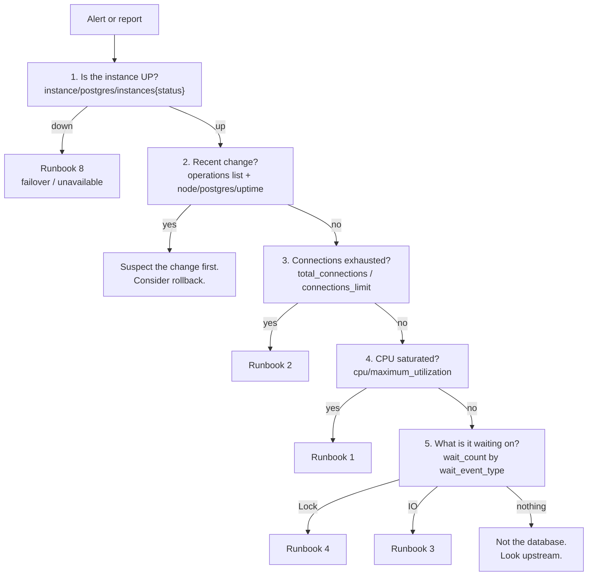

# AlloyDB Troubleshooting Runbook

> **Use this when something is wrong right now.** Each runbook is self-contained:
> symptom → confirming metric → diagnostic SQL → immediate mitigation → durable fix.
> Start at [The first five minutes](#the-first-five-minutes) if you do not yet know
> what is wrong.

Companion documents:
[monitoring-metrics.md](./monitoring-metrics.md) explains every metric referenced here;
[maintenance-and-upgrades.md](./maintenance-and-upgrades.md) covers planned change;
[sizing-guide.md](./sizing-guide.md) covers capacity.

> [!IMPORTANT]
> Every numeric threshold on this page is a **starting point we chose**, not a Google
> recommendation — Google publishes no official numeric alerting thresholds for
> AlloyDB. Calibrate against your own baseline. And remember the scale trap: AlloyDB
> percentage metrics return a **fraction between 0 and 1** from the API, so `0.85`
> means 85%. See
> [the caution in monitoring-metrics.md](./monitoring-metrics.md#1-read-this-before-you-write-a-single-alert).

---

## The first five minutes

When you have no idea what is wrong, work outside-in. Do not open a psql session
first — you may not be able to get one, and if you can, you will be looking at a
symptom rather than the shape of the problem.



### Step 0 — write down the facts, in UTC

Before you touch anything, record the cluster name, region, instance IDs, the time the
symptom started **in UTC**, and what changed. You will need all of it for
[escalation](#escalation-what-to-collect-before-opening-a-support-case), and
reconstructing it later from memory is unreliable.

### Step 1 — is anything actually down?

```bash
# Nodes reporting down. Any non-zero value here changes the whole triage.
gcloud monitoring time-series list \
  --project=PROJECT_ID \
  --filter='metric.type="alloydb.googleapis.com/instance/postgres/instances"
            AND resource.labels.cluster_id="CLUSTER_ID"
            AND metric.labels.status="down"' \
  --format="value(metric.labels.status, points[0].value.int64Value)"

# And the control-plane view of cluster/instance state.
gcloud alloydb instances list --cluster=CLUSTER_ID --region=REGION \
  --format="table(name,instanceType,state,machineConfig.cpuCount)"
```

### Step 2 — did something change?

More incidents are caused by change than by drift. Check before you theorise.

```bash
# Every AlloyDB control-plane operation in this region, newest first.
# A resize, flag change, failover or maintenance swap will show here.
gcloud alloydb operations list --region=REGION \
  --format="table(name.basename(),targetLink.basename(),verb,status,createTime,endTime)" \
  --limit=20
```

Cross-check `node/postgres/uptime` — a recent reset means the node restarted, whether
or not you initiated it.

### Step 3 — the four-signal sweep

Open these four charts, in this order. Two minutes, and it narrows the problem to one
runbook.

| # | Signal | Metric | Points to |
| --- | --- | --- | --- |
| 1 | Connection saturation | `instance/postgres/total_connections` ÷ `instance/postgres/connections_limit` | [Runbook 2](#runbook-2--connection-exhaustion--too-many-clients) |
| 2 | CPU | `instance/cpu/maximum_utilization` (fraction!) | [Runbook 1](#runbook-1--high-cpu) |
| 3 | Memory | `instance/memory/min_available_memory` (bytes) | [Runbook 1](#runbook-1--high-cpu) / [3](#runbook-3--slow-queries-and-latency-regressions) |
| 4 | Wait profile | `instance/postgresql/wait_count` grouped by `wait_event_type` | Everything else |

The wait profile is the highest-value single chart in AlloyDB triage, because
`wait_event_type` classifies the slowdown for you:

| `wait_event_type` | Means | Go to |
| --- | --- | --- |
| `Lock` | Contention on rows or objects | [Runbook 4](#runbook-4--lock-contention-and-blocking) |
| `LWLock` | Internal contention — usually too many connections | [Runbook 2](#runbook-2--connection-exhaustion--too-many-clients) |
| `IO` | Reading from storage — cache miss or missing index | [Runbook 3](#runbook-3--slow-queries-and-latency-regressions) |
| `Client` | Waiting on the application | Not the database |
| (mostly running, no waits) | CPU-bound | [Runbook 1](#runbook-1--high-cpu) |

### Step 4 — only now, connect

```sql
-- In-database triage, in order. Full versions in
-- monitoring/sql/02_connections_and_locks.sql
--   A: connection budget       -- are we out of connections?
--   C: current wait events     -- what are the active sessions doing?
--   D: blocking tree           -- who is blocking whom?
--   E: long / idle-in-txn      -- what has been open too long?
```

> [!TIP]
> Take a `pg_stat_activity` snapshot **before** you mitigate, not after. Once you
> terminate the blocker or restart the pool, the evidence is gone and you will be
> guessing in the post-incident review. Query **E** in
> [02_connections_and_locks.sql](../monitoring/sql/02_connections_and_locks.sql),
> saved to a file with a UTC timestamp in the name, costs you ten seconds.

---

## Runbook 1 — High CPU

### Symptom as reported
"Everything is slow." "The database is pegged." Often accompanied by an autoscaler
adding application instances, which makes it worse.

### Confirm

| Metric | What you are looking for |
| --- | --- |
| `alloydb.googleapis.com/instance/cpu/maximum_utilization` | Sustained above ~`0.85` (85%) for more than a few minutes |
| `alloydb.googleapis.com/instance/cpu/average_utilization` | Compare against maximum — see below |
| `alloydb.googleapis.com/node/cpu/usage_time` | Per-node, to find *which* node |
| `alloydb.googleapis.com/instance/postgresql/wait_count` | Low `Lock`/`IO` waits confirms genuinely CPU-bound |

> [!NOTE]
> If `maximum_utilization` is high but `average_utilization` is much lower, you do not
> have a capacity problem — you have a **distribution** problem. One node in a read
> pool is taking the load. Look for sticky connections, a pooler pinning to one
> backend, or a client that resolved the endpoint once and cached it. Adding nodes will
> not help until the distribution is fixed.

### Diagnose

Run query **A** in
[01_top_queries.sql](../monitoring/sql/01_top_queries.sql) — top 20 queries by
**total** execution time. Sort by total, not mean: a 5 ms query executed two million
times costs far more CPU than a nine-second report run twice a day, and it is the one
you can actually fix.

Then query **B** in the same file (top by call count) to find candidates for app-side
caching or batching, and query **C** (highest standard deviation) if the CPU rise
coincided with a deploy — high variance usually means a plan flip.

If Query Insights is available, the `perquery` metric family gives you the same view
without a database connection, which matters when you cannot get one:
`database/postgresql/insights/perquery/execution_time`.

### Mitigate now

1. **Find the single worst offender** and kill it, if there is one. Query **F** in
   [02_connections_and_locks.sql](../monitoring/sql/02_connections_and_locks.sql).
   Always try `pg_cancel_backend(pid)` first — it cancels the query and keeps the
   connection. `pg_terminate_backend(pid)` drops the connection and rolls back.
2. **Shed load at the application**, not the database. Turn off the batch job, reduce
   the worker concurrency, enable a feature flag that bypasses the expensive path.
3. **Set a statement timeout** for the offending role. `statement_timeout` requires no
   restart, so this is a live change:
   ```sql
   -- Bound the damage from one runaway role without touching anyone else.
   ALTER ROLE reporting_user SET statement_timeout = '30s';
   ```
4. **Do not resize as a first response.** A machine type change replaces the node and
   drops every connection — you will convert a degradation into an outage. Resize
   deliberately, in a window, once you know it is a capacity problem and not a single
   bad query.

### Durable fix

- Fix or index the top query from `01_top_queries.sql` query A.
- Cap concurrency at the application: the pool arithmetic in
  [app-side-pool-sizing.md](../config/connection-pooling/app-side-pool-sizing.md)
  exists precisely to stop the database being handed more concurrency than it has
  cores.
- Set `statement_timeout` as a default for analytical roles.
- If it is genuinely capacity: resize per [sizing-guide.md](./sizing-guide.md), in a
  change window, following
  [maintenance-and-upgrades.md](./maintenance-and-upgrades.md#8-pre-change-checklist).
- Consider the index advisor (`google_db_advisor.enabled`, **requires a restart**).

---

## Runbook 2 — Connection exhaustion / "too many clients"

### Symptom as reported
`FATAL: sorry, too many clients already`. Applications failing to start. Health checks
failing while the database itself looks idle. Frequently the *first* symptom of a
different problem.

### Confirm

| Metric | What you are looking for |
| --- | --- |
| `instance/postgres/total_connections` ÷ `instance/postgres/connections_limit` | Ratio approaching 1.0 |
| `instance/postgresql/backends_by_state` (label `state`) | Which state dominates |
| `instance/postgresql/backends_for_top_applications` (label `application_name`) | Which service is responsible |
| `instance/postgresql/new_connections_count` | A spike means churn, not steady growth |

The state breakdown tells you which of three different problems you have:

| Dominant state | Actual problem | Go to |
| --- | --- | --- |
| `idle` | Pools are oversized or leaking. Capacity arithmetic was never done. | This runbook, durable fix |
| `idle_in_transaction` | Application leaves transactions open. Also blocks vacuum. | This runbook + [Runbook 7](#runbook-7--transaction-id-wraparound-risk) |
| `active` | The database genuinely cannot keep up. | [Runbook 1](#runbook-1--high-cpu) or [Runbook 4](#runbook-4--lock-contention-and-blocking) |

> [!WARNING]
> On a **read pool**, the naive `total_connections / connections_limit` ratio
> over-reports. `total_connections` sums across serving nodes while `connections_limit`
> is documented as the limit **per node**. Divide the denominator correctly, or use
> `node/postgres/backends` per node. Getting this wrong during an incident sends you
> chasing a saturation that is not there.

### Diagnose

In order, from
[02_connections_and_locks.sql](../monitoring/sql/02_connections_and_locks.sql):

- **Query A** — the connection budget. Gives `used_pct` and the state breakdown in one
  row. This is your first query.
- **Query B** — the census, grouped by `usename`, `datname`, `application_name` and
  `client_addr`. This is how you find the one misconfigured service holding 400
  connections. It only works if pools set `application_name`.
- **Query E** — long-running and idle-in-transaction sessions, with `transaction_age`.

### Mitigate now

1. **Reclaim idle-in-transaction sessions.** These are pure waste and they are also
   blocking vacuum:
   ```sql
   -- Terminate sessions idle in transaction for more than 10 minutes.
   -- Review the SELECT output before running the terminate - this rolls back
   -- whatever those transactions were doing.
   SELECT pid, usename, application_name, client_addr,
          now() - state_change AS idle_for
   FROM pg_stat_activity
   WHERE state = 'idle in transaction'
     AND now() - state_change > interval '10 minutes';

   -- SELECT pg_terminate_backend(pid) FROM pg_stat_activity
   --  WHERE state = 'idle in transaction'
   --    AND now() - state_change > interval '10 minutes';
   ```
2. **Scale down the offending service.** Fewer application instances means fewer
   connections. This is usually faster than any database-side action.
3. **Do not raise `max_connections` as an emergency action.** It **requires a restart**,
   so the "fix" drops every existing connection — during a connection incident. It also
   reduces memory available for shared buffers. If you are out of connections, the
   answer is a pooler.

### Durable fix

- Do the capacity arithmetic in
  [app-side-pool-sizing.md](../config/connection-pooling/app-side-pool-sizing.md).
  The two traps it names — sizing for current replicas instead of `maxReplicas`, and
  forgetting that rolling deploys double the instance count — cause most of these
  incidents.
- Put a pooler in front. Use AlloyDB **Managed Connection Pooling** — it is built
  into the instance, is disabled by default, and listens on port **6432** while
  direct connections stay on 5432. It is configured through
  `connection_pool_config` on `google_alloydb_instance` (`enabled` is required).
  See
  [managed-connection-pooling.md](../config/connection-pooling/managed-connection-pooling.md)
  for the pool modes, the transaction-mode compatibility list, and the four
  `database/conn_pool/*` metrics you should be watching.
- Set `idle_in_transaction_session_timeout` — **no restart required**. This converts an
  unbounded leak into a bounded, visible application error.
- Set `application_name` in every pool so query B is usable next time.
- Add the ratio alert from
  [monitoring-metrics.md](./monitoring-metrics.md#31-connection-saturation).

> [!NOTE]
> `max_connections` on AlloyDB has a documented minimum of **200** and maximum of
> **240,000**, with a default of **1,000**. Google's published guideline series
> increases with instance size and then **plateaus at 5,000** — going beyond the
> guideline "reduces memory for the shared buffer"
> ([AlloyDB quotas](https://cloud.google.com/alloydb/quotas)). Also: on a read pool,
> `max_connections` must **match or exceed** the primary's value.

---

## Runbook 3 — Slow queries and latency regressions

### Symptom as reported
"The API got slow after the release." p99 latency up, p50 unchanged. Timeouts on one
endpoint but not others.

### Confirm

| Metric | Reading |
| --- | --- |
| `database/postgresql/insights/aggregate/latencies` (DISTRIBUTION, `us`) | Did the distribution shift, or just the tail? |
| `database/postgresql/insights/perquery/latencies` | Which normalised query moved |
| `database/postgresql/insights/pertag/latencies` | Which route/service, if you tag with sqlcommenter |
| `instance/postgresql/wait_time` by `wait_event_type` | Where the time went |
| `instance/postgresql/blks_read` vs `blks_hit` | Cache miss ratio rising? |
| `instance/postgresql/temp_bytes_written_count` | Spilling to temp files → `work_mem` too small |
| `instance/postgres/ultrafastcache_hitrate` | Ultra-fast cache effectiveness |

A tail-only regression with flat p50 is almost always a plan flip, a lock, or a
specific parameter value hitting a bad plan — not a capacity problem.

### Diagnose

From [01_top_queries.sql](../monitoring/sql/01_top_queries.sql):

- **Query C** — highest `stddev_exec_time`. This is the plan-flip detector. Unstable
  execution time on a query with stable input is the signature of parameter sniffing or
  a statistics change.
- **Query D** — most physical I/O. Low `cache_hit_pct` on a hot query means the working
  set does not fit, or the query is scanning when it should seek.
- **Query E** — temp file spills. This is the single best justification for raising
  `work_mem`, and it names the queries that need it.
- **Query A** — for the overall picture and `pct_of_total`.

> [!TIP]
> If the regression coincided with a deploy, reset the baseline and re-measure rather
> than arguing about historical numbers:
> `SELECT pg_stat_statements_reset();` then re-run queries A–E after ten minutes of
> representative traffic. The comparison is far more convincing than cumulative stats
> that span the old and new code.

For a specific slow query, capture the plan:

```sql
-- Get the real plan with actual row counts and buffer usage.
-- BUFFERS shows whether the pages came from cache or storage - the difference
-- between "needs an index" and "needs more memory".
EXPLAIN (ANALYZE, BUFFERS, VERBOSE, SETTINGS)
SELECT /* the query */;
```

If you need plans captured automatically for queries you cannot reproduce, that is
`alloydb.enable_auto_explain` — but it **requires a restart**, and
`auto_explain.log_analyze` carries real overhead. See
[monitoring-metrics.md](./monitoring-metrics.md#10-observability-extensions-and-why-shared_preload_libraries-is-missing).

### Mitigate now

1. `ANALYZE` the tables involved. Stale statistics after a bulk load are the most
   common cause of a sudden plan change, and `ANALYZE` is cheap and safe.
2. Roll back the application release if the timing correlates. Correlation is
   sufficient evidence during an incident; causation can wait for the review.
3. Raise `work_mem` for the specific role or session if query E shows spilling.
   `work_mem` requires **no restart** (range 64 KB – 2147483647).
4. Add the obvious missing index with `CREATE INDEX CONCURRENTLY` — it does not take a
   blocking lock, though it is slower and can leave an invalid index if it fails.

### Durable fix

- Fix the query or add the index. Validate with the index advisor
  (`google_db_advisor.enabled`, **restart required**) rather than guessing.
- Drop unused indexes — query **G** in
  [03_vacuum_and_bloat.sql](../monitoring/sql/03_vacuum_and_bloat.sql). They cost
  write throughput, storage and vacuum time. Check a read pool's stats too before
  dropping: an index used only by a monthly report looks unused on any given day.
- Set `log_min_duration_statement` (no restart) so slow queries are logged before
  someone reports them.
- Turn on `track_io_timing` (no restart) so IO attribution in Query Insights is real.
- For analytical scans, evaluate the columnar engine — but note
  `google_columnar_engine.enabled` and `google_columnar_engine.memory_size_in_mb` both
  **require a restart**.

---

## Runbook 4 — Lock contention and blocking

### Symptom as reported
"Requests are hanging." A specific endpoint times out while everything else is fine.
CPU is low, which makes people assume the database is healthy.

### Confirm

| Metric | Reading |
| --- | --- |
| `instance/postgresql/wait_count` filtered to `wait_event_type="Lock"` | Rising |
| `instance/postgresql/deadlock_count` (DELTA) | Non-zero means real deadlocks, not just waits |
| `database/postgresql/deadlock_count_for_top_databases` | Which database |
| `instance/postgresql/backends_by_state` `state="active"` | Climbing with flat CPU = classic blocking |

Low CPU with many active sessions is the signature. The sessions are not working; they
are queued.

### Diagnose

From [02_connections_and_locks.sql](../monitoring/sql/02_connections_and_locks.sql):

- **Query C** — current wait events. Confirms `Lock` dominates.
- **Query D** — the blocking tree. This is the one that matters. It gives you
  `blocked_pid`, `blocking_pid`, how long each has been waiting, and both query texts.
- **Query E** — long-running and idle-in-transaction sessions, which is where the
  blocker usually turns out to live.

> [!CAUTION]
> **Terminate the blocker, not the victim.** Killing blocked sessions feels like
> progress but achieves nothing — the lock is still held, and the clients will retry
> straight back into the same queue. Query D exists specifically to identify the right
> PID. In a chain, work from the root: the session at the top of the tree that is itself
> blocked by nothing.

### Mitigate now

```sql
-- 1. Identify the root blocker (query D in 02_connections_and_locks.sql gives
--    you the full tree; this is the short form).
SELECT pid, usename, application_name, state,
       now() - xact_start AS txn_age,
       left(query, 100)   AS query
FROM pg_stat_activity
WHERE pid IN (SELECT unnest(pg_blocking_pids(pid)) FROM pg_stat_activity)
ORDER BY xact_start;

-- 2. Cancel first. This ends the query but keeps the session, which is the
--    gentler option and often enough.
-- SELECT pg_cancel_backend(<blocking_pid>);

-- 3. Terminate only if cancel does not clear it - for example if the blocker
--    is idle in transaction, in which case there is no query to cancel.
-- SELECT pg_terminate_backend(<blocking_pid>);
```

If the blocker is a schema migration holding an `ACCESS EXCLUSIVE` lock, stop it and
restart it with a `lock_timeout`, so it fails fast instead of queueing everything
behind itself.

### Durable fix

- **`lock_timeout` on every DDL path.** A migration that cannot get its lock in five
  seconds should fail and be retried, not block the application indefinitely:
  ```sql
  -- Standard preamble for any migration session.
  SET lock_timeout = '5s';
  SET statement_timeout = '60s';
  ```
- **`idle_in_transaction_session_timeout`** (no restart) to stop abandoned transactions
  becoming blockers.
- **Order writes consistently** across code paths. Deadlocks come from two transactions
  taking the same locks in opposite orders; a documented lock ordering eliminates a
  whole class of them.
- **Keep transactions short.** Never hold a transaction open across a network call to
  another service.
- **`log_lock_waits = on`** (no restart). Nearly free, and it puts the blocking details
  in your logs so the next occurrence is diagnosable after the fact.

---

## Runbook 5 — Replication lag on read pools

### Symptom as reported
"I wrote it and then read it back and it wasn't there." Stale dashboards. Intermittent
and unreproducible on the primary.

### Confirm

| Metric | Reading |
| --- | --- |
| `instance/postgres/replication/maximum_lag` (ms) | Lag across all serving read replicas |
| `node/postgres/replay_lag` (ms) | Per node — is it one replica or all of them? |
| `instance/postgres/replication/replicas` (label `state`) | Should be `streaming`; `catchup` means still recovering |
| `instance/postgres/replication/network_lag` (ms) | Separates network transfer from replay |
| `instance/postgres/replication/maximum_secondary_lag` (ms) | Cross-region DR lag — a different concern |

The `state` label on `instance/postgres/replication/replicas` takes the documented
values `startup`, `catchup`, `streaming`, `backup`, `stopping`. Anything other than
`streaming` for a sustained period is the answer.

> [!NOTE]
> Comparing `network_lag` with `maximum_lag` localises the problem. If network lag is
> low but total lag is high, WAL is arriving fine and the replica cannot **apply** it
> fast enough — typically because a long-running query on the replica is conflicting
> with replay, or the replica is undersized. If network lag is also high, the problem
> is upstream: WAL generation rate or the link.

### Diagnose

On the **primary**:

```sql
-- Replication state from the primary's perspective. write/flush/replay lag
-- decompose where the delay is: sending, persisting, or applying.
SELECT client_addr, application_name, state, sync_state,
       write_lag, flush_lag, replay_lag,
       pg_wal_lsn_diff(pg_current_wal_lsn(), replay_lsn) AS replay_bytes_behind
FROM pg_stat_replication;
```

On the **read pool instance**:

```sql
-- Is a long-running read holding up replay?
SELECT pid, now() - query_start AS running_for, state,
       wait_event_type, wait_event, left(query, 120) AS query
FROM pg_stat_activity
WHERE state <> 'idle'
ORDER BY query_start;
```

Also run query **C** in
[03_vacuum_and_bloat.sql](../monitoring/sql/03_vacuum_and_bloat.sql) on the primary.
Its C2 subquery finds inactive replication slots, which retain WAL indefinitely and can
turn a transient lag into an unbounded one.

### Mitigate now

1. **Route reads back to the primary** for the affected code path, if the primary has
   headroom. This is the fastest mitigation and it is usually a config flag.
2. **Kill the long-running query on the replica** if replay conflict is the cause.
3. **Reduce write volume on the primary** — pause the bulk job generating the WAL.
4. **Drop abandoned logical replication slots** if C2 found any (confirm ownership
   first; dropping a live slot breaks whatever depends on it).

### Durable fix

- **Design for eventual consistency.** Read-your-own-writes must go to the primary.
  This is an application architecture decision, not a database tuning problem, and no
  amount of replica capacity makes asynchronous replication synchronous.
- Alert on `instance/postgres/replication/maximum_lag` with a threshold derived from
  your application's actual staleness tolerance.
- Size read pool nodes to handle both query load **and** WAL replay. Replay is
  single-threaded for much of its work; a replica that is busy serving queries applies
  WAL more slowly.
- Monitor replication slots as a standing check, not just during incidents.

---

## Runbook 6 — Storage quota growth

### Symptom as reported
Write errors mentioning storage. `AlloyDB instance exceeds available storage quota`.
Or, better, an alert that fired at 80% with weeks of lead time.

> [!IMPORTANT]
> **This is not "the disk is full".** AlloyDB storage is elastic and disaggregated from
> compute — there is no volume to grow, no autogrow threshold, no IOPS tier. What you
> can exhaust is the **per-cluster storage quota**: default **16 TiB**, maximum
> supported **128 TiB** ([AlloyDB quotas](https://cloud.google.com/alloydb/quotas)).
> Cloud SQL disk-full procedures do not transfer to AlloyDB; the remedy here is a quota
> increase or a reduction in consumption, not a resize.

### Confirm

| Metric | Reading |
| --- | --- |
| `quota/storage_usage_per_cluster/usage` ÷ `quota/storage_usage_per_cluster/limit` | The ratio that matters |
| `quota/storage_usage_per_cluster/exceeded` (DELTA) | Non-zero = writes are already failing |
| `cluster/storage/usage` (bytes) | Absolute growth curve and rate |

Remember these live on the `alloydb.googleapis.com/Location` resource, with `cluster`
as a **metric** label, not a resource label.

```bash
# Current quota consumption for every cluster in the region.
gcloud monitoring time-series list \
  --project=PROJECT_ID \
  --filter='metric.type="alloydb.googleapis.com/quota/storage_usage_per_cluster/usage"' \
  --format="table(metric.labels.cluster, points[0].value.int64Value)"
```

### Diagnose

The question is always "what grew, and is it real data or is it garbage?".

From [03_vacuum_and_bloat.sql](../monitoring/sql/03_vacuum_and_bloat.sql):

- **Query F** — table and index sizes with a bloat estimate. Start here.
- **Query D** — dead tuple accumulation. A large `dead_pct` means storage is being
  consumed by rows that should have been reclaimed, which is a vacuum problem wearing a
  storage costume.
- **Query G** — unused indexes. Often a surprising fraction of total size.
- **Query C** — what is blocking the vacuum horizon. If C returns rows, vacuum cannot
  reclaim anything regardless of how you tune it.

Before running query C, check the postgres log. AlloyDB's **adaptive autovacuum** is
enabled by default and detects vacuum blockers for you — see
[Runbook 7](#runbook-7--transaction-id-wraparound-risk) for the log query and the
message wording. The database will often have already named the blocking session,
prepared transaction or replication slot, which saves you a diagnostic step.

Also account for what is *not* table data: continuous backup and PITR retention consume
storage, and so does WAL retained by an inactive replication slot.

### Mitigate now

1. **Request a quota increase.** Do this first — it is the only action with no risk,
   and quota requests take time to approve. Note that a quota grant is not a capacity
   guarantee; regional physical availability still applies.
2. **Drop unused indexes** from query G. Immediate, reversible, and usually the largest
   quick win.
3. **Clear the vacuum blocker** from query C, then let autovacuum reclaim.
4. **Delete or archive obsolete data.** Beware: a plain `DELETE` *increases* storage in
   the short term (dead tuples plus WAL). `TRUNCATE` or dropping a partition reclaims
   immediately; `DELETE` does not.

### Durable fix

- Ratio alert at a calibrated level with weeks of lead time —
  [monitoring-metrics.md](./monitoring-metrics.md#32-storage-quota-consumption).
  Storage growth is slow and predictable, so this is one of the few incidents you can
  reliably see coming.
- Partition large time-series tables so retention is a `DROP PARTITION` rather than a
  `DELETE`.
- Review backup and PITR retention against your actual regulatory requirement.
- **Tune per table, not globally.** Adaptive autovacuum already adjusts CPU, I/O,
  worker count and memory for vacuum in response to the live workload, so the
  stock-PostgreSQL habit of retuning the instance-wide `autovacuum_*` flags is
  usually unnecessary here and can work against it. Where a single high-churn table
  needs to be vacuumed more eagerly, express that on the table:
  ```sql
  -- Per-table override for a high-churn table: vacuum at 2% dead rather than
  -- waiting for the global default. No restart, no instance-wide side effects,
  -- and adaptive autovacuum takes the preference into account.
  ALTER TABLE events SET (autovacuum_vacuum_scale_factor = 0.02);
  ```
  Source:
  [Configure adaptive autovacuum](https://cloud.google.com/alloydb/docs/adaptive-autovacuum).

---

## Runbook 7 — Transaction ID wraparound risk

### Symptom as reported
Usually nothing, until `database is not accepting commands to avoid wraparound data
loss` — at which point writes have stopped and the remedy is slow. The value of this
runbook is in running it before that point.

### Confirm

| Metric | Reading |
| --- | --- |
| `database/postgresql/vacuum/transaction_id_utilization` (GAUGE DOUBLE) | Fraction of the XID space consumed, `0`–`1` |
| `database/postgresql/vacuum/oldest_transaction_age` (label `type`) | *What* is holding the horizon open |

`transaction_id_utilization` returns a **fraction between 0 and 1**, notwithstanding a
metric description that says "percentage". This is settled, not an open question: three
live clusters read `0.0895`, `0.0699` and `0.0723`, which correspond to XID ages of
roughly 179M, 140M and 145M — all sitting just below the PostgreSQL default
`autovacuum_freeze_max_age` of 200M. Write `0.2` in a Terraform `threshold_value`, not
`20`.

> [!CAUTION]
> Both vacuum metrics use the `database/` metric prefix but report against the
> **`alloydb.googleapis.com/Instance`** monitored resource. Filtering with
> `resource.type = "alloydb.googleapis.com/Database"` returns nothing and your alert
> never fires. This is the most common reason a wraparound alert is configured and
> then silently never triggers.

The `type` label on `oldest_transaction_age` takes the values `running`, `prepared`,
`replication_slot`, `replica` — which maps directly onto the diagnosis below.

### Thresholds we use, and why

These are our starting points, not Google recommendations — Google publishes no
numeric alerting thresholds for AlloyDB. They are implemented as
`txid_utilization_warning` and `txid_utilization_critical` in
[terraform/modules/observability/variables.tf](../terraform/modules/observability/variables.tf).

| Tier | Value | Reasoning |
| --- | --- | --- |
| Warning | `0.2` | Autovacuum starts forcing a freeze at `autovacuum_freeze_max_age`, 200M by default, which corresponds to roughly `0.10` on this metric — consistent with the healthy readings above. A healthy instance should therefore never sustain much above `0.10`. `0.2` means XID age is roughly twice what autovacuum should ever allow, so something is genuinely blocking it. |
| Critical | `0.4` | Around four times the level autovacuum should permit. At this point vacuum has been blocked long enough that manual intervention is required. |

A higher pair such as 0.5/0.8 — which is where many stock PostgreSQL runbooks sit —
only fires once you are close to a write outage, by which time the remedy is a long
manual freeze rather than clearing a blocker. Calibrate against your own baseline, but
calibrate downward from a healthy observed value rather than upward from the hard
limit.

### Diagnose

**Start with the postgres log.** AlloyDB's adaptive autovacuum is enabled by default
(`enable_google_adaptive_autovacuum`) and automatically detects vacuum blockers —
long-running transactions, orphan prepared transactions and orphan replication slots —
writing a warning to the postgres log when it finds one. The message looks like:

```text
Found a backend process PROCESS_ID with a long running transaction whose transaction id
age AGE is larger than or equal to the transaction age threshold AGE_THRESHOLD.
```

That is the database telling you what is blocking vacuum, so read it before you start
investigating manually:

```bash
# Vacuum-blocker warnings from adaptive autovacuum, newest first.
gcloud logging read \
  'logName="projects/PROJECT_ID/logs/alloydb.googleapis.com%2Fpostgres.log"
   AND resource.labels.cluster_id="CLUSTER_ID"
   AND textPayload:"long running transaction"' \
  --project=PROJECT_ID --limit=20 --freshness=7d \
  --format="table(timestamp,resource.labels.instance_id,textPayload)"
```

Source: [Configure adaptive autovacuum](https://cloud.google.com/alloydb/docs/adaptive-autovacuum).

Then confirm and quantify with
[03_vacuum_and_bloat.sql](../monitoring/sql/03_vacuum_and_bloat.sql):

- **Query A** — per-database XID age and `pct_to_wraparound` against the 2,147,483,647
  hard limit. This is the in-database ground truth that the metric reflects, and the
  number to calibrate against.
- **Query B** — the same, per table. Finds the single table blocking freezing.
- **Query C** — the three things that stall autovacuum: C1 long-running transactions,
  C2 inactive replication slots, C3 orphaned prepared transactions. One of these is
  almost always the cause, and it is usually the one the log already named.
- **Query E** — currently running autovacuum workers. Permanently full means autovacuum
  is saturated.

> [!NOTE]
> Query A's header comment in `03_vacuum_and_bloat.sql` still carries older 50%/80%
> guidance. The thresholds in this runbook and in the observability module are the
> current ones.

### Mitigate now

Work through C1, C2, C3 in order — they map one-to-one onto the `type` label:

1. **C1, `type=running`** — terminate the long-running or idle-in-transaction session.
   See [Runbook 2](#runbook-2--connection-exhaustion--too-many-clients).
2. **C2, `type=replication_slot`** — drop the inactive slot. An abandoned slot retains
   WAL *and* pins the horizon forever. Confirm nothing depends on it first:
   ```sql
   SELECT pg_drop_replication_slot('SLOT_NAME');
   ```
3. **C3, `type=prepared`** — commit or roll back the orphaned prepared transaction:
   ```sql
   -- ROLLBACK PREPARED 'GID';
   ```
4. **Then vacuum the worst table** from query B manually, so you are not waiting for
   autovacuum's schedule:
   ```sql
   -- Freeze the specific table blocking the horizon. VERBOSE gives progress;
   -- track it with query E in 03_vacuum_and_bloat.sql.
   VACUUM (FREEZE, VERBOSE) schema.table_name;
   ```

### Durable fix

- **Alert on `transaction_id_utilization`.** This is implemented as `txid_wraparound`
  in [terraform/modules/observability/main.tf](../terraform/modules/observability/main.tf)
  with the two-tier warning/critical structure described above. Wraparound gives you
  weeks of warning if the alert is armed, and none if it is not.
- **Alert or report on the adaptive autovacuum log warnings too.** A log-based metric
  over the message above turns a passive log line into a signal, and it fires earlier
  than the XID metric because it triggers on the blocker rather than on its
  consequence.
- `idle_in_transaction_session_timeout` (no restart) removes the most common cause.
- Standing monitoring for inactive replication slots and prepared transactions.
- For individual high-churn tables identified in query D, set a per-table
  `autovacuum_vacuum_scale_factor` with `ALTER TABLE` rather than changing the
  instance-wide flags — adaptive autovacuum manages the instance-wide behaviour for
  you and takes per-table preferences into account.
- Run query A weekly as a scheduled check, independent of alerting.

---

## Runbook 8 — Failover / instance unavailable

### Symptom as reported
Total loss of connectivity. Connection refused or timeouts from everywhere at once.

### Confirm

| Metric | Reading |
| --- | --- |
| `instance/postgres/instances` label `status="down"` | Node count reporting down |
| `node/postgres/uptime` | A reset confirms the node restarted |
| `instance/postgres/total_connections` | A cliff to zero |

```bash
# Control-plane truth. The metric view and this can briefly disagree; trust
# this one for state.
gcloud alloydb instances describe INSTANCE_ID \
  --cluster=CLUSTER_ID --region=REGION \
  --format="yaml(name,instanceType,state,availabilityType,updateTime)"

# Was this us? A maintenance swap, resize or failover appears here.
gcloud alloydb operations list --region=REGION \
  --format="table(name.basename(),verb,status,createTime,endTime)" --limit=10
```

### Diagnose

Work through the possibilities in order of likelihood:

1. **Planned maintenance.** Check the operations list and the cluster's maintenance
   window. See
   [maintenance-and-upgrades.md](./maintenance-and-upgrades.md#2-maintenance-windows).
   Remember the default with no window configured allows maintenance at times you did
   not choose.
2. **Automatic HA failover.** The standby was promoted. Expected recovery is fast; the
   lasting symptom is applications that never reconnected.
3. **Not the database at all.** Connectivity: VPC peering or PSC endpoint, firewall,
   the Auth Proxy, DNS. If `instance/postgres/instances{status="up"}` is healthy and
   `total_connections` is zero, the database is fine and your network path is not.
4. **A genuine incident.** Check the
   [Google Cloud Service Health dashboard](https://status.cloud.google.com/).

> [!WARNING]
> The most common lasting damage from a failover is not the failover. It is
> **applications that never reconnect** because the pool handed out dead connections
> indefinitely. If the instance reports healthy and one service is still broken, that
> service is the problem, not AlloyDB. Restart it and then fix the pool configuration
> per
> [maintenance-and-upgrades.md](./maintenance-and-upgrades.md#5-the-single-most-important-consequence-connections-drop).

### Mitigate now

1. **Wait briefly.** Automatic failover is measured in tens of seconds. Intervening
   during it makes things worse.
2. **Verify the path independently** before concluding the database is down:
   ```bash
   # Prove connectivity from inside the VPC, separately from the application.
   psql "host=INSTANCE_IP user=postgres dbname=postgres connect_timeout=5" -c "SELECT 1;"
   ```
3. **Manual failover**, if the primary is genuinely stuck and you have HA:
   ```bash
   # Promotes the standby. This drops all existing connections, so treat it as
   # a real, disruptive action rather than a diagnostic step.
   gcloud alloydb instances failover INSTANCE_ID \
     --cluster=CLUSTER_ID --region=REGION
   ```
4. **Restart applications** whose pools are stuck on dead connections.

### Durable fix

- Reconnection, retry and backoff with jitter. This is the single highest-value
  investment and it is specified per language in
  [app-side-pool-sizing.md](../config/connection-pooling/app-side-pool-sizing.md).
- Enable HA on every production instance.
- **Test failover on a schedule**, in non-production, using
  `gcloud alloydb instances failover` or `gcloud alloydb instances inject-fault`. An
  untested failover path is an assumption, not a control.
- Alert on `instance/postgres/instances{status="down"}` — the `node_down` policy in the
  observability module.

---

## Runbook 9 — Audit log pipeline backlog

### Symptom as reported
Usually nothing visible to users. Detected only by the metric, or — badly — during an
audit when records for a period turn out to be missing.

> [!IMPORTANT]
> **Treat this as a compliance incident, not a performance one.** A sustained audit
> backlog means pgAudit records are buffered on the node rather than durably written to
> Cloud Logging. Gaps in audit coverage discovered by an auditor are expensive; gaps
> you detect and remediate yourself are a finding you control.

### Confirm

| Metric | Reading |
| --- | --- |
| `node/database/logging/audit/backlog_bytes_count` (GAUGE, `By`) | Bytes not yet uploaded to Cloud Logging |
| `node/database/logging/audit/processed_bytes_count` (DELTA) | Throughput — is the pipeline moving at all? |
| `node/database/logging/audit/processed_entries_count` (DELTA) | Entry rate |

All three are on the `alloydb.googleapis.com/InstanceNode` resource and there is **no
instance-level equivalent**. Group by `resource.label.instance_id` and reduce with
`REDUCE_MAX`, or one struggling node averages away against healthy ones.

A *growing* backlog with *flat* `processed_bytes_count` means the pipeline has stalled.
A growing backlog with high `processed_bytes_count` means you are generating audit
volume faster than it can be shipped — a configuration problem.

### Diagnose

The usual cause is audit volume. `pgaudit.log = all` on a busy OLTP database produces
an enormous stream, and `all` includes `read`, which on a read-heavy workload means
every `SELECT`.

```sql
-- What is actually being audited on this instance?
SELECT name, setting
FROM pg_settings
WHERE name LIKE 'pgaudit%'
ORDER BY name;
```

The allowed values for `pgaudit.log`, confirmed from the AlloyDB Admin API, are
`read`, `write`, `function`, `role`, `ddl`, `misc`, `misc_set`, `all`, `none`, plus the
subtractive forms `-read`, `-write`, `-function`, `-role`, `-ddl`, `-misc`,
`-misc_set`, `-all`, `-none`.

Also confirm the records are actually landing:

```bash
# Are audit entries arriving in Cloud Logging, and how recently?
gcloud logging read \
  'resource.type="alloydb.googleapis.com/Instance"
   AND resource.labels.cluster_id="CLUSTER_ID"
   AND logName:"pgaudit"' \
  --project=PROJECT_ID --limit=5 --freshness=1h \
  --format="table(timestamp,resource.labels.instance_id)"
```

### Mitigate now

1. **Narrow the audit scope.** `pgaudit.log` needs **no restart**, so this is a live
   change. The subtractive form is the useful one — keep everything except the highest-
   volume class:
   ```bash
   # Audit everything except reads. Takes effect without a restart.
   gcloud alloydb instances update INSTANCE_ID \
     --cluster=CLUSTER_ID --region=REGION \
     --database-flags=pgaudit.log=all,pgaudit.log=-read
   ```
   Agree the narrowed scope with whoever owns the control before you change it. An
   unapproved reduction in audit coverage is itself a finding.
2. **Scope auditing per role or database** using `pgaudit.role` (no restart) instead of
   auditing everything globally.
3. **Reduce the load generating the audit volume** — often a batch job or a monitoring
   agent polling far more often than anyone realises.

### Durable fix

- **`alloydb.enable_auditlog_volume_reduction`** — deduplicates audit volume. It
  **requires a restart**, so plan a window.
- Right-size `pgaudit.log` to the actual control requirement. "Audit everything" is
  rarely the requirement and is frequently the reason the pipeline cannot keep up.
- Keep the `audit_backlog` alert armed whenever pgAudit is enabled. It is disabled by
  default in the observability module (`enable_audit_backlog_alert`) — enable it
  explicitly.
- Verify end-to-end delivery into your SIEM periodically, not just that pgAudit is on.
  "The flag is set" and "the records are in the SIEM" are different claims.

---

## Escalation: what to collect before opening a support case

A case opened with "AlloyDB is slow" gets a request for information and a day of
round-trips. A case opened with the list below gets an engineer looking at your
timeseries. Collect all of it **before** you open the case.

### Identity

- Full resource names, not short IDs:
  `projects/PROJECT_ID/locations/REGION/clusters/CLUSTER_ID/instances/INSTANCE_ID`
- Project ID and project number
- Region, and whether the instance is `PRIMARY`, `READ_POOL` or `SECONDARY`
- Database major version and current maintenance version

```bash
# One command that captures identity and configuration state.
gcloud alloydb clusters describe CLUSTER_ID --region=REGION \
  --format=yaml > cluster-$(date -u +%Y%m%dT%H%M%SZ).yaml

gcloud alloydb instances list --cluster=CLUSTER_ID --region=REGION \
  --format=yaml > instances-$(date -u +%Y%m%dT%H%M%SZ).yaml
```

### Timeline — in UTC, always

- Symptom start, in UTC, with the precision you actually have ("between 14:05 and
  14:10 UTC" is more useful than a false 14:07:33)
- Symptom end, or "ongoing"
- Whether it is continuous or intermittent, and the period if intermittent
- What changed in the preceding 24 hours: deploys, flag changes, resizes, quota
  changes, traffic events

> [!TIP]
> State the timezone explicitly on every timestamp, even when it is obvious to you.
> Support engineers work across regions, and a timeline with mixed or implicit
> timezones is the most common cause of a day lost to confusion. Generate timestamps
> with `date -u +%Y-%m-%dT%H:%M:%SZ` rather than reading a console clock.

### Operation IDs

Any AlloyDB operation near the incident window — this is how Google correlates your
report with their internal logs.

```bash
gcloud alloydb operations list --region=REGION \
  --format="table(name.basename(),targetLink.basename(),verb,status,createTime,endTime)" \
  --limit=50
```

For a major version upgrade, include the full `upgradeClusterStatus` with its stage
list, and the `ALLOYDB_PRECHECK` log query from
[maintenance-and-upgrades.md](./maintenance-and-upgrades.md#running-it).

### Metric evidence

Name the exact metric types and attach charts covering a window that includes
**normal operation before the incident** — a chart with no baseline proves nothing.
At minimum:

- `instance/cpu/maximum_utilization`
- `instance/postgres/total_connections` and `instance/postgres/connections_limit`
- `instance/memory/min_available_memory`
- `instance/postgresql/wait_count` grouped by `wait_event_type`
- Whichever metric the specific runbook above identified

Attach raw values, not just screenshots — the numbers are what get analysed:

```bash
# Raw timeseries for the incident window. Adjust the interval to bracket the
# event with at least an hour of normal behaviour on each side.
gcloud monitoring time-series list \
  --project=PROJECT_ID \
  --filter='metric.type="alloydb.googleapis.com/instance/cpu/maximum_utilization"
            AND resource.labels.cluster_id="CLUSTER_ID"' \
  --format=json > cpu-$(date -u +%Y%m%dT%H%M%SZ).json
```

### Database state snapshot

Taken **during** the incident if at all possible. This is the single most valuable
artefact and the one that is impossible to reconstruct afterwards.

```sql
-- Full pg_stat_activity snapshot. Run this BEFORE you mitigate.
-- \copy writes client-side, so it works from any psql session.
\copy (SELECT now() AS snapshot_taken_utc, * FROM pg_stat_activity) \
  TO 'pg_stat_activity_UTC.csv' CSV HEADER
```

Plus, as text output you can attach:

- Query **A** and **E** from
  [02_connections_and_locks.sql](../monitoring/sql/02_connections_and_locks.sql)
- Query **D** from the same file if any locking is involved
- Query **A** from [01_top_queries.sql](../monitoring/sql/01_top_queries.sql)
- Query **A** from
  [03_vacuum_and_bloat.sql](../monitoring/sql/03_vacuum_and_bloat.sql) for anything
  vacuum-related

### Impact statement

Support prioritisation is driven by impact, so state it plainly and quantitatively:
what fraction of requests fail, which business functions are affected, whether data
integrity is at risk, and whether you have a workaround in place. "Writes have been
failing for 40 minutes affecting all payment processing, no workaround" is a different
case from "p99 latency is up 30% on one reporting endpoint".

### Case hygiene

- One case per issue. Bundling unrelated problems slows all of them.
- Quote exact error strings, including any error codes, verbatim.
- Say what you have already tried and what the result was.
- If you have a Technical Account Manager, tell them the case number.

---

## Runbook index

| # | Symptom | Primary metric | Primary SQL |
| --- | --- | --- | --- |
| [1](#runbook-1--high-cpu) | High CPU | `instance/cpu/maximum_utilization` | `01_top_queries.sql` A |
| [2](#runbook-2--connection-exhaustion--too-many-clients) | Too many clients | `total_connections` ÷ `connections_limit` | `02_connections_and_locks.sql` A, B |
| [3](#runbook-3--slow-queries-and-latency-regressions) | Latency regression | `insights/*/latencies` | `01_top_queries.sql` C, D, E |
| [4](#runbook-4--lock-contention-and-blocking) | Hanging requests | `wait_count{wait_event_type="Lock"}` | `02_connections_and_locks.sql` D |
| [5](#runbook-5--replication-lag-on-read-pools) | Stale reads | `replication/maximum_lag` | `03_vacuum_and_bloat.sql` C |
| [6](#runbook-6--storage-quota-growth) | Storage quota | `quota/storage_usage_per_cluster/*` | `03_vacuum_and_bloat.sql` D, F, G |
| [7](#runbook-7--transaction-id-wraparound-risk) | XID wraparound | `vacuum/transaction_id_utilization` | `03_vacuum_and_bloat.sql` A, B, C |
| [8](#runbook-8--failover--instance-unavailable) | Instance down | `instance/postgres/instances{status}` | — |
| [9](#runbook-9--audit-log-pipeline-backlog) | Audit backlog | `node/.../audit/backlog_bytes_count` | — |

---

*Last verified: 2026-09-22 against provider google v8.3.0. Re-verify hard numbers before reuse.*
