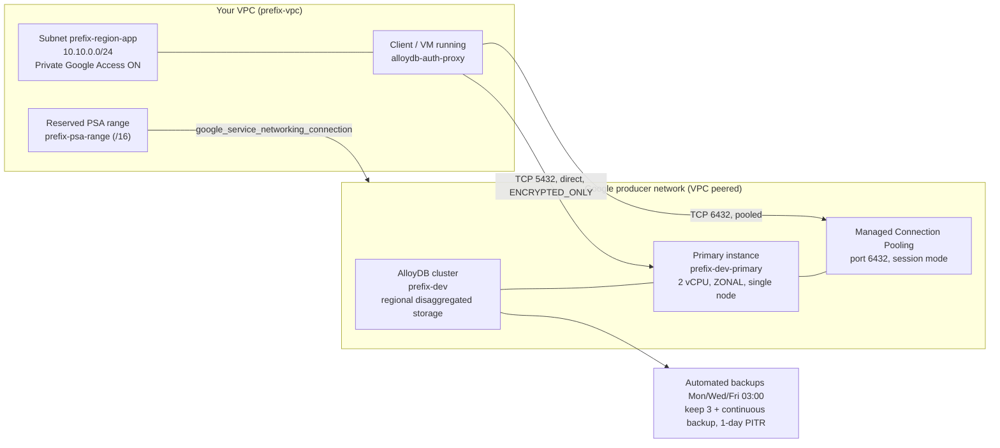

# 01 — Dev / Minimal

## Purpose

This is the smallest AlloyDB deployment that still works end to end, and it is the
one to read first. It exists to teach three things: that AlloyDB needs
**Private Services Access (PSA) wired up before the cluster can be created**, that a
**cluster and an instance are separate objects** with separate lifecycles, and that a
single `ZONAL` instance is the cheapest way to get a working database for a sandbox.
Use it for workshops, throwaway experiments, and for proving out network plumbing in a
new project. It is not suitable for anything anyone depends on: there is no standby
node, no alerting, and no deletion protection.

> [!CAUTION]
> A `ZONAL` instance has a single serving node with no automatic failover, and it is
> not covered by the AlloyDB HA SLA. Losing the zone loses the database's availability
> until Google or you rebuild it. For anything production-shaped, go to
> [`02-prod-ha`](../02-prod-ha/README.md).

---

## What it creates

| Resource | Terraform address | Purpose |
| --- | --- | --- |
| VPC | `module.network.google_compute_network.this` | Custom-mode VPC (`<prefix>-vpc`). Auto-mode is deliberately avoided because its fixed per-region ranges collide with on-prem later. |
| Subnet | `module.network.google_compute_subnetwork.app` | `<prefix>-<region>-app`, carries client workloads. Private Google Access on, VPC Flow Logs at 0.5 sampling. |
| Reserved PSA range | `module.network.google_compute_global_address.psa_range` | `/16` block handed to Google's producer network so AlloyDB can allocate an IP inside your address space. |
| Service networking connection | `module.network.google_service_networking_connection.psa` | The actual VPC peering to `servicenetworking.googleapis.com`. Without this the cluster create fails. |
| Firewall: allow Postgres | `module.network.google_compute_firewall.allow_postgres_internal` | TCP 5432 and 6432 within the subnet CIDR — 5432 for direct connections, 6432 for the managed pooler. |
| Firewall: logged deny-all | `module.network.google_compute_firewall.deny_all_ingress_logged` | Priority 65534 explicit deny so rejected ingress is *visible* in Cloud Logging. The implicit deny at 65535 cannot log. |
| AlloyDB cluster | `module.alloydb.google_alloydb_cluster.this` | `<prefix>-dev`. Owns storage, backups, encryption, the network attachment. |
| AlloyDB primary instance | `module.alloydb.google_alloydb_instance.primary` | `<prefix>-dev-primary`. Owns compute, flags, connectivity. 2 vCPU, `ZONAL`, Managed Connection Pooling enabled in session mode. |

Outputs: `cluster_name`, `primary_ip_address`, `vcpu_quota_consumed`,
`connect_via_auth_proxy`.

> [!NOTE]
> The cluster/instance split is the single most important AlloyDB concept. Storage is
> **regional and disaggregated** — it lives with the cluster, not on a disk attached to
> the instance. That is why resizing compute never touches your data, and why there is
> no "disk full" condition in the Cloud SQL sense. Storage grows elastically; what you
> can run out of is the per-cluster storage *quota*.

---

## Architecture diagram



---

## Prerequisites

### APIs

```bash
# Enable once per project. Terraform in this example does NOT enable them for you.
gcloud services enable \
  alloydb.googleapis.com \
  servicenetworking.googleapis.com \
  compute.googleapis.com \
  --project=YOUR_PROJECT_ID
```

### IAM for whoever runs Terraform

These are the predefined roles this example's resources require. Confirm them against
your own org policy — this is the minimum set the code needs, not a Google-published
list.

| Role | Needed for |
| --- | --- |
| `roles/alloydb.admin` | Create the cluster and instance |
| `roles/compute.networkAdmin` | VPC, subnet, global address, firewall rules |
| `roles/servicenetworking.networksAdmin` | The PSA peering |

### Quota to check first

| Quota | Default | Max supported | This example uses |
| --- | --- | --- | --- |
| Clusters per project per region | 3–10 (depends on project history) | 20 | 1 |
| vCPUs per project per region | 10,000 | — | **2** |
| Storage per cluster | 16 TiB | 128 TiB | negligible |

Source: [AlloyDB quotas and limits](https://cloud.google.com/alloydb/quotas).

> [!IMPORTANT]
> A **`REGIONAL`** primary instance consumes **two VMs** worth of vCPU quota — the
> active node plus the standby. This example is `ZONAL`, so it consumes **1× its vCPU
> count = 2 vCPUs**. That halving is the whole reason `ZONAL` is used here. Every other
> example in this repo is `REGIONAL` and therefore doubles. The
> `vcpu_quota_consumed` output does the arithmetic for you.

Check what you have before applying:

```bash
gcloud alloydb operations list --region=us-central1 --project=YOUR_PROJECT_ID
# Quota errors surface as: VCPUsUsedPerProjectPerRegion or ClustersUsedPerProjectPerRegion
```

---

## Usage

```bash
cd terraform/examples/01-dev-minimal

# 1. Supply variables. terraform.tfvars is gitignored.
cp terraform.tfvars.example terraform.tfvars
$EDITOR terraform.tfvars          # set project_id at minimum

# 2. Prefer keeping the password out of any file on disk.
export TF_VAR_initial_user_password="$(openssl rand -base64 24)"

# 3. Standard cycle.
terraform init
terraform plan -out=tfplan
terraform apply tfplan
```

Expect roughly 10–15 minutes end to end; PSA peering and cluster creation dominate.
That is an observed range for this repo, not a Google-published figure.

> [!WARNING]
> `initial_user_password` is written to Terraform state **in plaintext**. Use a remote
> backend with encryption and tight IAM, or treat this state file as a secret. The
> module sets `lifecycle.ignore_changes = [initial_user]` so changing the variable later
> will *not* rotate the password — rotate it with `ALTER ROLE` instead.

---

## Key configuration decisions explained

### Why `availability_type = "ZONAL"`

`ZONAL` provisions exactly one serving node. `REGIONAL` provisions an active node plus a
standby in a different zone of the same region, both reading the same regional storage —
which is why AlloyDB failover does not involve copying data. For a dev sandbox, the
standby buys you nothing you will actually use, and it costs you a second VM of vCPU
quota and a second VM of compute spend. The trade is explicit: no automatic failover and
no HA SLA coverage. That is a reasonable trade in a sandbox, and only in a sandbox.

### Why PSA is a separate module with an explicit `depends_on`

Terraform sees `network_self_link = module.network.network_self_link` and infers that
the network must exist before the cluster. What it *cannot* infer is that the
`google_service_networking_connection` — the actual peering — must also be established
first. Without the explicit `depends_on = [module.network]`, Terraform will happily
attempt the cluster create in parallel with the peering, and you get an opaque failure.
This is the number one first-attempt failure mode for AlloyDB.

### Why `ssl_mode = "ENCRYPTED_ONLY"` even in dev

The only other legal value is `ALLOW_UNENCRYPTED_AND_ENCRYPTED`. There is no scenario in
which allowing plaintext database traffic is a reasonable default, and the cost of
enforcing encryption is zero. Getting into the habit in dev means the production config
is not the first time anyone tests it. Those two strings are the complete set of allowed
values in the provider schema.

### Why `require_connectors = false`

Setting this to `true` forbids direct connections entirely — every client must come
through the AlloyDB Auth Proxy or a language connector. That is the stronger control and
it is what [`04-secure-cmek-psc`](../04-secure-cmek-psc/README.md) does. It is off here
purely so workshop attendees can reach the database with plain `psql` without extra
setup. Treat this as a workshop affordance, not a recommendation.

### Why these two database flags

| Flag | Value | Reasoning |
| --- | --- | --- |
| `idle_in_transaction_session_timeout` | `300000` (5 min, ms) | Sessions idle *inside* a transaction hold locks and pin the vacuum horizon. In a dev environment they are almost always an abandoned `psql` window. Killing them is free. No restart required. |
| `log_min_duration_statement` | `1000` (1 s, ms) | Anything slower than a second lands in Cloud Logging, so attendees can actually see slow queries during the session. No restart required. |

Both flags are confirmed settable on AlloyDB with no instance restart. Two flags that
look tempting but are not available: `shared_preload_libraries` and `wal_level` are not
settable on AlloyDB, and the Admin API rejects them rather than warning you.

### Why Managed Connection Pooling is on, in session mode

AlloyDB ships a connection pooler inside the managed instance. It is **disabled by
default**, so the `connection_pool` block in `main.tf` is what turns it on. It is enabled
here even in a sandbox for one reason: it is the pooling story this repository
recommends, and it is worth attendees seeing it working before they meet it in a
production template. There is no separate pooler fleet to run, patch, or give its own
credential store.

| Property | Value here | Worth knowing |
| --- | --- | --- |
| Enabled | `true` | Disabled by default on every AlloyDB instance. |
| Port | `6432` | Direct, unpooled connections stay on `5432`. |
| `pool_mode` | `session` | Transaction mode is the better production default; see below. |
| Flag key style | `pool_mode` | Terraform keys drop the `connection-pooling-` CLI prefix and use underscores, so `--connection-pooling-pool-mode` becomes `pool_mode`. |

Session mode is used here rather than transaction mode because transaction pooling does
not support a set of session-scoped features that a workshop attendee poking around with
`psql` would reasonably expect: `SET`/`RESET`, `LISTEN`, `WITH HOLD CURSOR`,
`PREPARE`/`DEALLOCATE`, `PRESERVE`/`DELETE ROW` temp tables, `LOAD`, session-level
advisory locks, and protocol-level prepared plans. Session mode keeps all of those
working while still sharing server connections.
[`02-prod-ha`](../02-prod-ha/README.md) uses transaction mode, which is where the large
multiplexing win lives.

> [!NOTE]
> Managed Connection Pooling is **not supported on public IP connections**. For a
> security review that reads as an advantage rather than a limitation: adopting the
> pooler reinforces a private-only posture instead of working against it. Connections
> from users holding the PostgreSQL `REPLICATION` role are also not supported and must
> go direct to 5432 — relevant if you later add logical replication or CDC tooling.

The pooler works with the AlloyDB Auth Proxy and the AlloyDB language connectors as well
as with direct connections. Defaults worth being aware of before you tune anything:
`max_pool_size` 50 per user-and-database pair, `max_client_connections` 5,000,
`server_idle_timeout` 600 s, `query_wait_timeout` 120 s, and `server_lifetime` 3,600 s.
The full reference is in
[`config/connection-pooling/managed-connection-pooling.md`](../../../config/connection-pooling/managed-connection-pooling.md).

### Why minimal backup retention

Three quantity-based backups on a Mon/Wed/Fri schedule, plus continuous backup with a
**1-day** PITR window. This is throwaway data. The point of enabling continuous backup at
all is to show that PITR exists and is a separate control from scheduled backups — you
need both, and they defend against different things. Production examples in this repo
use 14 to 35 days.

### Why both deletion guards are relaxed

`deletion_protection = false` and `deletion_policy = "FORCE"` together mean a single
`terraform destroy` tears this down. These are two independent guards:
`deletion_protection` is a provider-side block, and `deletion_policy` controls whether
the AlloyDB API will delete child instances along with the cluster. In dev, friction on
teardown means orphaned clusters burning quota. In production you want the friction —
see [`02-prod-ha`](../02-prod-ha/README.md).

---

## Cost considerations

Cost here is driven by, in rough order of impact:

1. **The primary instance's compute** — 2 vCPU running 24×7. This is the floor and it
   does not go away when idle.
2. **Regional storage** — grows with your data, billed on what the cluster actually
   holds. It is elastic, so you never pre-provision and never pay for empty headroom.
3. **Continuous backup storage** — a 1-day window is deliberately tiny here.
4. **VPC Flow Logs at 0.5 sampling** — small at this scale, but it is a real line item.

Managed Connection Pooling runs inside the managed instance rather than on infrastructure
you provision. The AlloyDB documentation for the feature does not state a pricing
position either way, so confirm on the pricing page for your region before you model it
rather than assuming it is free.

There is **no idle discount and no auto-pause**. An AlloyDB instance you are not using
costs the same as one you are. For a workshop environment the correct answer is to
`terraform destroy` at the end of the day and re-apply tomorrow — the whole stack is
~15 minutes to rebuild. If you must keep the cluster, note that you cannot scale the
instance to zero; the minimum is the smallest available shape.

See [AlloyDB pricing](https://cloud.google.com/alloydb/pricing).

---

## Verification

All read-only.

```bash
PROJECT=YOUR_PROJECT_ID
REGION=us-central1
CLUSTER=alloydb-wk-dev          # name_prefix + "-dev"

# 1. Cluster exists, is READY, and is PSA-attached (network_config, not psc_config).
gcloud alloydb clusters describe "$CLUSTER" \
  --region="$REGION" --project="$PROJECT" \
  --format='yaml(name,state,clusterType,networkConfig,continuousBackupConfig,automatedBackupPolicy)'

# 2. Instance is ZONAL with 2 vCPU, and SSL is enforced.
gcloud alloydb instances describe "${CLUSTER}-primary" \
  --cluster="$CLUSTER" --region="$REGION" --project="$PROJECT" \
  --format='yaml(name,state,instanceType,availabilityType,machineConfig,ipAddress,clientConnectionConfig)'
# Expect: availabilityType: ZONAL, machineConfig.cpuCount: 2,
#         clientConnectionConfig.sslConfig.sslMode: ENCRYPTED_ONLY

# 3. The database flags actually landed.
gcloud alloydb instances describe "${CLUSTER}-primary" \
  --cluster="$CLUSTER" --region="$REGION" --project="$PROJECT" \
  --format='value(databaseFlags)'

# 3b. Managed Connection Pooling is on, in session mode.
gcloud alloydb instances describe "${CLUSTER}-primary" \
  --cluster="$CLUSTER" --region="$REGION" --project="$PROJECT" \
  --format='yaml(connectionPoolConfig)'
# Expect: enabled: true, flags.pool_mode: session

# 4. The PSA peering is ACTIVE. If this is missing, the cluster create would have failed.
gcloud compute networks peerings list \
  --network="alloydb-wk-vpc" --project="$PROJECT"
# Expect a peering named servicenetworking-googleapis-com in state ACTIVE.

# 5. The reserved range is actually reserved.
gcloud compute addresses list --global --project="$PROJECT" \
  --filter="purpose=VPC_PEERING" \
  --format='table(name,address,prefixLength,status)'

# 6. Confirm vCPU consumption matches the output.
terraform output vcpu_quota_consumed   # expect 2
```

Then connect:

```bash
# The proxy must run somewhere with network reachability to the instance:
# a VM in this VPC, or your workstation over VPN/Interconnect.
./alloydb-auth-proxy "$(terraform output -raw cluster_name)/instances/${CLUSTER}-primary"
psql -h 127.0.0.1 -p 5432 -U postgres -d postgres
```

`terraform output connect_via_auth_proxy` prints the exact instance URI for you.

To use the pooled path instead, point the client at port 6432 rather than 5432. The
pooler accepts Auth Proxy and language-connector connections as well as direct ones,
so the only change is the port:

```bash
# Pooled endpoint. Session pool mode, so session-scoped state still behaves
# the way it does on a direct connection.
psql "host=$(terraform output -raw primary_ip_address) port=6432 user=postgres dbname=postgres sslmode=require"
```

---

## Teardown

This example is configured for easy teardown — `deletion_protection = false` and
`deletion_policy = "FORCE"` are already set in `main.tf`. One command:

```bash
cd terraform/examples/01-dev-minimal
terraform destroy
```

> [!TIP]
> The `google_service_networking_connection` in the network module uses
> `deletion_policy = "ABANDON"`, so the VPC peering to `servicenetworking` is
> **deliberately left behind** on destroy. Removing a service networking connection is
> the most common way a database `terraform destroy` hangs, because the producer side
> still holds resources. The leftover peering is harmless and is reused on the next
> apply. If you genuinely need it gone, remove it manually afterwards:
> `gcloud services vpc-peerings delete --network=alloydb-wk-vpc --service=servicenetworking.googleapis.com`

Verify nothing is left consuming quota:

```bash
gcloud alloydb clusters list --region=us-central1 --project=YOUR_PROJECT_ID
```

---

## Next steps

Operations docs:

- [`docs/04-operations/sizing-guide.md`](../../../docs/04-operations/sizing-guide.md) — how to pick a shape, and why `ZONAL` vs `REGIONAL` changes your quota maths
- [`docs/04-operations/monitoring-metrics.md`](../../../docs/04-operations/monitoring-metrics.md) — the metrics that actually exist, and the 0–1 fraction trap
- [`docs/04-operations/security-hardening.md`](../../../docs/04-operations/security-hardening.md) — what this example deliberately leaves off
- [`docs/04-operations/troubleshooting-runbook.md`](../../../docs/04-operations/troubleshooting-runbook.md) — start here when the cluster create fails

Related configuration:

- [`config/connection-pooling/managed-connection-pooling.md`](../../../config/connection-pooling/managed-connection-pooling.md) — the full flag reference, pool-mode trade-offs and pooler metrics
- [`config/connection-pooling/app-side-pool-sizing.md`](../../../config/connection-pooling/app-side-pool-sizing.md) — sizing the pool inside your application, which complements the server-side pooler

Next example: **[`02-prod-ha`](../02-prod-ha/README.md)** — the same shape with
`REGIONAL` HA, pgAudit, IAM database authentication, Managed Connection Pooling in
transaction mode, real backup retention, full alerting, and deletion protection turned
on. It is the reference production deployment; if you copy one example, copy that one.

---

*Last verified: 2026-09-22 against provider google v8.3.0.*
