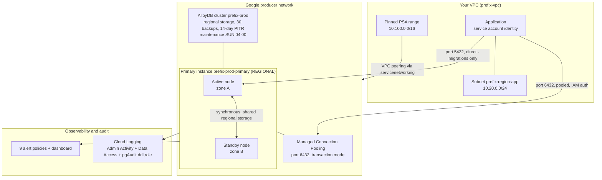

# 02 — Production HA

## Purpose

This is the reference production deployment for AlloyDB, and the example to copy if you
only copy one. It builds a `REGIONAL` (highly available) cluster behind Private Services
Access, then layers on the controls a security team actually asks about: pgAudit with
Data Access logs, IAM database authentication so the application holds no password,
password-hash read restrictions, a hardened flag baseline, Managed Connection Pooling,
30 scheduled backups plus a 14-day point-in-time recovery window, a pinned maintenance
window, nine alert policies with a dashboard, and deletion protection. Use it as the
starting template for any real workload. Read
[`01-dev-minimal`](../01-dev-minimal/README.md) first if you have not yet seen how the
PSA plumbing works.

> [!IMPORTANT]
> `deletion_protection = true` in this example. You **cannot** `terraform destroy` it
> without first flipping that flag and applying the change. See
> [Teardown](#teardown) — that two-step is deliberate, not an oversight.

---

## What it creates

| Resource | Terraform address | Purpose |
| --- | --- | --- |
| VPC | `module.network.google_compute_network.this` | Custom-mode VPC `<prefix>-vpc`. |
| Subnet | `module.network.google_compute_subnetwork.app` | `<prefix>-<region>-app`, Private Google Access on, Flow Logs at 0.5 sampling. |
| Reserved PSA range | `module.network.google_compute_global_address.psa_range` | **Pinned** `/16` starting at `psa_range_address` (default `10.100.0.0`). |
| Service networking connection | `module.network.google_service_networking_connection.psa` | The VPC peering that makes PSA work. |
| Firewall: allow Postgres | `module.network.google_compute_firewall.allow_postgres_internal` | TCP 5432 + 6432 within the subnet. |
| Firewall: logged deny-all | `module.network.google_compute_firewall.deny_all_ingress_logged` | Priority 65534 explicit deny, logged — the implicit deny cannot log. |
| AlloyDB cluster | `module.alloydb.google_alloydb_cluster.this` | `<prefix>-prod`. Owns storage, backups, maintenance window, network attachment. |
| AlloyDB primary instance | `module.alloydb.google_alloydb_instance.primary` | `<prefix>-prod-primary`. `REGIONAL`, `cpu_count` vCPU (default 8), hardened flags, connection pool on. |
| IAM database user | `google_alloydb_user.app_iam` | *Conditional on `app_service_account_email`.* Registers the app SA as an `ALLOYDB_IAM_USER` with role `alloydbiamuser`. |
| Project IAM binding | `google_project_iam_member.app_alloydb_client` | *Conditional.* `roles/alloydb.client` for the app SA. |
| Project IAM binding | `google_project_iam_member.app_alloydb_db_user` | *Conditional.* `roles/alloydb.databaseUser` for the app SA. |
| Audit config | `google_project_iam_audit_config.alloydb` | *Conditional on `enable_data_access_logs` (default `true`).* Turns on `ADMIN_READ`, `DATA_READ`, `DATA_WRITE` for `alloydb.googleapis.com`. |
| Notification channel | `google_monitoring_notification_channel.email` | *Conditional on `alert_email`.* Email channel wired into every alert policy. |
| Alert policies ×9 | `module.observability` | CPU, connection utilisation, available memory, transaction-ID utilisation, storage quota, replication lag, node down, backup staleness, audit backlog. |
| Dashboard | `module.observability.google_monitoring_dashboard.alloydb` | Bundled Cloud Monitoring overview dashboard. |

Outputs: `cluster_name`, `primary_instance_name`, `primary_ip_address`,
`vcpu_quota_consumed`, `alert_policies`, `dashboard_id`, `connection_notes`.

---

## Architecture diagram



---

## Prerequisites

### APIs

```bash
gcloud services enable \
  alloydb.googleapis.com \
  servicenetworking.googleapis.com \
  compute.googleapis.com \
  monitoring.googleapis.com \
  --project=YOUR_PROJECT_ID
```

### IAM for whoever runs Terraform

The minimum set this example's resources need. Confirm against your org policy; this is
not a Google-published list.

| Role | Needed for |
| --- | --- |
| `roles/alloydb.admin` | Cluster, instance, and the `google_alloydb_user` resource |
| `roles/compute.networkAdmin` | VPC, subnet, global address, firewall rules |
| `roles/servicenetworking.networksAdmin` | The PSA peering |
| `roles/resourcemanager.projectIamAdmin` | The two `google_project_iam_member` grants and the audit config |
| `roles/monitoring.editor` | Alert policies, notification channel, dashboard |

> [!WARNING]
> `google_project_iam_audit_config` is **authoritative for the `alloydb.googleapis.com`
> service** at project level. If something else in your estate already manages Data
> Access log configuration for that service, applying this will fight with it. Check
> before you apply, or set `enable_data_access_logs = false` and manage audit config
> centrally.

### Quota to check first

| Quota | Default | Max supported | This example uses |
| --- | --- | --- | --- |
| Clusters per project per region | 3–10 (depends on project history) | 20 | 1 |
| vCPUs per project per region | 10,000 | — | **2 × `cpu_count`** = 16 at the default |
| Storage per cluster | 16 TiB | 128 TiB | grows with your data |
| `max_connections` | 1,000 | adjustable to 240,000 | left at the default |

Source: [AlloyDB quotas and limits](https://cloud.google.com/alloydb/quotas).

> [!IMPORTANT]
> A **`REGIONAL` primary consumes two VMs** of vCPU quota — the active node plus the
> standby. At the default `cpu_count = 8` that is **16 vCPUs**, not 8. This is the most
> commonly missed line in AlloyDB capacity planning. The `vcpu_quota_consumed` output
> computes it; check it against your `VCPUsUsedPerProjectPerRegion` quota before you
> apply. Quota errors surface with the literal string
> `VCPUsUsedPerProjectPerRegion`.

---

## Usage

```bash
cd terraform/examples/02-prod-ha

cp terraform.tfvars.example terraform.tfvars
$EDITOR terraform.tfvars
# At minimum set project_id. Consider also:
#   cpu_count                 (remember: 2x for quota)
#   psa_range_address         (pin it, document it in IPAM)
#   app_service_account_email (enables the IAM-auth path)
#   alert_email               (otherwise policies exist but nobody is paged)

export TF_VAR_initial_user_password="$(openssl rand -base64 24)"

terraform init
terraform plan -out=tfplan
terraform apply tfplan

# Read the connection guidance the stack prints for you:
terraform output connection_notes
```

---

## Key configuration decisions explained

### Why `availability_type = "REGIONAL"`

`REGIONAL` provisions an active node and a standby node in a different zone of the same
region. Both attach to the **same regional storage layer** — the standby is not a copy of
your data, it is a second compute node in front of the same bytes. That is why AlloyDB
failover does not involve restoring or catching up a replica, and why the RPO for a zone
failure is zero. Only `REGIONAL` instances are covered by the AlloyDB HA SLA. The price
is the second VM of compute and of vCPU quota.

Note carefully that this is **zone**-level protection only. A regional outage takes the
whole thing out. For region-level protection you need a secondary cluster — see
[`05-cross-region-dr`](../05-cross-region-dr/README.md). HA and DR are different
controls solving different problems, and you need both.

### Why the PSA range is pinned (`psa_range_address`, `/16`)

In `01-dev-minimal` the range is auto-allocated, which is fine for a sandbox. In
production an auto-allocated range is a range you cannot document, cannot pre-clear with
your network team, and which may land somewhere that collides with a future peering. The
range is handed to Google's producer network and is effectively permanent for the life of
the VPC. Pin it, write it into IPAM, and size it `/16` so future managed services on the
same VPC have room.

### Why `pgaudit.log = "ddl,role"` and not `"all"`

This is the decision that most often gets made badly. The allowed values, confirmed
directly against the AlloyDB Admin API's supported-flags list, are exactly:
`read, write, function, role, ddl, misc, misc_set, all, none`, plus subtractive forms
(`-read`, `-write`, … `-all`). The default is `none` — meaning if you enable
`alloydb.enable_pgaudit` and stop there, you have paid for the extension and captured
nothing.

`ddl,role` captures **schema changes and privilege changes**. Those are low-volume,
high-signal, and they are what an auditor or an incident responder actually needs: who
created a table, who granted themselves a role, when the schema drifted. Adding `write`
multiplies volume by your transaction rate. Adding `read` — or jumping straight to
`all` — multiplies it by your *query* rate, which on an OLTP system is enormous, and
these records are delivered as billable Data Access logs.

The correct sequence is: start at `ddl,role`, measure your actual log volume for a week,
then add `write` if your compliance regime demands it, and only consider `read` with a
volume-reduction strategy in place. [`04-secure-cmek-psc`](../04-secure-cmek-psc/README.md)
defaults to `ddl,role,write` because it targets a higher-assurance posture and pairs it
with `alloydb.enable_auditlog_volume_reduction`.

> [!CAUTION]
> `alloydb.enable_pgaudit` **requires an instance restart**, which drops every open
> connection. Turning on auditing is not a zero-downtime change. Plan it into a
> maintenance window. By contrast `alloydb.iam_authentication` requires **no** restart —
> the two behave differently and it is easy to assume otherwise.

### Why Data Access logs are enabled alongside pgAudit

pgAudit records are delivered to Cloud Logging as **Data Access** logs. Data Access
logging is off by default across Google Cloud and must be turned on per service. So
`alloydb.enable_pgaudit = on` without `google_project_iam_audit_config` produces an
audited database whose audit trail goes nowhere useful. The two are a pair. Admin
Activity logs (who created/deleted/modified the cluster) are always on and free; Data
Access logs are opt-in and billable.

### Why `alloydb.pg_authid_select_role` and `alloydb.pg_shadow_select_role`

In stock PostgreSQL, `pg_authid` and `pg_shadow` — which hold password hashes — are
readable by superusers only, but managed-Postgres role models often loosen this. Setting
both to `alloydbsuperuser` means an ordinary authenticated user cannot `SELECT` every
password hash in the cluster and walk away with them for offline cracking. This is a
cheap control with no operational downside and it closes a real exfiltration path.
Neither flag requires a restart.

### Why IAM database authentication instead of a password

When `app_service_account_email` is set, the example does three things: grants the SA
`roles/alloydb.client` and `roles/alloydb.databaseUser`, and registers it as an
`ALLOYDB_IAM_USER` in the cluster. The application then authenticates with a short-lived
OAuth token derived from its Google Cloud identity — there is no database password to
store, rotate, leak, or find in a git history. This removes an entire class of secret
management problem and makes revocation an IAM operation rather than a database
operation.

Two details worth internalising:

- The `user_id` is the service account email **with `.gserviceaccount.com` stripped**,
  because PostgreSQL role names cap at 63 characters. The code does this with
  `trimsuffix()`.
- `database_roles` on `google_alloydb_user` is **authoritative**. Roles granted out of
  band with `GRANT` are stripped on the next apply. Manage *role membership* in
  Terraform and *object privileges* with SQL; mixing the two will surprise you.

The example deliberately does **not** grant `roles/alloydb.admin` to the application. An
application must never hold the ability to delete the cluster it depends on. That is
blast-radius control, and it is the difference between a bad deploy and an outage with
no data.

### Why Managed Connection Pooling, in transaction mode, on port 6432

AlloyDB's `max_connections` default is 1,000, and Google's published guidance curve
doubles with instance size then **plateaus at 5,000** — raising it further "reduces
memory for the shared buffer"
([quotas page](https://cloud.google.com/alloydb/quotas)). So connection count is a
resource you manage, not a dial you turn up. Managed Connection Pooling multiplexes many
client connections onto few server connections, and in AlloyDB it is a first-class
instance feature configured through `connection_pool_config` — there is no separate
pooler fleet to run, patch, monitor, or give its own credential store.

The pooler is **disabled by default**, so the `connection_pool` block in `main.tf` is
what turns it on. It listens on **port 6432**; direct connections stay on 5432
([managed connection pooling docs](https://cloud.google.com/alloydb/docs/managed-connection-pooling)).
It accepts connections from the AlloyDB Auth Proxy and the AlloyDB language connectors as
well as direct ones, so the pooled path composes with the IAM-authentication path
described above rather than competing with it.

`pool_mode = "transaction"` is the default mode and is where the large multiplexing win
comes from. It is also where the sharp edge is.

> [!WARNING]
> Transaction pooling does not support a specific set of session-scoped features,
> because consecutive statements from one client may land on different server
> connections: `SET`/`RESET`, `LISTEN`, `WITH HOLD CURSOR`, `PREPARE`/`DEALLOCATE`,
> `PRESERVE`/`DELETE ROW` temp tables, `LOAD`, session-level advisory locks, and
> protocol-level prepared plans. Two of those catch people out in practice — some
> migration tools use advisory locks to serialise migrations, and some drivers use
> protocol-level prepared statements by default. Audit the application before enabling
> transaction mode, and run schema migrations against port 5432 rather than 6432.
> `session` mode is the fallback if any of the above is genuinely required; it pools
> less aggressively but keeps session state intact.

Two properties of the pooler are worth raising in a security review specifically. It is
**not supported on public IP connections**, which means adopting it reinforces a
private-only networking posture rather than working against it. And connections from
users holding the PostgreSQL `REPLICATION` role are not supported, so logical replication
and CDC tooling must connect directly on 5432 — useful to know before someone tries to
route a CDC pipeline through the pooler and cannot work out why it fails.

Terraform flag keys drop the `connection-pooling-` CLI prefix and use underscores, so
`--connection-pooling-pool-mode` becomes the key `pool_mode`. The documented defaults
this example inherits without restating them:

| Flag key | Default | Notes |
| --- | --- | --- |
| `pool_mode` | `transaction` | Set explicitly here for clarity. The alternative is `session`. |
| `max_pool_size` | `50` | Per user **and database pair**, not per instance. |
| `max_client_connections` | `5000` | |
| `server_idle_timeout` | `600` s | |
| `query_wait_timeout` | `120` s | |
| `server_lifetime` | `3600` s | |

`max_pool_size` being per user-and-database pair is the detail that bites during
capacity planning: total server connections the pooler may open is
`max_pool_size × (user, database) pairs`, and that total is what has to fit inside
`max_connections`.

See
[`config/connection-pooling/managed-connection-pooling.md`](../../../config/connection-pooling/managed-connection-pooling.md)
for the full flag reference and the pooler metrics, and
[`config/connection-pooling/app-side-pool-sizing.md`](../../../config/connection-pooling/app-side-pool-sizing.md)
for how to size the client side.

### Why these production flags

| Flag | Value | Reasoning | Restart? |
| --- | --- | --- | --- |
| `idle_in_transaction_session_timeout` | `60000` (60 s) | Idle-in-transaction sessions hold locks and pin the vacuum horizon. 60 s is tighter than dev's 5 min. | No |
| `statement_timeout` | `300000` (5 min) | A backstop, not a policy. Anything running 5 minutes on an OLTP primary is a bug or an accident. | No |
| `log_min_duration_statement` | `1000` (1 s) | Slow-query visibility without logging everything. | No |
| `log_checkpoints` / `log_lock_waits` | `on` | Checkpoint and lock-wait behaviour are the two things you most want in the log after an incident. | No |
| `log_temp_files` | `0` | Logs *every* temp file spill. Spills mean `work_mem` is too small for the query; you want to know. | No |
| `alloydb.iam_authentication` | `on` | Enables the passwordless path. Confirmed: **no restart**. | No |
| `alloydb.enable_pgaudit` | `on` | Loads the extension. | **Yes** |
| `pgaudit.log` | `ddl,role` | See above. | No |
| `password.enforce_complexity`, `password.min_pass_length = 16`, `password.enforce_password_does_not_contain_username` | — | Applies to any remaining built-in password users. Belt and braces behind IAM auth. | No |
| `alloydb.pg_authid_select_role`, `alloydb.pg_shadow_select_role` | `alloydbsuperuser` | See above. | No |

`max_connections` is deliberately **left at its AlloyDB default of 1,000**. Raising it is
the wrong fix for concurrency pressure; the pooler is the right one. Keep this set in
sync with
[`config/database-flags/production-oltp.env`](../../../config/database-flags/production-oltp.env).

Worth knowing that the autovacuum flags are absent from that list on purpose. AlloyDB
enables **adaptive autovacuum** (`enable_google_adaptive_autovacuum`) by default, and it
adjusts vacuum scheduling, worker count and cost limits in response to the workload. The
familiar self-managed reflex — globally lowering `autovacuum_vacuum_scale_factor` and
raising `autovacuum_vacuum_cost_limit` — works against that adaptation rather than with
it. Those flags are still settable if you need them, but the better instinct on AlloyDB
is to leave the global settings alone and apply per-table storage parameters to the few
tables that genuinely need different behaviour. See
[adaptive autovacuum](https://cloud.google.com/alloydb/docs/adaptive-autovacuum).

### Why the maintenance window is pinned to Sunday 04:00

Leaving `maintenance_update_policy` unset lets Google pick, which means you find out when
it happens. Maintenance briefly drops connections. Pinning it to a genuinely low-traffic
hour — in the cluster's own timezone, which is not necessarily yours — turns an
unannounced blip into a known event you can put on a calendar and tell the application
team about. Maintenance begins *within an hour* of the stated time, so treat it as a
window not an instant. Only whole hours are supported: the API rejects non-zero minutes,
seconds or nanos.

Clients must retry. Managed maintenance is a normal part of a managed database, and an
application that cannot survive a reconnect is not production-ready regardless of what
the database does.

### Why the alert policies look the way they do

The observability module creates nine policies. Two design choices are worth calling out:

- **Connection utilisation is a *ratio*, not a count.** It compares
  `instance/postgres/total_connections` against
  `instance/postgres/connections_limit`. A hardcoded connection threshold silently rots
  the moment somebody resizes the instance or changes `max_connections`. A ratio keeps
  working.
- **The memory alert is an absolute byte value**, because there is no ratio metric for
  memory. This example therefore computes it from the instance shape:
  `var.cpu_count * 8 GiB / 8`, i.e. roughly 12.5% of RAM assuming the ~8 GiB-per-vCPU
  highmem convention. **That RAM-per-vCPU assumption is not a Google-published figure** —
  verify the actual shape you deploy in the console or pricing calculator and adjust.

> [!CAUTION]
> Google does **not** publish numeric alerting thresholds for AlloyDB. Every default in
> the observability module — 85% CPU, 80% connections, 20%/40% transaction-ID
> utilisation, 80% storage quota, 30 s replication lag, 48 h backup age — is a considered
> **starting point, not a Google recommendation**. Calibrate against two weeks of your own
> baseline before any of them pages a human.

The transaction-ID numbers deserve a word of explanation, because they look low next to
the others. `database/postgresql/vacuum/transaction_id_utilization` is a **fraction
between 0 and 1** of the transaction ID space consumed, and because autovacuum freezes at
the 200 million default `autovacuum_freeze_max_age`, a healthy instance sits around 0.10
and never climbs much above it. Three live clusters sampled for this repo read 0.0895,
0.0699 and 0.0723. A warning at **0.2** therefore means "XID age is roughly twice what
autovacuum should ever allow", which is an early and actionable signal; **0.4** is worth
paging for. Thresholds up near 0.8 only fire once you are close to a write outage, which
is far too late to be useful.

One more trap, verified empirically against a live instance: metrics carrying the unit
`10^2.%` (including `instance/cpu/maximum_utilization`) return a **fraction between 0 and
1** from the API, even though the console renders a percentage and some metric
descriptions say "from 0 to 100". In Terraform you write `0.85`, not `85`. Writing `85`
produces a policy that validates cleanly and never fires. See
[`docs/04-operations/monitoring-metrics.md`](../../../docs/04-operations/monitoring-metrics.md).

### Why `deletion_protection = true` with `deletion_policy = "DEFAULT"`

Two independent guards, and they do different things.

| Guard | Layer | Effect |
| --- | --- | --- |
| `deletion_protection = true` | Terraform provider | `terraform destroy` fails outright. Must be set `false` **and applied** before a destroy will run. |
| `deletion_policy = "DEFAULT"` | AlloyDB API | Deleting a cluster that still has instances is rejected. `FORCE` would delete children along with the cluster. |

Production keeps both restrictive. The friction is the feature: deleting a production
database should require a deliberate, reviewable, two-commit sequence, not one
mistyped command.

---

## Cost considerations

The cost drivers here, in rough order:

1. **Two VMs of compute, 24×7.** `REGIONAL` means the standby is always running. This
   dominates, and it is the direct price of the HA SLA. Halving `cpu_count` halves it.
2. **Managed Connection Pooling.** The pooler runs inside the managed instance rather
   than on infrastructure you provision. The feature documentation does not state a
   pricing position either way, so confirm it on the pricing page for your region
   before you model it.
3. **Regional storage**, elastic, billed on what the cluster holds.
4. **Backup storage** — 30 retained backups plus a 14-day continuous-backup window. The
   PITR window is the bigger contributor on a write-heavy system, because continuous
   backup retains WAL for the whole window.
5. **Data Access logs.** This is the line item that surprises people. pgAudit at
   `ddl,role` is modest; the same config at `all` on a busy OLTP primary can generate
   more logging spend than the database. Measure before you widen the scope.
6. **VPC Flow Logs** at 0.5 sampling, and nine alert policies plus a dashboard
   (monitoring costs are small but non-zero).

What to turn off when idle: for a non-production copy of this stack, the honest answer is
that AlloyDB has **no pause or idle discount**, so an unused cluster costs what a used
one does. If this is a staging environment that sleeps at night, destroy it. If you must
keep it, the levers are `availability_type` (drop to `ZONAL`, losing the SLA),
`cpu_count`, the PITR window, and `enable_data_access_logs`. Never reach for the last one
in production.

See [AlloyDB pricing](https://cloud.google.com/alloydb/pricing).

---

## Verification

All read-only.

```bash
PROJECT=YOUR_PROJECT_ID
REGION=us-central1
CLUSTER=alloydb-wk-prod        # name_prefix + "-prod"
INSTANCE="${CLUSTER}-primary"

# 1. Cluster: READY, PSA-attached, backups and maintenance window as configured.
gcloud alloydb clusters describe "$CLUSTER" \
  --region="$REGION" --project="$PROJECT" \
  --format='yaml(state,clusterType,networkConfig,automatedBackupPolicy,continuousBackupConfig,maintenanceUpdatePolicy,deletionPolicy)'
# Expect: continuousBackupConfig.recoveryWindowDays: 14
#         automatedBackupPolicy.quantityBasedRetention.count: 30
#         maintenanceUpdatePolicy ... day: SUNDAY, hours: 4

# 2. Instance: REGIONAL HA, SSL enforced, pooling on.
gcloud alloydb instances describe "$INSTANCE" \
  --cluster="$CLUSTER" --region="$REGION" --project="$PROJECT" \
  --format='yaml(state,instanceType,availabilityType,machineConfig,clientConnectionConfig,connectionPoolConfig,ipAddress)'
# Expect: availabilityType: REGIONAL
#         clientConnectionConfig.sslConfig.sslMode: ENCRYPTED_ONLY
#         connectionPoolConfig.enabled: true, flags.pool_mode: transaction

# 3. The security-relevant flags actually landed.
gcloud alloydb instances describe "$INSTANCE" \
  --cluster="$CLUSTER" --region="$REGION" --project="$PROJECT" \
  --format='json(databaseFlags)' | \
  grep -E 'iam_authentication|enable_pgaudit|pgaudit.log|pg_authid|pg_shadow|password\.'

# 4. Data Access logging is on for AlloyDB.
gcloud projects get-iam-policy "$PROJECT" \
  --format='yaml(auditConfigs)'
# Expect a service: alloydb.googleapis.com entry with ADMIN_READ, DATA_READ, DATA_WRITE.

# 5. IAM database users registered on the cluster.
gcloud alloydb users list --cluster="$CLUSTER" --region="$REGION" --project="$PROJECT"
# Expect userType ALLOYDB_IAM_USER for the app SA (if app_service_account_email was set).

# 6. Alert policies exist and are enabled.
gcloud alpha monitoring policies list --project="$PROJECT" \
  --filter='displayName:"alloydb-wk-prod"' \
  --format='table(displayName,enabled,conditions[0].displayName)'

# 7. Confirm a metric is actually flowing (and note the 0-1 scale).
gcloud monitoring time-series list \
  --project="$PROJECT" \
  --filter='metric.type="alloydb.googleapis.com/instance/cpu/maximum_utilization"
            AND resource.labels.cluster_id="'"$CLUSTER"'"' \
  --format='value(points[0].value.doubleValue)' 2>/dev/null | head -1
# A value like 0.0423 means 4.23% CPU. NOT 4.23%-of-100.

# 8. Quota arithmetic.
terraform output vcpu_quota_consumed    # expect 2 x cpu_count
```

Then connect:

```bash
terraform output connection_notes

# Pooled path (what the application should use):
psql "host=$(terraform output -raw primary_ip_address) port=6432 user=postgres dbname=postgres sslmode=require"

# Direct path (migrations, session-scoped work):
psql "host=$(terraform output -raw primary_ip_address) port=5432 user=postgres dbname=postgres sslmode=require"

# Passwordless via IAM:
./alloydb-auth-proxy --auto-iam-authn "$(terraform output -raw primary_instance_name)"
```

Useful diagnostic SQL lives in
[`monitoring/sql/02_connections_and_locks.sql`](../../../monitoring/sql/02_connections_and_locks.sql).

---

## Teardown

> [!IMPORTANT]
> `deletion_protection = true` means a plain `terraform destroy` **will fail**. You must
> disable the guard and apply that change *first*. This is intentional.

```bash
cd terraform/examples/02-prod-ha

# Step 1: flip the provider-side guard in main.tf.
#   deletion_protection = true   ->   deletion_protection = false
$EDITOR main.tf

# Step 2: APPLY that change. This is the step people skip.
terraform apply

# Step 3: now the destroy is permitted.
terraform destroy
```

If you would rather not edit tracked code, the equivalent one-liner — note that it still
needs the apply before the destroy:

```bash
terraform apply  -var-file=terraform.tfvars -target=module.alloydb   # after editing
terraform destroy -var-file=terraform.tfvars
```

`deletion_policy` is `DEFAULT` here, meaning the API refuses to delete a cluster that
still owns instances. Terraform destroys the instance before the cluster, so the normal
ordering works. If you ever hit a stuck cluster, `FORCE` is the escape hatch — but
understand that it deletes the instances with it.

> [!TIP]
> The `google_service_networking_connection` uses `deletion_policy = "ABANDON"`, so the
> VPC peering survives the destroy on purpose. Tearing down a service networking
> connection is the classic way a database stack's destroy hangs. The leftover peering is
> harmless and gets reused next time.

Confirm nothing is left:

```bash
gcloud alloydb clusters list --region=us-central1 --project=YOUR_PROJECT_ID
gcloud alpha monitoring policies list --project=YOUR_PROJECT_ID --filter='displayName:"alloydb-wk-prod"'
```

Note that `google_project_iam_audit_config` is removed on destroy, which turns Data
Access logging for AlloyDB back off project-wide. If other clusters in the project rely
on it, re-enable it.

---

## Next steps

Operations docs:

- [`docs/04-operations/security-hardening.md`](../../../docs/04-operations/security-hardening.md) — the full control set, including what this example stops short of
- [`docs/04-operations/audit-logging-and-siem.md`](../../../docs/04-operations/audit-logging-and-siem.md) — widening `pgaudit.log` safely, and getting records to a SIEM
- [`docs/04-operations/monitoring-metrics.md`](../../../docs/04-operations/monitoring-metrics.md) — which metrics exist, and the 0–1 fraction trap
- [`docs/04-operations/sizing-guide.md`](../../../docs/04-operations/sizing-guide.md) — choosing `cpu_count` and the 2× quota maths
- [`docs/04-operations/maintenance-and-upgrades.md`](../../../docs/04-operations/maintenance-and-upgrades.md) — what happens in that Sunday window
- [`docs/04-operations/troubleshooting-runbook.md`](../../../docs/04-operations/troubleshooting-runbook.md)

Related configuration:

- [`config/connection-pooling/managed-connection-pooling.md`](../../../config/connection-pooling/managed-connection-pooling.md) — pool modes, the full flag reference, and the four `conn_pool` metrics
- [`config/connection-pooling/app-side-pool-sizing.md`](../../../config/connection-pooling/app-side-pool-sizing.md) — sizing the client-side pool that sits in front of it
- [`config/database-flags/production-oltp.env`](../../../config/database-flags/production-oltp.env) — the annotated flag baseline this example mirrors

Next examples:

- **[`03-read-pool-scaling`](../03-read-pool-scaling/README.md)** — add horizontal read
  capacity, and the workload-isolation pattern that matters more than node count.
- **[`04-secure-cmek-psc`](../04-secure-cmek-psc/README.md)** — the higher-assurance
  variant: Private Service Connect instead of PSA, CMEK, `require_connectors = true`, and
  an audit export sink.
- **[`05-cross-region-dr`](../05-cross-region-dr/README.md)** — because `REGIONAL` HA
  protects a zone, not a region.

---

*Last verified: 2026-09-22 against provider google v8.3.0.*
