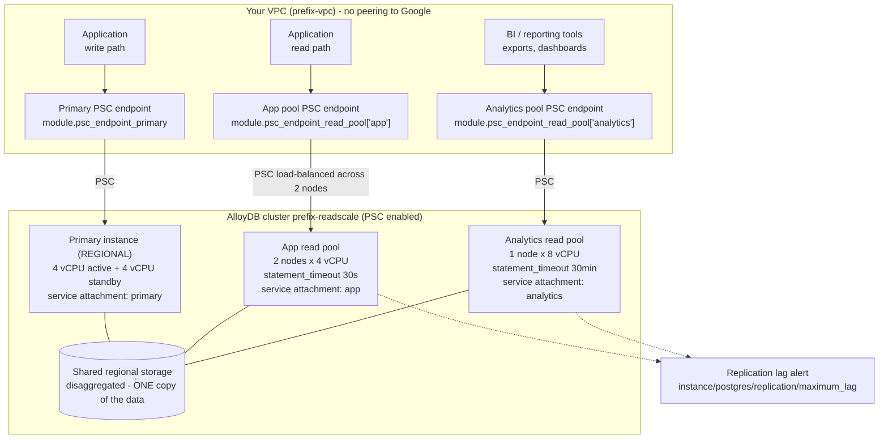

# 03 — Read Pool Scaling

## Purpose

This example demonstrates horizontal read scaling in AlloyDB, and — more importantly —
the **workload isolation pattern** that matters far more than the raw node count. It
builds a `REGIONAL` primary plus **two separate read pool instances**: one sized and
tuned for latency-sensitive application reads, one deliberately isolated for analytics
and reporting with a long statement timeout, larger `work_mem`, and the columnar engine
enabled. Use it when you are planning how to absorb read growth, when a BI tool is
threatening your OLTP latency, or when you need to explain to a security or architecture
review where the blast-radius boundaries in your data tier actually are. Read
[`02-prod-ha`](../02-prod-ha/README.md) first for the production baseline this builds on.

> [!NOTE]
> The architectural point that makes AlloyDB read pools different from traditional
> PostgreSQL read replicas: **read pool nodes do not get their own copy of the data.**
> AlloyDB storage is regional and disaggregated, shared by every instance in the cluster.
> Adding a read node adds compute and cache, not storage. That is why read pools scale
> out in minutes rather than hours, why they cost compute and not a duplicated dataset,
> and why there is no "replica is rebuilding from a base backup" phase to wait through.

---

## What it creates

| Resource | Terraform address | Purpose |
| --- | --- | --- |
| VPC | `module.network.google_compute_network.this` | Custom-mode VPC `<prefix>-vpc`. |
| Subnet | `module.network.google_compute_subnetwork.app` | `<prefix>-<region>-app` (default `10.30.0.0/24`), Private Google Access on. Hosts client workloads and all PSC endpoints. |
| Firewall: allow Postgres | `module.network.google_compute_firewall.allow_postgres_internal` | TCP 5432 + 6432 within the subnet. |
| Firewall: logged deny-all | `module.network.google_compute_firewall.deny_all_ingress_logged` | Priority 65534 explicit logged deny. |
| Project lookup | `data.google_project.this` | Supplies this project's number for the PSC consumer allow-list. |
| AlloyDB cluster | `module.alloydb.google_alloydb_cluster.this` | `<prefix>-readscale`. `psc_enabled = true`. Owns shared regional storage. |
| Primary instance | `module.alloydb.google_alloydb_instance.primary` | `<prefix>-readscale-primary`. `REGIONAL`, `primary_cpu_count` vCPU (default 4). All writes go here. Publishes its own service attachment. |
| App read pool | `module.alloydb.google_alloydb_instance.read_pool["<prefix>-readscale-app"]` | Default 2 nodes × 4 vCPU. `statement_timeout = 30s`. Publishes its own service attachment. |
| Analytics read pool | `module.alloydb.google_alloydb_instance.read_pool["<prefix>-readscale-analytics"]` | Default 1 node × 8 vCPU. `statement_timeout = 30min`, `work_mem = 256 MB`, columnar engine on. Publishes its own service attachment. |
| PSC endpoint: primary | `module.psc_endpoint_primary` | Reserved internal IP plus forwarding rule for writes to the primary. |
| PSC endpoints: read pools | `module.psc_endpoint_read_pool` (for_each) | Dedicated endpoint per read pool instance in your subnet. |
| Private DNS zones & records | `module.psc_endpoint_*.google_dns_*` | *Conditional on `create_psc_dns` (default `false`).* One per instance. |
| Alert policies ×8 | `module.observability` | CPU, connection utilisation, memory, transaction-ID utilisation, storage quota, **replication lag**, node down, backup staleness. |
| Dashboard | `module.observability.google_monitoring_dashboard.alloydb` | Bundled Cloud Monitoring overview. |

Outputs: `cluster_name`, `primary_psc_endpoint_ip`, `read_pool_psc_endpoint_ips`,
`psc_dns_records_required`, `read_pool_nodes_used`, `vcpu_quota_consumed`,
`routing_guidance`.

`main.tf` also contains a Terraform `check` block named `read_pool_node_budget`
which asserts `app_pool_nodes + analytics_pool_nodes <= 20`, so you fail at plan time
rather than discovering the ceiling during a 20-minute apply.

---

## Architecture diagram



---

## Prerequisites

### APIs

```bash
gcloud services enable \
  alloydb.googleapis.com \
  compute.googleapis.com \
  monitoring.googleapis.com \
  dns.googleapis.com \
  --project=YOUR_PROJECT_ID
```

*(Note: `dns.googleapis.com` is only required if `create_psc_dns = true`.)*

### IAM for whoever runs Terraform

The minimum set this example's resources need. Confirm against your org policy; this is
not a Google-published list.

| Role | Needed for |
| --- | --- |
| `roles/alloydb.admin` | Cluster, primary instance, both read pool instances |
| `roles/compute.networkAdmin` | VPC, subnet, PSC forwarding rules and addresses, firewall rules |
| `roles/dns.admin` | *Conditional on `create_psc_dns`.* Private DNS zones and records |
| `roles/monitoring.editor` | Alert policies and the dashboard |

### Quota to check first

This example is the most quota-hungry of the five relative to its apparent size, because
read pool nodes each consume a VM.

| Quota | Default | Max supported | This example uses (defaults) |
| --- | --- | --- | --- |
| Clusters per project per region | 3–10 (depends on project history) | 20 | 1 |
| vCPUs per project per region | 10,000 | — | **24** (see breakdown) |
| Read pool nodes per cluster | — | **20** across all read pool instances | 3 |
| Storage per cluster | 16 TiB | 128 TiB | one copy, shared |
| `max_connections` | 1,000 | adjustable to 240,000 | left at default |

Quota source: [AlloyDB quotas and limits](https://cloud.google.com/alloydb/quotas).
Read pool node limit source:
[Create a read pool instance](https://cloud.google.com/alloydb/docs/instance-read-pool-create)
— "you cannot have more than 20 nodes across all read pool instances in a cluster".

vCPU breakdown at the defaults:

| Component | Arithmetic | vCPUs |
| --- | --- | --- |
| Primary, `REGIONAL` | 4 × **2** (active + standby) | 8 |
| App read pool | 2 nodes × 4 | 8 |
| Analytics read pool | 1 node × 8 | 8 |
| **Total** | | **24** |

> [!IMPORTANT]
> A **`REGIONAL` primary consumes two VMs** of vCPU quota — the active node plus the
> standby — while each **read pool node consumes exactly one**. The quotas page states it
> plainly: "Each primary instance uses two VMs. Each read pool instance uses one VM for
> every node it contains." The `vcpu_quota_consumed` output does this arithmetic; check it
> before applying. Quota failures surface as `VCPUsUsedPerProjectPerRegion`.

---

## Usage

```bash
cd terraform/examples/03-read-pool-scaling

cp terraform.tfvars.example terraform.tfvars
$EDITOR terraform.tfvars
# Set project_id. Then consider the four sizing dials:
#   primary_cpu_count            (also the app pool node size)
#   app_pool_nodes               \  must total <= 20
#   analytics_pool_nodes         /
#   analytics_cpu_count
#   replication_lag_ms_threshold (derive from your staleness tolerance)

export TF_VAR_initial_user_password="$(openssl rand -base64 24)"

terraform init
terraform plan -out=tfplan
terraform apply tfplan

terraform output routing_guidance
terraform output read_pool_nodes_used     # e.g. "3 / 20"
```

> [!TIP]
> Instance operations within a single AlloyDB cluster are **serialised** by the API —
> concurrent creates fail with a conflicting-operation error. The module handles this
> with `depends_on = [google_alloydb_instance.primary]` on the read pools, which is why
> this apply takes noticeably longer than `01` or `02`: the primary must finish before
> either pool starts.

---

## Key configuration decisions explained

### Why two read pools instead of one bigger one

This is the part worth copying. A single large pool means the BI tool's unbounded
`SELECT` competes for CPU, memory and cache with the login endpoint's 3 ms point lookups.
When the report goes wrong — and it will, eventually — the application degrades with it,
and your only lever is to kill the query after users have already noticed.

Two pools give you three things a single pool cannot:

1. **A blast-radius boundary you can reason about.** A runaway analytical query saturates
   the analytics pool. The application pool does not notice. That boundary is
   enforceable and explainable to a security or availability review; "we sized it
   generously" is not.
2. **Independent flag tuning.** The two workloads want genuinely opposite settings —
   short vs long timeouts, small vs large `work_mem`, row-store vs columnar access. One
   pool forces you to pick a compromise that suits neither.
3. **Independent scaling.** Read traffic and reporting load grow on different curves and
   at different times of day. Separate pools let you scale them separately.

The cost of the split is one more instance's worth of baseline compute and one more
endpoint for the application to know about. On any system where the analytics workload is
real, that is cheap.

### Why the app pool is sized to match the primary

`cpu_count = var.primary_cpu_count` on the app pool is not a coincidence. Read pool nodes
apply the primary's WAL stream; an undersized node cannot keep up with a busy primary and
falls behind, which surfaces as replication lag and therefore as **stale reads**, not as a
CPU alert. Matching the primary's shape is the safe default. If you then observe the pool
running cold, shrink it deliberately and watch
`instance/postgres/replication/maximum_lag` while you do.

### Why the analytics pool is bigger per node but fewer nodes

`analytics_cpu_count` defaults to 8 against the primary's 4, with a single node. Analytical
queries are memory-hungry and parallelism-hungry *within* one query; they benefit from a
larger node far more than from more nodes. Application reads are the opposite — many small
independent queries, which fan out across nodes beautifully. "Few and large" for analytics,
"many and small" for application reads, is the right instinct.

There is a published concurrency guideline worth knowing here: Google
[recommends](https://cloud.google.com/alloydb/quotas) "running a maximum of four
concurrent queries per instance vCPU". On an 8 vCPU analytics node that is roughly 32
concurrent queries before you should expect queueing — useful for sizing the BI tool's
own connection pool.

### Why `statement_timeout` differs so sharply between the pools

| Pool | Value | Reasoning |
| --- | --- | --- |
| App | `30000` (30 s) | An application read that takes 30 seconds is a bug. Failing fast returns the node's resources to the queue and surfaces the problem immediately, rather than letting one bad query pile up behind itself until the pool is exhausted. |
| Analytics | `1800000` (30 min) | Long-running reports are the *expected* workload here. A tight timeout would simply break the use case. The 30-minute ceiling still prevents a truly runaway query from occupying the node forever. |

Neither value requires an instance restart. Both are far tighter than "no limit" — the
correct default for any timeout is a number, not infinity.

### Why `work_mem = 262144` (256 MB) is safe on the analytics pool but not the primary

`work_mem` is allocated **per sort or hash operation, per session** — not per instance. A
single complex query with several sorts and hash joins can allocate it many times over,
and then that multiplies again by concurrency. 256 MB on a primary serving hundreds of
concurrent OLTP sessions is a route to memory exhaustion. On an analytics node carrying a
handful of concurrent sessions, it is what turns a disk-spilling sort into an in-memory
one. The isolation is what makes the aggressive value defensible.

The confirmed range for `work_mem` on AlloyDB is 64 KB to 2,147,483,647 (KB units), no
restart required. If you want to know whether you need it, turn on `log_temp_files` and
look for spills — [`02-prod-ha`](../02-prod-ha/README.md) sets `log_temp_files = 0` on the
primary for exactly this reason.

### Why the columnar engine goes on the analytics pool, not the primary

`google_columnar_engine.enabled = "on"` converts qualifying large scans into vectorised
columnar scans, which is transformative for aggregate and scan-heavy analytical queries
and irrelevant for point lookups. The engine claims a share of instance memory to hold its
columnar representation. Enabling it on the analytics pool means **analytical acceleration
costs no memory on the write path** — the primary's shared buffers stay intact for the OLTP
workload. This is the same isolation argument as `work_mem`, applied to a bigger lever.

> [!CAUTION]
> `google_columnar_engine.enabled` **requires an instance restart**, which drops every
> connection to that pool. Turning it on is not a zero-downtime change. A related flag,
> `google_columnar_engine.memory_size_in_mb` (minimum 128), also requires a restart and is
> **not set by this example** — the engine uses its default sizing. If you tune it, batch
> the change with any other restart-requiring flag so you take one outage, not two.

### How flags merge from the primary into the pools

The module does `database_flags = merge(var.database_flags, each.value.database_flags)` —
the primary's flags form the base, the pool's own flags override. That is not just
convenience. There is a hard AlloyDB rule, quoted verbatim from the
[quotas page](https://cloud.google.com/alloydb/quotas):

> "When you set the max_connections flag on a read pool instance, the new value must match
> or exceed the max_connections value of its cluster's primary"

Inheriting by default keeps that invariant true without anyone having to remember it. If
you set `max_connections` on the primary and forget the pools, the merge covers you; if
you set a *lower* value on a pool, the API rejects it. Note also that `max_connections`
**does** require an instance restart, unlike most of the flags used here.

### Why there is one endpoint per pool, and what PSC changes

Each read pool instance exposes a **single stable endpoint** that load balances across its
nodes. Scaling `node_count` from 2 to 6 does not change the connection string and does not
require an application deploy. This is why read pool scaling is an operational action
rather than a release.

However, on Private Service Connect, **reachability is per-instance**. The primary and each
read pool each publish their own service attachment. That gives you two key architectural realities:

1. **Security isolation:** You can allow-list consumer projects per instance. For example, an analytics consumer project can be granted access only to the analytics read pool's service attachment, leaving the primary completely unreachable to it.
2. **Operational overhead:** Adding a read pool is not just provisioning compute; it requires creating a consumer-side PSC endpoint (internal IP + forwarding rule) and a DNS record for the advertised hostname. `terraform output read_pool_psc_endpoint_ips` and `terraform output psc_dns_records_required` provide the addresses and hostnames.

### If your organisation uses PSA

Private Services Access remains fully supported. With PSA, Google allocates private IP addresses inside your VPC for the primary and read pools automatically, with no consumer endpoints to manage. To use PSA, set `enable_psa = true` on `module.network` and pass `network_self_link` plus `allocated_ip_range` to `module.alloydb`. Note that the choice between PSA and PSC is permanent at cluster creation.

### Why replication lag is the alert that matters here

Read pools are **asynchronous**. A read issued immediately after a write may not see that
write. This is the one semantic difference that will bite an application team who assume a
read pool is a transparent performance upgrade. Two rules follow:

- Route any read that must observe a just-completed write to the **primary**, or carry the
  value forward in the application rather than re-reading it.
- Alert on `alloydb.googleapis.com/instance/postgres/replication/maximum_lag` (units:
  milliseconds) and set the threshold from the staleness your application actually
  tolerates.

The example wires `replication_lag_ms_threshold` (default 10,000 ms) into the
observability module for exactly this.

> [!CAUTION]
> Google does **not** publish numeric alerting thresholds for AlloyDB. The 10-second
> default here, and every other default in the observability module — 85% CPU, 80%
> connections, 20%/40% transaction-ID utilisation, 80% storage quota, 48 h backup age —
> is a considered **starting point, not a Google recommendation**. Calibrate against two
> weeks of your own baseline before letting any of them page a human.

The transaction-ID pair looks low beside the others, and the reason is worth knowing.
`database/postgresql/vacuum/transaction_id_utilization` reports a **fraction between 0
and 1** of the transaction ID space consumed. Because autovacuum freezes at the 200
million default `autovacuum_freeze_max_age`, a healthy instance sits around 0.10 — three
live clusters sampled for this repo read 0.0895, 0.0699 and 0.0723. A warning at 0.2 is
therefore "XID age is roughly twice what autovacuum should ever allow", which is early
enough to act on; 0.4 is worth paging for. Read pools do not consume XIDs themselves, but
a long-running analytical query on a pool **does** hold back the primary's vacuum
horizon, which is one of the more common ways this metric climbs on a cluster that
otherwise looks healthy.

One scale trap, verified empirically against a live instance: metrics with the unit
`10^2.%` (such as `instance/cpu/maximum_utilization`) return a **fraction between 0 and 1**
from the API, even though the console draws a percentage. In Terraform you write `0.85`,
not `85`. Lag metrics are plain milliseconds and are not affected.

### Why deletion guards are relaxed here

`deletion_protection = false` and `deletion_policy = "FORCE"`. This is a demonstration
stack that should be easy to tear down, and `FORCE` means the cluster and all three
instances go in one destroy. Production would use the
[`02-prod-ha`](../02-prod-ha/README.md) posture instead.

---

## Cost considerations

Read pools are the single biggest cost lever in this example, and they are also the
easiest one to get wrong in the *cheap* direction, so think about both.

1. **Read pool node compute dominates.** Every node is a running VM, billed whether it is
   serving anything or not. Three nodes at the defaults is 16 vCPUs of read capacity
   against 8 vCPUs of primary — the pools cost more than the database they are reading.
2. **The `REGIONAL` primary's standby** is a second always-on VM.
3. **Storage is billed once.** This is the good news, and it is the structural difference
   from traditional read replicas: three instances, one copy of the data, one storage
   bill. Scaling reads does not scale your storage spend.
4. **Backups** — 14 retained plus a 7-day continuous-backup window.
5. **Monitoring** — eight alert policies and a dashboard; small but non-zero.

What to turn off when idle:

- **Scale `analytics_pool_nodes` to 0** overnight or at weekends if reporting is
  business-hours only. The pool instance can be resized without touching the primary or
  the app pool, and because storage is shared there is nothing to rebuild when you scale
  back up. This is the highest-leverage idle saving in the whole repo.
- **Shrink `app_pool_nodes`** off-peak. Same reasoning.
- Avoid economising by undersizing nodes to the point where they lag — that trades a
  visible cost line for an invisible correctness problem.

AlloyDB has no pause and no idle discount, so a pool you are not querying costs what a busy
one does. See [AlloyDB pricing](https://cloud.google.com/alloydb/pricing).

---

## Verification

All read-only.

```bash
PROJECT=YOUR_PROJECT_ID
REGION=us-central1
CLUSTER=alloydb-wk-readscale        # name_prefix + "-readscale"

# 1. All three instances exist, with the right types and shapes.
gcloud alloydb instances list --cluster="$CLUSTER" \
  --region="$REGION" --project="$PROJECT" \
  --format='table(name.basename(),instanceType,availabilityType,machineConfig.cpuCount,readPoolConfig.nodeCount,state,ipAddress)'
# Expect: PRIMARY / REGIONAL / 4
#         READ_POOL nodeCount 2, cpuCount 4   (app)
#         READ_POOL nodeCount 1, cpuCount 8   (analytics)

# 2. App pool flags: inherited from primary + its own 30s timeout.
gcloud alloydb instances describe "${CLUSTER}-app" \
  --cluster="$CLUSTER" --region="$REGION" --project="$PROJECT" \
  --format='yaml(databaseFlags)'
# Expect statement_timeout: "30000" plus the inherited primary flags.

# 3. Analytics pool flags: long timeout, big work_mem, columnar engine on.
gcloud alloydb instances describe "${CLUSTER}-analytics" \
  --cluster="$CLUSTER" --region="$REGION" --project="$PROJECT" \
  --format='yaml(databaseFlags)'
# Expect statement_timeout "1800000", work_mem "262144",
#        google_columnar_engine.enabled "on".

# 4. Node budget and quota.
terraform output read_pool_nodes_used     # "3 / 20"
terraform output vcpu_quota_consumed      # 24 at defaults

# 5. Replication lag is actually being reported. This is your staleness exposure.
gcloud monitoring time-series list --project="$PROJECT" \
  --filter='metric.type="alloydb.googleapis.com/instance/postgres/replication/maximum_lag"
            AND resource.labels.cluster_id="'"$CLUSTER"'"' \
  --format='table(resource.labels.instance_id, points[0].value.int64Value)'
# Values are milliseconds.

# 6. Alert policies, including the replication lag one.
gcloud alpha monitoring policies list --project="$PROJECT" \
  --filter='displayName:"alloydb-wk-readscale"' \
  --format='table(displayName,enabled)'

# 7. Endpoints the application should use.
terraform output primary_psc_endpoint_ip
terraform output read_pool_psc_endpoint_ips
terraform output psc_dns_records_required
terraform output routing_guidance
```

Confirm the isolation actually works, from SQL:

```sql
-- On the ANALYTICS pool endpoint. Should report 1800000.
SHOW statement_timeout;
-- Should report 262144 (kB).
SHOW work_mem;

-- On the APP pool endpoint. Should report 30000.
SHOW statement_timeout;

-- On any read pool: confirm it is genuinely read-only.
SELECT pg_is_in_recovery();   -- expect t
```

[`monitoring/sql/01_top_queries.sql`](../../../monitoring/sql/01_top_queries.sql) is useful
for finding which queries belong on which pool.

---

## Teardown

This example is already configured for a clean single-command teardown:
`deletion_protection = false` and `deletion_policy = "FORCE"` are set in `main.tf`.
`FORCE` matters here because the cluster owns three instances — it tells the AlloyDB API
to delete the children along with the cluster rather than rejecting the request.

```bash
cd terraform/examples/03-read-pool-scaling
terraform destroy
```

If you only want to release the read capacity and keep the primary — the common
cost-control action rather than a full teardown:

```bash
# Scale the analytics pool to zero nodes and re-apply.
terraform apply -var='analytics_pool_nodes=0'
# Or remove a pool entirely by deleting its entry from read_pool_instances in main.tf.
```

> [!TIP]
> On the PSC path, there is no service networking VPC peering to leave behind. The forwarding
> rules and reserved addresses for all endpoints are destroyed cleanly with the rest of the
> stack. If you created DNS records in a central corporate DNS system (with `create_psc_dns = false`),
> remember to clean up those records manually.

Confirm the quota has been released:

```bash
gcloud alloydb instances list --cluster=alloydb-wk-readscale --region=us-central1 --project=YOUR_PROJECT_ID
gcloud alloydb clusters list --region=us-central1 --project=YOUR_PROJECT_ID
```

---

## Next steps

Operations docs:

- [`docs/scaling-playbook.md`](../../../docs/scaling-playbook.md) — when to add nodes, when to add a pool, and when to fix the query instead
- [`docs/sizing-guide.md`](../../../docs/sizing-guide.md) — choosing node shapes and the vCPU quota maths
- [`docs/monitoring-metrics.md`](../../../docs/monitoring-metrics.md) — replication lag, cache hit rate, and the 0–1 fraction trap
- [`docs/troubleshooting-runbook.md`](../../../docs/troubleshooting-runbook.md) — diagnosing a lagging or saturated read pool

Related configuration:

- [`config/connection-pooling/managed-connection-pooling.md`](../../../config/connection-pooling/managed-connection-pooling.md) — the in-service pooler, its flags, and why each pool wants its own sizing
- [`config/connection-pooling/app-side-pool-sizing.md`](../../../config/connection-pooling/app-side-pool-sizing.md) — how many client connections each pool should carry

Next examples:

- **[`04-secure-cmek`](../04-secure-cmek/README.md)** — the hardened posture:
  Private Service Connect, CMEK, `require_connectors`, and an audit export sink.
- **[`05-cross-region-dr`](../05-cross-region-dr/README.md)** — read pools do **not**
  survive a failover and are not a DR mechanism. That example covers what is.

---

*Last verified: 2026-09-22 against provider google v8.3.0.*
