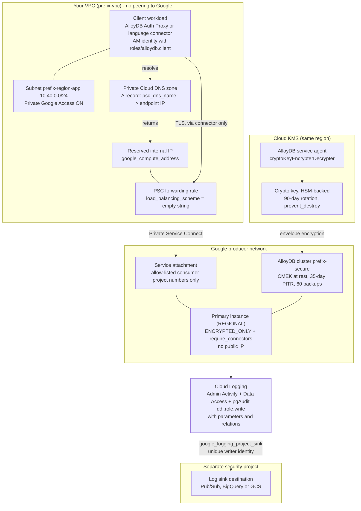

# 04 — Hardened: CMEK + Private Service Connect + IAM Auth + Full Audit

## Purpose

This is the maximum-assurance reference deployment, and it exists to satisfy a security
review rather than to be the cheapest or simplest way to run AlloyDB. It combines
**Private Service Connect** instead of VPC peering (so there is no transitive routing
exposure and consumer projects are allow-listed one at a time), **customer-managed
encryption keys** on both the cluster and its backups with automatic rotation,
**`require_connectors = true`** so a stolen password alone cannot open a connection,
**IAM database authentication** including group authentication, **pgAudit with parameter
logging** exported to a sink in a separate security project, restricted reads on the
password-hash catalogs, a 35-day point-in-time recovery window, and alerting on the audit
pipeline itself. Use it when the data class is confidential or regulated. Read
[`02-prod-ha`](../02-prod-ha/README.md) first — this example assumes you already
understand that baseline.

> [!IMPORTANT]
> Two things in this stack resist deletion on purpose: `deletion_protection = true` on the
> cluster, and `prevent_destroy = true` on the KMS key. Neither is an oversight and
> neither can be worked around with a single command. Read [Teardown](#teardown) **before**
> you apply this in an environment you will later want to clean up.

---

## What it creates

| Resource | Terraform address | Purpose |
| --- | --- | --- |
| KMS key ring | `google_kms_key_ring.alloydb` | `<prefix>-alloydb-kr`, **in the same region as the cluster**. Key rings cannot be deleted, ever. |
| KMS crypto key | `google_kms_crypto_key.alloydb` | `<prefix>-alloydb-key`. `ENCRYPT_DECRYPT`, HSM-backed by default, rotating every 90 days. `prevent_destroy = true`. |
| API enablement | `google_project_service.alloydb` | Turns on `alloydb.googleapis.com`; `disable_on_destroy = false`. |
| Service identity | `google_project_service_identity.alloydb` | **Beta provider.** Forces the AlloyDB service agent into existence so the IAM binding below has a principal to bind to. |
| KMS IAM binding | `google_kms_crypto_key_iam_member.alloydb_agent` | Grants the service agent `roles/cloudkms.cryptoKeyEncrypterDecrypter`. **Must exist before the cluster.** |
| VPC | `module.network.google_compute_network.this` | Custom-mode VPC `<prefix>-vpc`. |
| Subnet | `module.network.google_compute_subnetwork.app` | `<prefix>-<region>-app` (default `10.40.0.0/24`). Private Google Access **on**, Flow Logs at 0.5 sampling. Hosts clients *and* the PSC endpoint. |
| Firewall: allow Postgres | `module.network.google_compute_firewall.allow_postgres_internal` | TCP 5432 + 6432 within the subnet. |
| Firewall: logged deny-all | `module.network.google_compute_firewall.deny_all_ingress_logged` | Priority 65534 explicit deny, logged. The implicit deny at 65535 cannot log. |
| AlloyDB cluster | `module.alloydb.google_alloydb_cluster.this` | `<prefix>-secure`. PSC mode, CMEK on cluster and backups, 35-day PITR, 60 retained backups, Sunday 04:00 maintenance, deletion protection on. |
| Primary instance | `module.alloydb.google_alloydb_instance.primary` | `<prefix>-secure-primary`. `REGIONAL`, `cpu_count` vCPU (default 4), `ENCRYPTED_ONLY`, `require_connectors = true`, no public IP, hardened flag set. |
| PSC endpoint IP | `google_compute_address.psc_endpoint` | Internal IP reserved in your subnet. |
| PSC forwarding rule | `google_compute_forwarding_rule.psc_endpoint` | The consumer-side endpoint targeting AlloyDB's service attachment. `load_balancing_scheme = ""`. |
| Private DNS zone | `google_dns_managed_zone.alloydb_psc` | *Conditional on `create_psc_dns` (default `true`).* Private zone covering the AlloyDB PSC domain, visible to this VPC. |
| DNS A record | `google_dns_record_set.alloydb_psc` | Maps the advertised `psc_dns_name` to the endpoint IP. Without this the connectors cannot resolve the instance. |
| Audit config | `google_project_iam_audit_config.alloydb` | Enables `ADMIN_READ`, `DATA_READ`, `DATA_WRITE` for `alloydb.googleapis.com`. Unconditional here. |
| Log sink | `google_logging_project_sink.alloydb_audit` | *Conditional on `audit_sink_destination`.* Exports AlloyDB audit logs out of this project, with a dedicated writer identity. |
| Alert policies ×9 | `module.observability` | CPU, connections, memory, transaction-ID utilisation, storage quota, replication lag, node down, backup staleness, **audit backlog**. |
| Dashboard | `module.observability.google_monitoring_dashboard.alloydb` | Bundled Cloud Monitoring overview. |

Outputs: `cluster_name`, `kms_key_id`, `alloydb_service_agent`, `psc_endpoint_ip`,
`psc_dns_name`, `psc_service_attachment`, `audit_sink_writer_identity`,
`security_posture_summary`.

> [!TIP]
> `terraform output security_posture_summary` prints a formatted control inventory —
> network, encryption, identity, audit, recovery — designed to be pasted directly into a
> design review document.

---

## Architecture diagram



---

## Prerequisites

### APIs

```bash
gcloud services enable \
  alloydb.googleapis.com \
  servicenetworking.googleapis.com \
  compute.googleapis.com \
  cloudkms.googleapis.com \
  dns.googleapis.com \
  monitoring.googleapis.com \
  logging.googleapis.com \
  --project=YOUR_PROJECT_ID
```

`alloydb.googleapis.com` is additionally managed by `google_project_service.alloydb`
inside the config, because the AlloyDB **service agent** is only created on first use of
the API and the KMS grant needs that principal to exist.

> [!NOTE]
> `servicenetworking.googleapis.com` is listed for consistency with the other examples,
> but this example runs in **PSC mode** with `enable_psa = false`, so it creates no
> Private Services Access resources and does not depend on that API at apply time. Enable
> it anyway if you may later add a PSA-mode cluster to the same project.

### IAM for whoever runs Terraform

The minimum set this example's resources need. Confirm against your org policy; this is
not a Google-published list.

| Role | Needed for |
| --- | --- |
| `roles/alloydb.admin` | Cluster and instance |
| `roles/cloudkms.admin` | Key ring, crypto key, and the IAM binding on the key |
| `roles/compute.networkAdmin` | VPC, subnet, firewall rules, PSC address and forwarding rule |
| `roles/dns.admin` | Private managed zone and A record |
| `roles/resourcemanager.projectIamAdmin` | `google_project_iam_audit_config` |
| `roles/logging.configWriter` | The export sink |
| `roles/serviceusage.serviceUsageAdmin` | `google_project_service` and the service identity |
| `roles/monitoring.editor` | Alert policies and dashboard |

You will additionally need permission on the **destination** project to grant the sink's
writer identity write access — see the post-apply step under [Usage](#usage). That is
deliberately a separate privilege in a separate project.

### Quota to check first

| Quota | Default | Max supported | This example uses |
| --- | --- | --- | --- |
| Clusters per project per region | 3–10 (depends on project history) | 20 | 1 |
| vCPUs per project per region | 10,000 | — | **2 × `cpu_count`** = 8 at the default |
| Storage per cluster | 16 TiB | 128 TiB | grows with your data |
| `max_connections` | 1,000 | adjustable to 240,000 | left at default |

Source: [AlloyDB quotas and limits](https://cloud.google.com/alloydb/quotas).

> [!IMPORTANT]
> A **`REGIONAL` primary consumes two VMs** of vCPU quota — the active node plus the
> standby. At the default `cpu_count = 4` that is **8 vCPUs**, not 4. The quotas page is
> explicit: "Each primary instance uses two VMs." Quota failures surface with the literal
> string `VCPUsUsedPerProjectPerRegion`.

Also check your **Cloud KMS** posture before applying: HSM-protected keys are priced
differently from software keys, and some organisation policies constrain which protection
levels or locations are permitted.

---

## Usage

```bash
cd terraform/examples/04-secure-cmek-psc

cp terraform.tfvars.example terraform.tfvars
$EDITOR terraform.tfvars
# Decisions to make before you apply:
#   kms_protection_level          HSM (default) or SOFTWARE
#   key_rotation_period           default 7776000s = 90 days
#   psc_allowed_consumer_projects project NUMBERS, empty = this project only
#   pgaudit_log_classes           default "ddl,role,write"
#   audit_sink_destination        strongly recommended - a SEPARATE project

# Break-glass credential only. Normal access is IAM-authenticated.
export TF_VAR_initial_user_password="$(openssl rand -base64 32)"

terraform init      # pulls BOTH google and google-beta providers
terraform plan -out=tfplan
terraform apply tfplan
```

Two mandatory post-apply steps:

```bash
# 1. Grant the sink's writer identity write access on the destination, or the export
#    silently delivers nothing. The required role depends on the destination type.
terraform output audit_sink_writer_identity
#   Pub/Sub   -> roles/pubsub.publisher
#   BigQuery  -> roles/bigquery.dataEditor
#   Storage   -> roles/storage.objectCreator

# 2. Store the initial postgres password in Secret Manager as a break-glass credential
#    and remove it from your shell history / tfvars.
```

> [!WARNING]
> `initial_user_password` is written to Terraform state **in plaintext**, even in this
> hardened example — AlloyDB requires an initial user at create time. Treat the state file
> as a secret: remote backend, encryption, tight IAM, and ideally CMEK on the state bucket
> too. The module sets `lifecycle.ignore_changes = [initial_user]`, so changing the
> variable later will not rotate the password; rotate with `ALTER ROLE`.

---

## Key configuration decisions explained

### Why the KMS grant must precede cluster creation

This is the single most important ordering constraint in the example, and the failure mode
is genuinely confusing if you get it wrong.

AlloyDB does not encrypt your data with your key directly. It uses the key to wrap its own
data-encryption keys, and it does so as the **AlloyDB service agent** — a Google-managed
service account of the form `service-<project-number>@gcp-sa-alloydb.iam.gserviceaccount.com`.
That agent is created **lazily, on first use of the AlloyDB API**. So on a brand-new
project three things have to line up in order:

1. `alloydb.googleapis.com` is enabled (`google_project_service.alloydb`).
2. The service agent exists (`google_project_service_identity.alloydb` forces it into
   existence rather than waiting for it to appear).
3. The agent holds `roles/cloudkms.cryptoKeyEncrypterDecrypter` **on that specific key**
   (`google_kms_crypto_key_iam_member.alloydb_agent`).

Only then can the cluster be created. The config enforces this with an explicit
`depends_on = [google_kms_crypto_key_iam_member.alloydb_agent, module.network]` on the
cluster module.

> [!CAUTION]
> If the grant lands after the create attempt, cluster creation fails with a permission
> error that does **not** obviously point at KMS — it reads like a generic authorisation
> problem. Engineers typically waste an hour on project IAM before looking at the key. If
> you see a permission failure creating a CMEK cluster, check the key's IAM policy first,
> not the project's.

Two related constraints worth internalising: the key ring must be in the **same region as
the cluster** (a global or mismatched-region key is rejected), and **CMEK is ForceNew** —
you cannot add customer-managed encryption to an existing AlloyDB cluster in place. If you
think you might ever need CMEK, enable it at creation.

### Why `google_project_service_identity` needs the beta provider

`google_project_service_identity` is not available in the GA `google` provider, which is
why `versions.tf` declares `google-beta` and the resource carries `provider = google-beta`.
Everything else in the stack uses GA. The alternative — a two-phase apply where you create
the cluster, let the agent appear, then grant the key — works but is exactly the kind of
"run it twice" ritual that breaks CI.

### Why backups get their own `encryption_config`

`backup_kms_key_name` is set (to the same key here). AlloyDB backups carry a **separate**
encryption configuration from the cluster's live storage. Leaving it unset would produce a
CMEK-encrypted cluster whose backups are Google-managed-key encrypted — which fails the
spirit of the control and, in an audit, the letter of it too. The module defaults
`backup_kms_key_name` to `kms_key_name` when null, but setting it explicitly documents the
intent. If your compliance regime requires key separation between live data and backups,
point them at two different keys; the service agent needs a grant on both.

### Why HSM protection and 90-day rotation

`kms_protection_level = "HSM"` gives FIPS 140-2 Level 3 hardware-backed key custody. It
costs more than `SOFTWARE`. Choose HSM where a compliance regime demands hardware key
custody; choose `SOFTWARE` where it does not and cost matters.

`key_rotation_period = "7776000s"` is 90 days. Rotation creates a **new key version for new
writes**; data already encrypted stays readable through the version that encrypted it.
AlloyDB picks up new versions transparently — there is no re-encryption event and no
downtime. This is why `prevent_destroy` on the key is not optional: destroying a key
version makes every byte encrypted under it unrecoverable, including backups.

### Why Private Service Connect instead of Private Services Access

PSA and PSC are mutually exclusive, and **the choice cannot be changed after the cluster is
created**. For a security-sensitive deployment PSC is the stronger position:

| | PSA (examples 01, 02, 03, 05) | PSC (this example) |
| --- | --- | --- |
| Connectivity | VPC peering to Google's producer network | A forwarding rule in *your* subnet |
| IP address space | A `/16` of yours is handed to the producer network | Endpoint uses one IP from your existing subnet |
| Transitive exposure | Peering brings routing considerations with it | None — PSC is a unidirectional attachment |
| Access control | Network reachability | Explicit **allow-list of consumer project numbers** |
| DNS | Google-managed | **Your responsibility** |
| Operational cost | Low | Higher — you own the endpoint and the DNS record |

The allow-list is the control a security team will care about most. Each entry in
`psc_allowed_consumer_projects` is a grant of network reachability to the database, made
explicitly and reviewably. The default here is `[data.google_project.this.number]` — this
project only, the least-privilege choice. Note it takes project **numbers**, not project
IDs; supplying IDs produces an obscure failure.

### Why you must create the PSC endpoint *and* the DNS record

This is the part people miss when moving from PSA. With PSA, Google gives you an IP and it
just resolves. With PSC you are the consumer and you own three things:

1. `google_compute_address` — an internal IP reserved in your subnet.
2. `google_compute_forwarding_rule` — targets AlloyDB's `service_attachment_link`. Note
   `load_balancing_scheme = ""`: the empty string is **required** for a PSC endpoint, and
   any real load balancing scheme value is rejected.
3. A DNS A record mapping the `psc_dns_name` AlloyDB advertises (e.g.
   `<uid>.<region>.alloydb-psc.goog.`, **with a trailing dot**) to that IP.

AlloyDB advertises the hostname but does not create the record. The language connectors
and the Auth Proxy expect it to resolve. If `create_psc_dns = false` because you manage DNS
centrally, **something** still has to create that record or nothing can connect. The
`locals` block in `main.tf` derives the managed zone's `dns_name` by stripping the first
label from the FQDN.

### Why `require_connectors = true` is the control that matters

`ssl_mode = "ENCRYPTED_ONLY"` (the only alternative being
`ALLOW_UNENCRYPTED_AND_ENCRYPTED`) guarantees the transport is encrypted.
`require_connectors = true` goes further: it **rejects any connection that did not arrive
via the AlloyDB Auth Proxy or a language connector**. The practical effect is that
possessing a database password is no longer sufficient. The caller must *also* hold a
Google Cloud identity with `roles/alloydb.client`, because the connector authenticates to
the AlloyDB API to obtain ephemeral certificates before it ever speaks Postgres.

That turns database access into a two-factor problem where one factor is centrally
revocable IAM. It is why this example can honestly claim that a leaked credential does not
by itself yield data access.

> [!WARNING]
> `require_connectors = true` **breaks plain `psql` and plain JDBC**. Every client, every
> migration tool, every BI connector, and every operator runbook must be able to run a
> connector. Audit all of them before enabling it — including the ones your on-call
> engineer reaches for at 3am. [`02-prod-ha`](../02-prod-ha/README.md) leaves this
> configurable (`require_connectors` variable, default `false`) for exactly this reason.

The subnet has `enable_private_google_access = true` because the Auth Proxy must reach
`googleapis.com` to fetch those ephemeral certificates. On a private-only host without
Private Google Access, the proxy fails to start with a confusing timeout rather than a
clear permission error.

### Why public IP is off and the external network list is empty

`enable_public_ip = false` and `authorized_external_networks = []`. A public IP on a
database is a finding in most security reviews, and there is no reason to have one when
PSC plus the Auth Proxy exists. The module only emits `authorized_external_networks` when
public IP is on — sending entries otherwise is an API error, which is a nice forcing
function: you cannot accidentally leave an allow-list configured for a disabled feature.

Worth knowing for anyone adapting this example: AlloyDB's Managed Connection Pooling is
**not supported on public IP connections** at all. This example does not enable the
pooler, but if you add it — [`02-prod-ha`](../02-prod-ha/README.md) shows the
configuration — that constraint works in your favour, because the pooled path can only
ever exist on the private posture this example already enforces. See
[`config/connection-pooling/managed-connection-pooling.md`](../../../config/connection-pooling/managed-connection-pooling.md).

### Why `pgaudit.log = "ddl,role,write"` here but `"ddl,role"` in production HA

The allowed values, confirmed against the AlloyDB Admin API's supported-flags list, are
exactly `read, write, function, role, ddl, misc, misc_set, all, none`, plus subtractive
forms (`-read`, `-write`, … `-all`), combined with commas.

| Scope | Captures | Volume |
| --- | --- | --- |
| `ddl` | Schema changes | Low |
| `role` | Privilege and role changes | Low |
| `write` | `INSERT`/`UPDATE`/`DELETE`/`COPY` | Scales with transaction rate |
| `read` | `SELECT` | Scales with query rate — very large on OLTP |
| `all` | Everything | Usually impractical without volume controls |

This example adds `write` because a confidential-data deployment generally needs to answer
"who changed this row and when", not just "who changed the schema". It stops short of
`read` and `all` because the volume — and therefore the billable Data Access log spend —
grows with your query rate, which on an OLTP primary is enormous. Measure your actual
volume for a week before widening further.

Three supporting flags make the audit trail forensically useful:

- `pgaudit.log_parameter = "on"` records the **actual parameter values**, not just the
  statement shape. This is high forensic value and it also means your audit log now
  contains sensitive data. Treat the sink destination as a sensitive data store with
  access controls to match.
- `pgaudit.log_relation = "on"` attributes each audited statement to the relation it
  touched, so you can answer "what happened to *this table*" without parsing SQL.
- `alloydb.enable_auditlog_volume_reduction = "on"` suppresses repetitive records, which
  is what makes `write` affordable.

> [!CAUTION]
> `alloydb.enable_pgaudit` **requires an instance restart**, which drops every open
> connection. So do `alloydb.enable_auditlog_volume_reduction` and the other
> `alloydb.enable_*` extension flags. `pgaudit.log`, `pgaudit.log_parameter` and
> `pgaudit.log_relation` do not. By contrast `alloydb.iam_authentication` and
> `alloydb.iam_group_authentication` require **no** restart — it is easy to assume
> otherwise. Batch all restart-requiring changes into one maintenance window.

### Why Data Access logs must be enabled alongside pgAudit

pgAudit records reach Cloud Logging as **Data Access** logs. Data Access logging is off by
default across Google Cloud and is enabled per service. `alloydb.enable_pgaudit = on`
without `google_project_iam_audit_config` gives you an audited database whose audit trail
goes nowhere useful. Admin Activity logs — who created, modified or deleted the cluster —
are always on and free; Data Access logs are opt-in and billable. Both are needed for a
complete picture.

Note that `google_project_iam_audit_config` is **authoritative for
`alloydb.googleapis.com` at project level**. If something else in your estate manages audit
config for that service, these will fight.

### Why the audit sink points at a different project

The sink destination deliberately lives **outside this project's blast radius**. An
attacker — or a well-meaning engineer with a bad script — who obtains admin on the database
project should not thereby be able to delete the evidence of what they did. That is the
whole argument, and it is the difference between an audit trail and a suggestion.

`unique_writer_identity = true` creates a dedicated service account for the sink. You must
grant it write access on the destination or the export silently delivers nothing — silently
is the operative word, which is why `terraform output audit_sink_writer_identity` exists
and why the post-apply grant is not optional.

The sink's filter captures both AlloyDB API audit logs
(`protoPayload.serviceName="alloydb.googleapis.com"`) and instance-scoped audit logs
(`resource.type="alloydb.googleapis.com/Instance"` with a `cloudaudit.googleapis.com` log
name).

### Why alert on the audit pipeline itself

`enable_audit_backlog_alert = true`. A backlogged audit shipping pipeline means audit
records are buffered and may be lost — which is a compliance failure that is otherwise
completely invisible. You find out during the audit, not during the incident. This is the
kind of control that distinguishes a security posture that has been operated from one that
has only been designed.

### Why `alloydb.pg_authid_select_role` and `alloydb.pg_shadow_select_role`

`pg_authid` and `pg_shadow` hold password hashes. Restricting `SELECT` on them to
`alloydbsuperuser` means an ordinary authenticated user cannot read every password hash in
the cluster and walk away with them for offline cracking. Neither flag requires a restart
and neither has an operational downside. This closes a real exfiltration path that most
managed-Postgres deployments leave open.

### Why the full password policy when IAM auth is enabled

IAM authentication is the intended path, but the built-in `postgres` user still exists as a
break-glass credential, and someone will eventually create a password user "temporarily".
The full `password.*` set — complexity, minimum 16 characters, character-class minimums,
90-day expiry with 14-day notification, and a check that the password does not contain the
username — makes that path survivable rather than catastrophic. All `password.*` flags are
confirmed settable with **no restart required**.

### Why a 35-day PITR window and 60 retained backups

35 days is the maximum `continuous_backup_recovery_window_days` the module accepts (the
valid range is 1–35). The reasoning is specific to the threat model: ransomware and
malicious-insider scenarios are typically **detected weeks after the fact**. A 7-day window
is useless if the compromise happened on day 20. Continuous backup is also the only defence
against logical corruption — a bad migration or a malicious `DELETE` — because replication
faithfully reproduces both.

Restores create a **new cluster**; AlloyDB does not restore in place. Rehearse that, and
account for the second cluster's quota when you do.

### Why deletion protection is on

`deletion_protection = true` (Terraform-side: `terraform destroy` fails outright) and
`deletion_policy = "DEFAULT"` (API-side: deleting a cluster that still owns instances is
rejected). Two independent guards. For a confidential-data cluster, deletion should require
a deliberate, reviewable, multi-step sequence.

---

## Cost considerations

This example is the most expensive of the five per vCPU, and most of the extra cost is
security machinery rather than database capacity.

1. **Two VMs of compute, 24×7** — `REGIONAL` means the standby always runs.
2. **Cloud KMS, HSM protection level.** HSM keys cost materially more than software keys,
   and you are billed for key versions and for cryptographic operations. Rotating every 90
   days accumulates versions. `SOFTWARE` is the lever if FIPS 140-2 Level 3 is not a
   requirement.
3. **Data Access logs — usually the surprise.** `ddl,role,write` with
   `pgaudit.log_parameter = on` produces substantially more log volume than
   [`02-prod-ha`](../02-prod-ha/README.md)'s `ddl,role`. On a write-heavy system this can
   rival or exceed the database spend. `alloydb.enable_auditlog_volume_reduction` helps.
   Measure before widening; never widen to `all` without a volume budget.
4. **Log sink egress and destination storage.** BigQuery and GCS destinations have their
   own storage and query costs; Pub/Sub has throughput costs.
5. **35-day continuous backup.** The PITR window retains WAL for its whole duration, so on
   a write-heavy cluster this is a real line item — roughly five times the retention of a
   7-day window.
6. **60 retained scheduled backups.**
7. **PSC forwarding rule and reserved IP** — small, but they exist.
8. **VPC Flow Logs** at 0.5 sampling, plus nine alert policies and a dashboard.

What to turn off when idle: for a **non-production** copy, the levers are
`kms_protection_level = "SOFTWARE"`, a shorter
`continuous_backup_recovery_window_days`, a narrower `pgaudit_log_classes`, and a smaller
`cpu_count`. In production, resist every one of these — they are the controls you built the
example for. AlloyDB has no pause and no idle discount, so the only real saving on a
non-production copy is to destroy it (see the KMS caveats below first).

See [AlloyDB pricing](https://cloud.google.com/alloydb/pricing).

---

## Verification

All read-only. This section doubles as evidence-gathering for a security review.

```bash
PROJECT=YOUR_PROJECT_ID
REGION=us-central1
CLUSTER=alloydb-sec-secure          # name_prefix + "-secure"
INSTANCE="${CLUSTER}-primary"

# 0. The one-shot summary, formatted for a design review document.
terraform output security_posture_summary

# 1. CMEK is actually applied - to the cluster AND to both backup paths.
gcloud alloydb clusters describe "$CLUSTER" \
  --region="$REGION" --project="$PROJECT" \
  --format='yaml(encryptionConfig,encryptionInfo,
                 automatedBackupPolicy.encryptionConfig,
                 continuousBackupConfig.encryptionConfig,
                 continuousBackupConfig.recoveryWindowDays,
                 pscConfig,deletionPolicy)'
# Expect: encryptionConfig.kmsKeyName pointing at your key,
#         the SAME key under both backup configs,
#         recoveryWindowDays: 35, pscConfig.pscEnabled: true.

# 2. The service agent really does hold the key grant. This is the evidence
#    that the ordering constraint was satisfied.
terraform output alloydb_service_agent
gcloud kms keys get-iam-policy "$(terraform output -raw kms_key_id)" \
  --format='yaml(bindings)'
# Expect roles/cloudkms.cryptoKeyEncrypterDecrypter for the service agent.

# 3. Key protection level and rotation schedule.
gcloud kms keys describe "$(terraform output -raw kms_key_id)" \
  --format='yaml(purpose,rotationPeriod,nextRotationTime,versionTemplate)'
# Expect protectionLevel: HSM, rotationPeriod: 7776000s.

# 4. Transport and connection controls.
gcloud alloydb instances describe "$INSTANCE" \
  --cluster="$CLUSTER" --region="$REGION" --project="$PROJECT" \
  --format='yaml(availabilityType,clientConnectionConfig,networkConfig,pscInstanceConfig)'
# Expect: sslMode: ENCRYPTED_ONLY
#         requireConnectors: true
#         networkConfig.enablePublicIp absent or false
#         pscInstanceConfig.allowedConsumerProjects = only what you intended
#         pscInstanceConfig.serviceAttachmentLink / pscDnsName populated

# 5. Security flags landed.
gcloud alloydb instances describe "$INSTANCE" \
  --cluster="$CLUSTER" --region="$REGION" --project="$PROJECT" \
  --format='json(databaseFlags)' | \
  grep -E 'iam_authentication|iam_group|pgaudit|auditlog_volume|pg_authid|pg_shadow|password\.'

# 6. PSC endpoint and DNS resolve correctly. Run the dig from INSIDE the VPC.
terraform output psc_endpoint_ip
terraform output psc_dns_name
gcloud compute forwarding-rules describe "alloydb-sec-alloydb-psc-ep" \
  --region="$REGION" --project="$PROJECT" \
  --format='yaml(IPAddress,target,loadBalancingScheme)'
gcloud dns record-sets list --zone="alloydb-sec-alloydb-psc" --project="$PROJECT"
# From a VM in the subnet:
#   dig +short "$(terraform output -raw psc_dns_name)"   # must return psc_endpoint_ip

# 7. Data Access logging is on for AlloyDB.
gcloud projects get-iam-policy "$PROJECT" --format='yaml(auditConfigs)'
# Expect service: alloydb.googleapis.com with ADMIN_READ, DATA_READ, DATA_WRITE.

# 8. The export sink exists and its writer identity has been granted.
gcloud logging sinks describe "alloydb-sec-alloydb-audit" --project="$PROJECT" \
  --format='yaml(destination,filter,writerIdentity)'
terraform output audit_sink_writer_identity
# Then confirm on the DESTINATION project that this principal holds the write role.

# 9. pgAudit records are actually arriving.
gcloud logging read \
  'protoPayload.serviceName="alloydb.googleapis.com" AND
   logName:"cloudaudit.googleapis.com%2Fdata_access"' \
  --project="$PROJECT" --limit=5 --freshness=1h --format='value(timestamp,protoPayload.methodName)'

# 10. Alert policies, including the audit backlog one.
gcloud alpha monitoring policies list --project="$PROJECT" \
  --filter='displayName:"alloydb-sec-secure"' \
  --format='table(displayName,enabled)'
# Expect 9 policies, one of which mentions "Audit log backlog".

# 11. Quota arithmetic.
gcloud alloydb instances describe "$INSTANCE" --cluster="$CLUSTER" \
  --region="$REGION" --project="$PROJECT" --format='value(machineConfig.cpuCount)'
# Multiply by 2 for the REGIONAL standby.
```

Connectivity test — note there is no plain-`psql` option:

```bash
# require_connectors = true, so this is the ONLY way in.
./alloydb-auth-proxy --auto-iam-authn \
  "projects/$PROJECT/locations/$REGION/clusters/$CLUSTER/instances/$INSTANCE"
psql -h 127.0.0.1 -U "your-sa-name@your-project.iam" -d postgres
```

> [!TIP]
> The `security_posture_summary` output points at
> [`scripts/verify-security-posture.sh`](../../../scripts/verify-security-posture.sh),
> which automates every check above and a few more. It makes no changes, so it is safe
> to run against production and safe to hand to an auditor who holds only viewer
> access. It needs `gcloud` and `jq` on the path; `--project` falls back to your active
> gcloud configuration if omitted.
>
> ```bash
> ./scripts/verify-security-posture.sh \
>   --cluster CLUSTER_ID --region REGION --project PROJECT_ID
> ```
>
> Exit codes are `0` for all checks passed, `1` if any check FAILed, and `2` for a
> usage or prerequisite error — so it works as a CI gate. Expect FAILs against a
> cluster that was not built from this example; that is the point.


---

## Teardown

> [!IMPORTANT]
> This stack has **two** independent delete guards plus a KMS resource that can never be
> fully deleted. A plain `terraform destroy` will fail. Work through the steps in order.

### Step 1 — disable the cluster's deletion protection and apply

```bash
cd terraform/examples/04-secure-cmek-psc

# Edit main.tf inside the module.alloydb block:
#   deletion_protection = true   ->   deletion_protection = false
$EDITOR main.tf

# APPLY the change. This is the step people skip, and it is the whole point of the guard.
terraform apply
```

### Step 2 — remove `prevent_destroy` from the KMS key

The crypto key carries `lifecycle { prevent_destroy = true }`. Terraform refuses to plan a
destroy while that is set, and it cannot be overridden from the command line — it must be
edited out of the configuration.

```bash
# Edit main.tf inside resource "google_kms_crypto_key" "alloydb":
#   lifecycle { prevent_destroy = true }   ->   delete or set false
$EDITOR main.tf
```

### Step 3 — destroy

```bash
terraform destroy
```

### What survives, and why

> [!CAUTION]
> **Cloud KMS key rings can never be deleted, and crypto keys cannot be deleted either** —
> only individual key *versions* can be scheduled for destruction. `terraform destroy`
> removes the key and key ring from Terraform state, but the resources persist in the
> project forever. This is a Cloud KMS design decision, not an AlloyDB one, and it means
> re-applying this example with the same `name_prefix` and `region` will collide with the
> existing key ring. Either reuse it via `terraform import`, or use a different
> `name_prefix`.

Consequently, **destroying a key version destroys your backups.** Anything encrypted under
a version you destroy — including every backup taken while that version was primary —
becomes permanently unrecoverable. If you need the backups, restore them to a new cluster
*before* you touch the key. Do not schedule version destruction as part of routine
teardown.

If you prefer to leave the key entirely alone, skip Step 2 and remove it from state
instead:

```bash
terraform state rm google_kms_crypto_key.alloydb google_kms_key_ring.alloydb
terraform destroy
```

Other residue to check:

```bash
# Data Access logging for AlloyDB is turned back OFF project-wide by the destroy.
# If other clusters depend on it, re-enable it.
gcloud projects get-iam-policy YOUR_PROJECT_ID --format='yaml(auditConfigs)'

# The sink's writer identity grant on the DESTINATION project is not managed here.
# Revoke it manually if the sink is gone for good.

# Confirm nothing is left consuming quota.
gcloud alloydb clusters list --region=us-central1 --project=YOUR_PROJECT_ID
gcloud compute forwarding-rules list --project=YOUR_PROJECT_ID --filter='name~alloydb'
gcloud dns managed-zones list --project=YOUR_PROJECT_ID --filter='name~alloydb'
```

---

## Next steps

Operations docs:

- [`docs/04-operations/security-hardening.md`](../../../docs/04-operations/security-hardening.md) — the full control catalogue this example implements
- [`docs/04-operations/audit-logging-and-siem.md`](../../../docs/04-operations/audit-logging-and-siem.md) — tuning `pgaudit.log`, controlling volume, and SIEM ingestion patterns
- [`docs/04-operations/monitoring-metrics.md`](../../../docs/04-operations/monitoring-metrics.md) — metric names that actually exist, and the 0–1 fraction trap
- [`docs/04-operations/maintenance-and-upgrades.md`](../../../docs/04-operations/maintenance-and-upgrades.md) — batching restart-requiring flag changes
- [`docs/04-operations/troubleshooting-runbook.md`](../../../docs/04-operations/troubleshooting-runbook.md) — CMEK permission errors and PSC resolution failures
- [`docs/04-operations/sizing-guide.md`](../../../docs/04-operations/sizing-guide.md)

Next examples:

- **[`05-cross-region-dr`](../05-cross-region-dr/README.md)** — a `REGIONAL` instance
  survives a zone, not a region. Note that a CMEK cluster's secondary needs a key in the
  *secondary's* region with its own service-agent grant; that example does not use CMEK.
- **[`03-read-pool-scaling`](../03-read-pool-scaling/README.md)** — read pools inherit the
  cluster's PSC config and `require_connectors` setting, so the hardened posture extends to
  them cleanly.
- **[`02-prod-ha`](../02-prod-ha/README.md)** — the less restrictive production baseline,
  if this posture is more than your workload warrants.

---

*Last verified: 2026-09-22 against provider google v8.3.0.*
