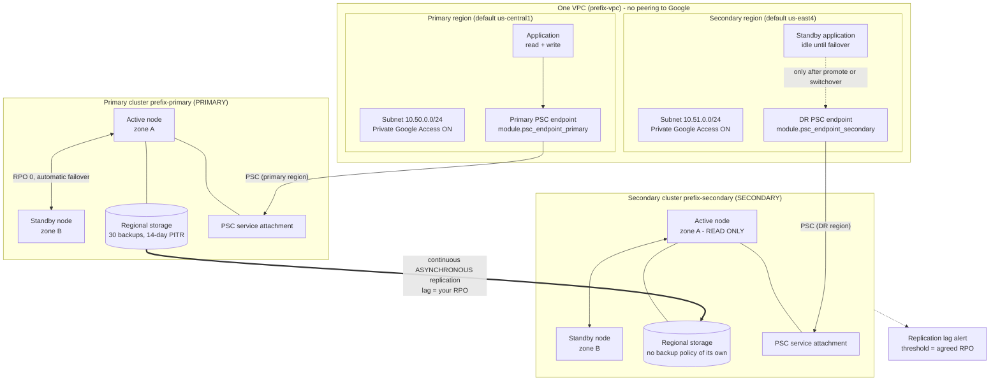

# 05 — Cross-Region Disaster Recovery

## Purpose

This example builds a `REGIONAL` primary AlloyDB cluster in one region and a continuously
replicated, read-only **secondary cluster** in another, with monitoring on both sides and
a failover runbook baked into the Terraform outputs. Use it when you need to survive the
loss of an entire region, when you are documenting RPO and RTO for a business continuity
review, or when you are rehearsing a DR drill. The most valuable thing here is not the
Terraform — it is understanding precisely what this protects against and what it does
not. Read [`02-prod-ha`](../02-prod-ha/README.md) first for the production baseline.

> [!IMPORTANT]
> **HA and DR are different controls solving different problems, and you need both.**
> `availability_type = REGIONAL` gives you an active node plus a standby in another
> **zone**: RPO 0, automatic failover, covered by the HA SLA. A secondary **cluster** gives
> you protection against losing the whole **region**: RPO equal to the replication lag at
> the moment of failure, and the failover is a human decision. This example configures
> both, which is why the primary is `REGIONAL` *and* has a secondary.

---

## What it creates

| Resource | Terraform address | Purpose |
| --- | --- | --- |
| VPC | `module.network_primary.google_compute_network.this` | Custom-mode VPC `<prefix>-vpc`. **One VPC serves both regions.** |
| Primary subnet | `module.network_primary.google_compute_subnetwork.app` | `<prefix>-<primary_region>-app` (default `10.50.0.0/24`). Private Google Access on. Hosts client workloads *and* the primary region's PSC endpoint. |
| Firewall rules ×2 | `module.network_primary` | Allow Postgres 5432/6432 within the primary subnet; logged deny-all at priority 65534. |
| Secondary subnet | `module.network_secondary.google_compute_subnetwork.app` | `<prefix>-dr-<secondary_region>-app` (default `10.51.0.0/24`), in the **same** VPC (`create_network = false`). Hosts the standby application and the DR region's PSC endpoint. |
| Firewall rules ×2 | `module.network_secondary` | Same pair, scoped to the secondary subnet CIDR, named with the `<prefix>-dr` prefix. |
| Project lookup | `data.google_project.this` | Supplies this project's **number** for the PSC consumer allow-list. PSC allow-lists take numbers, not IDs. |
| Primary cluster | `module.alloydb_primary.google_alloydb_cluster.this` | `<prefix>-primary` in `primary_region`. `cluster_type = PRIMARY`, `psc_enabled = true`, 30 backups, 14-day PITR. |
| Primary instance | `module.alloydb_primary.google_alloydb_instance.primary` | `<prefix>-primary-primary`. `REGIONAL`, `cpu_count` vCPU (default 4). All writes go here. Publishes its own service attachment. |
| Secondary cluster | `module.alloydb_secondary.google_alloydb_cluster.this` | `<prefix>-secondary` in `secondary_region`. `cluster_type = SECONDARY`, `psc_enabled = true`, `secondary_config.primary_cluster_name` points at the primary. |
| Secondary instance | `module.alloydb_secondary.google_alloydb_instance.primary` | `<prefix>-secondary-primary`, `instance_type = SECONDARY`. `REGIONAL`, same `cpu_count`. **Read-only until promoted.** Publishes its own, separate service attachment. |
| PSC endpoint, primary region | `module.psc_endpoint_primary` | `<prefix>-primary-psc`. Reserved internal IP plus forwarding rule in the primary subnet, targeting the primary's service attachment. This is what the application connects through today. |
| PSC endpoint, DR region | `module.psc_endpoint_secondary` | `<prefix>-secondary-psc`. The same, in the secondary subnet against the secondary's service attachment. Created now, deliberately, rather than during an incident. |
| Private DNS zones and A records ×2 | `module.psc_endpoint_*.google_dns_*` | *Conditional on `create_psc_dns` (default `false`).* One per endpoint. When false, both records are yours to create — see `psc_dns_records_required`. |
| Alert policies ×8 (primary) | `module.observability_primary` | CPU, connections, memory, transaction-ID utilisation, storage quota, replication lag, node down, backup staleness. |
| Alert policies ×8 (secondary) | `module.observability_secondary` | Same set, with a tight replication-lag threshold and the backup-freshness alert neutralised. |
| Dashboards ×2 | `module.observability_*` | One bundled Cloud Monitoring overview per cluster. |

Both network modules are called with `enable_psa = false` and
`enable_private_google_access = true`: there is no peering to Google's producer network,
and clients can still reach `googleapis.com` from a private-only host, which the Auth
Proxy needs.

Outputs: `primary_cluster_name`, `secondary_cluster_name`, `primary_psc_endpoint_ip`,
`secondary_psc_endpoint_ip`, `psc_dns_records_required`, `total_vcpu_quota`, `dr_runbook`.

> [!TIP]
> `terraform output dr_runbook` prints the complete switchover and promote procedures with
> your actual cluster names and both endpoint addresses substituted in. Print it, put it in
> your incident wiki, and rehearse it — a runbook first read during an outage is not a
> runbook. `terraform output psc_dns_records_required` prints the hostname-to-address map
> for both regions, which is what you hand to whoever manages DNS.

---

## Architecture diagram



---

## Prerequisites

### APIs

```bash
gcloud services enable \
  alloydb.googleapis.com \
  compute.googleapis.com \
  monitoring.googleapis.com \
  dns.googleapis.com \
  --project=YOUR_PROJECT_ID
```

*(Note: `dns.googleapis.com` is only required if `create_psc_dns = true`.)*

### IAM for whoever runs Terraform

The minimum set this example's resources need. Confirm against your org policy; this is
not a Google-published list.

| Role | Needed for |
| --- | --- |
| `roles/alloydb.admin` | Both clusters, both instances, and later the `promote`/`switchover` operations |
| `roles/compute.networkAdmin` | VPC, both subnets, both PSC endpoints, four firewall rules |
| `roles/dns.admin` | *Conditional on `create_psc_dns`.* Private DNS zones and records |
| `roles/monitoring.editor` | Sixteen alert policies and two dashboards |

### Quota to check first

This is the one example where you must check quota in **two regions**, and where the check
is easy to get wrong because the numbers are per-region, not per-project.

| Quota | Default | Max supported | Primary region | Secondary region |
| --- | --- | --- | --- | --- |
| Clusters per project per region | 3–10 (depends on project history) | 20 | 1 | 1 |
| vCPUs per project per region | 10,000 | — | **8** | **8** |
| Storage per cluster | 16 TiB | 128 TiB | grows with data | mirrors the primary |
| `max_connections` | 1,000 | adjustable to 240,000 | default | default |

Source: [AlloyDB quotas and limits](https://cloud.google.com/alloydb/quotas).

> [!IMPORTANT]
> A **`REGIONAL` primary consumes two VMs** of vCPU quota — the active node plus the
> standby. Both clusters here are `REGIONAL`, so at the default `cpu_count = 4` each
> region consumes **8 vCPUs**, for 16 across the project. `VCPUsUsedPerProjectPerRegion`
> is a **per-region** quota: having headroom in `us-central1` tells you nothing about
> `us-east4`. The `total_vcpu_quota` output returns a map keyed by region precisely so you
> check both.

```bash
terraform output total_vcpu_quota
# { "us-central1" = 8, "us-east4" = 8 }
```

Quota is also not a capacity guarantee — regional physical availability still applies.
Confirm AlloyDB is available in your chosen `secondary_region` before you plan a DR
strategy around it.

---

## Usage

```bash
cd terraform/examples/05-cross-region-dr

cp terraform.tfvars.example terraform.tfvars
$EDITOR terraform.tfvars
# Decisions to make:
#   primary_region / secondary_region
#   primary_subnet_cidr / secondary_subnet_cidr   (must not overlap)
#   cpu_count                        applied to BOTH clusters
#   dr_replication_lag_ms_threshold  this IS your RPO

export TF_VAR_initial_user_password="$(openssl rand -base64 24)"

terraform init
terraform plan -out=tfplan
terraform apply tfplan

terraform output dr_runbook
```

Expect this apply to take substantially longer than the other examples. The secondary
cluster cannot begin creation until the primary exists (`depends_on`), and it then has to
seed itself from the primary's data before it reaches a serving state.

### Choosing the secondary region

`secondary_region` defaults to `us-east4` against a `us-central1` primary. The trade-offs,
and none of them have a universally right answer:

| Consideration | Pulls you further away | Pulls you closer |
| --- | --- | --- |
| Failure-domain independence | Further is better — shared power, network or natural-disaster exposure defeats the purpose | |
| Replication lag (your RPO) | | Closer is better — physics |
| Inter-region egress cost | | Closer and same-continent is cheaper |
| Data residency / sovereignty | Depends entirely on your obligations — this may be the binding constraint | |

Decide this with your risk and compliance people, not on latency alone.

---

## Key configuration decisions explained

### Why the secondary must match the primary's shape

`cpu_count` is deliberately a **single variable applied to both clusters**. It would have
been trivial to expose `primary_cpu_count` and `secondary_cpu_count` separately, and that
would have been a mistake. There are two independent reasons.

**First, an undersized secondary increases your RPO.** The secondary applies a continuous
stream of changes from the primary. If it has less compute than the primary generating
those changes, it falls behind during exactly the periods you care about most — peak write
load, bulk migrations, month-end batch. Replication lag *is* your data-loss exposure under
an unplanned failover, so under-provisioning the secondary directly converts a cost saving
into potential data loss. This is the classic false economy in DR design: the thing you
saved money on is the thing that fails when you need it.

**Second, after a failover the secondary *is* your production database.** A secondary at
half the primary's size does not degrade gracefully into "slightly slower production" — it
becomes a database that cannot carry your traffic, during an incident, while everyone is
watching. You have converted a regional outage into a regional outage plus a capacity
crisis.

Both clusters are also `REGIONAL`, so the secondary has its own zone-level HA. A DR site
with a single point of failure inside it is not much of a DR site.

The honest cost of this discipline is that DR roughly doubles your database compute spend.
That is the price. If the business will not pay it, the correct response is to write down a
larger RPO and rely on point-in-time recovery instead — not to quietly under-size the
secondary and hope.

### Network topology and why DR requires two regional PSC endpoints

`module.network_primary` creates the VPC and a subnet in the primary region (`10.50.0.0/24`).
`module.network_secondary` reuses the same VPC (`create_network = false`) and creates a second
subnet in the DR region (`10.51.0.0/24`). Both network modules have `enable_psa = false` and
`enable_private_google_access = true`.

The critical PSC design point for cross-region DR:
**A PSC endpoint is a regional resource and targets exactly one service attachment.** It cannot
span regions and cannot follow a failover. As a result, a two-region deployment requires
**two permanent endpoints**:

1. `module.psc_endpoint_primary` in the primary region (`10.50.0.0/24`), targeting the primary
   cluster's service attachment.
2. `module.psc_endpoint_secondary` in the DR region (`10.51.0.0/24`), targeting the secondary
   cluster's service attachment.

**We pre-provision the DR endpoint now, before any incident.** Creating an endpoint while a region
is experiencing an outage — when Terraform state or cloud control planes may be degraded — is not
a viable recovery plan. Pre-provisioning costs an internal IP address and ensures that network
reachability already exists the moment a promote command is issued.

Furthermore, both clusters share the same consumer project allow-list (`psc_allowed_consumer_projects`).
The allow-list must already contain any project whose workloads will connect after a promote; discovering
an authorization failure in the middle of a failover adds severe RTO delay.

### If your organisation uses PSA

Private Services Access remains fully supported. With PSA, a single VPC peering to
`servicenetworking.googleapis.com` and a global `/16` range serve clusters in both regions.
To use PSA, set `enable_psa = true` on `module.network_primary` and pass `network_self_link`
plus `allocated_ip_range` to both cluster modules. The choice is permanent at cluster creation.

### Why the secondary has no initial user, no backup policy, and no continuous backup

`automated_backup = null` is set explicitly, and the module additionally suppresses the
`initial_user` and `continuous_backup_config` blocks whenever `cluster_type = "SECONDARY"`.
This is not a simplification — the API does not accept those blocks on a secondary cluster.
A secondary's entire contents arrive by replication from the primary; it has no independent
existence to back up and no user list of its own to seed.

The operational consequence matters: **backups are taken on the primary, and only on the
primary**. If you fail over, one of your first post-failover tasks is to establish a backup
policy on the new primary, because it does not inherit one. This is item 3 in the runbook
for a reason.

It is also why `module.observability_secondary` sets `backup_max_age_hours = 87600`
(ten years — effectively disabling that alert). The backup-freshness alert is a good alert;
pointed at a secondary cluster it would simply fire forever and train everyone to ignore
the whole policy set. Neutralising it deliberately is better than letting it cry wolf.

### Why the replication lag alert is the most important number in this stack

`dr_replication_lag_ms_threshold` defaults to 60,000 ms and is wired only into
`module.observability_secondary`. Read the variable description carefully: **this value IS
your recovery point objective under an unplanned regional failover.**

Cross-region replication is asynchronous. If the primary region disappears right now, you
lose whatever had not yet reached the secondary — which is exactly what
`alloydb.googleapis.com/instance/postgres/replication/maximum_lag` measures, in
milliseconds. So the threshold is not an engineering guess about what looks normal on the
graph. It is the maximum data loss the business has agreed to tolerate, expressed in
milliseconds. Set it from the agreement, then treat any breach as "we are currently
out of compliance with our stated RPO", not as a performance blip.

Related confirmed metrics you can build on:
`instance/postgres/replication/maximum_secondary_lag`,
`instance/postgres/replication/network_lag`, and `instance/postgres/replication/replicas`.

> [!CAUTION]
> Google does **not** publish numeric alerting thresholds for AlloyDB. The 60-second
> default here, and every other default in the observability module — 85% CPU, 80%
> connections, 20%/40% transaction-ID utilisation, 80% storage quota — is a considered
> **starting point, not a Google recommendation**. The lag threshold in particular should
> come from your business continuity agreement, not from this file.

The transaction-ID numbers are low relative to the others for a reason worth knowing.
`database/postgresql/vacuum/transaction_id_utilization` is a **fraction between 0 and 1**
of the transaction ID space consumed, and because autovacuum freezes at the 200 million
default `autovacuum_freeze_max_age`, a healthy instance sits around 0.10 — three live
clusters sampled for this repo read 0.0895, 0.0699 and 0.0723. A warning at 0.2 means
"XID age is roughly twice what autovacuum should ever allow"; 0.4 is worth paging for.
Both observability modules carry this pair, so the alert exists on the secondary as well
as the primary.

One scale trap, verified empirically against a live instance: metrics carrying the unit
`10^2.%` (such as `instance/cpu/maximum_utilization`) return a **fraction between 0 and 1**
from the API, even though the console draws a percentage. In Terraform you write `0.85`,
not `85`. Lag metrics are plain milliseconds and are unaffected.

### Why the secondary is monitored at all

`module.observability_secondary` is not decoration. A silently broken replica is **worse
than no replica**, because you believe you are protected and you are not. You will discover
the truth at the worst possible moment. Monitoring the secondary — its lag, its node
health, its CPU — is what converts "we have DR" from an assertion into a measurement.

### Why `lifecycle.ignore_changes = [instance_type]` exists in the module

`instance_type` is ForceNew on `google_alloydb_instance`. During a `promote` or
`switchover`, the AlloyDB API changes it out from under Terraform — the secondary instance
becomes a primary. Without the `ignore_changes`, the very next `terraform plan` after a DR
event would propose to **destroy and recreate your newly promoted production database**.
The module suppresses that. You still have to reconcile the configuration with reality
afterwards; the guard buys you the time to do it deliberately rather than under pressure.

### Why `deletion_policy = "FORCE"` is required on the secondary

The secondary cluster is configured with `deletion_protection = false` and
`deletion_policy = "FORCE"`. The `FORCE` part is **not** a convenience here, it is a
requirement:

> A secondary cluster's instance **cannot be deleted independently of the cluster.**

With the default `deletion_policy = "DEFAULT"`, the API refuses to delete a cluster that
still owns instances, and Terraform cannot satisfy that by deleting the instance first —
because the API will not let it. The result is a destroy that fails and a cluster you have
to clean up by hand. `FORCE` tells the API to delete the cluster together with its
instance, in one operation, which is the only ordering that works for a secondary.

The primary in this example also uses `FORCE`, but there it is a convenience for a demo
stack rather than a necessity. A production primary should use the
[`02-prod-ha`](../02-prod-ha/README.md) posture — `deletion_protection = true` and
`deletion_policy = "DEFAULT"`.

### What this protects against, and what it does not

| Failure | Protected by | In this example |
| --- | --- | --- |
| Single node / zone failure | `availability_type = REGIONAL` | Yes, on both clusters. RPO 0, automatic. |
| Entire region unavailable | Secondary cluster + `promote` | Yes. RPO = replication lag, human decision. |
| Bad migration, accidental `DELETE`, ransomware | **Point-in-time recovery only** | Yes, 14-day PITR on the primary. |
| Cluster deleted by mistake | Deletion protection | **No** — relaxed in this demo example. |

> [!CAUTION]
> **Logical corruption replicates.** A bad migration or a malicious `DELETE` reaches the
> secondary within seconds, faithfully and irreversibly. Cross-region replication is not a
> backup and it is not an undo button. Your defence against logical corruption is
> continuous backup and point-in-time recovery — which is why this example configures a
> 14-day PITR window on the primary alongside the replica. You need both, and they solve
> genuinely different problems.

Restores create a **new cluster**; AlloyDB does not restore in place. Budget the quota for
that second cluster in advance, because you will be provisioning it during an incident.

### What the two clusters share, and what they deliberately do not

Two values are hoisted into a `locals` block in `main.tf` and applied to both sides.
This is worth understanding before a failover, because it determines what the promoted
cluster is actually running.

| Value | Shared? | Why |
| --- | --- | --- |
| `database_flags` (`idle_in_transaction_session_timeout = 60000`, `log_min_duration_statement = 1000`) | **Yes** — `local.database_flags`, passed to both modules | Flags are an instance-level property, and a secondary does not inherit them from its primary. Letting the two drift means a promote silently changes your runtime configuration at the worst possible moment. Keeping them identical makes promote boring. |
| `cpu_count` | **Yes** — a single variable | See above: an undersized secondary raises your RPO and leaves you short of capacity after a failover. |
| `local.pitr_window_days` (14) | Applies to the primary; referenced by `outputs.tf` | Continuous backup is only configured on the primary. The DR runbook output reads the same local, so the window it quotes can never drift from the window that is actually configured. |
| `initial_user_password` | **No**, by design | The API does not accept an initial user on a secondary cluster. User accounts arrive with the replicated data. |
| Backup policy and continuous backup config | **No**, by design | The API does not accept those blocks on a secondary. Backups are taken on the primary only — which is why re-establishing a backup policy is on the post-failover checklist. |

---

## Failover procedures

`terraform output dr_runbook` prints these with your cluster names filled in. Summarised:

### Planned: `switchover` — zero data loss, reversible

Use for DR drills, region migrations, and planned maintenance. Requires **both clusters
healthy and reachable**. The primary is quiesced, outstanding changes are drained to the
secondary, then the roles reverse. Replication continues in the opposite direction, so it
is reversible — run it again to switch back.

```bash
gcloud alloydb clusters switchover alloydb-dr-secondary \
  --region=us-east4 --project=YOUR_PROJECT_ID
```

### Unplanned: `promote` — non-zero data loss, irreversible

Use when the primary region is gone or unreachable. Data loss is bounded by the replication
lag at the moment of failure — the number your lag alert has been measuring all along.

```bash
gcloud alloydb clusters promote alloydb-dr-secondary \
  --region=us-east4 --project=YOUR_PROJECT_ID
```

> [!WARNING]
> `promote` **breaks the replication link permanently.** The secondary becomes an
> independent read-write cluster, and re-establishing DR afterwards means building a brand
> new secondary from the new primary — including the full seeding time. Do not reach for
> `promote` when `switchover` would work.

### After any failover

1. **Repoint the applications.** AlloyDB does not move the endpoint for you — the new
   primary has a different IP in a different region. Whatever handles that (DNS, config
   push, service discovery) is **your RTO bottleneck, not AlloyDB's**. Automate it and
   rehearse it; this step is almost always the longest one, and it is entirely within your
   control.
2. **Recreate read pools.** They do not carry across. See
   [`03-read-pool-scaling`](../03-read-pool-scaling/README.md).
3. **Re-establish the backup policy and monitoring** on the new primary. A secondary has no
   backup policy of its own, so until you do this you have a production database with no
   backups.
4. **Reconcile Terraform with reality.** `cluster_type` has changed underneath you. The
   module's `ignore_changes` on `instance_type` stops Terraform proposing to recreate the
   instance, but the configuration still needs to be brought into line. Database flags
   are one thing you do *not* need to chase: both clusters take them from the same
   `locals` block, so the promoted instance is already running the primary's flag set.

### Rehearse it

A DR capability you have never exercised is a hypothesis. `switchover` is specifically
designed to be safe and reversible; run it on a schedule, time every step including the
application repoint, and record the real RTO rather than the aspirational one.

---

## Cost considerations

Cross-region DR is the most expensive pattern in this repo, and the cost structure is
straightforward to reason about.

1. **Four VMs of compute, 24×7.** Two clusters, each `REGIONAL`, each with an active and a
   standby node. This roughly doubles the compute cost of
   [`02-prod-ha`](../02-prod-ha/README.md) and it dominates everything else. The secondary
   is fully provisioned at all times — there is no cold or warm standby tier and no idle
   discount.
2. **Storage is paid twice.** Unlike read pools, which share one copy of the data within a
   cluster, a secondary cluster is a genuinely separate regional storage footprint in
   another region.
3. **Inter-region replication egress.** Continuous, and proportional to your write volume.
   This is the line item people forget when modelling DR, and it scales with how busy the
   primary is, not with how big the database is.
4. **Backups and the 14-day PITR window** on the primary. Continuous backup retains WAL for
   the whole window.
5. **Monitoring** — sixteen alert policies and two dashboards.

What to turn off when idle: for a **non-production** DR demo, the only meaningful levers
are `cpu_count` (applied to both sides) and destroying the stack entirely. Resist the
temptation to shrink only the secondary — that is precisely the false economy described
above, and if you are going to practise bad DR hygiene in a demo you will practise it in
production too. AlloyDB has no pause and no idle discount, so a DR site you never fail over
to costs the same as one you use weekly. That is the nature of the insurance.

See [AlloyDB pricing](https://cloud.google.com/alloydb/pricing).

---

## Verification

All read-only.

```bash
PROJECT=YOUR_PROJECT_ID
PRIMARY_REGION=us-central1
SECONDARY_REGION=us-east4
PRIMARY=alloydb-dr-primary            # name_prefix + "-primary"
SECONDARY=alloydb-dr-secondary        # name_prefix + "-secondary"

# 1. Both clusters exist with the correct types, and the link is declared.
gcloud alloydb clusters describe "$PRIMARY" \
  --region="$PRIMARY_REGION" --project="$PROJECT" \
  --format='yaml(state,clusterType,continuousBackupConfig,automatedBackupPolicy,deletionPolicy)'
# Expect clusterType: PRIMARY, recoveryWindowDays: 14, quantityBasedRetention.count: 30

gcloud alloydb clusters describe "$SECONDARY" \
  --region="$SECONDARY_REGION" --project="$PROJECT" \
  --format='yaml(state,clusterType,secondaryConfig,deletionPolicy)'
# Expect clusterType: SECONDARY
#        secondaryConfig.primaryClusterName ending in /clusters/alloydb-dr-primary
#        deletionPolicy: FORCE
#        NO automatedBackupPolicy, NO continuousBackupConfig - this is correct.

# 2. Both instances are REGIONAL and the same shape. This is the check that
#    catches a quietly under-provisioned secondary.
for R in "$PRIMARY_REGION:$PRIMARY" "$SECONDARY_REGION:$SECONDARY"; do
  gcloud alloydb instances list --cluster="${R#*:}" --region="${R%%:*}" --project="$PROJECT" \
    --format='table(name.basename(),instanceType,availabilityType,machineConfig.cpuCount,state,ipAddress)'
done
# Expect PRIMARY/REGIONAL/4 and SECONDARY/REGIONAL/4. The cpuCount values MUST match.

# 3. Replication lag - your live RPO measurement.
gcloud monitoring time-series list --project="$PROJECT" \
  --filter='metric.type="alloydb.googleapis.com/instance/postgres/replication/maximum_lag"
            AND resource.labels.cluster_id="'"$SECONDARY"'"' \
  --format='table(resource.labels.instance_id, points[0].value.int64Value)'
# Milliseconds. Compare against dr_replication_lag_ms_threshold.

# 4. One VPC, two regional subnets, two PSC endpoints.
gcloud compute networks subnets list --project="$PROJECT" \
  --filter='network~alloydb-dr-vpc' \
  --format='table(name,region,ipCidrRange)'
gcloud compute forwarding-rules list --project="$PROJECT" \
  --filter='name~alloydb-dr-' \
  --format='table(name,region,IPAddress,pscConnectionStatus)'
# Expect two endpoints: one in primary_region and one in secondary_region, both ACCEPTED.

# 5. Alert policies on both sides, and confirm the secondary's backup alert is neutralised.
gcloud alpha monitoring policies list --project="$PROJECT" \
  --filter='displayName:"alloydb-dr-"' \
  --format='table(displayName,enabled)'
# Expect 8 policies prefixed alloydb-dr-primary and 8 prefixed alloydb-dr-secondary.

# 6. Quota consumption, per region.
terraform output total_vcpu_quota

# 7. The runbook, with your names substituted.
terraform output dr_runbook
```

Confirm the secondary really is read-only, and that data is flowing:

```sql
-- Against the secondary's endpoint IP (terraform output secondary_psc_endpoint_ip):
SELECT pg_is_in_recovery();          -- expect t
CREATE TABLE dr_test (id int);       -- expect an error: read-only

-- Write on the primary, then read on the secondary a moment later, to observe
-- the asynchronous replication path end to end.
```

---

## Teardown

Both clusters in this example are already set to `deletion_protection = false` and
`deletion_policy = "FORCE"`, so a single destroy works:

```bash
cd terraform/examples/05-cross-region-dr
terraform destroy
```

> [!IMPORTANT]
> `deletion_policy = "FORCE"` on the **secondary** is mandatory, not stylistic. A secondary
> cluster's instance **cannot be deleted independently of its cluster** — the API rejects
> it. With the default `DEFAULT` policy, the API then also refuses to delete a cluster that
> still owns an instance, and you are stuck in a loop that Terraform cannot resolve on its
> own. `FORCE` deletes the cluster and its instance together, which is the only ordering
> the API accepts. If you adapt this example and change `deletion_policy` on the secondary,
> you will discover this during teardown.

Terraform destroys the secondary before the primary because of the `depends_on`. That is
also the correct manual order — deleting the primary out from under a live secondary is not
something to attempt.

If you ever need to do it by hand:

```bash
# Secondary first. FORCE is required.
gcloud alloydb clusters delete alloydb-dr-secondary \
  --region=us-east4 --project=YOUR_PROJECT_ID --force

# Then the primary.
gcloud alloydb clusters delete alloydb-dr-primary \
  --region=us-central1 --project=YOUR_PROJECT_ID --force
```

> [!TIP]
> On the PSC path, there is no service networking VPC peering to leave behind. Both
> forwarding rules and their reserved addresses are destroyed cleanly with the rest of
> the stack. If you created DNS records centrally in corporate DNS, remember to clean
> them up manually.

Confirm both regions are clear:

```bash
gcloud alloydb clusters list --region=us-central1 --project=YOUR_PROJECT_ID
gcloud alloydb clusters list --region=us-east4    --project=YOUR_PROJECT_ID
```

---

## Next steps

Operations docs:

- [`docs/04-operations/troubleshooting-runbook.md`](../../../docs/04-operations/troubleshooting-runbook.md) — diagnosing replication lag and stalled secondaries
- [`docs/04-operations/monitoring-metrics.md`](../../../docs/04-operations/monitoring-metrics.md) — the replication metric family, and the 0–1 fraction trap
- [`docs/04-operations/maintenance-and-upgrades.md`](../../../docs/04-operations/maintenance-and-upgrades.md) — how maintenance interacts with a replicated pair
- [`docs/04-operations/sizing-guide.md`](../../../docs/04-operations/sizing-guide.md) — why the secondary's shape is a DR decision, not a cost decision
- [`docs/04-operations/scaling-playbook.md`](../../../docs/04-operations/scaling-playbook.md)

Related examples:

- **[`02-prod-ha`](../02-prod-ha/README.md)** — the production posture this should inherit:
  deletion protection, pgAudit, IAM database authentication, and Managed Connection
  Pooling. Layer those onto the primary here for a real deployment.
- **[`03-read-pool-scaling`](../03-read-pool-scaling/README.md)** — read pools do **not**
  survive a failover and must be recreated on the new primary.
- **[`04-secure-cmek`](../04-secure-cmek/README.md)** — if you need CMEK with
  cross-region DR, note that the secondary requires a key in **its own** region with its own
  service-agent grant. This example does not use CMEK.

---

*Last verified: 2026-09-22 against provider google v8.3.0.*
